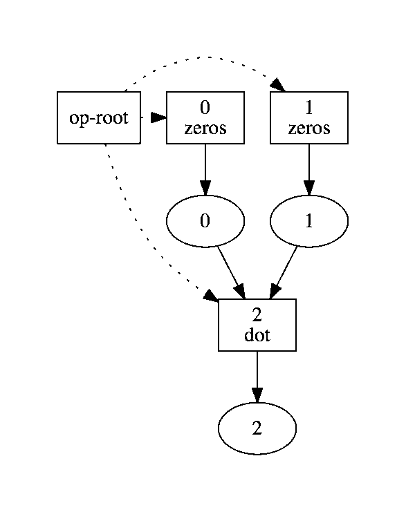

## Basic Usage

To use Ray, you need to understand the following:

- How Ray uses object references to represent immutable remote objects.
- How Ray constructs computation graphs using remote functions.

### Immutable remote objects

In Ray, we can create and manipulate objects. We refer to these objects as
**remote objects**, and we use **object references** to refer to them. Remote
objects are stored in **object stores**, and there is one object store per node
in the cluster. In the cluster setting, we may not actually know which machine
each object lives on.

An **object reference** is essentially a unique ID that can be used to refer to
a remote object. If you're familiar with Futures, our object references are
conceptually similar.

We assume that remote objects are immutable. That is, their values cannot be
changed after creation. This allows remote objects to be replicated in multiple
object stores without needing to synchronize the copies.

#### Put and Get

The commands `ray.get` and `ray.put` can be used to convert between Python
objects and object references, as shown in the example below.
```python
>>> x = [1, 2, 3]
>>> ray.put(x)
<ray.ObjRef at 0x1031baef0>
```

The command `ray.put(x)` would be run by a worker process or by the driver
process (the driver process is the one running your script). It takes a Python
object and copies it to the local object store (here *local* means *on the same
node*). Once the object has been stored in the object store, its value cannot be
changed.

In addition, `ray.put(x)` returns an object reference, which is essentially an
ID that can be used to refer to the newly created remote object. If we save the
object reference in a variable with `ref = ray.put(x)`, then we can pass `ref`
into remote functions, and those remote functions will operate on the
corresponding remote object.

The command `ray.get(ref)` takes an object reference and creates a Python object
from the corresponding remote object. For some objects like arrays, we can use
shared memory and avoid copying the object. For other objects, this currently
copies the object from the object store into the memory of the worker process.
If the remote object corresponding to the object reference `ref` does not live
on the same node as the worker that calls `ray.get(ref)`, then the remote object
will first be copied from an object store that has it to the object store that
needs it.
```python
>>> ref = ray.put([1, 2, 3])
>>> ray.get(ref)
[1, 2, 3]
```

If the remote object corresponding to the object reference `ref` has not been
created yet, the command `ray.get(ref)` will wait until the remote object has
been created.

### Computation graphs in Ray

Ray represents computation with a directed acyclic graph of tasks. Tasks are
added to this graph by calling **remote functions**.

For example, a normal Python function looks like this.
```python
def add(a, b):
  return a + b
```
A remote function in Ray looks like this.
```python
@ray.remote([int, int], [int])
def add(a, b):
  return a + b
```

The information passed to the `@ray.remote` decorator includes type information
for the arguments and for the return values of the function. Because of the
distinction that we make between *submitting a task* and *executing the task*,
we require type information so that we can catch type errors when the remote
function is called instead of catching them when the task is actually executed.

However, the only piece of information that is fundamentally required by the
system is the number of return values (because the system must assign the
correct number of object references to the outputs before the function has
actually executed and produced any outputs).

#### Remote functions

Whereas in regular Python, calling `add(1, 2)` would return `3`, in Ray, calling
`add(1, 2)` does not actually execute the task. Instead, it adds a task to the
computation graph and immediately returns an object reference to the output of
the computation.

```python
>>> ref = add(1, 2)
>>> ray.get(ref)
3
```

There is a sharp distinction between *submitting a task* and *executing the
task*. When a remote function is called, the task of executing that function is
submitted to the scheduler, and the scheduler immediately returns object
references for the outputs of the task. However, the task will not be executed
until the scheduler actually schedules the task on a worker.

When a task is submitted, each argument may be passed in by value or by object
reference. For example, these lines have the same behavior.

```python
>>> add(1, 2)
>>> add(1, ray.put(2))
>>> add(ray.put(1), ray.put(2))
```

Remote functions never return actual values, they always return object
references.

When the remote function is actually executed, it operates on Python objects.
That is, if the remote function was called with any object references, the
Python objects corresponding to those object references will be retrieved and
passed into the actual execution of the remote function.

#### Blocking computation

In a regular Python script, the specification of a computation is intimately
linked to the actual execution of the code. For example, consider the following
code.
```python
result = []
for i in range(10):
  result.append(np.zeros(size=[100, 100]))
```

At the core of the above script, there are 10 separate tasks, each of which
generates a 100x100 matrix of zeros. These tasks do not depend on each other, so
in principle, they could be executed in parallel. However, in the above
implementation, they will be executed serially.

Ray gets around this by representing computation as a graph of tasks, where some
tasks depend on the outputs of other tasks and where tasks can be executed once
their dependencies have been executed.

For example, suppose we define the remote function `zeros` to be a wrapper
around `np.zeros`.
```python
from typing import List
import numpy as np

@ray.remote([List[int]], [np.ndarray])
def zeros(shape):
  return np.zeros(shape)
```
Then we can write
```python
result_refs = []
for i in range(10):
  result.append(zeros([100, 100]))
```
This adds 10 tasks to the computation graph, with no dependencies between the
tasks.

The computation graph looks like this.

<p align="center">
  
</p>

In this figure, boxes are tasks and ovals are objects.

The box that says `op-root` in it just refers to the overall script itself. The
dotted lines indicate that the script launched 10 tasks (tasks are denoted by
rectangular boxes). The solid lines indicate that each task produces one output
(represented by an oval).

It is clear from the computation graph that these ten tasks can be executed in
parallel.

Computation graphs encode dependencies. For example, suppose we define
```python
ray.remote([np.ndarray, np.ndarray], [np.ndarray])
def dot(a, b):
  return np.dot(a, b)
```
Then we run
```python
aref = zeros([10, 10])
bref = zeros([10, 10])
cref = dot(aref, bref)
```
The corresponding computation graph looks like this.

<p align="center">
  
</p>


The three dashed lines indicate that the script launched three tasks (the two
`zeros` tasks and the one `dot` task). Each task produces a single output, and
the `dot` task depends on the outputs of the two `zeros` tasks.

This makes it clear that the two `zeros` tasks can execute in parallel but that
the `dot` task must wait until the two `zeros` tasks have finished.
