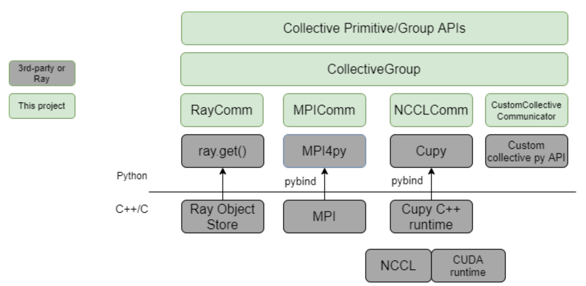
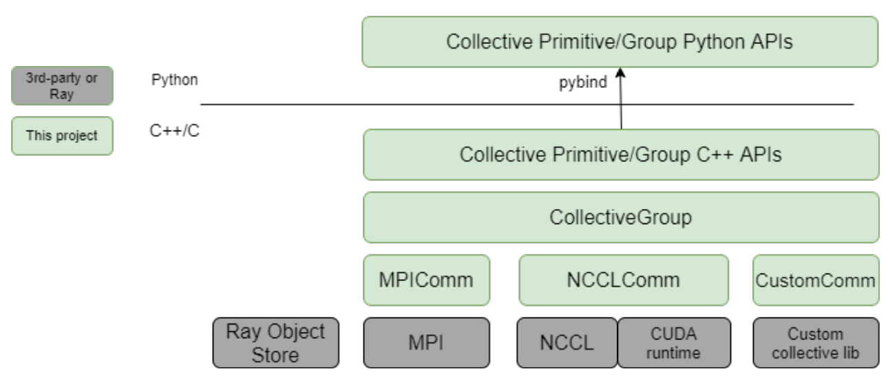

# RFC-202011-collective-in-ray

| Status        | Proposed      |
:-------------- |:---------------------------------------------------- |
| **Author(s)** | Hao Zhang, Lianmin Zheng |
| **Sponsor**   | Ion Stoica, Melih Elibol                 |
| **Reviewer**  | |
| **Updated**   | YYYY-MM-DD                                           |


## Objective

This RFC proposes to add a set of *Python-based* collective and send/recv communication APIs into Ray, for *both CPU and GPU* tensors, based on several established collective communication backends, including [NCCL](https://github.com/NVIDIA/nccl), [MPI](https://github.com/mpi4py/mpi4py), as well as the original Ray object store (hence gRPC). 

This set of APIs will enable Ray users to conveniently perform collective communication of several types of Python tensors in Ray actors and tasks, for their performance-critical applications, such as (GPU-based) distributed machine learning, or other HPC applications. 

This set of APIs also serve as a shared infrastructure for the two ongoing Ray-derived projects: [NumS](https://github.com/nums-project/nums) and [RayML](https://github.com/zhisbug/ray-scalable-ml-design/).

### Non-goals

- For now, these APIs aim to only support **python Tensors** (i.e. Numpy, Cupy, PyTorch tensors), but **NOT** arbitrary Ray Objects or ObjectRefs.
- These APIs are not obligated to perform communication through Ray object store. Instead, an option is provided in the APIs to allow choosing Ray object store (gPRC) as the backend.

## Motivation

We want to flesh out several value propositions that drive this project, with a few concrete use cases.

### Improve Programming Convenience 

#### General collective communication APIs in Ray
Collective communication (CC) patterns (e.g.`allreduce`, `allgather`) naturally emerge in many distributed computing applications in Ray. While in practice Ray users can compose CC functions using Ray's generic APIs as a series of RPC calls, directly providing such CC APIs would add significant convenience.

#### Distributed NCCL APIs in Python
To run on distributed environments, NCCL [relies on MPI or other socket tools](https://docs.nvidia.com/deeplearning/nccl/user-guide/docs/usage/communicators.html) to broadcast the `ncclUniqueId` to distributed processes. This requirement makes it hard to implement distributed NCCL-based applications in Python. To meet this requirement, existing libraries that use NCCL mostly reply on MPI or an additional self-implemented distributed KV-store to setup cross-process coordination. Examples:
- Horovod depends on `mpirun [args]` (wrapped as `horovodrun [args]`) to invoke distributed processes. 
- PyTorch implements a dedicate [distributed KV Store](https://github.com/pytorch/pytorch/blob/master/torch/lib/c10d/Store.hpp) for NCCL to run in distributed environments.

Also of note that NCCL itself does not have a native Python binding. The only way users can use NCCL in their distributed Python applications are: 
- Writing C++ instead of Python; 
- Constrainting their code within PyTorch/TensorFlow/Horovod which natively support NCCL; 
- Using Cupy low-level (cupy.cuda.nccl) APIs (which involves CUDA code such as stream management and is error-prone) plus some other distributed stitching tools like MPI. 

Indeed, there is a gap to implement distributed Python applications using NCCL -- Ray naturally fills this gap: Ray has a distributed store and high-level stitching APIs. Putting NCCL into Ray and wraps it into high-level Python APIs makes it easy to use NCCL, which in turn might benefit Ray.

#### Collective communication of multiple types of Python tensor
Nowadays ML frameworks expose some sorts of collective communication APIs for their framework-native tensor types, such as `torch.distributed.allreduce(x: torch.Tensor)` in PyTorch, or `tf.collective_ops` in TensorFlow. The collective APIs built on top of Ray can slightly relax this constraint on tensor types -- by allowing some extent of interoperatability  between tensor types: collective communication of tensors from different computing libraries, such as allreducing a Cupy tensor and a PyTorch tensor, as long as the tensor classes expose a `data_ptr()` method that points to the address of the tensor (which is true for Numpy, Cupy, PyTorch).

#### Auxiliary applications
We observe there is an emerging need for Ray to offer some native high-level application interfaces, such as a *sharded parameter server*, or *collective allreduce strategy*, similar to `tf.distributed.CollectiveAllReduceStrategy`. The targeted users of these interfaces are those who conduct distributed ML loads either without using TensorFlow or PyTorch, or mixing the usage of TensorFlow or PyTorch. For example, [Spacy](https://spacy.io/) has a community of users who build ML applications using their in-house framework [Thinc](https://thinc.ai/), which replies on Ray to provide distributed computing support. They will likely find a Ray-native parameter server implementation helpful. A set of high-performance collective APIs are the cornerstone of these applications.

### Improve Performance

#### Improvement on CPU Tensor Collective Communication
For CPU tensors, composing collective communication functions using Ray's object store is feasible, but the performance is suboptimal, compared to highly optimized, vender-specific CC libraries like MPI, NCCL, [GLOO](https://github.com/facebookincubator/gloo), [OneCCL](https://github.com/oneapi-src/oneCCL). See a detailed performance benchmark in this [report](https://github.com/zhisbug/ray-scalable-ml-design/tree/main/pytorch/microbenchmark/primitives/results). Bring these CC libraries into Ray can improve the perfermance of such communication patterns.

#### Improvement on GPU Tensor Collective Communication
Ray's object store has limited awareness of GPUs. As a consequence, using Ray's generic APIs to move GPU tensors (collectives or point-to-point) faces severe performance degeneration. See [Hao's benchmarking report](https://github.com/zhisbug/ray-scalable-ml-design/tree/main/pytorch/microbenchmark/primitives/results) and [Lianmin's benchmarking report](https://docs.google.com/spreadsheets/d/1l7aA3LtgXEw1R-kl1V6b87YGPhfDDRemIDgwJEMa4vs/edit?usp=sharing) for details. While this RFC **does NOT** aim to add GPU awareness to Ray's object store, it can address the performance issues for collective and P2P communication of GPU tensors.

#### Performance of Concrete Use Cases
Some Ray users (e.g. Spacy) rely on Ray as a primary tool to provide distributed communication support. They face some performance challenges caused by collective communication. These APIs will address their performance issues.

## User Benefit

With this project, Ray users can access a set of readily available collective and send/recv APIs in pure Python, with MPI/NCCL/Ray as optional backends, supporting both CPU and GPU tensors in Numpy, Cupy, and PyTorch.


## Design Proposal

### Architecture
An architecture diagram is shown below:

<p align="center"></p>

The intended functionalities of several key classes are briefly explained below: 

#### `Communicator`
The `Communicator` and derived subclasses cover backend-specific implementations for a few essential functionalities:
- Communicator creation, management, reuse, etc.
- Thread/CUDA stream creation, management, reuse, when needed
- tensor type detection, conversion
- Invocation of the third-party communication APIs
- Other backend-specific implementations such as dtype matching, CUDA stream synchronization, etc.

#### `CollectiveGroup`
A `CollectiveGroup` accounts for coordinating a set of processes (i.e. Ray actors or tasks) participating into collective communication, and managing their collective communicators.

The `CollectiveGroup` exposes a set of general collective primitive and group APIs for users to create a collective group and perform collective or send/recv communication. It dispatches the execution of primitives to the specific collective implementations in backends.


### APIs

#### Rationale
The core problem to solve in designing APIs is to expose a minimal and least disrupted set of interfaces so that users can declare a set of Ray actors or tasks as a collective group, and assign each member therein with a few attributes required for collective communication. These attributes are:
- `collective_group`: the name of its participating group
- `world_size`: the number of collective participants 
- `rank`: the rank of this participant
- `backend`: the backend to use, NCCL, MPI, or Ray Object Store (gRPC)

Below I list a few API proposals. **Note** the proposals are **very preliminary** and need extensive help and discussion among NumS, RayML and AnyScale developers to get into the right shape.

####  User APIs Proposal #1: Basic APIs
```python
# Example #1
import ray
import cupy

@ray.remote(num_gpus=1) 
def cupy_func(rank):
    send = cupy.ones((10,), dtype=cupy.float32)
    recv = cupy.ones((10,), dtype=cupy.float32)
	
    # This is a blocking call
    ray.collective.init_collective_group(collective_group='my_name',
                                         backend='nccl',
                                         world_size=4,
                                         rank=rank)

    # This is a blocking call
    ray.collective.allreduce(send, recv)
    # In-place version:
    # ray.collective.allreduce(send) 
    return recv

futures = [cupy_func.remote(i) for i in range(4)]
print(ray.get(futures))
```
```python
# Example #2
import ray
import torch
import cupy

@ray.remote
class CupyWorker:
    def __init__(self):
        self.send = cupy.ones((10,), dtype=cupy.float32)
        self.recv = cupy.zeros((10,), dtype=cupy.float32)

    def setup(self, rank):
        ray.collective.init_collective_group(collective_group='my_name',
                             backend='nccl',
                             world_size=20,
                             rank=rank)
        return True
	
    def do_computation(self):
        ray.collective.allreduce(self.send, self.recv)
	
@ray.remote
class PytorchWorker:
    def __init__(self):
        self.send = torch.cuda.FloatTensor(10).fill_(1.0)
        self.recv = torch.cuda.FloatTensor(10).fill_(0.0)

    def setup_collective_group(self, name, backend, world_size, rank):
        ray.collective.init_collective_group(collective_group='my_name',
                             backend='nccl',
                             world_size=20,
                             rank=rank)
        return True

    def do_computation(self):
        # Do some computation
        ray.collective.allreduce(self.send, self.recv)
        return self.secv
		

# Declare 10 Cupy workers and 10 PyTorch workers
actors = []
actors.extend([CupyWorker.remote() for i in range(10)])
actors.extend([PytorchWorker.remote() for i in range(10)])

# Setup collective groups
ray.wait([a.setup.remote(rank) for rank, a in enumurate(actors)])

# Note: interoperatability between cupy and pytorch
# Similarly we can do that between numpy, cupy, pytorch, 
# or any tensor that expose a pointer
futures = [a.do_computation.remote(i) for a in actors]
print(ray.get(futures))
```

#### User APIs Proposal #2: Mimicking `ray.util.ActorPool`
The APIs above can be further simplified by defining some interfaces like `CollectivePool`, similar to the current `ray.util.ActorPool`.

```python
actors = [CupyWorkers.remote() for i in range(20)]

# This line will setup collective memberships among all actors 
# (i.e. implicitly generate a setup function as above, and call 
# it among all actor processes
pool = CollectivePool(actors, ranks, name='default')

# Do whatever that needs collective communication
futures = [a.do_computation.remote(i) for a in actors]
# ...
```

#### User APIs Proposal #3: providing a `CollectiveActor`
Ray provides a base collectiveActor class which has some built-in setup functions for collective group. Users are expected to implement actors 
based on this class.

```python
@ray.remote()
class CollectiveActor: 
    def __init__(self, group="default", world_size=1, rank=0, backend='ray', *args, **kwargs):
        self.group_name = group
        self.world_size = world_size
        self.rank = rank
        self.backend = backend
        self.setup()

    def setup():
        ray.collective.init_collective_group(self.group, self.world_size, self.rank, self.backend)
    
	
class CupyWorker(CollectiveAcotr):
    pass
```


#### Collective Primitive Signatures
The collective/group API signatures are similar to `torch.distributed` and NCCL, following MPI standards, under the namespace `ray.collective`. Some example signatures:
- `ray.collective.init_collective_group(group_name, world_size, rank, backend, ...)`
- `ray.collective.allreduce(tensor, reduce_op, ...)`
- `ray.collective.all_gather(tensor_list, tensor, ...)`
- `ray.collective.send(tensor, dst_rank, ...)`
- `ray.collective.recv(tensor, src_rank, ...)`

See [NCCL Collective](https://docs.nvidia.com/deeplearning/nccl/user-guide/docs/api/colls.html#) and [torch.distributed](https://pytorch.org/docs/stable/distributed.html#) for more examples. 

A key difference worth mentioning here is that the `tensor` in Ray collective primitives could be any of Numpy, PyTorch, or Cupy tensors, as long as their `dtype` matches.

#### (Optional) Lower-level APIs
`ray.collective` namespace dispatches different collective primitive calls to their backend-specific implementations. However, if a user wants to have fine-grained control of the `communicators` and communication backends, some lower-level APIs could be made available. Take the NCCL as an example:
- `comm = ray.collective.nccl.create_communication()`
- `ray.collective.nccl.allreduce(tensor, reduce_op, comm, ...)`
- `...`

Working with this layer of APIs however needs to deal with the creation and destruction of `communicators`, and potentially manages the communication threads or CUDA streams when needed manually.

### Unsolved Problems

#### Deadlocks
In some of the prototypes, we occasionally observe deadlocks. An example is below:
```python
A = CupyWorker.remote()
B = CupyWorker.remote()
ray.wait([A.setup.remote(rank=0, ...), B.setup.remote(rank=1, ...)]
ray.get([A.send.remote(), B.recv.remote(), A.recv.remote(), B.send.remote()])
```
The above code tries to do two parallel send/recv between two workers A and B using NCCL APIs, and use `ray.get()` to trigger the round trip. It will hang.

#### GPU Stream Management
Making NCCL calls need to manage multiple asynchronous GPU streams on each worker to ensure performance, while carefully synchronize GPU streams between workers and GPUs to ensure correctness. Engineering-wise this could be realized using the python bindings of CUDA runtime APIs in Cupy, but we haven't figured out the optimal way to allocate/manage streams yet. A good reference is the [ProcessGroupNCCL.hpp](https://github.com/pytorch/pytorch/blob/master/torch/lib/c10d/ProcessGroupNCCL.hpp) in PyTorch.

#### Multiple Concurrent Collective Groups 
In some cases (e.g. model parallelism + data parallelism) we might create multiple `CollectiveGroups` within a same pool of Ray actors or tasks, in which some groups perform `allreduce` synchronization of gradients for data parallelism, while other groups perform `send/recv` P2P communications between two model partitions. This might require carefully managing collective communicators, communication threads, and GPU streams and will complicate the implementation. We need to figure out more details on this later during implementation.

#### Compatibility with AWS g4dn.12xlarge
We found some compability issue between Ray and NCCL on AWS g4dn.12xlarge. 

### Alternative Design #1: a C++ Architecture with Python Bindings

One alternative architecture is shown in the figure below. 

<p align="center"></p>

Several key differences between this design and the proposed one are:
- Import the NCCL libraries (same for MPI, or other custom CCLs) into Ray in C++; compile them together with Ray C++ core.
- Implement the communicator creation, management, and collective group creation/management all in C++. Implement a set of collective communication primitive APIs in C++. Then provide python APIs on top of them as Python bindings.

Its pros and cons are discussed below:
#### Pros
- Get rid of Cupy and MPI4py dependencies.
- Might observe slight performance improvement.
- In the future, it might be easier to generalize this set of CC APIs to work with Ray object store, and support collective communication of Ray objects or ObjectRefs (@Ion).
- It is easier to extrapolate to newer custom collective communication libraries, such as Intel oneCCL, because normally these libraries are implemented and released in C/C++, *without* Python bindings.

#### Cons
- For the NCCL part, we are essentially redoing a lot of engineering that Cupy/PyTorch have done, including: NCCL Python bindings, GPU memory management, some CUDA runtime API wrappers, definitions of GPU data structures, etc.
- For the MPI part, we are redoing a lot of engineering that Horovod has done.
- Apparently implementing things in C++ might significantly extend the development cycle of this project.


### Alternative #2: Using UCX/UCX-py as the communication backend
We have also considered using [UCX](https://github.com/openucx/ucx) and [UCX-py](https://github.com/rapidsai/ucx-py) for P2P communication (in particular, for GPU tensors), and then implementing collective communication functions based on P2P API. We deny this option with the following discussion of pros and cons:

#### Cons
- According to Lianmin's [benchmarking results](https://docs.google.com/spreadsheets/d/1l7aA3LtgXEw1R-kl1V6b87YGPhfDDRemIDgwJEMa4vs/edit?usp=sharing), UCX-py shows inferior performance compared to NCCL on GPU tensor collective or send/recv communication. This gap is substantial.
- The UCX C++ backend is under development. Compared to NCCL, it is less mature -- we observe less cases in which UCX is adopted. In contrast, MPI/NCCL is the SoTA CPU/GPU collective communication library, esp. in distributed ML -- A major goal of this project is to build the communication backend infra for the two distributed ML projects: NumS and RayML.
- The UCX-py package is at a rather preliminary stage, and we find it not easy to use, e.g. building applications with its APIs heavily involves using Python3.8+ AsyncIO.

#### Pros
- UCX is supposed to offer a device-agnostic "one-size-fit-all" solution for cross-process communication. It aims to eventually provide some features to auto-detect the device topology and properties, and then auto-optimize communication algorithms. 
- In several scenarios where we want to communicate messages between CPU RAM and GPUs (cpu -> gpu send/recv), it might be advantageous.

### Other Considerations
We want to make it light-weight so we can develop most of the needed features in a fast pace, then refocus on the development of NumS and RayML core. Hence, we tend to favor design that:
- Avoids redoing some of the engineering that existing projects have done
- If an implementation can be done either in C++ or Python, we lean toward Python, unless there is a substantial performance gap.


### Performance Implications
In summary, the performance of collective primitives of CPU tensors in Ray can improve 2x-10x (latency), matching MPI/GLOO performance. Collective communication of GPU tensors in Ray can improve 10x - 1000x, matching NCCL performance.
- See [micro benchmark#1](https://github.com/zhisbug/ray-scalable-ml-design/tree/main/pytorch/microbenchmark/primitives/results) for the results on collective primitives in a 2-gpu node, and a (2, 4, 8, 16)-node cluster where each node has 1 GPU.

- See [microbenchmark#2](https://docs.google.com/spreadsheets/d/1l7aA3LtgXEw1R-kl1V6b87YGPhfDDRemIDgwJEMa4vs/edit?usp=sharing) for the performance improvement forP2P communication, on AWS g4dn.12xlarge, AWS p3.8xlarge, and AWS p2.8xlarge

- (TODO: Hao) Provide end-to-end results on Spacy NLP pipeline.

### Dependencies
If choosing NCCL as the CCL backend, the proposed design will introduce [Cupy](https://github.com/cupy/cupy) as a new dependency. Users need to identify the right Cupy version to install based on their CUDA version. Cupy has a bundled version of NCCL, which will be used by default. Alternatively, users can install their desired NCCL version and tell Ray (Cupy) to use that version.
- This Cupy dependency could be removed in longer run by building NCCL into Ray and expose NCCL APIs as python bindings. 
- send/recv is supported with NCCL>=2.7.4.
 
If choosing MPI as the CC backend, the proposed design will introduce [MPI4py](https://github.com/mpi4py/mpi4py) as a new dependency.


### Engineering Impact
-  Engineering impact: Minimal change in Ray binary. All the code will be implemented in Python so no impact on Ray building time.
-  Maintenance: NumS and RayML team will develop and maintain it. This code relies on Ray to be tested in a distributed environment.


### Platforms and Environments


### Best Practices
Once this feature gets into Ray: 
- In general, we recommend this set of APIs to perform collective communication of Python tensors between distributed actors and tasks, regardless of the type of device that hosts the tensors (CPU RAM or GPU memory).
- We strongly recommend this set of APIs to perform collective communication and point-to-point communication when the tensors are hosted on GPUs.

### Tutorials and Examples

Some working prototypes can be found [here](https://github.com/zhisbug/ray-scalable-ml-design/tree/main/cupy).
Many of the design here draws some insights from `torch.distributed`.

### Compatibility

### User Impact

## Implementation Plan
We plan to prioritize the implementations of NCCL backends so to unblock some ongoing development in NumS and RayML.

## Detailed Design
### Collective Groups
### Communicators
### Implementations of Collective Primitives


## Questions and Discussion Topics
