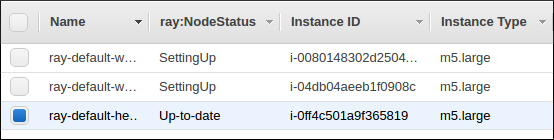

Cloud Setup and Auto-Scaling
============================

The ``ray create_or_update`` command starts an AWS Ray cluster from your personal computer. Once the cluster is up, you can then SSH into it to run Ray programs.

Quick start
-----------

First, ensure you have configured your AWS credentials in ``~/.aws/credentials``,
as described in `the boto docs <http://boto3.readthedocs.io/en/latest/guide/configuration.html>`__.

Then you're ready to go. The provided `ray/python/ray/autoscaler/aws/example.yaml <https://github.com/ray-project/ray/tree/master/python/ray/autoscaler/aws/example.yaml>`__ cluster config file will create a small cluster with a m4.large head node (on-demand), and two m4.large `spot workers <https://aws.amazon.com/ec2/spot/>`__, configured to autoscale up to four m4.large workers.

Try it out by running these commands from your personal computer. Once the cluster is started, you can then
SSH into the head node to run Ray programs with ``ray.init(redis_address="<node_internal_ip>:6379")``.

.. code-block:: bash

    # Create or update the cluster. When the command finishes, it will print
    # out the command that can be used to SSH into the cluster head node.
    $ ray create_or_update ray/python/ray/autoscaler/aws/example.yaml

    # Reconfigure autoscaling behavior without interrupting running jobs
    $ ray create_or_update ray/python/ray/autoscaler/aws/example.yaml \
        --max-workers=N --no-restart

    # Teardown the cluster
    $ ray teardown ray/python/ray/autoscaler/aws/example.yaml

Updating your cluster
---------------------

When you run ``ray create_or_update`` with an existing cluster, the command checks if the local configuration differs from the applied configuration of the cluster. This includes any changes to synced files specified in the ``file_mounts`` section of the config. If so, the new files and config will be uploaded to the cluster. Following that, Ray services will be restarted.

You can also run ``ray create_or_update`` to restart a cluster if it seems to be in a bad state (this will restart all Ray services even if there are no config changes).

If you don't want the update to restart services (e.g. because the changes don't require a restart), pass ``--no-restart`` to the update call.

Autoscaling
-----------

Ray clusters come with a load-based auto-scaler. When cluster resource usage exceeds a configurable threshold (80% by default), new nodes will be launched up the specified ``max_workers`` limit. When nodes are idle for more than a timeout, they will be removed, down to the ``min_workers`` limit. The head node is never removed.

The default idle timeout is 5 minutes. This is to prevent excessive node churn which could impact performance and increase costs (in AWS there is a minimum billing charge of 1 minute per instance, after which usage is billed by the second).

Monitoring cluster status
-------------------------

You can monitor cluster usage and auto-scaling status by tailing the autoscaling logs in ``/tmp/raylogs/monitor-*.log``.

The Ray autoscaler also reports per-node status in the form of instance tags. In the AWS console, you can click on a Node, go the the "Tags" pane, and add the ``ray:NodeStatus`` tag as a column. This lets you see per-node statuses at a glance:

Customizing cluster setup
-------------------------

You are encouraged to copy the example YAML file and modify it to your needs. This may include adding additional setup commands to install libraries or sync local data files. After you have customized the nodes, it is also a good idea to create a new machine image (AMI) and use that in the config file. This reduces worker setup time, improving the efficiency of auto-scaling.

The setup commands you use should ideally be *idempotent*, that is, can be run more than once. This allows Ray to update nodes after they have been created. You can usually make commands idempotent with small modifications, e.g. ``git clone foo`` can be rewritten as ``test -e foo || git clone foo`` which checks if the repo is already cloned first.

Syncing git branches
--------------------

A common use case is syncing a particular local git branch to all workers of the cluster. There is a nice way to do this as follows:

.. code-block:: yaml

    file_mounts: {
        "/tmp/current_branch_sha": "/path/to/local/repo/.git/refs/heads/<YOUR_BRANCH_NAME>",
    }

    setup_commands:
        - test -e <REPO_NAME> || git clone https://github.com/<REPO_ORG>/<REPO_NAME>.git
        - cd <REPO_NAME> && git fetch && git checkout `cat /tmp/current_branch_sha`

This tells ``ray create_or_update`` to sync the current git branch SHA from your personal computer to a temporary file on the cluster. Then, the setup commands read that file to figure out which SHA they should checkout on the nodes. The final workflow to update the cluster then becomes just this:

1. Make local changes to a git branch
2. Commit the changes with ``git commit`` and ``git push``
3. Update files on your Ray cluster with ``ray create_or_update``

Common cluster configurations
-----------------------------

The ``example.yaml`` configuration is enough to get started with Ray, but for more compute intensive workloads you will want to change the instance types to e.g. use GPU or larger compute instance by editing the yaml file. Here are a few common configurations:

**GPU single node**: use Ray on a single large GPU instance.

.. code-block:: yaml

    max_workers: 0
    head_node:
        InstanceType: p2.8xlarge

**Mixed GPU and CPU nodes**: for RL applications that require proportionally more
CPU than GPU resources, you can use additional CPU workers with a GPU head node.

.. code-block:: yaml

    max_workers: 10
    head_node:
        InstanceType: p2.8xlarge
    worker_nodes:
        InstanceType: m4.16xlarge

**Autoscaling CPU cluster**: use a small head node and have Ray auto-scale
workers as needed. This can be a cost-efficient configuration for clusters with
bursty workloads. You can also request spot workers for additional cost savings.

.. code-block:: yaml

    min_workers: 0
    max_workers: 10
    head_node:
        InstanceType: m4.large
    worker_nodes:
        InstanceMarketOptions:
            MarketType: spot
        InstanceType: m4.16xlarge

**Autoscaling GPU cluster**: similar to the autoscaling CPU cluster, but
with GPU worker nodes instead.

.. code-block:: yaml

    min_workers: 0
    max_workers: 10
    head_node:
        InstanceType: m4.large
    worker_nodes:
        InstanceMarketOptions:
            MarketType: spot
        InstanceType: p2.xlarge

Additional Cloud providers
--------------------------

To use Ray autoscaling on other Cloud providers or cluster management systems, you can implement the ``NodeProvider`` interface (~100 LOC) and register it in `node_provider.py <https://github.com/ray-project/ray/tree/master/python/ray/autoscaler/node_provider.py>`__. Contributions are welcome!
