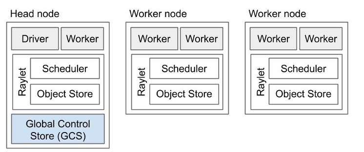

Key Concepts
============
..
    TODO(cade) Can we simplify this? From https://github.com/ray-project/ray/pull/26754#issuecomment-1192927645:
    * Worker Nodes
    * Head Node
    * Autoscaler
    * Clients and Jobs
    
    Need to add the following sections + break out existing content into them.
    See ray-core/user-guide.rst for a TOC example
    
    overview
    high-level-architecture
    jobs
    nodes-vs-workers
    scheduling-and-autoscaling
    configuration
    Things-to-know
    .
    Yeah I think this is implementation detail (making key-concepts work for both). The few places I can think of:
    .
    nodes vs pods. Can tackle this in bullet points under node concept.
    autoscaler location: head node vs kuberay pod. Can have a couple bullet points here too.
    Btw, the key concepts section needs to be trimmed way down. It's supposed to be a single, concise page of key concepts. Right now, it's introducing a lot of other stuff that isn't really key (there's like 10 things). I think you can keep it to:
    .
    Worker Nodes
    Head Node
    Autoscaler
    Clients and Jobs
    The other sub-sections can be moved under user guides in the K8s/VM specific sections.

.. include:: /_includes/clusters/we_are_hiring.rst

.. _cluster-key-concepts-under-construction:

..
  .. _cluster-key-concepts-under-construction:
  
  Cluster
  -------
  
  A Ray cluster is a set of one or more nodes that are running Ray and share the
  same :ref:`head node<cluster-node-types>`.
  
  .. _cluster-node-types-under-construction:
  
  Node types
  ----------
  
  A Ray cluster consists of a :ref:`head node<cluster-head-node>` and a set of
  :ref:`worker nodes<cluster-worker-node>`.
  
  .. image:: ray-cluster.jpg
      :align: center
      :width: 600px

This page introduces several key concepts that are helpful when creating and managing Ray clusters.

.. contents::
    :local:

.. _cluster-worker-nodes-under-construction:

Worker nodes
------------
A Ray cluster consists of a set of one or more **worker nodes**. Ray tasks and actors
can be scheduled onto the worker nodes. Each worker node runs helper processes which
implement distributed scheduling and :ref:`memory management<memory>`.

    A Ray cluster consists of a set of one or more worker nodes, one of which is designated
    as the head node. Each node runs Ray helper processes and Ray application code.

The number of worker nodes in a cluster may change with application demand, according
to your Ray cluster configuration. The :ref:`head node<cluster-head-node-under-construction>`
runs the logic which implements autoscaling.

.. note::
    A *node* means an individual machine. However, :ref:`on Kubernetes<kuberay-index>`, nodes are implemented as pods.

.. _cluster-head-node-under-construction:

Head node
---------
Every Ray cluster has one :ref:`worker node<cluster-worker-nodes-under-construction>`
which is designated as the **head node** of the cluster. The head node runs
important processes such as the :ref:`autoscaler<cluster-autoscaler-under-construction>`
and the Ray driver processes, :ref:`which run the top-level Ray application
<cluster-clients-and-jobs-under-construction>`. Ray may schedule tasks and actors
on the head node just like any other worker node.

.. _cluster-autoscaler-under-construction:

Autoscaler
----------

The autoscaler is a process that runs on the :ref:`head node<cluster-head-node>`
and is responsible for adding or removing :ref:`worker nodes<cluster-worker-node>`
to meet the needs of the Ray workload while matching the specification in the
:ref:`cluster config file<cluster-config>`. In particular, if the resource
demands of the Ray workload exceed the current capacity of the cluster, the
autoscaler will try to add nodes. Conversely, if a node is idle for long enough,
the autoscaler will remove it from the cluster. To learn more about autoscaling,
refer to the :ref:`Ray cluster deployment guide<deployment-guide-autoscaler>`.

.. _cluster-clients-and-jobs-under-construction:

Clients and Jobs
----------------

Lorem ipsum dolor sit amet, consectetur adipiscing elit. Cras aliquet congue diam in ultricies. Duis feugiat non est sit amet tincidunt. Sed eget leo tempor, tempus mi quis, sollicitudin orci. Vivamus cursus et enim ac interdum. Ut magna ligula, suscipit id justo finibus, pharetra elementum lacus. Etiam tristique vulputate lacus, vel suscipit augue hendrerit nec. Praesent hendrerit scelerisque mi.

Vivamus id neque risus. Curabitur sed enim fringilla, lacinia erat nec, finibus purus. In ornare diam feugiat sapien elementum porttitor. Praesent sodales tristique nibh quis efficitur. Mauris maximus porta nisi ac pretium. Donec quis nulla nibh. Maecenas ac auctor arcu. Pellentesque id nulla at massa tempus condimentum id nec ligula. Suspendisse aliquet scelerisque libero quis rhoncus. Quisque tempus aliquam tortor ac vehicula. Aliquam erat volutpat. Donec lectus est, consectetur ut dolor non, volutpat posuere nisi.

..
    Ray Client
    ----------
    The Ray Client is an API that connects a Python script to a remote Ray cluster.
    To learn more about the Ray Client, you can refer to the :ref:`documentation<ray-client>`.
    
    Job submission
    --------------
    
    Ray Job submission is a mechanism to submit locally developed and tested applications
    to a remote Ray cluster. It simplifies the experience of packaging, deploying,
    and managing a Ray application. To learn more about Ray jobs, refer to the
    :ref:`documentation<ray-job-submission-api-ref>`.
