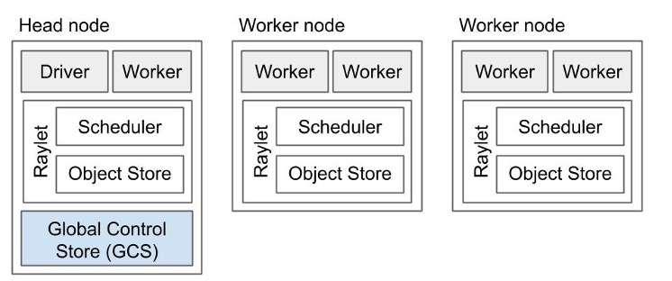

.. include:: /_includes/clusters/announcement.rst

.. include:: we_are_hiring.rst

.. _cluster-index:

Ray Cluster Overview
====================

What is a Ray cluster?
------------------------

One of Ray's strengths is the ability to leverage multiple machines in the same
program. Ray can, of course, be run on a single machine (and is done so often),
but the real power is using Ray on a cluster of machines.

A Ray cluster consists of a **head node** and a set of **worker nodes**. The
head node needs to be started first, and the worker nodes are given the address
of the head node to form the cluster:

You can use the Ray Cluster Launcher to provision machines and launch a
multi-node Ray cluster. You can use the cluster launcher :ref:`on AWS, GCP,
Azure, Kubernetes, Aliyun, on-premise, and Staroid or even on your custom node provider
<cluster-cloud>`. Ray clusters can also make use of the Ray Autoscaler, which
allows Ray to interact with a cloud provider to request or release instances
following :ref:`a specification <cluster-config>` and according to application
workload.

Next steps
----------

To get started with Ray Clusters, we recommend that you check out the :ref:`Ray
Cluster Quick Start <ref-cluster-quick-start>`. For more advanced examples of
use, you can also refer to the :ref:`full specification for Ray Cluster
configuration <cluster-config>`.

To learn about best practices for deploying a Ray cluster, :ref:`check out the
deployment guide <deployment-guide>`.

.. include:: /_includes/clusters/announcement_bottom.rst
