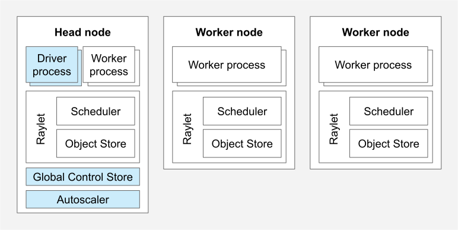
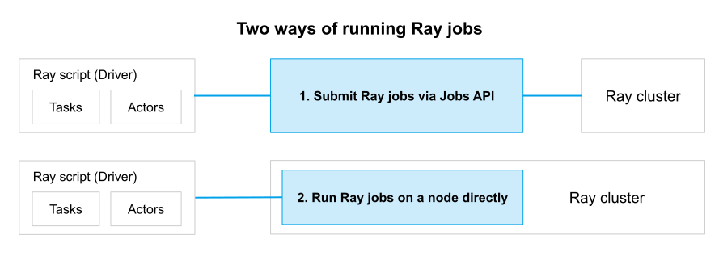

Key Concepts
============

.. _cluster-key-concepts:

This page introduces key concepts for Ray clusters:

.. contents::
    :local:

Ray Cluster
-----------
A Ray cluster consists of a single :ref:`head node <cluster-head-node>`
and any number of connected :ref:`worker nodes <cluster-worker-nodes>`:

    
    *A Ray cluster with two worker nodes. Each node runs Ray helper processes to
    facilitate distributed scheduling and memory management. The head node runs
    additional control processes (highlighted in blue).*

The number of worker nodes may be *autoscaled* with application demand as specified
by your Ray cluster configuration. The head node runs the :ref:`autoscaler <cluster-autoscaler>`.

.. note::
    Ray nodes are implemented as pods when :ref:`running on Kubernetes <kuberay-index>`.

Users can submit jobs for execution on the Ray cluster, or can interactively use the
cluster by connecting to the head node and running `ray.init`. See
:ref:`Ray Jobs <jobs-quickstart>` for more information.

.. _cluster-head-node:

Head Node
---------
Every Ray cluster has one node which is designated as the *head node* of the cluster.
The head node is identical to other worker nodes, except that it also runs singleton processes responsible for cluster management such as the
:ref:`autoscaler <cluster-autoscaler>` and the Ray driver processes
:ref:`which run Ray jobs <cluster-clients-and-jobs>`. Ray may schedule
tasks and actors on the head node just like any other worker node, unless configured otherwise.

.. _cluster-worker-nodes:

Worker Node
------------
*Worker nodes* do not run any head node management processes, and serve only to run user code in Ray tasks and actors. They participate in distributed scheduling, as well as the storage and distribution of Ray objects in :ref:`cluster memory <memory>`.

.. _cluster-autoscaler:

Autoscaling
-----------

The *Ray autoscaler* is a process that runs on the :ref:`head node <cluster-head-node>` (or as a sidecar container in the head pod if :ref:`using Kubernetes <kuberay-index>`).
When the resource demands of the Ray workload exceed the
current capacity of the cluster, the autoscaler will try to increase the number of worker nodes. When worker nodes
sit idle, the autoscaler will remove worker nodes from the cluster.

It is important to understand that the autoscaler only reacts to task and actor resource requests, and not application metrics or physical resource utilization.
To learn more about autoscaling, refer to the user guides for Ray clusters on :ref:`VMs <cloud-vm-index>` and :ref:`Kubernetes <kuberay-index>`.

.. _cluster-clients-and-jobs:

Ray Jobs
--------

A Ray job is a single application: it is the collection of Ray tasks, objects, and actors that originate from the same script.
The worker that runs the Python script is known as the *driver* of the job. 

There are three ways to run a Ray job on a Ray cluster:

1. (Recommended) Submit the job using the :ref:`Ray Jobs API <jobs-overview>`.
2. Run the driver script directly on any node of the Ray cluster, for interactive development.
3. Use :ref:`Ray Client <ray-client-ref>` to connect remotely to the cluster within a driver script.

For details on these workflows, refer to the :ref:`Ray Jobs API guide <jobs-overview>`.

    
    *Three ways of running a job on a Ray cluster.*