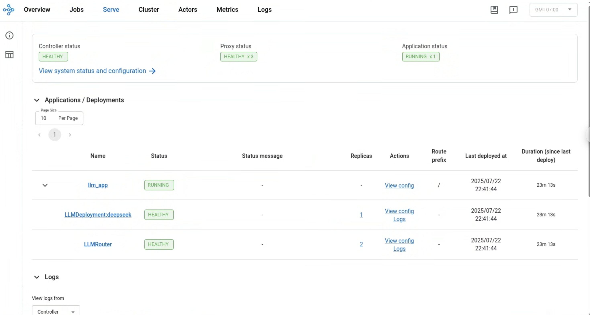

(kuberay-rayservice-deepseek-example)=

# Serve Deepseek R1 using Ray Serve LLM

This guide provides a step-by-step guide for deploying a Large Language Model (LLM) using Ray Serve LLM on Kubernetes. Leveraging KubeRay, Ray Serve, and vLLM, this guide deploys the  `deepseek-ai/DeepSeek-R1` model from Hugging Face, enabling scalable, efficient, and OpenAI-compatible LLM serving within a Kubernetes environment. See [Serving LLMs](serving-llms) for information on Ray Serve LLM.

## Prerequisites
A DeepSeek model requires 2 nodes, each equipped with 8 H100 80 GB GPUs.
It should be deployable on Kubernetes clusters that meet this requirement.
This guide provides instructions for setting up a GKE cluster using [A3 High](https://cloud.google.com/compute/docs/gpus#a3-high) or [A3 Mega](https://cloud.google.com/compute/docs/gpus#a3-mega) machine types.

Before creating the cluster, ensure that your project has sufficient [quota](https://console.cloud.google.com/iam-admin/quotas) for the required accelerators.

## Step 1: Create a Kubernetes cluster on GKE
Run this command and all following commands on your local machine or on the [Google Cloud Shell](https://cloud.google.com/shell). If running from your local machine, you need to install the [Google Cloud SDK](https://cloud.google.com/sdk/docs/install). 
The following command creates a Kubernetes cluster named `kuberay-gpu-cluster` with 1 default CPU node in the `us-east5-a` zone. This example uses the `e2-standard-16` machine type, which has 16 vCPUs and 64 GB memory.

```sh
gcloud container clusters create kuberay-gpu-cluster \
    --location=us-east5-a \
    --machine-type=e2-standard-16 \
    --num-nodes=1 \
    --enable-image-streaming
```

Run the following command to create an on-demand GPU node pool for Ray GPU workers.

```sh
gcloud beta container node-pools create gpu-node-pool \
    --cluster kuberay-gpu-cluster \
    --machine-type a3-highgpu-8g \
    --num-nodes 2 \
    --accelerator "type=nvidia-h100-80gb,count=8" \
    --zone us-east5-a \
    --node-locations us-east5-a \
    --host-maintenance-interval=PERIODIC
```

The `--accelerator` flag specifies the type and number of GPUs for each node in the node pool. This example uses the [A3 High](https://cloud.google.com/compute/docs/gpus#a3-high) GPU. The machine type `a3-highgpu-8g` has 8 GPU, 640 GB GPU Memory, 208 vCPUs, and 1872 GB RAM.


```{admonition} Note
:class: note

To create a node pool that uses reservations, you can specify the following parameters:
* `--reservation-affinity=specific`
* `--reservation=RESERVATION_NAME`
* `--placement-policy=PLACEMENT_POLICY_NAME` (Optional)
```

Run the following `gcloud` command to configure `kubectl` to communicate with your cluster:

```sh
gcloud container clusters get-credentials kuberay-gpu-cluster --zone us-east5-a
```

## Step 2: Install the KubeRay operator

Install the most recent stable KubeRay operator from the Helm repository by following [Deploy a KubeRay operator](kuberay-operator-deploy). The Kubernetes `NoSchedule` taint in the example config prevents the KubeRay operator Pod from running on a GPU node.

## Step 3: Deploy a RayService

Deploy DeepSeek-R1 as a RayService custom resource by running the following command:

```sh
kubectl apply -f https://raw.githubusercontent.com/ray-project/kuberay/master/ray-operator/config/samples/ray-service.deepseek.yaml
```

This step sets up a custom Ray Serve application to serve the `deepseek-ai/DeepSeek-R1` model on two worker nodes. You can inspect and modify the `serveConfigV2` section in the YAML file to learn more about the Serve application:
```yaml
serveConfigV2: |
  applications:
  - args:
      llm_configs:
        - model_loading_config:
            model_id: "deepseek"
            model_source: "deepseek-ai/DeepSeek-R1"
          accelerator_type: "H100"
          deployment_config:
            autoscaling_config:
              min_replicas: 1
              max_replicas: 1
          runtime_env:
            env_vars:
              VLLM_USE_V1: "1"
          engine_kwargs:
            tensor_parallel_size: 8
            pipeline_parallel_size: 2
            gpu_memory_utilization: 0.92
            dtype: "auto"
            max_num_seqs: 40
            max_model_len: 16384
            enable_chunked_prefill: true
            enable_prefix_caching: true
    import_path: ray.serve.llm:build_openai_app
    name: llm_app
    route_prefix: "/"
```

In particular, this configuration loads the model from `deepseek-ai/DeepSeek-R1` and sets its `model_id` to `deepseek`. The `LLMDeployment` initializes the underlying LLM engine using the `engine_kwargs` field, which includes key performance tuning parameters:

- `tensor_parallel_size: 8`

  This setting enables tensor parallelism, splitting individual large layers of the model across 8 GPUs. Adjust this variable according to the number of GPUs used by cluster nodes.

- `pipeline_parallel_size: 2`
  
  This setting enables pipeline parallelism, dividing the model's entire set of layers into 2 sequential stages. Adjust this variable according to cluster worker node numbers.


The `deployment_config` section sets the desired number of engine replicas. See [Serving LLMs](serving-llms) and the [Ray Serve config documentation](serve-in-production-config-file) for more information.

Wait for the RayService resource to become healthy. You can confirm its status by running the following command:
```sh
kubectl get rayservice deepseek-r1 -o yaml
```

After a few minutes, the result should be similar to the following:
```
status:
  activeServiceStatus:
    applicationStatuses:
      llm_app:
        serveDeploymentStatuses:
          LLMDeployment:deepseek:
            status: HEALTHY
          LLMRouter:
            status: HEALTHY
        status: RUNNING
```

```{admonition} Note
:class: note

The model download and deployment will typically take 20-30 minutes. While this is in progress, use the Ray Dashboard (Step 4) Cluster tab to monitor  the download progress as disk fills up.
```

## Step 4: View the Ray dashboard
```sh
# Forward the service port
kubectl port-forward svc/deepseek-r1-head-svc 8265:8265
```

Once forwarded, navigate to the Serve tab on the dashboard to review application status, deployments, routers, logs, and other relevant features.


## Step 5: Send a request

To send requests to the Ray Serve deployment, port-forward port 8000 from the Serve app service:
```sh
kubectl port-forward svc/deepseek-r1-serve-svc 8000
```

Note that this Kubernetes service comes up only after Ray Serve apps are running and ready.

Test the service with the following command:
```sh
$ curl http://localhost:8000/v1/chat/completions     -H "Content-Type: application/json"     -d '{
      "model": "deepseek",
      "messages": [
        {
          "role": "user", 
          "content": "I have four boxes. I put the red box on the bottom and put the blue box on top. Then I put the yellow box on top the blue. Then I take the blue box out and put it on top. And finally I put the green box on the top. Give me the final order of the boxes from bottom to top. Show your reasoning but be brief"}
      ],
      "temperature": 0.7
    }'
```

The output should be in the following format:

```
{
  "id": "deepseek-653881a7-18f3-493b-a43f-adc8501f01f8",
  "object": "chat.completion",
  "created": 1753345252,
  "model": "deepseek",
  "choices": [
    {
      "index": 0,
      "message": {
        "role": "assistant",
        "reasoning_content": null,
        "content": "Okay, let's break this down step by step. The user has four boxes: red, blue, yellow, and green. The starting point is putting the red box on the bottom. Then blue is placed on top of red. Next, yellow goes on top of blue. At this point, the order is red (bottom), blue, yellow. \n\nThen the instruction says to take the blue box out and put it on top. Wait, when they take the blue box out from where? The current stack is red, blue, yellow. If we remove blue from between red and yellow, that leaves red and yellow. Then placing blue on top would make the stack red, yellow, blue. But the problem is, when you remove a box from the middle, the boxes above it should fall down, right? So after removing blue, yellow would be on top of red. Then putting blue on top of that stack would make it red, yellow, blue.\n\nThen the final step is putting the green box on top. So the final order would be red (bottom), yellow, blue, green. Let me verify again to make sure I didn't miss anything. Start with red at bottom. Blue on top of red: red, blue. Yellow on top of blue: red, blue, yellow. Remove blue from the middle, so yellow moves down to be on red, then put blue on top: red, yellow, blue. Finally, add green on top: red, yellow, blue, green. Yes, that seems right.\n</think>\n\nThe final order from bottom to top is: red, yellow, blue, green.\n\n1. Start with red at the bottom.  \n2. Add blue on top: red → blue.  \n3. Add yellow on top: red → blue → yellow.  \n4. **Remove blue** from between red and yellow; yellow drops to second position. Now: red → yellow.  \n5. Place blue back on top: red → yellow → blue.  \n6. Add green on top: red → yellow → blue → green.",
        "tool_calls": []
      },
      "logprobs": null,
      "finish_reason": "stop",
      "stop_reason": null
    }
  ],
  "usage": {
    "prompt_tokens": 81,
    "total_tokens": 505,
    "completion_tokens": 424,
    "prompt_tokens_details": null
  },
  "prompt_logprobs": null
}
```


