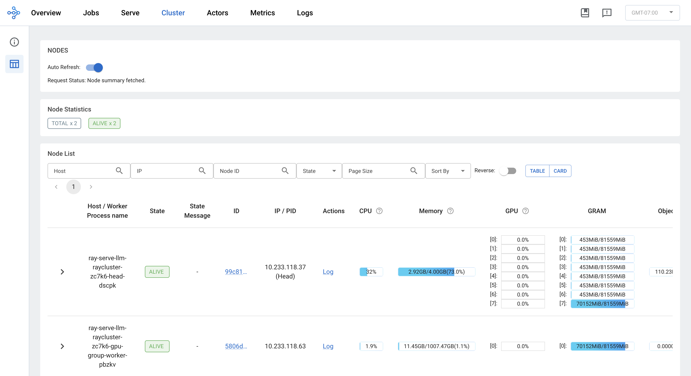

(kuberay-rayservice-llm-example)=

# Serve a Large Language Model using Ray Serve LLM on Kubernetes

This guide provides a step-by-step walkthrough for deploying a Large Language Model (LLM) using Ray Serve LLM on Kubernetes. Leveraging KubeRay, Ray Serve, and vLLM, this guide deploys the  `Qwen/Qwen2.5-7B-Instruct` model from HuggingFace, enabling scalable, efficient, and OpenAI-compatible LLM serving within a Kubernetes environment. For more information on Ray-Serve LLM, visit [here](../../../serve/llm/serving-llms.rst).

## Prerequisites

In this example, model weights are downloaded from the [Qwen/Qwen2.5-7B-Instruct](https://huggingface.co/Qwen/Qwen2.5-7B-Instruct) Hugging Face repository. In order to properly finish this guide, you must fulfill the following requirements:
* A [Hugging Face Account](https://huggingface.co/) and a Hugging Face [Access Token](https://huggingface.co/settings/tokens) with read access to gated repos.
* In your Ray Serve configuration, set the `HUGGING_FACE_HUB_TOKEN` environment variable to this token to enable model downloads.
* Any supported GPU. You can refer [here](../user-guides/k8s-cluster-setup.md) for more information

## Step 1: Create a Kubernetes cluster with GPUs

Follow [aws-eks-gpu-cluster.md](kuberay-eks-gpu-cluster-setup) or [gcp-gke-gpu-cluster.md](kuberay-gke-gpu-cluster-setup) to create a Kubernetes cluster.

## Step 2: Install the KubeRay Operator

Install the most recent stable KubeRay operator from the Helm repository by following [Deploy a KubeRay operator](../getting-started/kuberay-operator-installation.md). The KubeRay operator pod should run on a CPU node if the taint for the GPU node pool is configured correctly.

## Step 3: Create a Kubernetes Secret containing your Hugging Face access token

For additional security, instead of passing the HF Access Token directly as an environment variable, we recommend creating a Kubernetes Secret containing your Hugging Face access token. Download the Ray Serve LLM service config yaml [here](https://github.com/ray-project/kuberay/blob/master/ray-operator/config/samples/ray-service.llm-serve.yaml), update the value for `hf_token` to your private access token in the `Secret`, and apply the config to your K8s cluster.

```yaml
apiVersion: v1
kind: Secret
metadata:
  name: hf-token
type: Opaque
stringData:
  hf_token: <your-hf-access-token-value>
```

## Step 4: Deploy a RayService

Create a RayService Custom Resource:

```sh
kubectl apply -f https://raw.githubusercontent.com/ray-project/kuberay/master/ray-operator/config/samples/ray-service.llm-serve.yaml
```

In this step, a custom Ray Serve Application is setup to serve the `Qwen/Qwen2.5-7B-Instruct` Model, creating an OpenAI-Compatible Server. The source for this example is on [GitHub](https://github.com/ray-project/kuberay/blob/master/ray-operator/config/samples/ray-service.llm-serve.yaml). You can inspect and modify the Serve Config to learn more about the Serve deployment:
```yaml
serveConfigV2: |
  applications:
  - name: llms
    import_path: ray.serve.llm:build_openai_app
    route_prefix: "/"
    args:
      llm_configs:
      - model_loading_config:
          model_id: qwen2.5-7b-instruct
          model_source: Qwen/Qwen2.5-7B-Instruct
        engine_kwargs:
          dtype: bfloat16
          max_model_len: 1024
          device: auto
          gpu_memory_utilization: 0.75
        deployment_config:
          autoscaling_config:
            min_replicas: 1
            max_replicas: 4
            target_ongoing_requests: 64
          max_ongoing_requests: 128
```

Wait for the RayService resource to become healthy. You can check its status by running the following command:
```sh
kubectl get rayservice ray-serve-llm -o yaml
```

After a few minutes, the result should be something like this:
```
status:
  activeServiceStatus:
    applicationStatuses:
      llms:
        serveDeploymentStatuses:
          LLMDeployment:qwen2_5-7b-instruct:
            status: HEALTHY
          LLMRouter:
            status: HEALTHY
        status: RUNNING
```

## Step 5: Sending a Request

To send requests to the Ray Serve Deployment, port-forward 8000 port from the Serve application Service:
```sh
kubectl port-forward ray-serve-llm-head-svc 8000
```

Additionally, you can also port-forward 8000 port from the Head application Service to send requests to the serve application.

Keep in mind this Kubernetes Service comes up only after Ray Serve applications are running and ready. This process takes a few minutes after all the pods in the Ray Cluster are up and running.

Test the service with the following command:
```sh
curl --location 'http://localhost:8000/v1/chat/completions' --header 'Content-Type: application/json' 
  --data '{
      "model": "qwen2.5-7b-instruct",
      "messages": [
          {
              "role": "system", 
              "content": "You are a helpful assistant."
          },
          {
              "role": "user", 
              "content": "Provide steps to serve an LLM using Ray Serve."
          }
      ]
  }'
```


## Step 6: View the Ray Dashboard

Ray Serve automatically starts Ray Dashboard, a web interface that provides metrics, charts, and other features that help Ray users to understand and debug Ray applications.

To access the Ray Dashboard, port-forward port 8625 from the Head application Service using the following command:
```sh
kubectl port-forward svc/ray-serve-llm-head-svc 8625
```

Once forwarded, navigate to the Serve tab on the Dashboard to review application status, deployments, routers, logs, and other relevant features.


The Cluster tab provides detailed information about the Ray cluster components, including head and worker pods.


For monitoring application and cluster-level metrics, set up Prometheus and Grafana for dashboarding by referring to the official documentation:
* [Prometheus and Grafana with KubeRay](../k8s-ecosystem/prometheus-grafana.md)
* [Collecting and Monitoring Metrics in Ray](../../metrics.md)
* [Configuring and Managing Dashboards](../../configure-manage-dashboard.md)
