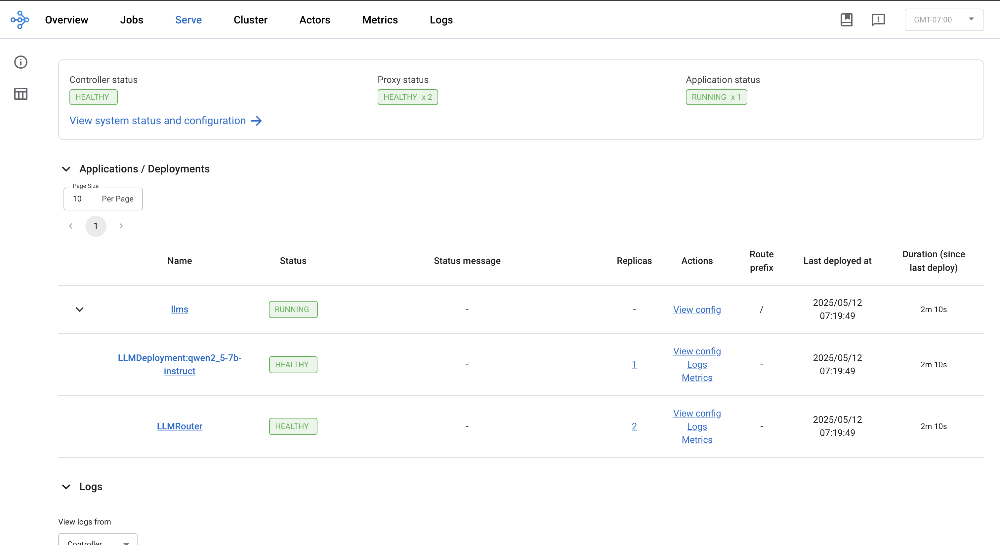

(kuberay-rayservice-llm-example)=

# Serve a Large Language Model using Ray Serve LLM on Kubernetes

This guide provides a step-by-step guide for deploying a Large Language Model (LLM) using Ray Serve LLM on Kubernetes. Leveraging KubeRay, Ray Serve, and vLLM, this guide deploys the  `Qwen/Qwen2.5-7B-Instruct` model from Hugging Face, enabling scalable, efficient, and OpenAI-compatible LLM serving within a Kubernetes environment. See [Serving LLMs](serving-llms) for information on Ray Serve LLM.

## Prerequisites

This example downloads model weights from the [`Qwen/Qwen2.5-7B-Instruct`](https://huggingface.co/Qwen/Qwen2.5-7B-Instruct) Hugging Face repository. To completely finish this guide, you must fulfill the following requirements:
* A [Hugging Face account](https://huggingface.co/) and a Hugging Face [access token](https://huggingface.co/settings/tokens) with read access to gated repositories.
* In your RayService custom resource, set the `HUGGING_FACE_HUB_TOKEN` environment variable to the Hugging Face token to enable model downloads.
* A Kubernetes cluster with GPUs. 

## Step 1: Create a Kubernetes cluster with GPUs

Refer to the Kubernetes cluster setup [instructions](../user-guides/k8s-cluster-setup.md) for guides on creating a Kubernetes cluster.

## Step 2: Install the KubeRay operator

Install the most recent stable KubeRay operator from the Helm repository by following [Deploy a KubeRay operator](../getting-started/kuberay-operator-installation.md). The Kubernetes `NoSchedule` taint in the example config prevents the KubeRay operator pod from running on a GPU node.

## Step 3: Create a Kubernetes Secret containing your Hugging Face access token

For additional security, instead of passing the HF access token directly as an environment variable, create a Kubernetes secret containing your Hugging Face access token. Download the Ray Serve LLM service config .yaml file using the following command:

```sh
curl -o ray-service.llm-serve.yaml https://raw.githubusercontent.com/ray-project/kuberay/master/ray-operator/config/samples/ray-service.llm-serve.yaml
```

After downloading, update the value for `hf_token` to your private access token in the `Secret`.

```yaml
apiVersion: v1
kind: Secret
metadata:
  name: hf-token
type: Opaque
stringData:
  hf_token: <your-hf-access-token-value>
```

## Step 4: Deploy a RayService

After adding the Hugging Face access token, create a RayService custom resource using the config file:

```sh
kubectl apply -f ray-service.llm-serve.yaml
```

This step sets up a custom Ray Serve app to serve the `Qwen/Qwen2.5-7B-Instruct` model, creating an OpenAI-compatible server. You can inspect and modify the `serveConfigV2` section in the YAML file to learn more about the Serve app:
```yaml
serveConfigV2: |
  applications:
  - name: llms
    import_path: ray.serve.llm:build_openai_app
    route_prefix: "/"
    args:
      llm_configs:
      - model_loading_config:
          model_id: qwen2.5-7b-instruct
          model_source: Qwen/Qwen2.5-7B-Instruct
        engine_kwargs:
          dtype: bfloat16
          max_model_len: 1024
          device: auto
          gpu_memory_utilization: 0.75
        deployment_config:
          autoscaling_config:
            min_replicas: 1
            max_replicas: 4
            target_ongoing_requests: 64
          max_ongoing_requests: 128
```

In particular, this configuration loads the model from `Qwen/Qwen2.5-7B-Instruct` and sets its `model_id` to `qwen2.5-7b-instruct`. The `LLMDeployment` initializes the underlying LLM engine using the `engine_kwargs` field. The `deployment_config` section sets the desired number of engine replicas. By default, each replica requires one GPU. See [Serving LLMs](serving-llms) and the [Ray Serve config documentation](serve-in-production-config-file) for more information.

Wait for the RayService resource to become healthy. You can confirm its status by running the following command:
```sh
kubectl get rayservice ray-serve-llm -o yaml
```

After a few minutes, the result should be similar to the following:
```
status:
  activeServiceStatus:
    applicationStatuses:
      llms:
        serveDeploymentStatuses:
          LLMDeployment:qwen2_5-7b-instruct:
            status: HEALTHY
          LLMRouter:
            status: HEALTHY
        status: RUNNING
```

## Step 5: Send a request

To send requests to the Ray Serve deployment, port-forward port 8000 from the Serve app service:
```sh
kubectl port-forward ray-serve-llm-serve-svc 8000
```


Note that this Kubernetes service comes up only after Ray Serve apps are running and ready.

Test the service with the following command:
```sh
curl --location 'http://localhost:8000/v1/chat/completions' --header 'Content-Type: application/json' 
  --data '{
      "model": "qwen2.5-7b-instruct",
      "messages": [
          {
              "role": "system", 
              "content": "You are a helpful assistant."
          },
          {
              "role": "user", 
              "content": "Provide steps to serve an LLM using Ray Serve."
          }
      ]
  }'
```

The output should be in the following format:

```
{
  "id": "qwen2.5-7b-instruct-550d3fd491890a7e7bca74e544d3479e",
  "object": "chat.completion",
  "created": 1746595284,
  "model": "qwen2.5-7b-instruct",
  "choices": [
      {
          "index": 0,
          "message": {
              "role": "assistant",
              "reasoning_content": null,
              "content": "Sure! Ray Serve is a library built on top of Ray...",
              "tool_calls": []
          },
          "logprobs": null,
          "finish_reason": "stop",
          "stop_reason": null
      }
  ],
  "usage": {
      "prompt_tokens": 30,
      "total_tokens": 818,
      "completion_tokens": 788,
      "prompt_tokens_details": null
  },
  "prompt_logprobs": null
}
```


## Step 6: View the Ray dashboard


```sh
kubectl port-forward svc/ray-serve-llm-head-svc 8265
```

Once forwarded, navigate to the Serve tab on the dashboard to review application status, deployments, routers, logs, and other relevant features.

