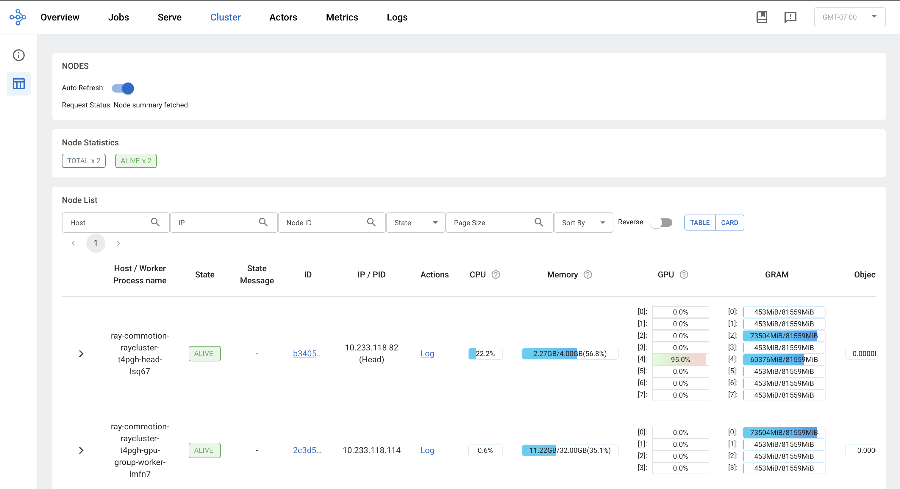

(kuberay-rayservice-llm-example)=

# Serve a Large Language Model using Ray Serve LLM on Kubernetes

This guide provides a step-by-step walkthrough for deploying a Large Language Model (LLM) using Ray Serve LLM on Kubernetes. Leveraging KubeRay, Ray Serve, and vLLM, this guide deploys the  `Qwen/Qwen2.5-7B-Instruct` model from HuggingFace, enabling scalable, efficient, and OpenAI-compatible LLM serving within a Kubernetes environment.

## Prerequisites

In this example, model weights are downloaded from Hugging Face. In order to properly finish this guide, you must fulfill the following requirements:
* A [Hugging Face Account](https://huggingface.co/) and a Hugging Face [Access Token](https://huggingface.co/settings/tokens) with read access to gated repos.
* In your Ray Serve configuration, set the `HUGGING_FACE_HUB_TOKEN` environment variable to this token to enable model downloads.
* Any supported GPU. You can refer [here](https://docs.ray.io/en/latest/cluster/kubernetes/user-guides/k8s-cluster-setup.html#kuberay-k8s-setup) for more information

## Install the KubeRay Operator

Install the most recent stable KubeRay operator from the Helm repository by following [Deploy a KubeRay operator](kuberay-operator-deploy). The KubeRay operator Pod must be on the CPU node if you set up the taint for the GPU node pool correctly.

## Create a Kubernetes Secret containing your Hugging Face access token

Additionally, instead of passing the HF Access Token directly as an environment variable, you can also create a Kubernetes Secret containing your Hugging Face access token:

```yaml
  apiVersion: v1
  kind: Secret
  metadata:
    name: hf-token
  type: Opaque
  stringData:
    hf_token: <your-hf-access-token-value>
```

## Deploy a RayService

Create a Ray Service Custom Resource:

```sh
$ kubectl apply -f https://raw.githubusercontent.com/ray-project/kuberay/master/ray-operator/config/samples/ray-service.llm-serve.yaml
```

In this step, a custom Ray Serve Application is setup to serve the `Qwen/Qwen2.5-7B-Instruct` Model, creating an OpenAI-Compatible Server. You can look up the complete configuration for this example on our [GitHub Repository](https://github.com/ray-project/kuberay/blob/master/ray-operator/config/samples/ray-service.llm-serve.yaml). You can inspect and modify the Serve Config to learn more about the Serve deployment:
```yaml
  serveConfigV2: |
    applications:
    - name: llms
      import_path: ray.serve.llm:build_openai_app
      route_prefix: "/"
      args:
        llm_configs:
        - model_loading_config:
            model_id: qwen2.5-7b-instruct
            model_source: Qwen/Qwen2.5-7B-Instruct
          engine_kwargs:
            dtype: bfloat16
            max_model_len: 1024
            device: auto
            gpu_memory_utilization: 0.75
          deployment_config:
            autoscaling_config:
              min_replicas: 1
              max_replicas: 4
              target_ongoing_requests: 64
            max_ongoing_requests: 128
```

Wait for the RayService resource to become healthy. You can check its status by running the following command:
```sh
$ kubectl get rayservice ray-serve-llm -o yaml
```

The result should be something like this:
```
status:
  activeServiceStatus:
    applicationStatuses:
      llms:
        serveDeploymentStatuses:
          LLMDeployment:qwen2_5-7b-instruct:
            status: HEALTHY
          LLMRouter:
            status: HEALTHY
        status: RUNNING
```

## Checking Out Ray-Dashboard

Ray Services also serves a built-in Ray Dashboard, a web interface that provides metrics, charts, and other features that help Ray users to understand and debug Ray applications.

To access the Ray Dashboard, port-forward 8625 port from the Head application Service using the following command:
```sh
$ kubectl port-forward svc/ray-commotion-llm-head-svc 8625
```

Once forwarded, navigate to the Serve tab on the Dashboard to review application status, deployments, routers, logs, and other relevant features.


The Cluster tab provides detailed information about the Ray cluster components, including head and worker pods.


For monitoring application and cluster-level metrics, set up Prometheus and Grafana for dashboarding by referring to the official documentation:
* [Prometheus and Grafana with KubeRay](https://docs.ray.io/en/latest/cluster/kubernetes/k8s-ecosystem/prometheus-grafana.html)
* [Collecting and Monitoring Metrics in Ray](https://docs.ray.io/en/latest/cluster/metrics.html)

## Sending a Request

To send requests to the Ray Serve Deployment, port-forward 8000 port from the Serve application Service:
```sh
$ kubectl port-forward svc/ray-commotion-llm-serve-svc 8000
```

Additionally, you can also port-forward 8000 port from the Head application Service to send requests to the serve application.

Keep in mind this Kubernetes Service comes up only after Ray Serve applications are running and ready. This process takes a few minutes after all the pods in the Ray Cluster are up and running.

```sh
$ curl --location 'https://ray-serve.models.gocommotion.com/v1/chat/completions' --header 'Content-Type: application/json' 
    --data '{
        "model": "qwen2.5-7b-instruct",
        "messages": [
            {
                "role": "system", 
                "content": "You are a helpful assistant."
            },
            {
                "role": "user", 
                "content": "Provide steps to serve an LLM using Ray Serve."
            }
        ]
    }'
```

The output should be in the following format:

```
  {
    "id": "qwen2.5-7b-instruct-550d3fd491890a7e7bca74e544d3479e",
    "object": "chat.completion",
    "created": 1746595284,
    "model": "qwen2.5-7b-instruct",
    "choices": [
        {
            "index": 0,
            "message": {
                "role": "assistant",
                "reasoning_content": null,
                "content": "Sure! Ray Serve is a library built on top of Ray that makes it easy to deploy machine learning models as a service across a cluster. Here are the steps to serve an LLM (Language Model) using Ray Serve:\n\n### Step 1: Install Required Libraries\n\nFirst, ensure that you have the necessary libraries installed. You can install Ray and Ray Serve using pip.\n\n```bash\npip install ray[serve]\n```\n\n### Step 2: Define the Model Endpoint\n\nCreate a Python file that defines the model endpoint. This file will include the function that Ray Serve will use to handle predictions.\n\n#### Example: `llm_model.py`\n\n```python\nimport json\nimport os\nimport io\nimport torch\nfrom transformers import AutoModelForCausalLM, AutoTokenizer\n\n# Load the model and tokenizer\nMODEL_NAME = \"your-model-name\"  # Replace with your model name\ntokenizer = AutoTokenizer.from_pretrained(MODEL_NAME)\nmodel = AutoModelForCausalLM.from_pretrained(MODEL_NAME)\n\ndef predict(request: str) -> str:\n    inputs = tokenizer(request, return_tensors=\"pt\")\n    outputs = model.generate(**inputs, max_length=50)\n    return tokenizer.decode(outputs[0], skip_special_tokens=True)\n```\n\n### Step 3: Create a Ray Serve Application\n\nCreate a Python file that uses the Ray Serve library to set up the application.\n\n#### Example: `ray_serve_app.py`\n\n```python\nimport ray\nfrom ray import serve\n\n# Initialize Ray if it's not running already\nray.init Ray Serve using the imported functions\nserve.init()\n\n# Define the model endpoint using the predict function\n@serve.deployment(route_prefix=\"/llm/predict\")\n@serve.deploy\nclass LLMModel:\n    async def __call__(self, request: str) -> str:\n        input_str = request.path_params[\"request\"]\n        return predict(input_str)\n\n# Deploy the model endpoint\nllm_model = LLMModel.deploy()\n```\n\n### Step 4: Start the Ray Cluster\n\nStart a Ray cluster if you're not using a local cluster. You can do this by running:\n\n```bash\nray start --head --ray-init-address=\"<your-ray-address>\" --block\n```\n\nFor local development, you can also start a local Ray cluster using:\n\n```bash\nray start -- num-cpus=4 --num-gpus=1\n```\n\n### Step 5: Run the Ray Serve Application\n\nRun your Ray Serve application to start the server.\n\n```bash\npython ray_serve_app.py\n```\n\n### Step 6: Send Predictions to the LLM\n\nNow you can send requests to the LLM endpoint. For example, you can use `httpx` or any other HTTP client to send requests.\n\n#### Example: Sending a Request\n\n```python\nimport httpx\n\nasync def send_request():\n    async with httpx.AsyncClient() as client:\n        response = await client.post(\"http://127.0.0.1:8000/llm/predict\", json={\"request\": \"Hello, how are you?\"})\n        print(response.json())\n\nimport asyncio\nasyncio.run(send_request())\n```\n\nThis will print the response from the LLM.\n\n### Summary\n\n1. **Install Required Libraries** - Install Ray and Ray Serve.\n2. **Define the Model Endpoint** - Write the function that acts as the endpoint.\n3. **Create a Ray Serve Application** - Define the deployment and set up the endpoint.\n4. **Start the Ray Cluster** - Start the Ray cluster.\n5. **Run the Ray Serve Application** - Run the script to deploy the model.\n6. **Send Predictions** - Send requests to the deployed endpoint.\n\nThat's it! You now have a Ray Serve deployment that can serve predictions from your LLM.",
                "tool_calls": []
            },
            "logprobs": null,
            "finish_reason": "stop",
            "stop_reason": null
        }
    ],
    "usage": {
        "prompt_tokens": 30,
        "total_tokens": 818,
        "completion_tokens": 788,
        "prompt_tokens_details": null
    },
    "prompt_logprobs": null
  }
```