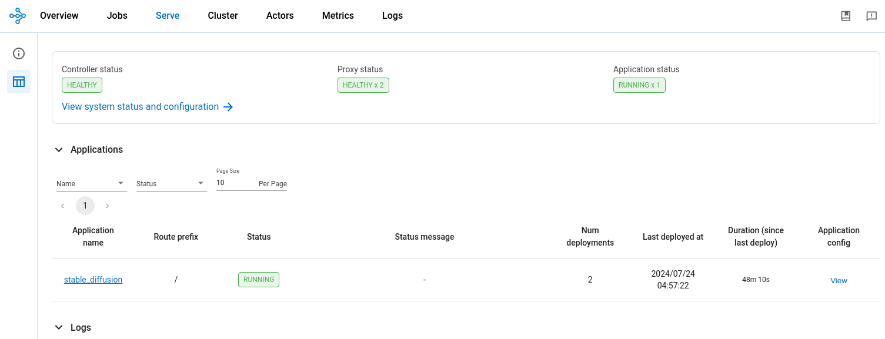

(kuberay-tpu-stable-diffusion-example)=

# Serve a Stable Diffusion model on GKE with TPUs

> **Note:** The Python files for the Ray Serve app and its client are in the [ray-project/serve_config_examples](https://github.com/ray-project/serve_config_examples). This guide adapts the [tensorflow/tpu](https://github.com/tensorflow/tpu/tree/master/tools/ray_tpu/src/serve) example.

## Step 1: Create a Kubernetes cluster with TPUs

Follow [Creating a GKE Cluster with TPUs for KubeRay](kuberay-gke-tpu-cluster-setup) to create a GKE cluster with 1 CPU node and 1 TPU node.

## Step 2: Install the KubeRay operator

Skip this step if the [Ray Operator Addon](https://cloud.google.com/kubernetes-engine/docs/add-on/ray-on-gke/concepts/overview) is enabled in your GKE cluster. Follow [Deploy a KubeRay operator](kuberay-operator-deploy) instructions to install the latest stable KubeRay operator from the Helm repository. Multi-host TPU support is available in KubeRay v1.1.0+. Note that the YAML file in this example uses `serveConfigV2`, which KubeRay supports starting from v0.6.0.

## Step 3: Install the RayService CR

```sh
# Creates a RayCluster with a single-host v4 TPU worker group of 2x2x1 topology.
kubectl apply -f https://raw.githubusercontent.com/ray-project/kuberay/master/ray-operator/config/samples/ray-service.tpu-single-host.yaml
```

KubeRay operator v1.1.0 adds a new `NumOfHosts` field to the RayCluster CR, supporting multi-host worker groups. This field specifies the number of workers to create per replica, with each replica representing a multi-host Pod slice. The value for `NumOfHosts` should match the number of TPU VM hosts that the given `cloud.google.com/gke-tpu-topology` node selector expects. For this example, the Stable Diffusion model is small enough to run on a single TPU host, so `numOfHosts` is set to 1 in the RayService manifest.

## Step 4: View the Serve deployment in the Ray Dashboard

Verify that you deployed the RayService CR and it's running:

```sh
kubectl get rayservice

# NAME               SERVICE STATUS   NUM SERVE ENDPOINTS
# stable-diffusion-tpu-serve-svc   Running          2
```

Port-forward the Ray Dashboard from the Ray head service. To view the dashboard, open http://localhost:8265/ on your local machine.

```sh
kubectl port-forward svc/stable-diffusion-tpu-head-svc 8265:8265 &
```

Monitor the status of the RayService CR in the Ray Dashboard from the 'Serve' tab. The installed RayService CR should create a running app with the name 'stable_diffusion'. The app should have two deployments, the API ingress, which receives input prompts, and the Stable Diffusion model server.




## Step 5: Send text-to-image prompts to the model server

Port forward the Ray Serve service:
```sh
kubectl port-forward svc/stable-diffusion-tpu-serve-svc 8000
```

In a separate terminal, download the Python prompt script:

```sh
curl -LO https://raw.githubusercontent.com/ray-project/serve_config_examples/master/stable_diffusion/stable_diffusion_tpu_req.py
```

Install the required dependencies to run the Python script locally:

```sh
# Create a Python virtual environment.
python3 -m venv myenv
source myenv/bin/activate

pip install numpy pillow requests tqdm
```


Submit a text-to-image prompt to the Stable Diffusion model server:
```sh
python stable_diffusion_tpu_req.py  --save_pictures
```

* The Python prompt script saves the results of the Stable Diffusion inference to a file named diffusion_results.png.


