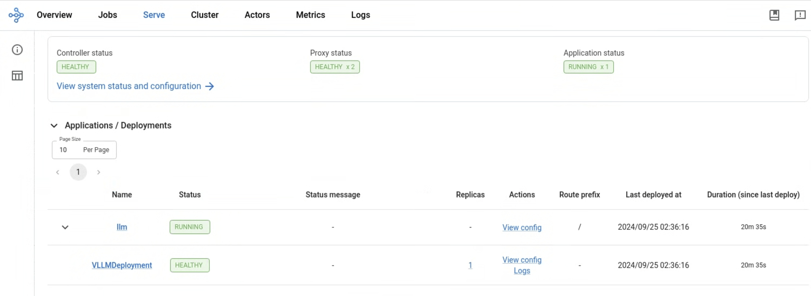

(kuberay-tpu-single-host-vllm)=

# Serve a LLM on GKE with Single-Host TPUs

This guide showcases how to serve LLMs using Tensor Processing Units (TPUs) with the [vLLM](https://docs.vllm.ai/en/latest/) serving framework. A single-host TPU slice is a node pool that contains one or more independent TPU VMs. This tutorial uses one TPU Trillium node, which is Google's sixth generation TPU. For more information about TPUs, see [Use TPUs with KubeRay](kuberay-tpu). This example showcases serving and inference with Llama-3.1-70B on a 2x4 Trillium (v6e) TPU node, or with 8 TPU chips total.

* This example uses vLLM with KubeRay. However, Ray provides a native [Serve LLM API](https://docs.ray.io/en/latest/serve/llm/overview.html) to enable users to deploy multiple LLM models together with the Ray Serve API. This API is the recommended path for running LLMs through Ray Serve.

## Step 1: Create a Kubernetes Cluster with TPUs and the Ray Operator Enabled

First, set environment variables to be used in the following commands:
```sh
export PROJECT_ID=$(gcloud config get project)
export CLUSTER_NAME=vllm-tpu
export COMPUTE_REGION=REGION
export COMPUTE_ZONE=ZONE
```
Replace the following:
  - REGION: the region where you have TPU quota. Ensure that the TPU version that you want to use is available in this region. To learn more, see [TPU availability in GKE](https://cloud.devsite.corp.google.com/kubernetes-engine/docs/concepts/plan-tpus#availability-autopilot%60).
  - ZONE: the zone with available TPU quota.

### GKE Autopilot

Create an Autopilot cluster with the Ray operator enabled:
```sh
gcloud container clusters create-auto $CLUSTER_NAME  \
    --enable-ray-operator \
    --release-channel=rapid \
    --location=$COMPUTE_REGION
```

### GKE Standard

Create a Standard cluster with the Ray operator enabled:
```sh
gcloud container clusters create $CLUSTER_NAME \
    --release-channel=rapid \
    --location=$COMPUTE_ZONE \
    --workload-pool=$PROJECT_ID.svc.id.goog \
    --machine-type="n1-standard-4" \
    --addons=RayOperator,GcsFuseCsiDriver
```

Create a single-host TPU slice node pool:
```sh
gcloud container node-pools create v6e-8 \
    --location=$COMPUTE_ZONE \
    --cluster=$CLUSTER_NAME \
    --machine-type=ct6e-standard-8t \
    --num-nodes=1
```

## Connect to the GKE cluster

To allow kubectl to communicate with your cluster, run the following command:
```sh
gcloud container clusters get-credentials $CLUSTER_NAME \
    --location=LOCATION
```
In the above command, replace LOCATION with $COMPUTE_ZONE or $COMPUTE_REGION if you created a
Standard or Autopilot GKE cluster respectively.

## Step 2: [Optional] Install the KubeRay operator

Skip this step if the [Ray Operator Addon](https://cloud.google.com/kubernetes-engine/docs/add-on/ray-on-gke/concepts/overview) is enabled in your GKE cluster. Follow [Deploy a KubeRay operator](kuberay-operator-deploy) instructions to install the latest stable KubeRay operator from the Helm repository. Note that the YAML file in this example uses `serveConfigV2`, which KubeRay supports starting from v0.6.0.

## Step 3: Build a vLLM image with TPU dependencies

vLLM supports TPUs using PyTorch XLA, providing a [Dockerfile.tpu](https://github.com/vllm-project/vllm/blob/main/Dockerfile.tpu) for users to build their own vLLM image with TPU dependencies. This image includes ray[default] as a dependency and will serve as the image on our Ray head and workers.

Create a Docker repository to store the container images for this tutorial:
```sh
gcloud artifacts repositories create vllm-tpu \
  --repository-format=docker \
  --location=us-central1
```

Clone the vLLM repository:
```sh
git clone https://github.com/vllm-project/vllm.git && \
cd vllm
```

Build the TPU image:
```sh
docker build -f Dockerfile.tpu . -t vllm-tpu
```

Set environment variables to be used for your Docker image:
```sh
export TAG="latest"
export PROJECT_NUMBER=$(gcloud projects describe $PROJECT_ID --format="value(projectNumber)")
export VLLM_IMAGE=us-central1-docker.pkg.dev/$PROJECT_ID/vllm-tpu/vllm-tpu:$TAG
```

Tag the image with your Artifact Registry name:
```sh
docker tag vllm-tpu $VLLM_IMAGE
```

Push the vLLM image to your Artifact registry:
```sh
docker push $VLLM_IMAGE
```

### Create a Cloud Storage bucket and setup access
To accelerate the vLLM deployment startup time and minimize required disk space per node, use the [Cloud Storage FUSE CSI driver](https://cloud.devsite.corp.google.com/kubernetes-engine/docs/how-to/persistent-volumes/cloud-storage-fuse-csi-driver) to mount the downloaded model and compilation cache to the Ray nodes.

Set environment variables to be used in the following commands:
```sh
export GSBUCKET=vllm-tpu-bucket
export KSA_NAME=vllm-tpu-sa
export NAMESPACE=default
```

Create the bucket:
```sh
gcloud storage buckets create gs://$GSBUCKET \
    --uniform-bucket-level-access
```

Create a Kubernetes service account to access the bucket:
```sh
kubectl create serviceaccount $KSA_NAME \
    --namespace $NAMESPACE
```

Grant the service account read-write access to the Cloud Storage bucket:
```sh
gcloud storage buckets add-iam-policy-binding gs://$GSBUCKET \
  --member "principal://iam.googleapis.com/projects/$PROJECT_NUMBER/locations/global/workloadIdentityPools/$PROJECT_ID.svc.id.goog/subject/ns/$NAMESPACE/sa/$KSA_NAME" \
  --role "roles/storage.objectUser"
```

## Step 4: Create a Kubernetes Secret for Hugging Face credentials

This example uses meta-llama/Llama-3.1-70B, a gated Hugging Face model that requires access to be granted before use. Create a Hugging Face account, if you don't already have one, and follow the steps on the [model page](https://huggingface.co/meta-llama/Llama-3.1-70B) to request access to the model. Save your Hugging Face token for the following steps.

Set environment variable:
```sh
export HF_TOKEN=HUGGING_FACE_TOKEN
```
Replace HUGGING_FACE_TOKEN with your Hugging Face access token.

Create a Kubernetes Secret with your Hugging Face credentials:
```sh
kubectl create secret generic hf-secret \
    --from-literal=hf_api_token=$HF_TOKEN \
    --dry-run=client -o yaml | kubectl --namespace $NAMESPACE apply -f -
```

## Step 5: Install the RayService CR

Clone the sample repository:
```sh
git clone https://github.com/GoogleCloudPlatform/kubernetes-engine-samples.git
cd kubernetes-engine-samples
```

Navigate to the working directory:
```sh
cd ai-ml/gke-ray/rayserve/llm
```

Set the following environment vars for the model to serve:
```sh
export MODEL_ID="meta-llama/Llama-3.1-70B"
export MAX_MODEL_LEN=8192
```

In the next step, we'll deploy a RayService CR with the following:
```sh
apiVersion: ray.io/v1
kind: RayService
metadata:
  name: vllm-tpu
spec:
  serveConfigV2: |
    applications:
      - name: llm
        import_path: ai-ml.gke-ray.rayserve.llm.tpu.serve_tpu:model
        deployments:
        - name: VLLMDeployment
          num_replicas: 1
        runtime_env:
          working_dir: "https://github.com/GoogleCloudPlatform/kubernetes-engine-samples/archive/main.zip"
          env_vars:
            MODEL_ID: "$MODEL_ID"
            MAX_MODEL_LEN: "$MAX_MODEL_LEN"
            DTYPE: "$DTYPE"
            TOKENIZER_MODE: "$TOKENIZER_MODE"
            TPU_CHIPS: "8"
  rayClusterConfig:
    headGroupSpec:
      rayStartParams: {}
      template:
        metadata:
          annotations:
            gke-gcsfuse/volumes: "true"
            gke-gcsfuse/cpu-limit: "0"
            gke-gcsfuse/memory-limit: "0"
            gke-gcsfuse/ephemeral-storage-limit: "0"
        spec:
          serviceAccountName: $KSA_NAME
          containers:
          - name: ray-head
            image: $VLLM_IMAGE
            imagePullPolicy: IfNotPresent
            ports:
            - containerPort: 6379
              name: gcs
            - containerPort: 8265
              name: dashboard
            - containerPort: 10001
              name: client
            - containerPort: 8000
              name: serve
            env:
            - name: HUGGING_FACE_HUB_TOKEN
              valueFrom:
                secretKeyRef:
                  name: hf-secret
                  key: hf_api_token
            - name: VLLM_XLA_CACHE_PATH
              value: "/data"
            resources:
              limits:
                cpu: "2"
                memory: 8G
              requests:
                cpu: "2"
                memory: 8G
            volumeMounts:
            - name: gcs-fuse-csi-ephemeral
              mountPath: /data
            - name: dshm
              mountPath: /dev/shm
          volumes:
          - name: gke-gcsfuse-cache
            emptyDir:
              medium: Memory
          - name: dshm
            emptyDir:
              medium: Memory
          - name: gcs-fuse-csi-ephemeral
            csi:
              driver: gcsfuse.csi.storage.gke.io
              volumeAttributes:
                bucketName: $GSBUCKET
                mountOptions: "implicit-dirs,file-cache:enable-parallel-downloads:true,file-cache:parallel-downloads-per-file:100,file-cache:max-parallel-downloads:-1,file-cache:download-chunk-size-mb:10,file-cache:max-size-mb:-1"
    workerGroupSpecs:
    - groupName: tpu-group
      replicas: 1
      minReplicas: 1
      maxReplicas: 1
      numOfHosts: 1
      rayStartParams: {}
      template:
        metadata:
          annotations:
            gke-gcsfuse/volumes: "true"
            gke-gcsfuse/cpu-limit: "0"
            gke-gcsfuse/memory-limit: "0"
            gke-gcsfuse/ephemeral-storage-limit: "0"
        spec:
          serviceAccountName: $KSA_NAME
          containers:
            - name: ray-worker
              image: $VLLM_IMAGE
              imagePullPolicy: IfNotPresent
              resources:
                limits:
                  cpu: "100"
                  google.com/tpu: "8"
                  ephemeral-storage: 40G
                  memory: 200G
                requests:
                  cpu: "100"
                  google.com/tpu: "8"
                  ephemeral-storage: 40G
                  memory: 200G
              env:
                - name: JAX_PLATFORMS
                  value: "tpu"
                - name: HUGGING_FACE_HUB_TOKEN
                  valueFrom:
                    secretKeyRef:
                      name: hf-secret
                      key: hf_api_token
                - name: VLLM_XLA_CACHE_PATH
                  value: "/data"
              volumeMounts:
              - name: gcs-fuse-csi-ephemeral
                mountPath: /data
              - name: dshm
                mountPath: /dev/shm
          volumes:
          - name: gke-gcsfuse-cache
            emptyDir:
              medium: Memory
          - name: dshm
            emptyDir:
              medium: Memory
          - name: gcs-fuse-csi-ephemeral
            csi:
              driver: gcsfuse.csi.storage.gke.io
              volumeAttributes:
                bucketName: $GSBUCKET
                mountOptions: "implicit-dirs,file-cache:enable-parallel-downloads:true,file-cache:parallel-downloads-per-file:100,file-cache:max-parallel-downloads:-1,file-cache:download-chunk-size-mb:10,file-cache:max-size-mb:-1"
          nodeSelector:
            cloud.google.com/gke-tpu-accelerator: tpu-v6e-slice
            cloud.google.com/gke-tpu-topology: 2x4
```
The above example RayService manifest deploys on Trillium (v6e) TPUs.

Create the RayService CR:
```sh
# For v6e TPUs
envsubst < tpu/ray-service.tpu-v6e-singlehost.yaml | kubectl apply -f -
```
The above instruction replaces the container images with the VLLM_IMAGE environment variable.

## Step 6: View the Serve deployment in the Ray Dashboard

Verify that you deployed the RayService CR and it's running:
```sh
kubectl get rayservices vllm-tpu
```

Retrieve the name of the RayCluster head service:
```sh
SERVICE_NAME=$(kubectl --namespace=$NAMESPACE get rayservices/vllm-tpu \
    --template={{.status.activeServiceStatus.rayClusterStatus.head.serviceName}})
```

Port-forward the Ray Dashboard from the Ray Head service. To view the dashboard, open http://localhost:8265/ on your local machine.
```sh
kubectl port-forward svc/$SERVICE_NAME 8265:8265 2>&1 >/dev/null &
```



## Step 7: Send prompts to the model server

Port-forward the model endpoint from Ray head:
```sh
kubectl port-forward svc/$SERVICE_NAME 8000:8000 2>&1 >/dev/null &
```

Send a text prompt to the Llama model:
```sh
curl -X POST http://localhost:8000/v1/generate -H "Content-Type: application/json" -d '{"prompt": "What are the top 5 most popular programming languages? Be brief.", "max_tokens": 1024}'
```

We can then view the output of the provided prompt:
```sh
{"prompt": "What are the top 5 most popular programming languages? Be brief.", "text": " The answer is based on the Tiobe Index, which is a programming language popularity index that has been ranking programming languages since 2001.\n\n1.  **Java**: 14.63% of the index.\n2.  **Python**: 11.52% of the index.\n3.  **C**: 7.94% of the index.\n4.  **C++**: 7.17% of the index.\n5.  **JavaScript**: 6.86% of the index.\n\nThe Tiobe Index is based on searches on search engines like Google, as well as on forums and other online platforms. It does not necessarily reflect the actual usage of programming languages in the industry, but it is a good indicator of their popularity and usage in the programming community.
...}
```
