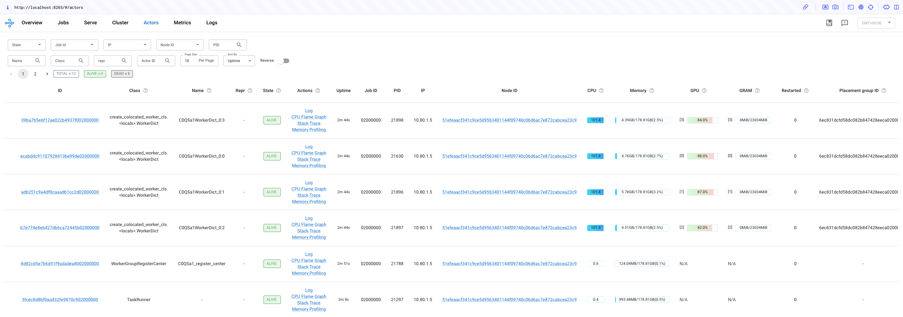

(kuberay-verl)=
# Reinforcement Learning with Human Feedback (RLHF) for LLMs with verl on KubeRay

[verl](https://github.com/volcengine/verl) is an open-source framework that provides a flexible, efficient, and production-ready RL training library for large language models (LLMs).
This guide demonstrates Proximal Policy Optimization (PPO) training on the GSM8K dataset with verl for `Qwen2.5-0.5B-Instruct` on KubeRay.

* To make it easier to follow, this guide launches a single-node RayCluster with 4 GPUs.
You can easily use KubeRay to launch a multi-node RayCluster to train larger models.
* You can also use the [RayJob CRD](kuberay-rayjob-quickstart) for production use cases.

# Step 1: Create a Kubernetes cluster with GPUs

Follow the instructions in [Managed Kubernetes services](kuberay-k8s-setup) to create a Kubernetes cluster with GPUs.

This guide uses a Kubernetes cluster with 4 L4 GPUs.

For GKE, you can follow the instructions in [this tutorial](kuberay-gke-gpu-cluster-setup) and use the following command
to create a GPU node pool with 4 L4 GPUs per Kubernetes node:

```bash
gcloud container node-pools create gpu-node-pool \
  --accelerator type=nvidia-l4-vws,count=4 \
  --zone us-west1-b \
  --cluster kuberay-gpu-cluster \
  --num-nodes 1 \
  --min-nodes 0 \
  --max-nodes 1 \
  --enable-autoscaling \
  --machine-type g2-standard-48
```

# Step 2: Install KubeRay operator

Follow the instructions in [KubeRay operator](kuberay-operator-deploy) to install the KubeRay operator.

# Step 3: Create a RayCluster

```sh
kubectl apply -f https://raw.githubusercontent.com/ray-project/kuberay/master/ray-operator/config/samples/ray-cluster.verl.yaml
```

# Step 4: Install verl in the head Pod

Log in to the head Pod and install verl.
The verl community doesn't provide images with verl installed ([verl#2222](https://github.com/volcengine/verl/issues/2222)) at the moment.

```sh
# Log in to the head Pod.
export HEAD_POD=$(kubectl get pods --selector=ray.io/node-type=head -o custom-columns=POD:metadata.name --no-headers)
kubectl exec -it $HEAD_POD -- bash

# Follow the instructions in https://verl.readthedocs.io/en/latest/start/install.html#install-from-docker-image to install verl.
git clone https://github.com/volcengine/verl && cd verl
pip3 install -e .[vllm]
```

# Step 5: Prepare the dataset and download `Qwen2.5-0.5B-Instruct` model

Run the following commands in the head Pod's verl root directory to prepare the dataset and download the `Qwen2.5-0.5B-Instruct` model.

```sh
# Prepare the dataset.
python3 examples/data_preprocess/gsm8k.py --local_dir ~/data/gsm8k

# Download the `Qwen2.5-0.5B-Instruct` model.
python3 -c "import transformers; transformers.pipeline('text-generation', model='Qwen/Qwen2.5-0.5B-Instruct')"
```

# Step 6: Run a PPO training job

Run the following command to start a PPO training job.
This differs slightly from the instructions in [verl's documentation](https://verl.readthedocs.io/en/latest/start/quickstart.html#step-3-perform-ppo-training-with-the-instruct-model).
The main differences are the following:
* Set `n_gpus_per_node` to `4` because the head Pod has 4 GPUs.
* Set `save_freq` to `-1` to avoid disk pressure caused by checkpointing.

```sh
PYTHONUNBUFFERED=1 python3 -m verl.trainer.main_ppo \
 data.train_files=$HOME/data/gsm8k/train.parquet \
 data.val_files=$HOME/data/gsm8k/test.parquet \
 data.train_batch_size=256 \
 data.max_prompt_length=512 \
 data.max_response_length=256 \
 actor_rollout_ref.model.path=Qwen/Qwen2.5-0.5B-Instruct \
 actor_rollout_ref.actor.optim.lr=1e-6 \
 actor_rollout_ref.actor.ppo_mini_batch_size=64 \
 actor_rollout_ref.actor.ppo_micro_batch_size_per_gpu=4 \
 actor_rollout_ref.rollout.log_prob_micro_batch_size_per_gpu=8 \
 actor_rollout_ref.rollout.tensor_model_parallel_size=1 \
 actor_rollout_ref.rollout.gpu_memory_utilization=0.4 \
 actor_rollout_ref.ref.log_prob_micro_batch_size_per_gpu=4 \
 critic.optim.lr=1e-5 \
 critic.model.path=Qwen/Qwen2.5-0.5B-Instruct \
 critic.ppo_micro_batch_size_per_gpu=4 \
 algorithm.kl_ctrl.kl_coef=0.001 \
 trainer.logger=['console'] \
 trainer.val_before_train=False \
 trainer.default_hdfs_dir=null \
 trainer.n_gpus_per_node=4 \
 trainer.nnodes=1 \
 trainer.save_freq=-1 \
 trainer.test_freq=10 \
 trainer.total_epochs=15 2>&1 | tee verl_demo.log
```

This job takes 5 hours to complete. While it's running, you can check the Ray dashboard to see more details about the PPO job and the Ray cluster.
Additionally, you can follow the next step to check the PPO job logs to see how the model improves.

```sh
# Port forward the Ray dashboard to your local machine's port 8265.
kubectl port-forward $HEAD_POD 8265:8265
```

Open `127.0.0.1:8265` in your browser to view the Ray dashboard and check whether all GPUs are in use.



# Step 7: Check the PPO job logs

Check `verl_demo.log` in the head Pod to see the PPO job's logs.
For every 10 steps, verl validates the model with a simple math problem.

* Math problem:
  ```
  Janet’s ducks lay 16 eggs per day. She eats three for breakfast every morning and bakes muffins for her friends every day with four. She sells the remainder at the farmers' market daily for $2 per fresh duck egg. How much in dollars does she make every day at the farmers' market? Let's think step by step and output the final answer after
  ```
* Answer: `(16 - 3 - 4) * 2 = 18`

You should be able to see the model becomes gradually better at this question after several steps.

In this example run, the model first got the correct answer after 130 steps, and the following is the log.
Throughout the entire process, the validation ran 44 times and got the correct answer 20 times.
It may vary depending on the random seed.

```
(TaskRunner pid=21297) [response] First, we calculate the number of eggs Janet's ducks lay in a day. Since there are 16 eggs per day and Janet lays these eggs every day, the number of eggs laid in a day is 16.
(TaskRunner pid=21297)
(TaskRunner pid=21297) Next, we calculate the number of eggs Janet eats in a day. She eats 3 eggs for breakfast and bakes 4 muffins, so the total number of eggs she eats in a day is 3 + 4 = 7.
(TaskRunner pid=21297)
(TaskRunner pid=21297) The number of eggs she sells in a day is the total number of eggs laid minus the number of eggs she eats, which is 16 - 7 = 9 eggs.
(TaskRunner pid=21297)
(TaskRunner pid=21297) She sells each egg for $2, so the total amount she makes every day is 9 * 2 = 18 dollars.
(TaskRunner pid=21297)
(TaskRunner pid=21297) #### 18
(TaskRunner pid=21297) #### 18 dollars
```

It's not necessary to wait for all steps to complete.
You can stop the job if you observe the process of the model improving.

# Step 8: Clean up

```sh
kubectl delete -f https://raw.githubusercontent.com/ray-project/kuberay/master/ray-operator/config/samples/ray-cluster.verl.yaml
```