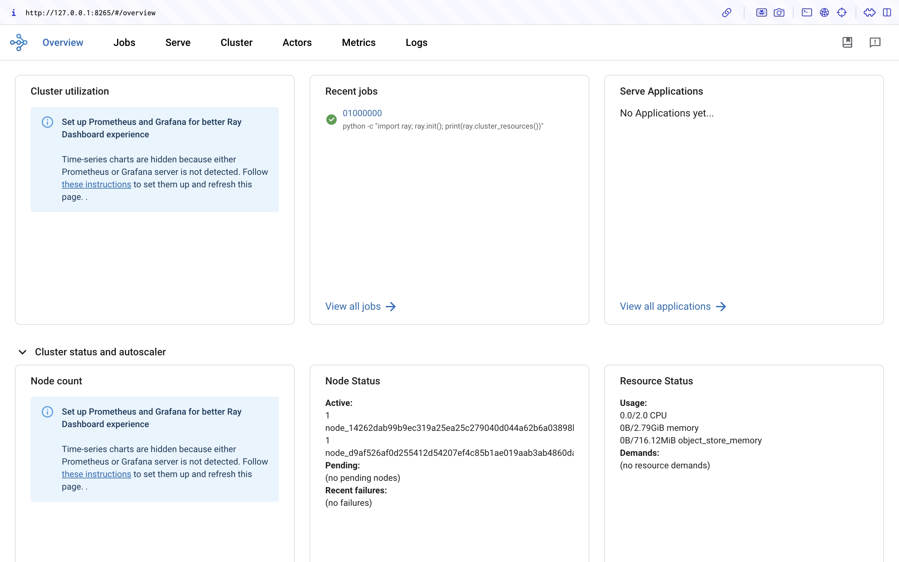

(kuberay-raycluster-quickstart)=

# RayCluster Quickstart

This guide shows you how to manage and interact with Ray clusters on Kubernetes.

## Preparation

* Install [kubectl](https://kubernetes.io/docs/tasks/tools/#kubectl) (>= 1.23), [Helm](https://helm.sh/docs/intro/install/) (>= v3.4) if needed, [Kind](https://kind.sigs.k8s.io/docs/user/quick-start/#installation), and [Docker](https://docs.docker.com/engine/install/).
* Make sure your Kubernetes cluster has at least 4 CPU and 4 GB RAM.

## Step 1: Create a Kubernetes cluster

This step creates a local Kubernetes cluster using [Kind](https://kind.sigs.k8s.io/). If you already have a Kubernetes cluster, you can skip this step.

```sh
kind create cluster --image=kindest/node:v1.26.0
```

## Step 2: Deploy a KubeRay operator

Follow [this document](kuberay-operator-deploy) to install the latest stable KubeRay operator from the Helm repository.

(raycluster-deploy)=
## Step 3: Deploy a RayCluster custom resource

Once the KubeRay operator is running, you're ready to deploy a RayCluster. Create a RayCluster Custom Resource (CR) in the `default` namespace.

```sh
# Deploy a sample RayCluster CR from the KubeRay Helm chart repo:
helm install raycluster kuberay/ray-cluster --version 1.5.0
```


Once the RayCluster CR has been created, you can view it by running:

```sh
# Once the RayCluster CR has been created, you can view it by running:
kubectl get rayclusters
```

```sh
NAME                 DESIRED WORKERS   AVAILABLE WORKERS   CPUS   MEMORY   GPUS   STATUS   AGE
raycluster-kuberay   1                 1                   2      3G       0      ready    55s
```

The KubeRay operator detects the RayCluster object and starts your Ray cluster by creating head and worker pods. To view Ray cluster's pods, run the following command:

```sh
# View the pods in the RayCluster named "raycluster-kuberay"
kubectl get pods --selector=ray.io/cluster=raycluster-kuberay
```

```sh
NAME                                          READY   STATUS    RESTARTS   AGE
raycluster-kuberay-head                       1/1     Running   0          XXs
raycluster-kuberay-worker-workergroup-xvfkr   1/1     Running   0          XXs
```

Wait for the pods to reach `Running` state. This may take a few minutes, downloading the Ray images takes most of this time.
If your pods stick in the `Pending` state, you can check for errors using `kubectl describe pod raycluster-kuberay-xxxx-xxxxx` and ensure your Docker resource limits meet the requirements.

## Step 4: Run an application on a RayCluster

Now, interact with the RayCluster deployed.

### Method 1: Execute a Ray job in the head Pod

The most straightforward way to experiment with your RayCluster is to exec directly into the head pod.
First, identify your RayCluster's head pod:

```sh
export HEAD_POD=$(kubectl get pods --selector=ray.io/node-type=head -o custom-columns=POD:metadata.name --no-headers)
echo $HEAD_POD
```

```sh
raycluster-kuberay-head
```

```sh
# Print the cluster resources.
kubectl exec -it $HEAD_POD -- python -c "import ray; ray.init(); print(ray.cluster_resources())"
```

```sh
2023-04-07 10:57:46,472 INFO worker.py:1243 -- Using address 127.0.0.1:6379 set in the environment variable RAY_ADDRESS
2023-04-07 10:57:46,472 INFO worker.py:1364 -- Connecting to existing Ray cluster at address: 10.244.0.6:6379...
2023-04-07 10:57:46,482 INFO worker.py:1550 -- Connected to Ray cluster. View the dashboard at http://10.244.0.6:8265
{'CPU': 2.0,
 'memory': 3000000000.0,
 'node:10.244.0.6': 1.0,
 'node:10.244.0.7': 1.0,
 'node:__internal_head__': 1.0,
 'object_store_memory': 749467238.0}
```

### Method 2: Submit a Ray job to the RayCluster using [ray job submission SDK](jobs-quickstart)

Unlike Method 1, this method doesn't require you to execute commands in the Ray head pod.
Instead, you can use the [Ray job submission SDK](jobs-quickstart) to submit Ray jobs to the RayCluster through the Ray Dashboard port where Ray listens for Job requests.
The KubeRay operator configures a [Kubernetes service](https://kubernetes.io/docs/concepts/services-networking/service/) targeting the Ray head Pod.

```sh
kubectl get service raycluster-kuberay-head-svc
```

```sh
NAME                          TYPE        CLUSTER-IP    EXTERNAL-IP   PORT(S)                                         AGE
raycluster-kuberay-head-svc   ClusterIP   None          <none>        10001/TCP,8265/TCP,6379/TCP,8080/TCP,8000/TCP   57s
```

Now that the service name is available, use port-forwarding to access the Ray Dashboard port which is 8265 by default.

```sh
# Execute this in a separate shell.
kubectl port-forward service/raycluster-kuberay-head-svc 8265:8265 > /dev/null &
```

Now that the Dashboard port is accessible, submit jobs to the RayCluster:

```sh
# The following job's logs will show the Ray cluster's total resource capacity, including 2 CPUs.
ray job submit --address http://localhost:8265 -- python -c "import ray; ray.init(); print(ray.cluster_resources())"
```

```sh
Job submission server address: http://localhost:8265

-------------------------------------------------------
Job 'raysubmit_8vJ7dKqYrWKbd17i' submitted successfully
-------------------------------------------------------

Next steps
  Query the logs of the job:
    ray job logs raysubmit_8vJ7dKqYrWKbd17i
  Query the status of the job:
    ray job status raysubmit_8vJ7dKqYrWKbd17i
  Request the job to be stopped:
    ray job stop raysubmit_8vJ7dKqYrWKbd17i

Tailing logs until the job exits (disable with --no-wait):
2025-03-18 01:27:51,014	INFO job_manager.py:530 -- Runtime env is setting up.
2025-03-18 01:27:51,744	INFO worker.py:1514 -- Using address 10.244.0.6:6379 set in the environment variable RAY_ADDRESS
2025-03-18 01:27:51,744	INFO worker.py:1654 -- Connecting to existing Ray cluster at address: 10.244.0.6:6379...
2025-03-18 01:27:51,750	INFO worker.py:1832 -- Connected to Ray cluster. View the dashboard at 10.244.0.6:8265 
{'CPU': 2.0,
 'memory': 3000000000.0,
 'node:10.244.0.6': 1.0,
 'node:10.244.0.7': 1.0,
 'node:__internal_head__': 1.0,
 'object_store_memory': 749467238.0}

------------------------------------------
Job 'raysubmit_8vJ7dKqYrWKbd17i' succeeded
------------------------------------------
```

## Step 5: Access the Ray Dashboard

Visit `${YOUR_IP}:8265` in your browser for the Dashboard. For example, `127.0.0.1:8265`.
See the job you submitted in Step 4 in the **Recent jobs** pane as shown below.



## Step 6: Cleanup

```sh
# Kill the `kubectl port-forward` background job in the earlier step
killall kubectl
kind delete cluster
```
