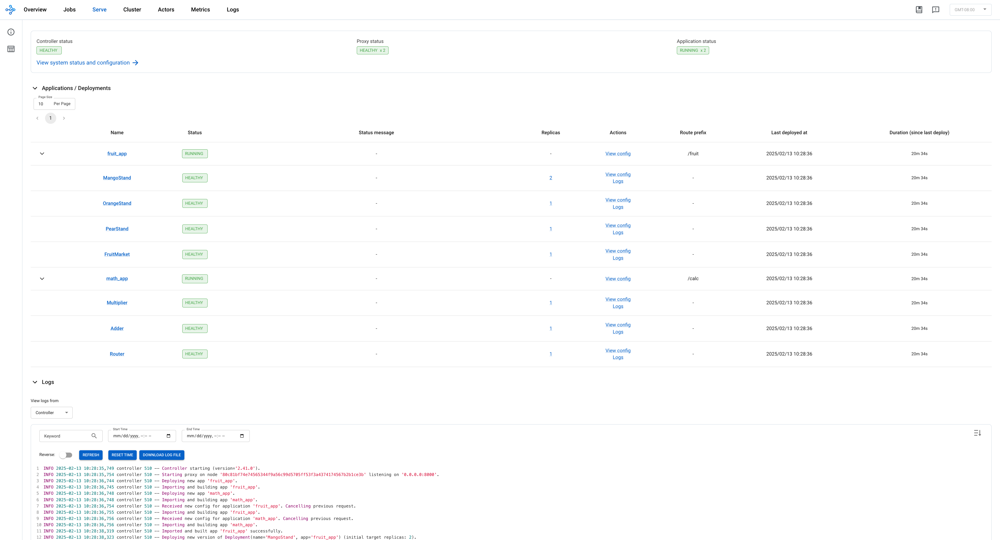

(kuberay-rayservice-quickstart)=

# RayService Quickstart

## Prerequisites

This guide mainly focuses on the behavior of KubeRay v1.3.0 and Ray 2.41.0.

## What's a RayService?

A RayService manages these components:

* **RayCluster**: Manages resources in a Kubernetes cluster.
* **Ray Serve Applications**: Manages users' applications.

## What does the RayService provide?

* **Kubernetes-native support for Ray clusters and Ray Serve applications:** After using a Kubernetes configuration to define a Ray cluster and its Ray Serve applications, you can use `kubectl` to create the cluster and its applications.
* **In-place updating for Ray Serve applications:** See [RayService](kuberay-rayservice) for more details.
* **Zero downtime upgrading for Ray clusters:** See [RayService](kuberay-rayservice) for more details.
* **High-availabilable services:** See [RayService high availability](kuberay-rayservice-ha) for more details.

## Example: Serve two simple Ray Serve applications using RayService

## Step 1: Create a Kubernetes cluster with Kind

```sh
kind create cluster --image=kindest/node:v1.26.0
```

## Step 2: Install the KubeRay operator

Follow [this document](kuberay-operator-deploy) to install the latest stable KubeRay operator from the Helm repository.
Note that the YAML file in this example uses `serveConfigV2` to specify a multi-application Serve configuration, available starting from KubeRay v0.6.0.

## Step 3: Install a RayService

```sh
kubectl apply -f https://raw.githubusercontent.com/ray-project/kuberay/v1.3.0/ray-operator/config/samples/ray-service.sample.yaml
```

## Step 4: Verify the Kubernetes cluster status

```sh
# Step 4.1: List all RayService custom resources in the `default` namespace.
kubectl get rayservice

# [Example output]
# NAME                SERVICE STATUS   NUM SERVE ENDPOINTS
# rayservice-sample   Running          1

# Step 4.2: List all RayCluster custom resources in the `default` namespace.
kubectl get raycluster

# [Example output]
# NAME                                 DESIRED WORKERS   AVAILABLE WORKERS   CPUS    MEMORY   GPUS   STATUS   AGE
# rayservice-sample-raycluster-bwrp8   1                 1                   2500m   4Gi      0      ready    83s

# Step 4.3: List all Ray Pods in the `default` namespace.
kubectl get pods -l=ray.io/is-ray-node=yes

# [Example output]
# NAME                                                          READY   STATUS    RESTARTS   AGE
# rayservice-sample-raycluster-bwrp8-head-p8dnc                 1/1     Running   0          105s
# rayservice-sample-raycluster-bwrp8-small-group-worker-hbwr2   1/1     Running   0          105s

# Step 4.4: Check the `Ready` condition of the RayService.
# The RayService is ready to serve requests when the condition is `True`.
kubectl describe rayservices.ray.io rayservice-sample

# [Example output]
# Conditions:
#   Last Transition Time:  2025-02-13T04:55:37Z
#   Message:               Number of serve endpoints is greater than 0
#   Observed Generation:   1
#   Reason:                NonZeroServeEndpoints
#   Status:                True
#   Type:                  Ready

# Step 4.5: List services in the `default` namespace.
kubectl get services

# NAME                                          TYPE        CLUSTER-IP      EXTERNAL-IP   PORT(S)                                                   AGE
# ...
# rayservice-sample-head-svc                    ClusterIP   None           <none>        10001/TCP,8265/TCP,6379/TCP,8080/TCP,8000/TCP   77s
# rayservice-sample-raycluster-bwrp8-head-svc   ClusterIP   None           <none>        10001/TCP,8265/TCP,6379/TCP,8080/TCP,8000/TCP   2m16s
# rayservice-sample-serve-svc                   ClusterIP   10.96.212.79   <none>        8000/TCP                                        77s
```

When the Ray Serve applications are healthy and ready, KubeRay creates a head service and a Ray Serve service for the RayService custom resource. For example, `rayservice-sample-head-svc` and `rayservice-sample-serve-svc` in Step 4.5.

## Step 5: Verify the status of the Serve applications

```sh
# (1) Forward the dashboard port to localhost.
# (2) Check the Serve page in the Ray dashboard at http://localhost:8265/#/serve.
kubectl port-forward svc/rayservice-sample-head-svc 8265:8265
```

* Refer to [rayservice-troubleshooting.md](kuberay-raysvc-troubleshoot) for more details on RayService observability.
Below is a screenshot example of the Serve page in the Ray dashboard.
  

## Step 6: Send requests to the Serve applications by the Kubernetes serve service

```sh
# Step 6.1: Run a curl Pod.
# If you already have a curl Pod, you can use `kubectl exec -it <curl-pod> -- sh` to access the Pod.
kubectl run curl --image=radial/busyboxplus:curl -i --tty

# Step 6.2: Send a request to the fruit stand app.
curl -X POST -H 'Content-Type: application/json' rayservice-sample-serve-svc:8000/fruit/ -d '["MANGO", 2]'
# [Expected output]: 6

# Step 6.3: Send a request to the calculator app.
curl -X POST -H 'Content-Type: application/json' rayservice-sample-serve-svc:8000/calc/ -d '["MUL", 3]'
# [Expected output]: "15 pizzas please!"
```

## Step 7: Clean up the Kubernetes cluster

```sh
# Delete the RayService.
kubectl delete -f https://raw.githubusercontent.com/ray-project/kuberay/v1.3.0/ray-operator/config/samples/ray-service.sample.yaml

# Uninstall the KubeRay operator.
helm uninstall kuberay-operator

# Delete the curl Pod.
kubectl delete pod curl
```

## Next steps

* See [RayService](kuberay-rayservice) document for the full list of RayService features, including in-place update, zero downtime upgrade, and high-availability.
* See [RayService troubleshooting guide](kuberay-raysvc-troubleshoot) if you encounter any issues.
* See [Examples](kuberay-examples) for more RayService examples.
The [MobileNet example](kuberay-mobilenet-rayservice-example) is a good example to start with because it doesn't require GPUs and is easy to run on a local machine.
