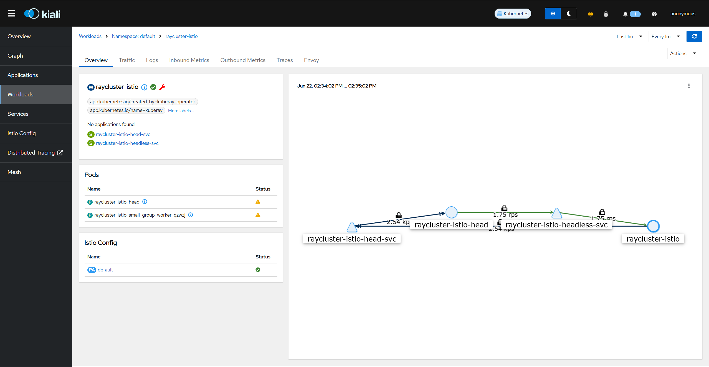
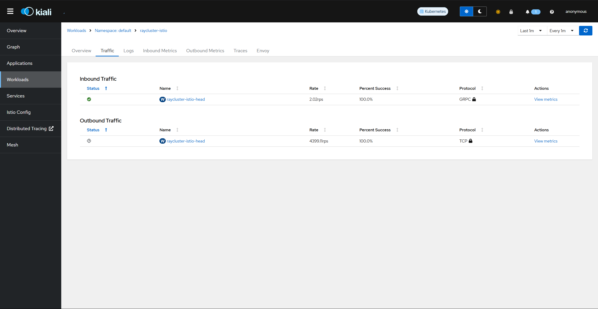

(kuberay-istio)=
# mTLS and L7 observability with Istio

This integration guide for KubeRay and Istio enables mTLS and L7 traffic observability in a RayCluster on a local Kind cluster.

## Istio

[Istio](https://istio.io/) is an open-source service mesh that provides a uniform and more efficient way to secure, connect, and monitor services. Some features of its powerful control plane include:
* Secure network traffic in a Kubernetes cluster with TLS encryption.
* Automatic metrics, logs, and traces for all traffic within a cluster.

See the [Istio documentation](https://istio.io/latest/docs/) to learn more.

## Step 0: Create a Kind cluster

Create a Kind cluster with the following command:

```bash
kind create cluster
```

## Step 1: Install Istio

```bash
# Download Istioctl and its manifests.
export ISTIO_VERSION=1.21.1
curl -L https://istio.io/downloadIstio | sh -
cd istio-1.21.1
export PATH=$PWD/bin:$PATH

# Install Istio with:
#   1. 100% trace sampling for demo purposes.
#   2. "sanitize_te" disabled for proper gRPC interception. This is required by Istio 1.21.0 (https://github.com/istio/istio/issues/49685).
#   3. TLS 1.3 enabled.
istioctl install -y -f - <<EOF
apiVersion: install.istio.io/v1alpha1
kind: IstioOperator
spec:
  meshConfig:
    defaultConfig:
      tracing:
        sampling: 100
      runtimeValues:
        envoy.reloadable_features.sanitize_te: "false"
    meshMTLS:
      minProtocolVersion: TLSV1_3
EOF

# Install Istio addons, including the Kiali and Jaeger dashboards.
kubectl apply -f samples/addons
# Enable the Istio sidecar auto injection.
kubectl label namespace default istio-injection=enabled
```

See [Istio Getting Started](https://istio.io/latest/docs/setup/getting-started/) for more details on installing Istio.

## Step 2: Install the KubeRay operator

Follow [Deploy a KubeRay operator](kuberay-operator-deploy) to install the latest stable KubeRay operator from the Helm repository.

## Step 3: (Optional) Enable Istio mTLS STRICT mode

This optional step enables Istio mTLS in STRICT mode, which provides the best security of service mesh by rejecting all undefined traffic.

In this mode, you _must_ disable the KubeRay init container injection by setting `ENABLE_INIT_CONTAINER_INJECTION=false` on the KubeRay controller. This setting is necessary because the init container starts before the `istio-proxy`, resulting in the rejection of all of its network traffic in STRICT mode.

```bash
# Set ENABLE_INIT_CONTAINER_INJECTION=false on the KubeRay operator.
helm upgrade kuberay-operator kuberay/kuberay-operator --version 1.5.0 \
  --set env\[0\].name=ENABLE_INIT_CONTAINER_INJECTION \
  --set-string env\[0\].value=false

# Apply mTLS STRICT mode on Istio.
kubectl apply -f - <<EOF
apiVersion: security.istio.io/v1beta1
kind: PeerAuthentication
metadata:
  name: "default"
  namespace: "default"
spec:
  mtls:
    mode: STRICT
EOF
```

See [Istio Mutual TLS Migration](https://istio.io/latest/docs/tasks/security/authentication/mtls-migration/) for more information about STRICT mode.

## Step 4: Apply a Headless service for the upcoming RayCluster

To let Istio learn the L7 information of the upcoming RayCluster, you must apply a Headless service for it.

```bash
kubectl apply -f - <<EOF
apiVersion: v1
kind: Service
metadata:
  labels:
    ray.io/headless-worker-svc: raycluster-istio
  name: raycluster-istio-headless-svc
  namespace: default
spec:
  clusterIP: None
  selector:
    ray.io/cluster: raycluster-istio
  publishNotReadyAddresses: true
  ports:
  - name: node-manager-port
    port: 6380
    appProtocol: grpc
  - name: object-manager-port
    port: 6381
    appProtocol: grpc
  - name: runtime-env-agent-port
    port: 6382
    appProtocol: grpc
  - name: dashboard-agent-grpc-port
    port: 6383
    appProtocol: grpc
  - name: dashboard-agent-listen-port
    port: 52365
    appProtocol: http
  - name: metrics-export-port
    port: 8080
    appProtocol: http
  - name: p10002
    port: 10002
    appProtocol: grpc
  - name: p10003
    port: 10003
    appProtocol: grpc
  - name: p10004
    port: 10004
    appProtocol: grpc
  - name: p10005
    port: 10005
    appProtocol: grpc
  - name: p10006
    port: 10006
    appProtocol: grpc
  - name: p10007
    port: 10007
    appProtocol: grpc
  - name: p10008
    port: 10008
    appProtocol: grpc
  - name: p10009
    port: 10009
    appProtocol: grpc
  - name: p10010
    port: 10010
    appProtocol: grpc
  - name: p10011
    port: 10011
    appProtocol: grpc
  - name: p10012
    port: 10012
    appProtocol: grpc
EOF
```

Note that this Headless Service manifest _must_ list _all_ the ports used by Ray explicitly, including _all_ worker ports. See [Configuring Ray](https://docs.ray.io/en/latest/ray-core/configure.html#all-nodes) for more details on the ports required by Ray.

:::{note}
Kubernetes Service doesn't support specifying ports in ranges. You _must_ set them one by one.
:::

:::{warning}
The default Ray worker port range, from 10002 to 19999, is too large to specify in the service manifest and can cause memory issues in Kubernetes. Set a smaller `max-worker-port` to work with Istio. Note that by default every sidecar in the service mesh caches these ports, which could lead to sidecar OOMs if you create too many headless services. 
:::

## Step 4: Create the RayCluster

The upcoming RayCluster _must_ use exactly the same ports listed in the previous Headless Service, including the `max-worker-port`.
In addition, the `node-ip-address` _must_ be set to the Pod FQDN of the Headless Service to enable Istio L7 observability.

  ```bash
  kubectl apply -f - <<EOF
  apiVersion: ray.io/v1
  kind: RayCluster
  metadata:
    name: raycluster-istio
  spec:
    rayVersion: '2.46.0'
    headGroupSpec:
      rayStartParams:
        num-cpus: '1'
        node-manager-port: '6380'
        object-manager-port: '6381'
        runtime-env-agent-port: '6382'
        dashboard-agent-grpc-port: '6383'
        dashboard-agent-listen-port: '52365'
        metrics-export-port: '8080'
        max-worker-port: '10012'
        node-ip-address: \$(hostname -I | tr -d ' ' | sed 's/\./-/g').raycluster-istio-headless-svc.default.svc.cluster.local
      template:
        spec:
          containers:
          - name: ray-head
            image: rayproject/ray:2.46.0
    workerGroupSpecs:
      - replicas: 1
        minReplicas: 1
        maxReplicas: 1
        groupName: small-group
        rayStartParams:
          num-cpus: '1'
          node-manager-port: '6380'
          object-manager-port: '6381'
          runtime-env-agent-port: '6382'
          dashboard-agent-grpc-port: '6383'
          dashboard-agent-listen-port: '52365'
          metrics-export-port: '8080'
          max-worker-port: '10012'
          node-ip-address: \$(hostname -I | tr -d ' ' | sed 's/\./-/g').raycluster-istio-headless-svc.default.svc.cluster.local
        template:
          spec:
            containers:
            - name: ray-worker
              image: rayproject/ray:2.46.0
  EOF
  ```

:::{note}
The Pod FQDN of the Headless service should be in the format of `pod-ipv4-address.service.namespace.svc.zone.` or the format of `pod-hostname.service.namespace.svc.zone.` depending on your implementation of the [Kubernetes DNS specification](https://github.com/kubernetes/dns/blob/master/docs/specification.md).
:::

## Step 5: Run your Ray app to generate traffic

After the RayCluster is ready, use the following script to generate internal traffic for visualization.

```bash
export HEAD_POD=$(kubectl get pods --selector=ray.io/node-type=head -o custom-columns=POD:metadata.name --no-headers)
kubectl exec -it $HEAD_POD -- python -c "import ray; ray.get([ray.remote(lambda x: print(x)).remote(i) for i in range(5000)])"
```

## Step 6: Verify the auto mTLS and L7 observability

Run the following command to start the Kiali dashboard:

```bash
istioctl dashboard kiali
```

Go to the `raycluster-istio` workload at: [http://localhost:20001/kiali/console/namespaces/default/workloads/raycluster-istio?duration=60&refresh=60000&tab=info](http://localhost:20001/kiali/console/namespaces/default/workloads/raycluster-istio?duration=60&refresh=60000&tab=info)



Go to the `Traffic` tab. You can see that mTLS protects all of the traffic.



Run the following command to start the Jaeger dashboard:

```bash
istioctl dashboard jaeger
```

<!-- TODO: Change the following link to markdown syntax after this issue  https://github.com/executablebooks/MyST-Parser/issues/760 is resolved -->
Go to the Jaeger dashboard with the `service=raycluster-istio.default` query: <a class="reference external" href="http://localhost:16686/jaeger/search?limit=1000&lookback=1h&maxDuration&minDuration&service=raycluster-istio.default">http://localhost:16686/jaeger/search?limit=1000&lookback=1h&maxDuration&minDuration&service=raycluster-istio.default</a>


You can click on any trace of the internal gRPC calls and view their details, such as `grpc.path` and `status code`.


## Step 7: Clean up

Run the following command to delete your cluster.

```bash
kind delete cluster
```
