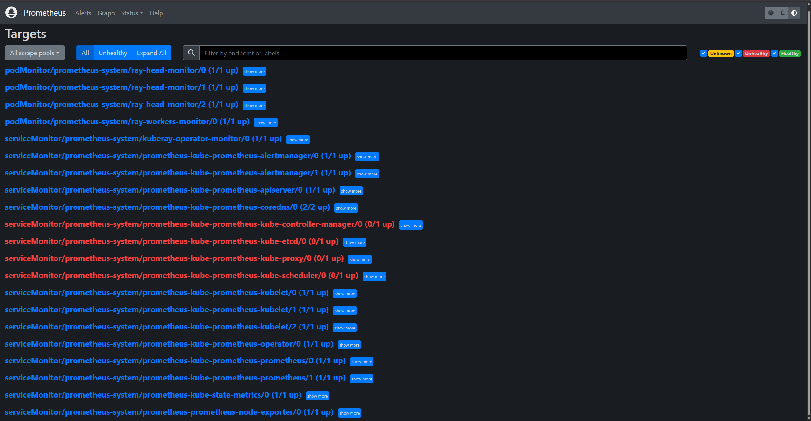

(kuberay-prometheus-grafana)=

# Using Prometheus and Grafana

This section will describe how to monitor Ray Clusters in Kubernetes using Prometheus & Grafana.

If you do not have any experience with Prometheus and Grafana on Kubernetes, watch this [YouTube playlist](https://youtube.com/playlist?list=PLy7NrYWoggjxCF3av5JKwyG7FFF9eLeL4).

## Preparation

Clone the [KubeRay repository](https://github.com/ray-project/kuberay) and checkout the `master` branch.
This tutorial requires several files in the repository.

## Step 1: Create a Kubernetes cluster with Kind

```sh
kind create cluster
```

## Step 2: Install Kubernetes Prometheus Stack via Helm chart

```sh
# Path: kuberay/
./install/prometheus/install.sh

# Check the installation
kubectl get all -n prometheus-system

# (part of the output)
# NAME                                                  READY   UP-TO-DATE   AVAILABLE   AGE
# deployment.apps/prometheus-grafana                    1/1     1            1           46s
# deployment.apps/prometheus-kube-prometheus-operator   1/1     1            1           46s
# deployment.apps/prometheus-kube-state-metrics         1/1     1            1           46s
```

* KubeRay provides an [install.sh script](https://github.com/ray-project/kuberay/blob/master/install/prometheus/install.sh) to install the [kube-prometheus-stack v48.2.1](https://github.com/prometheus-community/helm-charts/tree/kube-prometheus-stack-48.2.1/charts/kube-prometheus-stack) chart and related custom resources, including **PodMonitor** and **PrometheusRule**, in the namespace `prometheus-system` automatically.

* We made some modifications to the original `values.yaml` in kube-prometheus-stack chart to allow embedding Grafana panels in Ray Dashboard. See [overrides.yaml](https://github.com/ray-project/kuberay/tree/master/install/prometheus/overrides.yaml) for more details.
  ```yaml
  grafana:
    grafana.ini:
      security:
        allow_embedding: true
      auth.anonymous:
        enabled: true
        org_role: Viewer
  ```


## Step 3: Install a KubeRay operator

* Follow [this document](kuberay-operator-deploy) to install the latest stable KubeRay operator via Helm repository.

## Step 4: Install a RayCluster

```sh
# path: ray-operator/config/samples/
kubectl apply -f ray-cluster.embed-grafana.yaml

# Check ${RAYCLUSTER_HEAD_POD}
kubectl get pod -l ray.io/node-type=head

# Example output:
# NAME                                  READY   STATUS    RESTARTS   AGE
# raycluster-embed-grafana-head-98fqt   1/1     Running   0          11m

# Wait until all Ray Pods are running and forward the port of the Prometheus metrics endpoint in a new terminal.
kubectl port-forward ${RAYCLUSTER_HEAD_POD} 8080:8080
curl localhost:8080

# Example output (Prometheus metrics format):
# # HELP ray_spill_manager_request_total Number of {spill, restore} requests.
# # TYPE ray_spill_manager_request_total gauge
# ray_spill_manager_request_total{Component="raylet", NodeAddress="10.244.0.13", SessionName="session_2025-01-02_07-58-21_419367_11", Type="FailedDeletion", Version="2.9.0", container="ray-head", endpoint="metrics", instance="10.244.0.13:8080", job="prometheus-system/ray-head-monitor", namespace="default", pod="raycluster-embed-grafana-head-98fqt", ray_io_cluster="raycluster-embed-grafana"} 0

# Ensure that the port (8080) for the metrics endpoint is also defined in the head's Kubernetes service.
kubectl get service

# NAME                                TYPE        CLUSTER-IP      EXTERNAL-IP   PORT(S)                                                    AGE
# kuberay-operator                    ClusterIP   10.96.137.190   <none>        8080/TCP                                                   13m
# kubernetes                          ClusterIP   10.96.0.1       <none>        443/TCP                                                    14m
# raycluster-embed-grafana-head-svc   ClusterIP   None            <none>        44217/TCP,10001/TCP,44227/TCP,8265/TCP,6379/TCP,8080/TCP   13m
```

* KubeRay exposes a Prometheus metrics endpoint in port **8080** via a built-in exporter by default. Hence, we do not need to install any external exporter.
* If you want to configure the metrics endpoint to a different port, see [kuberay/#954](https://github.com/ray-project/kuberay/pull/954) for more details.
* Prometheus metrics format:
  * `# HELP`: Describe the meaning of this metric.
  * `# TYPE`: See [this document](https://prometheus.io/docs/concepts/metric_types/) for more details.

* Three required environment variables are defined in [ray-cluster.embed-grafana.yaml](https://github.com/ray-project/kuberay/blob/v1.2.2/ray-operator/config/samples/ray-cluster.embed-grafana.yaml). See [Configuring and Managing Ray Dashboard](https://docs.ray.io/en/latest/cluster/configure-manage-dashboard.html) for more details about these environment variables.
  ```yaml
  env:
    - name: RAY_GRAFANA_IFRAME_HOST
      value: http://127.0.0.1:3000
    - name: RAY_GRAFANA_HOST
      value: http://prometheus-grafana.prometheus-system.svc:80
    - name: RAY_PROMETHEUS_HOST
      value: http://prometheus-kube-prometheus-prometheus.prometheus-system.svc:9090
  ```
  * Note that we do not deploy Grafana in the head Pod, so we need to set both `RAY_GRAFANA_IFRAME_HOST` and `RAY_GRAFANA_HOST`.
    `RAY_GRAFANA_HOST` is used by the head Pod to send health-check requests to Grafana in the backend.
    `RAY_GRAFANA_IFRAME_HOST` is used by your browser to fetch the Grafana panels from the Grafana server rather than from the head Pod.
    Because we forward the port of Grafana to `127.0.0.1:3000` in this example, we set `RAY_GRAFANA_IFRAME_HOST` to `http://127.0.0.1:3000`.
  * `http://` is required.

## Step 5: Collect Head Node metrics with a PodMonitor

RayService creates two Kubernetes services for the head Pod; one managed by the RayService and the other by the underlying RayCluster. Therefore, it's recommended to use a PodMonitor to monitor the metrics for head Pods to avoid misconfigurations that could result in double counting the same metrics when using a ServiceMonitor.

```yaml
apiVersion: monitoring.coreos.com/v1
kind: PodMonitor
metadata:
  labels:
    # `release: $HELM_RELEASE`: Prometheus can only detect PodMonitor with this label.
    release: prometheus
  name: ray-head-monitor
  namespace: prometheus-system
spec:
  jobLabel: ray-head
  # Only select Kubernetes Pods in the "default" namespace.
  namespaceSelector:
    matchNames:
      - default
  # Only select Kubernetes Pods with "matchLabels".
  selector:
    matchLabels:
      ray.io/node-type: head
  # A list of endpoints allowed as part of this PodMonitor.
  podMetricsEndpoints:
    - port: metrics
      relabelings:
        - action: replace
          sourceLabels:
            - __meta_kubernetes_pod_label_ray_io_cluster
          targetLabel: ray_io_cluster
    - port: as-metrics # autoscaler metrics
      relabelings:
        - action: replace
          sourceLabels:
            - __meta_kubernetes_pod_label_ray_io_cluster
          targetLabel: ray_io_cluster
    - port: dash-metrics # dashboard metrics
      relabelings:
        - action: replace
          sourceLabels:
            - __meta_kubernetes_pod_label_ray_io_cluster
          targetLabel: ray_io_cluster
```

* The YAML example above is [podMonitor.yaml](https://github.com/ray-project/kuberay/blob/master/config/prometheus/podMonitor.yaml#L26-L63), and it is created by **install.sh**. Hence, no need to create anything here.
* See the [PodMonitor official document](https://github.com/prometheus-operator/prometheus-operator/blob/main/Documentation/api.md#podmonitor) for more details about the configurations.
* `release: $HELM_RELEASE`: Prometheus can only detect PodMonitor with this label. See [here](#prometheus-can-only-detect-this-label) for more details.

(prometheus-can-only-detect-this-label)=
  ```sh
  helm ls -n prometheus-system
  # ($HELM_RELEASE is "prometheus".)
  # NAME            NAMESPACE               REVISION        UPDATED                                 STATUS          CHART                           APP VERSION
  # prometheus      prometheus-system       1               2023-02-06 06:27:05.530950815 +0000 UTC deployed        kube-prometheus-stack-44.3.1    v0.62.0

  kubectl get prometheuses.monitoring.coreos.com -n prometheus-system -oyaml
  # podMonitorSelector:
  #   matchLabels:
  #     release: prometheus
  # ruleSelector:
  #   matchLabels:
  #     release: prometheus
  ```

* `namespaceSelector` and `selector` are used to select Kubernetes Pods.
  ```sh
  kubectl get pod -n default -l ray.io/node-type=head
  # NAME                                  READY   STATUS    RESTARTS   AGE
  # raycluster-embed-grafana-head-khfs4   1/1     Running   0          4m38s
  ```

* `relabelings`: This configuration renames the label `__meta_kubernetes_pod_label_ray_io_cluster` to `ray_io_cluster` in the scraped metrics. It ensures that each metric includes the name of the RayCluster to which the Pod belongs. This configuration is especially useful for distinguishing metrics when deploying multiple RayClusters. For example, a metric with the `ray_io_cluster` label might look like this:

  ```
  ray_node_cpu_count{SessionName="session_2025-01-02_07-58-21_419367_11", container="ray-head", endpoint="metrics", instance="10.244.0.13:8080", ip="10.244.0.13", job="raycluster-embed-grafana-head-svc", namespace="default", pod="raycluster-embed-grafana-head-98fqt", ray_io_cluster="raycluster-embed-grafana", service="raycluster-embed-grafana-head-svc"}
  ```

  In this example, `raycluster-embed-grafana` is the name of the RayCluster resource.

## Step 6: Collect Worker Node metrics with PodMonitors

Similar to the head Pod, this tutorial also uses a PodMonitor to collect metrics from worker Pods. The reason for using separate PodMonitors for head Pods and worker Pods is that the head Pod exposes multiple metric endpoints, whereas a worker Pod exposes only one.

**Note**: You could create a Kubernetes service with selectors a common label subset from our worker pods, however, this configuration is not ideal because the workers are independent from each other, that is, they aren't a collection of replicas spawned by replicaset controller. Due to this behavior, avoid using a Kubernetes service for grouping them together.

```yaml
apiVersion: monitoring.coreos.com/v1
kind: PodMonitor
metadata:
  name: ray-workers-monitor
  namespace: prometheus-system
  labels:
    # `release: $HELM_RELEASE`: Prometheus can only detect PodMonitor with this label.
    release: prometheus
spec:
  jobLabel: ray-workers
  # Only select Kubernetes Pods in the "default" namespace.
  namespaceSelector:
    matchNames:
      - default
  # Only select Kubernetes Pods with "matchLabels".
  selector:
    matchLabels:
      ray.io/node-type: worker
  # A list of endpoints allowed as part of this PodMonitor.
  podMetricsEndpoints:
  - port: metrics
    relabelings:
    - sourceLabels: [__meta_kubernetes_pod_label_ray_io_cluster]
      targetLabel: ray_io_cluster
```

* **PodMonitor** in `namespaceSelector` and `selector` are used to select Kubernetes Pods.
  ```sh
  kubectl get pod -n default -l ray.io/node-type=worker
  # NAME                                          READY   STATUS    RESTARTS   AGE
  # raycluster-kuberay-worker-workergroup-5stpm   1/1     Running   0          3h16m
  ```

## Step 7: Collect custom metrics with Recording Rules

[Recording Rules](https://prometheus.io/docs/prometheus/latest/configuration/recording_rules/) allow us to precompute frequently needed or computationally expensive [PromQL](https://prometheus.io/docs/prometheus/latest/querying/basics/) expressions and save their result as custom metrics. Note this is different from [Custom Application-level Metrics](application-level-metrics) which aim for the visibility of ray applications.

```yaml
apiVersion: monitoring.coreos.com/v1
kind: PrometheusRule
metadata:
  name: ray-cluster-gcs-rules
  namespace: prometheus-system
  labels:
    # `release: $HELM_RELEASE`: Prometheus can only detect Recording Rules with this label.
    release: prometheus
spec:
  groups:
- #  Rules within a group are run periodically with the same evaluation interval(30s in this example).
    name: ray-cluster-main-staging-gcs.rules
    # How often rules in the group are evaluated.
    interval: 30s
    rules:
    - # The name of the custom metric.
      # Also see best practices for naming metrics created by recording rules:
      # https://prometheus.io/docs/practices/rules/#recording-rules
      record: ray_gcs_availability_30d
      # PromQL expression.
      expr: |
      (
        100 * (
          sum(rate(ray_gcs_update_resource_usage_time_bucket{container="ray-head", le="20.0"}[30d]))
          /
          sum(rate(ray_gcs_update_resource_usage_time_count{container="ray-head"}[30d]))
        )
      )
```

* The PromQL expression above is:
$$\frac{ number\ of\ update\ resource\ usage\ RPCs\ that\ have\ RTT\ smaller\ then\ 20ms\ in\ last\ 30\ days\ }{total\ number\ of\ update\ resource\ usage\ RPCs\ in\ last\ 30\ days\ }   \times 100 $$


* The recording rule above is one of rules defined in [prometheusRules.yaml](https://github.com/ray-project/kuberay/blob/master/config/prometheus/rules/prometheusRules.yaml), and it is created by **install.sh**. Hence, no need to create anything here.

* See [PrometheusRule official document](https://github.com/prometheus-operator/prometheus-operator/blob/main/Documentation/api.md#prometheusrule) for more details about the configurations.

* `release: $HELM_RELEASE`: Prometheus can only detect PrometheusRule with this label. See [here](#prometheus-can-only-detect-this-label) for more details.

* PrometheusRule can be reloaded at runtime. Use `kubectl apply {modified prometheusRules.yaml}` to reconfigure the rules if needed.


## Step 8: Define Alert Conditions with Alerting Rules

[Alerting rules](https://prometheus.io/docs/prometheus/latest/configuration/alerting_rules/) allow us to define alert conditions based on [PromQL](https://prometheus.io/docs/prometheus/latest/querying/basics/) expressions and to send notifications about firing alerts to [Alertmanager](https://prometheus.io/docs/alerting/latest/alertmanager) which adds summarization, notification rate limiting, silencing and alert dependencies on top of the simple alert definitions.

```yaml
apiVersion: monitoring.coreos.com/v1
kind: PrometheusRule
metadata:
  name: ray-cluster-gcs-rules
  namespace: prometheus-system
  labels:
    # `release: $HELM_RELEASE`: Prometheus can only detect Alerting Rules with this label.
    release: prometheus
spec:
  groups:
  - name: ray-cluster-main-staging-gcs.rules
    # How often rules in the group are evaluated.
    interval: 30s
    rules:
    - alert: MissingMetricRayGlobalControlStore
      # A set of informational labels. Annotations can be used to store longer additional information compared to rules.0.labels.
      annotations:
        description: Ray GCS is not emitting any metrics for Resource Update requests
        summary: Ray GCS is not emitting metrics anymore
      # PromQL expression.
      expr: |
                      (
                       absent(ray_gcs_update_resource_usage_time_bucket) == 1
                      )
      # Time that Prometheus will wait and check if the alert continues to be active during each evaluation before firing the alert.
      # firing alerts may be due to false positives or noise if the setting value is too small.
      # On the other hand, if the value is too big, the alerts may not be handled in time.
      for: 5m
      # A set of additional labels to be attached to the alert.
      # It is possible to overwrite the labels in metadata.labels, so make sure one of the labels match the label in ruleSelector.matchLabels.
      labels:
        severity: critical
```

* The PromQL expression above checks if there is no time series exist for `ray_gcs_update_resource_usage_time_bucket` metric. See [absent()](https://prometheus.io/docs/prometheus/latest/querying/functions/#absent) for more detail.

* The alerting rule above is one of rules defined in [prometheusRules.yaml](https://github.com/ray-project/kuberay/blob/master/config/prometheus/rules/prometheusRules.yaml), and it is created by **install.sh**. Hence, no need to create anything here.

* Alerting rules are configured in the same way as recording rules.

## Step 9: Access Prometheus Web UI
```sh
# Forward the port of Prometheus Web UI in the Prometheus server Pod.
kubectl port-forward prometheus-prometheus-kube-prometheus-prometheus-0 -n prometheus-system 9090:9090
```

- Go to `${YOUR_IP}:9090/targets` (e.g. `127.0.0.1:9090/targets`). You should be able to see:
  - `podMonitor/prometheus-system/ray-workers-monitor/0 (1/1 up)`
  - `serviceMonitor/prometheus-system/ray-head-monitor/0 (1/1 up)`



- Go to `${YOUR_IP}:9090/graph`. You should be able to query:
  - [System Metrics](https://docs.ray.io/en/latest/ray-observability/ray-metrics.html#system-metrics)
  - [Application Level Metrics](https://docs.ray.io/en/latest/ray-observability/ray-metrics.html#application-level-metrics)
  - Custom Metrics defined in Recording Rules (e.g. `ray_gcs_availability_30d`)

- Go to `${YOUR_IP}:9090/alerts`. You should be able to see:
  - Alerting Rules (e.g. `MissingMetricRayGlobalControlStore`).

## Step 10: Access Grafana

```sh
# Forward the port of Grafana
kubectl port-forward deployment/prometheus-grafana -n prometheus-system 3000:3000
# Note: You need to update `RAY_GRAFANA_IFRAME_HOST` if you expose Grafana to a different port.

# Check ${YOUR_IP}:3000/login for the Grafana login page (e.g. 127.0.0.1:3000/login).
# The default username is "admin" and the password is "prom-operator".
```

> Note: `kubectl port-forward` is not recommended for production use.
Refer to [this Grafana document](https://grafana.com/tutorials/run-grafana-behind-a-proxy/) for exposing Grafana behind a reverse proxy.

* The default password is defined by `grafana.adminPassword` in the [values.yaml](https://github.com/prometheus-community/helm-charts/blob/main/charts/kube-prometheus-stack/values.yaml) of the kube-prometheus-stack chart.

* After logging in to Grafana successfully, we can import Ray Dashboard into Grafana via **dashboard_default.json**.
  * Click "Dashboards" icon in the left panel.
  * Click "New".
  * Click "Import".
  * Click "Upload JSON file".
  * Choose a JSON file.
    * Case 1: If you are using Ray 2.9.0, you can use [the sample config files in GitHub repository](https://github.com/ray-project/kuberay/tree/master/config/grafana). The file names have a pattern of `xxx_grafana_dashboard.json`.
    * Case 2: Otherwise, you should import the JSON files from `/tmp/ray/session_latest/metrics/grafana/dashboards/` in the head Pod. You can use `kubectl cp` to copy the files from the head Pod to your local machine.
  * Click "Import".

* TODO: Note that importing the dashboard manually is not ideal. We should find a way to import the dashboard automatically.


## Step 11: Embed Grafana panels in Ray Dashboard

```sh
kubectl port-forward svc/raycluster-embed-grafana-head-svc 8265:8265
# Visit http://127.0.0.1:8265/#/metrics in your browser.
```


