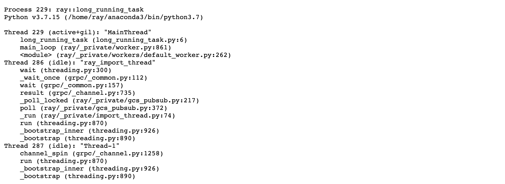

(kuberay-pyspy-integration)=

# Profiling with py-spy

## Stack trace and CPU profiling
[py-spy](https://github.com/benfred/py-spy/tree/master) is a sampling profiler for Python programs. It lets you visualize what your Python program is spending time on without restarting the program or modifying the code in any way. This section describes how to configure RayCluster YAML file to enable py-spy and see Stack Trace and CPU Flame Graph via Ray Dashboard.

## Prerequisite
py-spy requires the `SYS_PTRACE` capability to read process memory. However, Kubernetes omits this capability by default. To enable profiling, add the following to the `template.spec.containers` for both the head and worker Pods.

```bash
securityContext:
  capabilities:
    add:
    - SYS_PTRACE
```
**Notes:**
- Adding `SYS_PTRACE` is forbidden under `baseline` and `restricted` Pod Security Standards. See [Pod Security Standards](https://kubernetes.io/docs/concepts/security/pod-security-standards/) for more details.

## Check CPU flame graph and stack trace via Ray Dashboard

### Step 1: Create a KinD cluster

```bash
kind create cluster
```

### Step 2: Install the KubeRay operator

Follow [this document](kuberay-operator-deploy) to install the latest stable KubeRay operator via Helm repository.

### Step 3: Create a RayCluster with `SYS_PTRACE` capability

```bash
# Download `ray-cluster.py-spy.yaml`
curl -LO https://raw.githubusercontent.com/ray-project/kuberay/master/ray-operator/config/samples/ray-cluster.py-spy.yaml

# Create a RayCluster
kubectl apply -f ray-cluster.py-spy.yaml
```

### Step 4: Forward the dashboard port

```bash
kubectl port-forward --address 0.0.0.0 svc/raycluster-py-spy-head-svc 8265:8265
```

### Step 5: Run a sample job within the head Pod

```bash
# Log in to the head Pod
kubectl exec -it ${YOUR_HEAD_POD} -- bash

# (Head Pod) Run a sample job in the Pod
# `long_running_task` includes a `while True` loop to ensure the task remains actively running indefinitely. 
# This allows you ample time to view the Stack Trace and CPU Flame Graph via Ray Dashboard.
python3 samples/long_running_task.py
```

**Notes:**
- If you're running your own examples and encounter the error `Failed to write flamegraph: I/O error: No stack counts found` when viewing CPU Flame Graph, it might be due to the process being idle. Notably, using the `sleep` function can lead to this state. In such situations, py-spy filters out the idle stack traces. Refer to this [issue](https://github.com/benfred/py-spy/issues/321#issuecomment-731848950) for more information.

### Step 6: Profile using Ray Dashboard

- Visit http://localhost:8265/#/cluster.
- Click `Stack Trace` for `ray::long_running_task`.
    
- Click `CPU Flame Graph` for `ray::long_running_task`.
    
- For additional details on using the profiler, See [Python CPU profiling in the Dashboard](https://docs.ray.io/en/latest/ray-observability/user-guides/debug-apps/optimize-performance.html#python-cpu-profiling-in-the-dashboard).

### Step 7: Clean up

```bash
kubectl delete -f ray-cluster.py-spy.yaml
helm uninstall kuberay-operator
```
