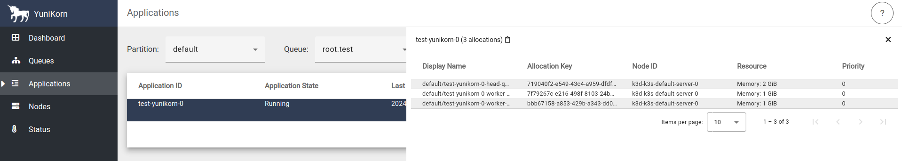
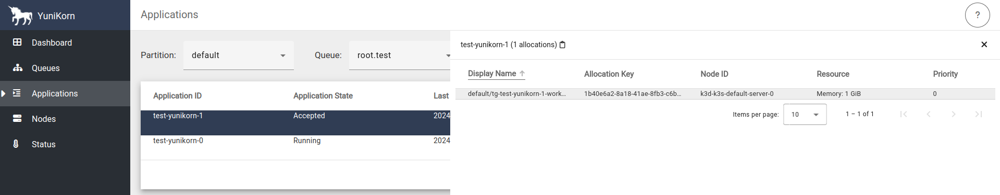

(kuberay-yunikorn)=

# KubeRay integration with Apache YuniKorn

[Apache YuniKorn](https://yunikorn.apache.org/) is a light-weight, universal resource scheduler for container orchestrator systems. It performs fine-grained resource sharing for various workloads efficiently on a large scale, multi-tenant, and cloud-native environment. YuniKorn brings a unified, cross-platform, scheduling experience for mixed workloads that consist of stateless batch workloads and stateful services.

KubeRay's Apache YuniKorn integration enables more efficient scheduling of Ray Pods in multi-tenant Kubernetes environments.

:::{note}

This feature requires KubeRay version 1.2.2 or newer, and it's in alpha testing.

:::

## Step 1: Create a Kubernetes cluster with Kind
Run the following command in a terminal:

```shell
kind create cluster
```

## Step 2: Install Apache YuniKorn

You need to successfully install Apache YuniKorn on your Kubernetes cluster before enabling Apache YuniKorn integration with KubeRay.
See [Get Started](https://yunikorn.apache.org/docs/) for Apache YuniKorn installation instructions.

## Step 3: Install the KubeRay operator with Apache YuniKorn support

When installing KubeRay operator using Helm, pass the `--set batchScheduler.name=yunikorn` flag at the command line:

```shell
helm install kuberay-operator kuberay/kuberay-operator --version 1.4.2 --set batchScheduler.name=yunikorn
```

## Step 4: Use Apache YuniKorn for gang scheduling

This example demonstrates gang scheduling of RayCluster custom resources with Apache YuniKorn and KubeRay. Starting with KubeRay 1.5.0, KubeRay also supports gang scheduling for RayJob custom resources.

First, create a queue with a capacity of 4 CPUs and 6Gi of RAM by editing the ConfigMap:

Run `kubectl edit configmap -n yunikorn yunikorn-defaults`

Helm creates this ConfigMap during the installation of the Apache YuniKorn Helm chart.

Add a `queues.yaml` config under the `data` key. The `ConfigMap` should look like the following:

```yaml
apiVersion: v1
kind: ConfigMap
metadata:
  # Metadata for the ConfigMap, skip for brevity.
data:
  queues.yaml: |
    partitions:
      - name: default
        queues:
          - name: root
            queues:
              - name: test
                submitacl: "*"
                parent: false
                resources:
                  guaranteed:
                    memory: 6G
                    vcore: 4
                  max:
                    memory: 6G
                    vcore: 4
```

Save the changes and exit the editor. This configuration creates a queue named `root.test` with a capacity of 4 CPUs and 6Gi of RAM.

Next, create a RayCluster with a head node with 1 CPU and 2GiB of RAM, and two workers with 1 CPU and 1GiB of RAM each, for a total of 3 CPU and 4GiB of RAM:

```shell
# Path: kuberay/ray-operator/config/samples
# Configure the necessary labels on the RayCluster custom resource for Apache YuniKorn scheduler's gang scheduling:
# - `ray.io/gang-scheduling-enabled`: Set to `true` to enable gang scheduling.
# - `yunikorn.apache.org/app-id`: Set to a unique identifier for the application in Kubernetes, even across different namespaces.
# - `yunikorn.apache.org/queue`: Set to the name of one of the queues in Apache YuniKorn.
wget https://raw.githubusercontent.com/ray-project/kuberay/master/ray-operator/config/samples/ray-cluster.yunikorn-scheduler.yaml
kubectl apply -f ray-cluster.yunikorn-scheduler.yaml
```

Check the RayCluster that the KubeRay operator created:

```shell
$ kubectl describe raycluster test-yunikorn-0

Name:         test-yunikorn-0
Namespace:    default
Labels:       ray.io/gang-scheduling-enabled=true
              yunikorn.apache.org/app-id=test-yunikorn-0
              yunikorn.apache.org/queue=root.test
Annotations:  <none>
API Version:  ray.io/v1
Kind:         RayCluster
Metadata:
  Creation Timestamp:  2024-09-29T09:52:30Z
  Generation:          1
  Resource Version:    951
  UID:                 cae1dbc9-5a67-4b43-b0d9-be595f21ab85
# Other fields are skipped for brevity
````

Note the labels on the RayCluster: `ray.io/gang-scheduling-enabled=true`, `yunikorn.apache.org/app-id=test-yunikorn-0`, and `yunikorn.apache.org/queue=root.test`.

:::{note}

You only need the `ray.io/gang-scheduling-enabled` label when you require gang scheduling. If you don't set this label, YuniKorn schedules the Ray cluster without enforcing gang scheduling.

:::

Because the queue has a capacity of 4 CPU and 6GiB of RAM, this resource should schedule successfully without any issues.

```shell
$ kubectl get pods

NAME                                  READY   STATUS    RESTARTS   AGE
test-yunikorn-0-head-98fmp            1/1     Running   0          67s
test-yunikorn-0-worker-worker-42tgg   1/1     Running   0          67s
test-yunikorn-0-worker-worker-467mn   1/1     Running   0          67s
```

Verify the scheduling by checking the [Apache YuniKorn dashboard](https://yunikorn.apache.org/docs/#access-the-web-ui).

```shell
kubectl port-forward svc/yunikorn-service 9889:9889 -n yunikorn
```

Go to `http://localhost:9889/#/applications` to see the running apps.



Next, add an additional RayCluster with the same configuration of head and worker nodes, but with a different name:

```shell
# Replace the name with `test-yunikorn-1`.
sed 's/test-yunikorn-0/test-yunikorn-1/' ray-cluster.yunikorn-scheduler.yaml | kubectl apply -f-
```

Now all the Pods for `test-yunikorn-1` are in the `Pending` state:

```shell
$ kubectl get pods

NAME                                      READY   STATUS    RESTARTS   AGE
test-yunikorn-0-head-98fmp                1/1     Running   0          4m22s
test-yunikorn-0-worker-worker-42tgg       1/1     Running   0          4m22s
test-yunikorn-0-worker-worker-467mn       1/1     Running   0          4m22s
test-yunikorn-1-head-xl2r5                0/1     Pending   0          71s
test-yunikorn-1-worker-worker-l6ttz       0/1     Pending   0          71s
test-yunikorn-1-worker-worker-vjsts       0/1     Pending   0          71s
tg-test-yunikorn-1-headgroup-vgzvoot0dh   0/1     Pending   0          69s
tg-test-yunikorn-1-worker-eyti2bn2jv      1/1     Running   0          69s
tg-test-yunikorn-1-worker-k8it0x6s73      0/1     Pending   0          69s
```

Apache YuniKorn creates the Pods with the `tg-` prefix for gang scheduling purpose.

Go to `http://localhost:9889/#/applications` and to see `test-yunikorn-1` in the `Accepted` state but not running yet:



Because the new cluster requires more CPU and RAM than the queue allows, even though one of the Pods would fit in the remaining 1 CPU and 2GiB of RAM, Apache YuniKorn doesn't place the cluster's Pods until there's enough room for all of the Pods. Without using Apache YuniKorn for gang scheduling in this way, KubeRay would place one of the Pods, and only partially allocating the cluster.

Delete the first RayCluster to free up resources in the queue:

```shell
kubectl delete raycluster test-yunikorn-0
```

Now all the Pods for the second cluster change to the `Running` state, because enough resources are now available to schedule the entire set of Pods:

Check the Pods again to see that the second cluster is now up and running:

```shell
$ kubectl get pods

NAME                                  READY   STATUS    RESTARTS   AGE
test-yunikorn-1-head-xl2r5            1/1     Running   0          3m34s
test-yunikorn-1-worker-worker-l6ttz   1/1     Running   0          3m34s
test-yunikorn-1-worker-worker-vjsts   1/1     Running   0          3m34s
```

Clean up the resources:

```shell
kubectl delete raycluster test-yunikorn-1
```
