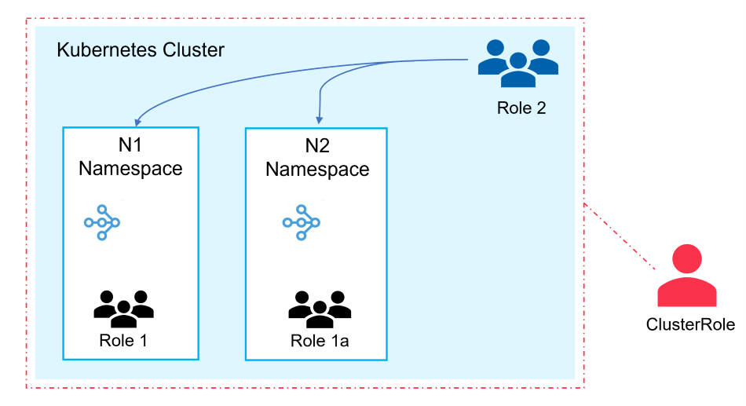

(kuberay-helm-chart-rbac)=

# Helm Chart RBAC

KubeRay utilizes Role-Based Access Control (RBAC) to grant permissions for monitoring and managing resources.
This document describes how to configure and use Helm charts to create Role or ClusterRole with practical guidance. 
Refer to [Kubernetes - Using RBAC Authorization](https://kubernetes.io/docs/reference/access-authn-authz/rbac/) 
for a better understanding of this document.


### Related parameters:

`rbacEnable` : Enables KubeRay's RBAC. If set to false, no RBAC resources will be created.

`singleNamespaceInstall` : Determines the creation of Role or ClusterRole. When set to true, it creates a Role instead of a ClusterRole.

`watchNamespace` :  A list of namespaces that the KubeRay operator will watch.

`crNamespacedRbacEnable` : By default, it's set to true and handles Role creation for RayCluster preparation.
You typically don't need to change this unless you're using GitOps tools like ArgoCD. In that case,
configure it as needed to avoid potential errors. 
For additional details, refer to [PR#1162](https://github.com/ray-project/kuberay/pull/1162).

KubeRay's RBAC configuration can be categorized into three cases.

- **[Default]** ClusterRole monitors all custom resources across the entire cluster, providing access to cluster-wide resources,
  including those in N1 and N2 namespaces as shown in the picture.

- Role monitors only the namespace where the KubeRay operator is deployed. As shown in the picture below, Role 1 and 
Role 1a only monitor N1 namespace and N2 namespace respectively.

- Role for monitoring multiple specific namespaces. In picture, Role 2 watches both N1 and N2 namespaces in the picture.





## Case 1
#### Watching all custom resources in the Kubernetes cluster
This is default setting, which installs cluster-scoped RBAC resources (i.e., ClusterRole and ClusterRoleBinding). The 
following example shows that the operator can monitor and create resources across the cluster scope.

```shell
# Create a Kubernetes cluster using Kind.
kind create cluster --image=kindest/node:v1.23.0

# Create namespaces
kubectl create ns n1
kubectl create ns n2

# Install a KubeRay operator (use default values.yaml)
# (path: helm-chart/kuberay-operator)
helm install kuberay-operator .

# Check ClusterRole
kubectl get clusterrole | grep kuberay
# kuberay-operator                                                       2023-10-15T04:54:28Z

# Check Role 
kubectl get role
#NAME                               CREATED AT
#kuberay-operator-leader-election   2023-10-15T04:54:28Z

# Install RayCluster in `default`, `n1`, `n2`
helm install raycluster kuberay/ray-cluster --version 1.0.0-rc.0
helm install raycluster kuberay/ray-cluster --version 1.0.0-rc.0 -n n1
helm install raycluster kuberay/ray-cluster --version 1.0.0-rc.0 -n n2

# RayCluster in these 3 namespaces should be created.
kubectl get raycluster -A
#NAMESPACE   NAME                 DESIRED WORKERS   AVAILABLE WORKERS   STATUS   AGE
#default     raycluster-kuberay   1                 1                   ready    73s
#n1          raycluster-kuberay   1                 1                   ready    56s
#n2          raycluster-kuberay   1                 1                   ready    52s
```

## Case 2
#### Watching only the namespace where the operator is deployed

Set `singleNamespaceInstall` to true and don't set `watchNamespace`, KubeRay installs namespace RBAC resources (i.e., Role and RoleBinding) in the 
namespace the operator is deployed .

```shell
# Set in value.yaml
singleNamespaceInstall: true
```

```shell
# Create a Kubernetes cluster using Kind.
kind create cluster --image=kindest/node:v1.23.0

# Create namespaces
kubectl create ns n1
kubectl create ns n2

# Install a KubeRay operator 
# set `singleNamespaceInstall` to true in values.yaml
# (path: helm-chart/kuberay-operator)
helm install kuberay-operator .

# Check ClusterRole
kubectl get clusterrole | grep kuberay
# (nothing found)

# Check Role
kubectl get role --all-namespaces | grep kuberay
#default       kuberay-operator                                 2023-10-15T05:18:03Z
#default       kuberay-operator-leader-election                 2023-10-15T05:18:03Z

# Install RayCluster in `default`, `n1`, `n2`
helm install raycluster kuberay/ray-cluster --version 1.0.0-rc.0
helm install raycluster kuberay/ray-cluster --version 1.0.0-rc.0 -n n1
helm install raycluster kuberay/ray-cluster --version 1.0.0-rc.0 -n n2

# Only RayCluster in `default` will be created.
kubectl get raycluster -A
#NAMESPACE   NAME                 DESIRED WORKERS   AVAILABLE WORKERS   STATUS   AGE
#default     raycluster-kuberay   1                 1                   ready    54s
#n1          raycluster-kuberay                                                  50s
#n2          raycluster-kuberay                                                  44s
```

## Case 3
#### Watching multiple namespaces with Role
For users who only have namespaced access, you would need to deploy one KubeRay Operator for each namespace. This can increase the maintenance overhead, such as upgrading the version for each deployed instance.
For this, KubeRay provides `watchNamespace` this parameter to support you to monitor multiple namespaces.

Set singleNamespaceInstall to true and watchNamespace, it will create Role and RoleBinding for all namespaces listed in watchNamespace.

```shell
# Set in value.yaml
singleNamespaceInstall: true

# Set the namespaces list
watchNamespace:
  - n1
  - n2
```

```shell
# Create a Kubernetes cluster using Kind.
kind create cluster --image=kindest/node:v1.23.0

# Create namespaces
kubectl create ns n1
kubectl create ns n2

# Install a KubeRay operator 
# set `singleNamespaceInstall` and `watchNamespace` in values.yaml
# (path: helm-chart/kuberay-operator)
helm install kuberay-operator .

# Check ClusterRole
kubectl get clusterrole | grep kuberay
# (nothing found)

# Check Role
kubectl get role --all-namespaces | grep kuberay
#default       kuberay-operator-leader-election                 2023-10-15T05:34:27Z
#n1            kuberay-operator                                 2023-10-15T05:34:27Z
#n2            kuberay-operator                                 2023-10-15T05:34:27Z

# Install RayCluster in `default`, `n1`, `n2`
helm install raycluster kuberay/ray-cluster --version 1.0.0-rc.0
helm install raycluster kuberay/ray-cluster --version 1.0.0-rc.0 -n n1
helm install raycluster kuberay/ray-cluster --version 1.0.0-rc.0 -n n2

# Only RayCluster in n1 and n2 will be created.
kubectl get raycluster -A
#NAMESPACE   NAME                 DESIRED WORKERS   AVAILABLE WORKERS   STATUS   AGE
#default     raycluster-kuberay                                                  74s
#n1          raycluster-kuberay   1                 1                   ready    70s
#n2          raycluster-kuberay   1                 1                   ready    67s
```

## Disable RBAC resources
If you want to disable the creation of any RBAC resources, you can set both serviceAccount.create and rbacEnable 
to false to prevent the creation of any RBAC resources.

```shell
# Set in value.yaml
serviceAccount:
  create: false

rbacEnable : false 
```

