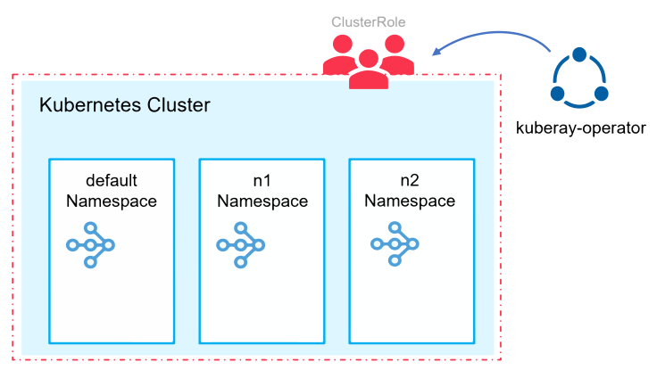
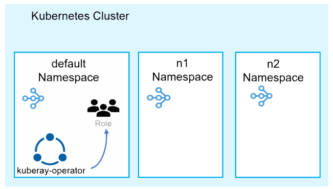
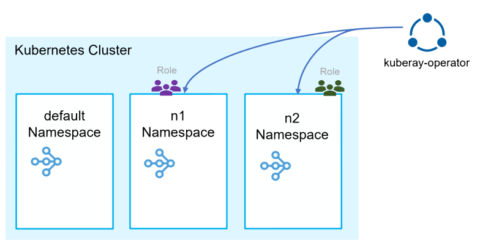

(kuberay-helm-chart-rbac)=

# Helm Chart RBAC

KubeRay utilizes [Kubernetes Role-Based Access Control (RBAC) resources](https://kubernetes.io/docs/reference/access-authn-authz/rbac/) to grant permissions for monitoring and managing resources.
This document describes how to configure the KubeRay Helm chart to create RBAC resources for 3 different use cases.

* [Case 1: Watch all namespaces in the Kubernetes cluster](case1-watch-all-namespaces)
* [Case 2: Watch the namespace where the operator is deployed](case2-watch-1-namespace)
* [Case 3: Watch multiple namespaces in the Kubernetes cluster](case3-watch-multiple-namespaces)

## Parameters

You can configure the KubeRay Helm chart to create RBAC resources for different use cases by modifying the following parameters in the [values.yaml](https://github.com/ray-project/kuberay/blob/master/helm-chart/kuberay-operator/values.yaml).
Then, you can install the KubeRay Helm chart with the modified **values.yaml**.

```shell
# Step 1: Clone the KubeRay repository
# Step 2: Modify the helm-chart/kuberay-operator/values.yaml
# Step 3: Install the KubeRay Helm chart (path: helm-chart/kuberay-operator)
helm install kuberay-operator .
```

* **`rbacEnable`**
  * It determines whether to create RBAC resources. If set to false, the Helm chart doesn't create any RBAC resources.
  * By default, it's set to `true` and creates RBAC resources.

* **`singleNamespaceInstall`**
  * It determines whether to create namespace-scoped or cluster-scoped RBAC resources. If set to true, the Helm chart creates Role and RoleBinding. Otherwise, it creates ClusterRole and ClusterRoleBinding instead.
  * By default, it's set to `false` and creates cluster-scoped RBAC resources.

* **`watchNamespace`**
  * The KubeRay operator's informer watches the custom resources in the namespaces listed in the `watchNamespace` parameter.

* **`crNamespacedRbacEnable`**
  * In most cases, it should be `true`, unless you are using a Kubernetes cluster managed by GitOps tools such as ArgoCD. For additional details, refer to [ray-project/kuberay#1162](https://github.com/ray-project/kuberay/pull/1162).
  * By default, it's set to `true`.

The [values.yaml](https://github.com/ray-project/kuberay/blob/master/helm-chart/kuberay-operator/values.yaml) file contains detailed descriptions of the parameters.
In addition, these pull requests, [ray-project/kuberay#1106](https://github.com/ray-project/kuberay/pull/1106), [ray-project/kuberay#1162](https://github.com/ray-project/kuberay/pull/1162), and [ray-project/kuberay#1190](https://github.com/ray-project/kuberay/pull/1190), may also be helpful to understand these parameters.

(case1-watch-all-namespaces)=
## Case 1: Watch all namespaces in the Kubernetes cluster



This is the KubeRay's default setting.
The informer of the KubeRay operator watches all namespaces in the Kubernetes cluster.
The operator has cluster-scoped access to create and manage resources, using ClusterRole and ClusterRoleBinding.

```shell
# Create a Kubernetes cluster using Kind.
kind create cluster --image=kindest/node:v1.23.0

# Create namespaces
kubectl create ns n1
kubectl create ns n2

# Install a KubeRay operator (use default values.yaml)
# (path: helm-chart/kuberay-operator)
helm install kuberay-operator .

# Check ClusterRole
kubectl get clusterrole | grep kuberay
# kuberay-operator                  2023-10-15T04:54:28Z

# Check Role 
kubectl get role
#NAME                               CREATED AT
#kuberay-operator-leader-election   2023-10-15T04:54:28Z

# Install RayCluster in `default`, `n1`, `n2` namespaces
helm install raycluster kuberay/ray-cluster --version 1.0.0-rc.0
helm install raycluster kuberay/ray-cluster --version 1.0.0-rc.0 -n n1
helm install raycluster kuberay/ray-cluster --version 1.0.0-rc.0 -n n2

# RayCluster in these 3 namespaces should be created.
kubectl get raycluster -A
# NAMESPACE   NAME                 DESIRED WORKERS   AVAILABLE WORKERS   STATUS   AGE
# default     raycluster-kuberay   1                 1                   ready    73s
# n1          raycluster-kuberay   1                 1                   ready    56s
# n2          raycluster-kuberay   1                 1                   ready    52s
```

(case2-watch-1-namespace)=
## Case 2: Watch the namespace where the operator is deployed



The informer of the KubeRay operator watches the namespace where the operator is deployed.
The operator has Role and RoleBinding in the same namespace.

* Modify the `singleNamespaceInstall` parameter in the `values.yaml` file to `true`.
  ```shell
  singleNamespaceInstall: true
  ```

```shell
# Create a Kubernetes cluster using Kind.
kind create cluster --image=kindest/node:v1.23.0

# Create namespaces
kubectl create ns n1
kubectl create ns n2

# Install a KubeRay operator 
# set `singleNamespaceInstall` to true in values.yaml
# (path: helm-chart/kuberay-operator)
helm install kuberay-operator .

# Check ClusterRole
kubectl get clusterrole | grep kuberay
# (nothing found)

# Check Role
kubectl get role --all-namespaces | grep kuberay
#default       kuberay-operator                                 2023-10-15T05:18:03Z
#default       kuberay-operator-leader-election                 2023-10-15T05:18:03Z

# Install RayCluster in `default`, `n1`, `n2`
helm install raycluster kuberay/ray-cluster --version 1.0.0-rc.0
helm install raycluster kuberay/ray-cluster --version 1.0.0-rc.0 -n n1
helm install raycluster kuberay/ray-cluster --version 1.0.0-rc.0 -n n2

# Only RayCluster in `default` will be created.
kubectl get raycluster -A
# NAMESPACE   NAME                 DESIRED WORKERS   AVAILABLE WORKERS   STATUS   AGE
# default     raycluster-kuberay   1                 1                   ready    54s
# n1          raycluster-kuberay                                                  50s
# n2          raycluster-kuberay                                                  44s
```

(case3-watch-multiple-namespaces)=
## Case 3: Watch multiple namespaces in the Kubernetes cluster



In Case 2, users with only namespaced access deploy a separate KubeRay operator for each namespace.
This approach can heighten maintenance overhead, especially when upgrading versions for each deployed instance.
Meanwhile, Case 3 creates Role and RoleBinding for multiple namespaces, allowing a single KubeRay operator to monitor several namespaces.

* Modify the `singleNamespaceInstall` and `watchNamespace` parameters in the `values.yaml`.
  ```shell
  # Set in value.yaml
  singleNamespaceInstall: true

  # Set the namespaces list
  watchNamespace:
    - n1
    - n2
  ```

```shell
# Create a Kubernetes cluster using Kind.
kind create cluster --image=kindest/node:v1.23.0

# Create namespaces
kubectl create ns n1
kubectl create ns n2

# Install a KubeRay operator 
# set `singleNamespaceInstall` and `watchNamespace` in values.yaml
# (path: helm-chart/kuberay-operator)
helm install kuberay-operator .

# Check ClusterRole
kubectl get clusterrole | grep kuberay
# (nothing found)

# Check Role
kubectl get role --all-namespaces | grep kuberay
#default       kuberay-operator-leader-election                 2023-10-15T05:34:27Z
#n1            kuberay-operator                                 2023-10-15T05:34:27Z
#n2            kuberay-operator                                 2023-10-15T05:34:27Z

# Install RayCluster in `default`, `n1`, `n2`
helm install raycluster kuberay/ray-cluster --version 1.0.0-rc.0
helm install raycluster kuberay/ray-cluster --version 1.0.0-rc.0 -n n1
helm install raycluster kuberay/ray-cluster --version 1.0.0-rc.0 -n n2

# Only RayCluster in n1 and n2 will be created.
kubectl get raycluster -A
# NAMESPACE   NAME                 DESIRED WORKERS   AVAILABLE WORKERS   STATUS   AGE
# default     raycluster-kuberay                                                  74s
# n1          raycluster-kuberay   1                 1                   ready    70s
# n2          raycluster-kuberay   1                 1                   ready    67s
```
