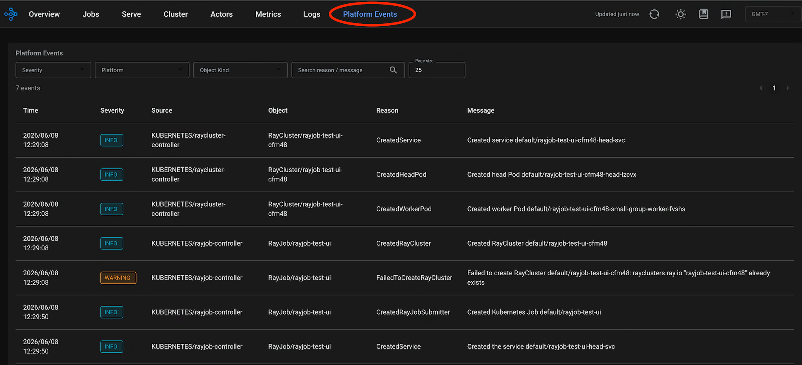

---
myst:
  html_meta:
    description: "How to enable platform events in the Ray Dashboard on Kubernetes: RBAC permissions, the environment variable that turns the feature on, and how to verify that the dashboard receives events."
---

(kuberay-k8s-events)=

# Enable Ray platform events on Kubernetes

This guide describes how to enable and use platform events in the Ray Dashboard on Kubernetes. Platform events surface Kubernetes lifecycle events for the KubeRay custom resources `RayCluster`, `RayJob`, and `RayService` in the Ray Dashboard, alongside your Ray application metrics and logs, so you can correlate cluster behavior with application behavior.

## Prerequisites

* **Ray version**: Ray 2.56.0 or later.
* **Kubernetes Python client**: Install the `kubernetes` Python package (`pip install kubernetes`) in the Ray head pod's Python environment. The official `rayproject/ray` images don't include it.
* **Kubernetes cluster**: A Kubernetes cluster where you can deploy Ray workloads.

## Configure RBAC permissions

The Ray head pod needs permission to call the Kubernetes API and watch events.

Create a file named `ray-rbac.yaml`:
```yaml
apiVersion: rbac.authorization.k8s.io/v1
kind: Role
metadata:
  name: ray-head-watch-role
rules:
- apiGroups: [""]
  resources: ["events"]
  verbs: ["get", "list", "watch"]
- apiGroups: ["ray.io"]
  resources: ["rayclusters"]
  verbs: ["get"]
---
apiVersion: rbac.authorization.k8s.io/v1
kind: RoleBinding
metadata:
  name: ray-head-watch-role-binding
subjects:
- kind: ServiceAccount
  name: default # IMPORTANT: Change this if your Ray Head Pod uses a different ServiceAccount
  namespace: default # IMPORTANT: Change this to the namespace where your Ray cluster runs
roleRef:
  kind: Role
  name: ray-head-watch-role
  apiGroup: rbac.authorization.k8s.io
```

Apply this configuration to the namespace where your Ray cluster runs:
```bash
kubectl apply -f ray-rbac.yaml -n <your-ray-namespace>
```

The role grants two permissions:

* `events`: Required to stream Kubernetes events.
* `rayclusters`: Required for the dashboard to find parent resources such as `RayJob` or `RayService` and watch their events.

## Enable platform events

Set `RAY_DASHBOARD_INGEST_PLATFORM_EVENTS` to `"true"` on the Ray head pod container. This environment variable starts the platform event watcher in the Ray Dashboard backend.

**For deployments without KubeRay (Ray 2.58+)**: KubeRay automatically injects `RAY_CLUSTER_NAME` and `RAY_CLUSTER_NAMESPACE` into the RayCluster's Pods. If you deploy Ray on Kubernetes without KubeRay, manually inject these environment variables into your Ray head pod container so the dashboard can display Kubernetes pod events:

```yaml
env:
  - name: RAY_CLUSTER_NAME
    value: "your-ray-cluster-name" # Must match the target Ray cluster name
  - name: RAY_CLUSTER_NAMESPACE
    value: "your-namespace" # Must match the target namespace
```

## Manifest examples

Deploy complete working examples from the KubeRay repository:

### RayCluster example
```bash
kubectl apply -f https://raw.githubusercontent.com/ray-project/kuberay/master/ray-operator/config/samples/ray-cluster.platform-events.yaml
```

### RayJob example
```bash
kubectl apply -f https://raw.githubusercontent.com/ray-project/kuberay/master/ray-operator/config/samples/ray-job.platform-events.yaml
```

## Verify the configuration

After you deploy your RayCluster or RayJob with these configurations, complete the following steps.

### Port-forward the dashboard

```bash
# Find your Ray head pod
kubectl get pods -n <your-ray-namespace> | grep head

# Port-forward
kubectl port-forward <head-pod-name> -n <your-ray-namespace> 8265:8265
```

### Query the API

This step is optional. Test the endpoint to confirm that Ray collects events:

```bash
curl http://localhost:8265/api/v0/platform_events
```

A successful response is a JSON object containing recent events:
```json
{
  "result": true,
  "msg": "Retrieved platform events",
  "data": {
    "events": [
      {
        "eventId": "Y2JiMzkxMWQtM2YxZS00YzAwLWFmYWMtN2IxNGU1ZjgwZDZk",
        "sourceType": "CLUSTER_LIFECYCLE",
        "eventType": "PLATFORM_EVENT",
        "timestamp": "2026-06-16T21:49:08Z",
        "severity": "INFO",
        "message": "Created RayCluster default/rayjob-test-f52vq",
        "platformEvent": {
          "source": {
            "platform": "KUBERNETES",
            "component": "rayjob-controller",
            "metadata": {
              "namespace": "default",
              "rayClusterName": "rayjob-test-f52vq"
            }
          },
          "objectKind": "RayJob",
          "objectName": "rayjob-test",
          "message": "Created RayCluster default/rayjob-test-f52vq",
          "reason": "CreatedRayCluster",
          "customFields": {}
        },
        "sessionName": "",
        "nodeId": ""
      },
      {
        "eventId": "MDk1MmYxNzUtY2I3MC00NDU3LWExNzktMTBkYjYwZGZkMDA0",
        "sourceType": "CLUSTER_LIFECYCLE",
        "eventType": "PLATFORM_EVENT",
        "timestamp": "2026-06-16T21:49:08Z",
        "severity": "INFO",
        "message": "Created service default/rayjob-test-f52vq-head-svc",
        "platformEvent": {
          "source": {
            "platform": "KUBERNETES",
            "component": "raycluster-controller",
            "metadata": {
              "namespace": "default",
              "rayClusterName": "rayjob-test-f52vq"
            }
          },
          "objectKind": "RayCluster",
          "objectName": "rayjob-test-f52vq",
          "message": "Created service default/rayjob-test-f52vq-head-svc",
          "reason": "CreatedService",
          "customFields": {}
        },
        "sessionName": "",
        "nodeId": ""
      },
      {
        "eventId": "YTEzMWM1MDQtNWMyNS00NGFkLTkwMmMtNTlmOTQ0ZDFlOGNi",
        "sourceType": "CLUSTER_LIFECYCLE",
        "eventType": "PLATFORM_EVENT",
        "timestamp": "2026-06-16T21:49:08Z",
        "severity": "INFO",
        "message": "Created head Pod default/rayjob-test-f52vq-head-vmlwz",
        "platformEvent": {
          "source": {
            "platform": "KUBERNETES",
            "component": "raycluster-controller",
            "metadata": {
              "namespace": "default",
              "rayClusterName": "rayjob-test-f52vq"
            }
          },
          "objectKind": "RayCluster",
          "objectName": "rayjob-test-f52vq",
          "message": "Created head Pod default/rayjob-test-f52vq-head-vmlwz",
          "reason": "CreatedHeadPod",
          "customFields": {}
        },
        "sessionName": "",
        "nodeId": ""
      },
      {
        "eventId": "NWRhNjhmNmEtYjFhMi00MWZiLWE0YWQtN2IwNjIyNmM1YjAw",
        "sourceType": "CLUSTER_LIFECYCLE",
        "eventType": "PLATFORM_EVENT",
        "timestamp": "2026-06-16T21:49:08Z",
        "severity": "INFO",
        "message": "Created worker Pod default/rayjob-test-f52vq-small-group-worker-j7gtf",
        "platformEvent": {
          "source": {
            "platform": "KUBERNETES",
            "component": "raycluster-controller",
            "metadata": {
              "namespace": "default",
              "rayClusterName": "rayjob-test-f52vq"
            }
          },
          "objectKind": "RayCluster",
          "objectName": "rayjob-test-f52vq",
          "message": "Created worker Pod default/rayjob-test-f52vq-small-group-worker-j7gtf",
          "reason": "CreatedWorkerPod",
          "customFields": {}
        },
        "sessionName": "",
        "nodeId": ""
      }
    ]
  }
}
```

### Check the Ray Dashboard

Open `http://localhost:8265` in your browser. Look for the **Platform Events** tab in the navigation bar at the top. The dashboard displays the events there.



## Troubleshooting

:::{note}
In Ray 2.56 and 2.57, this feature tracks only events for the KubeRay custom resources `RayCluster`, `RayJob`, and `RayService`. Starting in Ray 2.58, coverage expands to include generic Kubernetes pod-level events. For non-KubeRay deployments, make sure `RAY_CLUSTER_NAME` and `RAY_CLUSTER_NAMESPACE` are manually set on the head pod so pod events appear in the dashboard.
:::

:::{caution}
If the ServiceAccount lacks `get` permission on `rayclusters` in the `ray.io` API group, Ray can't link events to parent `RayJob` or `RayService` resources. The dashboard then shows only the events that target the RayCluster itself.
:::

### Route platform events to an external system

By default, Ray sends platform events to its observability system with the event type `PLATFORM_EVENT`.

If you set a custom event export address with `RAY_DASHBOARD_AGGREGATOR_AGENT_EVENTS_EXPORT_ADDR`, you can forward platform events to external logging and monitoring systems. See {ref}`Ray Event Export <ray-event-export>`.

If you filter event types with `RAY_ENABLE_PYTHON_RAY_EVENT_TYPES`, include `"PLATFORM_EVENT"` in the list, for example `RAY_ENABLE_PYTHON_RAY_EVENT_TYPES="PLATFORM_EVENT,SYSTEM_EVENT"`. Otherwise Ray doesn't export platform events.
