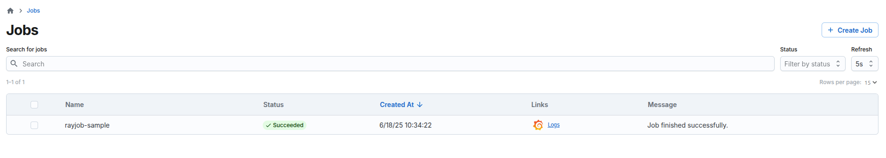

(kuberay-dashboard)=

# Use KubeRay dashboard (experimental)

Starting from KubeRay v1.4.0, you can use the open source dashboard UI for KubeRay. This component is still experimental and not considered ready for production, but feedback is welcome.

The KubeRay dashboard is a web-based UI that allows you to view and manage KubeRay resources running on your Kubernetes cluster. It's different from the Ray dashboard, which is a part of the Ray cluster itself. The KubeRay dashboard provides a centralized view of all KubeRay resources.

## Installation

The KubeRay dashboard depends on the optional `kuberay-apiserver` that you need to install. For simplicity, this guide disables the security proxy and allows all origins for Cross-Origin Resource Sharing.

```bash
helm install kuberay-apiserver kuberay/kuberay-apiserver --version v1.5.0 --set security= --set cors.allowOrigin='*'
```

And you need to port-forward the `kuberay-apiserver` service because the dashboard currently sends requests to `http://localhost:31888`:

```bash
kubectl port-forward svc/kuberay-apiserver-service 31888:8888
```

Install the KubeRay dashboard:

```bash
kubectl run kuberay-dashboard --image=quay.io/kuberay/dashboard:v1.5.0
```

Port-forward the KubeRay dashboard:

```bash
kubectl port-forward kuberay-dashboard 3000:3000
```

Go to `http://localhost:3000/ray/jobs` to see the list of Ray jobs. It's empty for now. You can create a RayJob custom resource to see how it works.

```bash
kubectl apply -f https://raw.githubusercontent.com/ray-project/kuberay/v1.5.0/ray-operator/config/samples/ray-job.sample.yaml
```

The KubeRay dashboard only shows RayJob custom resources that the KubeRay API server creates. This guide simulates the API server by labeling the RayJob.

```bash
kubectl label rayjob rayjob-sample app.kubernetes.io/managed-by=kuberay-apiserver
```

Go to `http://localhost:3000/ray/jobs` again. You can see `rayjob-sample` in the list of RayJob custom resources.


