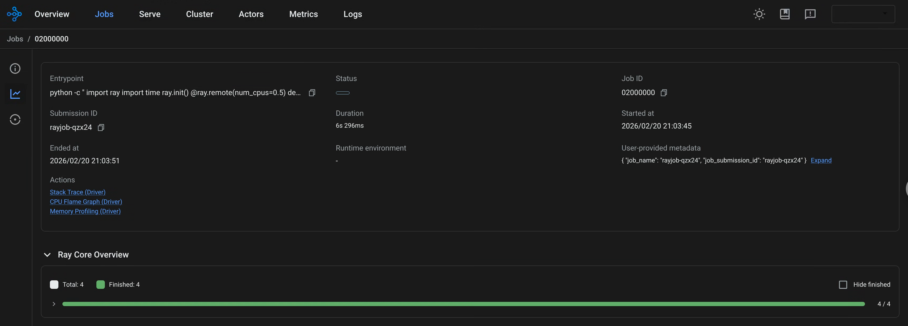
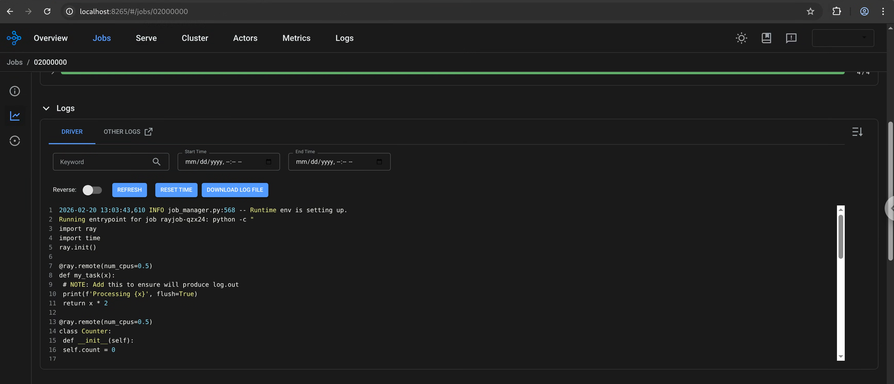

(kuberay-history-server)=

# Ray History Server with KubeRay

This guide covers how to set up and configure the Ray History Server with KubeRay on GKE using Google Cloud Storage.

The Ray History Server powers the Ray Dashboard's backend. For information about how to use the Ray Dashboard, see [Ray Dashboard](https://docs.ray.io/en/latest/ray-observability/getting-started.html).

:::{warning}
The Ray History Server project is currently in **alpha** and subject to breaking changes in future versions.
:::

## Ray History Server

The Ray History Server is a new component introduced in KubeRay v1.6 that's used to access and debug RayClusters even after its termination.

The Ray History Server consists of two main containers:
1. Collector - lives on the Ray nodes and collects/exports the necessary events and logs.
2. History Server - standalone deployment that reconstructs and serves the Ray endpoints.

## Prerequisites

Make sure that you have done the following:

* Have [helm](https://helm.sh/docs/intro/install/) installed and updated
* Access and permissions to the Google Cloud project and the `gcloud` command-line tool.
* Docker or similar container building tool
* Minimum Ray Version installed: v2.55

## Environment Variables used

This guide uses the following environment variables:
```sh
export RAY_CLUSTER=raycluster-historyserver
export NAMESPACE=default
export REGION=<REGION>
export GCS_BUCKET=<GCS_BUCKET_HERE>
export PROJECT_ID=<PROJECT_ID>
export PROJECT_NUMBER=<PROJECT_NUMBER>
export GKE_CLUSTER_NAME=<GKE_CLUSTER_NAME>
```

## Create GKE Cluster

This guide creates a standard GKE cluster using Workload Identity. If you already have a Kubernetes cluster, you can skip this step.

Create a GKE cluster with Workload Identity:
```sh
gcloud container clusters create ${GKE_CLUSTER_NAME} \
  --region=${REGION}
  --workload-pool=${PROJECT_ID}.svc.id.goog
```

Get credentials for the cluster for `kubectl`:
```sh
gcloud container clusters get-credentials ${GKE_CLUSTER_NAME} \
  --region ${REGION} \
  --project ${PROJECT_ID}
```

## Install KubeRay Operator

Follow [Deploy a KubeRay operator](https://docs.ray.io/en/latest/cluster/kubernetes/getting-started/kuberay-operator-installation.html#step-2-install-kuberay-operator) to install the latest stable KubeRay operator from the Helm repository.

## Build KubeRay History Server and Collector image

Because the Ray History Server is in alpha, public container images aren't currently provided. You must build the component images from source and push them to your own registry. For a complete walk-through, refer to the [this guide](https://github.com/ray-project/kuberay/blob/master/historyserver/docs/image-build-push-guide.md). Future KubeRay releases offer pre-built base images for this feature.

## Set up Ray History Server

This section goes through the process of setting up necessary cluster roles and permissions for history server

### Configure Role-based access control for Ray History Server

Prepare necessary cluster role bindings and Role-based access control  for the Ray History Server components:

```sh
kubectl apply -f - <<EOF
apiVersion: rbac.authorization.k8s.io/v1
kind: ClusterRole
metadata:
 name: raycluster-reader
rules:
- apiGroups: ["ray.io"]
  resources: ["rayclusters"]
  verbs: ["list", "get"]
---
apiVersion: rbac.authorization.k8s.io/v1
kind: ClusterRoleBinding
metadata:
  name: historyserver
  namespace: ${NAMESPACE}
subjects:
- kind: ServiceAccount
  name: historyserversa
  namespace: ${NAMESPACE}
roleRef:
  kind: ClusterRole
  name: raycluster-reader
EOF
```

### Create a Kubernetes service account 

```sh
kubectl -n $NAMESPACE create serviceaccount historyserver
```

### Setup Google Cloud Storage with cluster

If you don't have an existing Google Cloud Storage bucket already, create one using:
```sh
gcloud storage buckets create gs://$GCS_BUCKET --uniform-bucket-level-access
```

Add the `roles/storage.objectUser` role to the Kubernetes service account:
```sh
gcloud storage buckets add-iam-policy-binding gs://${GCS_BUCKET} --member "principal://iam.googleapis.com/projects/${PROJECT_NUMBER}/REGIONs/global/workloadIdentityPools/${PROJECT_ID}.svc.id.goog/subject/ns/${NAMESPACE}/sa/historyserver"  --role "roles/storage.objectUser"
```

## Deploy Ray History Server and service

Using the example provided [here](https://raw.githubusercontent.com/ray-project/kuberay/refs/heads/master/historyserver/config/historyserver-gcs.yaml) you can deploy a History Server that connects to the Google Cloud Storage. Run:

```sh
export GCS_BUCKET=<GCS_BUCKET_HERE>
export HISTORY_SERVER_IMAGE=<your image here>

curl https://raw.githubusercontent.com/ray-project/kuberay/refs/heads/master/historyserver/config/historyserver-gcs.yaml | envsubst | kubectl apply -f - 
```

## Deploy Example RayCluster 

The collector component of Ray History Server lives on each of the RayCluster Pods and handles collecting the necessary logs and events, and exporting them.

To create the RayCluster with the collector container run:
```sh
export GCS_BUCKET=<GCS_BUCKET_HERE>
export COLLECTOR_IMAGE=<your image here>

curl https://raw.githubusercontent.com/ray-project/kuberay/refs/heads/master/historyserver/config/raycluster-gcs.yaml | envsubst | kubectl apply -f - 
```

Within the manifest are env vars unique to the history server.
* `RAY_enable_core_worker_ray_event_to_aggregator` and `RAY_DASHBOARD_AGGREGATOR_AGENT_EVENTS_EXPORT_ADDR` enable the Ray event export API.
* `RAY_DASHBOARD_AGGREGATOR_AGENT_PUBLISHER_HTTP_ENDPOINT_EXPOSABLE_EVENT_TYPES` lists the types of events the collector collects.

The following collector container arguments set up the containers. The arguments ensure that the collector saves logs during a restart or termination.

* The `role `field tells the collector which Ray node the collector belongs to.
* The `runtime-class-name` field determines the storage client.
* The `ray-cluster-name` field defines the name of the RayCluster.
* The `ray-root` field tells Ray History Server what the root directory is.
* The `events-port` field tells collector which port the events comes from.

The Ray container also includes a `postStart` lifecycle hook to write the raylet node ID to a file. The collector reads this file to identify the node. Without this hook, the collector fails with errors such as `read nodeid file error`. It looks something like this:

```yaml
lifecycle:
  postStart:
    exec:
      command:
      - /bin/sh
      - -c
      - |
        while true; do
          nodeid=$(ps -ef | grep 'raylet.*--node_id' | grep -v grep | sed -n 's/.*--node_id=\([^ ]*\).*/\1/p' | head -1)
          if [ -n "$nodeid" ]; then
            echo "$nodeid" > /tmp/ray/raylet_node_id
            break
          fi
          sleep 1
        done
```

## Terminate the RayCluster

Metadata and logs persist after termination, allowing for the safe deletion of the RayCluster.

```sh
kubectl delete raycluster -n ${NAMESPACE} raycluster ${RAY_CLUSTER}
```

Once the Ray Cluster terminates, the collector populates the object store with latest events and logs. You can run `gsutil ls -r gs://${GCS_BUCKET}` to list the current objects.

The result looks something similar to this:
```text
gs://BUCKET/log/:

gs://BUCKET/log/metadir/:

gs://BUCKET/log/metadir/raycluster-historyserver_NAMESPACE/:
gs://BUCKET/log/metadir/raycluster-historyserver_NAMESPACE/
gs://BUCKET/log/metadir/raycluster-historyserver_NAMESPACE/session_2026-02-20_13-03-16_320452_1
...

gs://BUCKET/log/raycluster-historyserver_NAMESPACE/session_2026-02-20_13-03-16_320452_1/:

gs://BUCKET/log/raycluster-historyserver_NAMESPACE/session_2026-02-20_13-03-16_320452_1/logs/:

gs://BUCKET/log/raycluster-historyserver_NAMESPACE/session_2026-02-20_13-03-16_320452_1/logs/0a46878b6f144cdb0ed62e9871caaeb16083547bf34acb5025832ace/:
gs://BUCKET/log/raycluster-historyserver_NAMESPACE/session_2026-02-20_13-03-16_320452_1/logs/0a46878b6f144cdb0ed62e9871caaeb16083547bf34acb5025832ace/dashboard_agent.err
gs://BUCKET/log/raycluster-historyserver_NAMESPACE/session_2026-02-20_13-03-16_320452_1/logs/0a46878b6f144cdb0ed62e9871caaeb16083547bf34acb5025832ace/dashboard_agent.log
gs://BUCKET/log/raycluster-historyserver_NAMESPACE/session_2026-02-20_13-03-16_320452_1/logs/0a46878b6f144cdb0ed62e9871caaeb16083547bf34acb5025832ace/dashboard_agent.out
...

gs://BUCKET/log/raycluster-historyserver_NAMESPACE/session_2026-02-20_13-03-16_320452_1/node_events/:
gs://BUCKET/log/raycluster-historyserver_NAMESPACE/session_2026-02-20_13-03-16_320452_1/node_events/
gs://BUCKET/log/raycluster-historyserver_NAMESPACE/session_2026-02-20_13-03-16_320452_1/node_events/0a46878b6f144cdb0ed62e9871caaeb16083547bf34acb5025832ace-2026-02-20-13
...

gs://BUCKET/log/raycluster-historyserver_NAMESPACE/session_2026-02-20_13-03-16_320452_1/job_events/:

gs://BUCKET/log/raycluster-historyserver_NAMESPACE/session_2026-02-20_13-03-16_320452_1/job_events/AQAAAA==/:
gs://BUCKET/log/raycluster-historyserver_NAMESPACE/session_2026-02-20_13-03-16_320452_1/job_events/AQAAAA==/
gs://BUCKET/log/raycluster-historyserver_NAMESPACE/session_2026-02-20_13-03-16_320452_1/job_events/AQAAAA==/0a46878b6f144cdb0ed62e9871caaeb16083547bf34acb5025832ace-2026-02-20-13
...
```

## Access terminated RayCluster using Ray Dashboard

To view terminated Ray clusters, setup a local Ray Dashboard that uses the history server endpoint as the backend.

### Port Forward the history server

For the local Ray Dashboard to access the history server, you have to port forward the history server service.
```sh
kubectl port-forward svc/historyserver 8080:30080
```

### Start the local Ray Dashboard

Install Ray locally. Make sure to use at least Ray `v2.55`.

```sh
pip uninstall -y ray
pip install -U "ray[default]==2.55.0"
```

Run the `ray start` command:
```sh
ray start --head --num-cpus=1 --proxy-server-url=http://localhost:8080
```
Notice the `--proxy-server-url` parameter that points to the port-forwarded history server.

### Configure RayCluster for the Ray Dashboard

The Ray Dashboard uses cookies to identify which RayCluster to look at.
To select a historical cluster, first get the list of all Ray clusters and their sessions.

In your browser, list your Ray cluster sessions by navigating to the following URL:
```text
http://localhost:8265/clusters
```

The endpoint call result should look something like the following:
```text
[
 {
  "name": "rayjob-testing",
  "namespace": "default",
  "sessionName": "session_2026-03-25_13-28-57_801609_1",
  "createTime": "2026-03-25T13:28:57Z",
  "createTimeStamp": 1774445337
 },
 {
  "name": "ray-cluster-hs",
  "namespace": "default",
  "sessionName": "session_2026-03-18_17-11-25_410478_1",
  "createTime": "2026-03-18T17:11:25Z",
  "createTimeStamp": 1773853885
 },
 {
  "name": "raycluster-historyserver",
  "namespace": "default",
  "sessionName": "session_2026-02-20_13-03-16_320452_1",
  "createTime": "2026-02-20T13:03:16Z",
  "createTimeStamp": 1771592596
 },
]
```

Copy a Ray cluster session and navigate to this endpoint in the browser:
```text
http://localhost:8265/enter_cluster/default/raycluster-historyserver/<SELECTED_SESSION_ID>
```
Loading the endpoint initializes the cookies.

A successful request produces output like the following:
```text
{
 "name": "raycluster-historyserver",
 "namespace": "default",
 "result": "success",
 "session": "session_2026-02-20_13-03-16_320452_1"
}
```

Once set up, access the Ray Dashboard.

```text
http://localhost:8265
```

Ray job page using Ray History Server as a backend:




