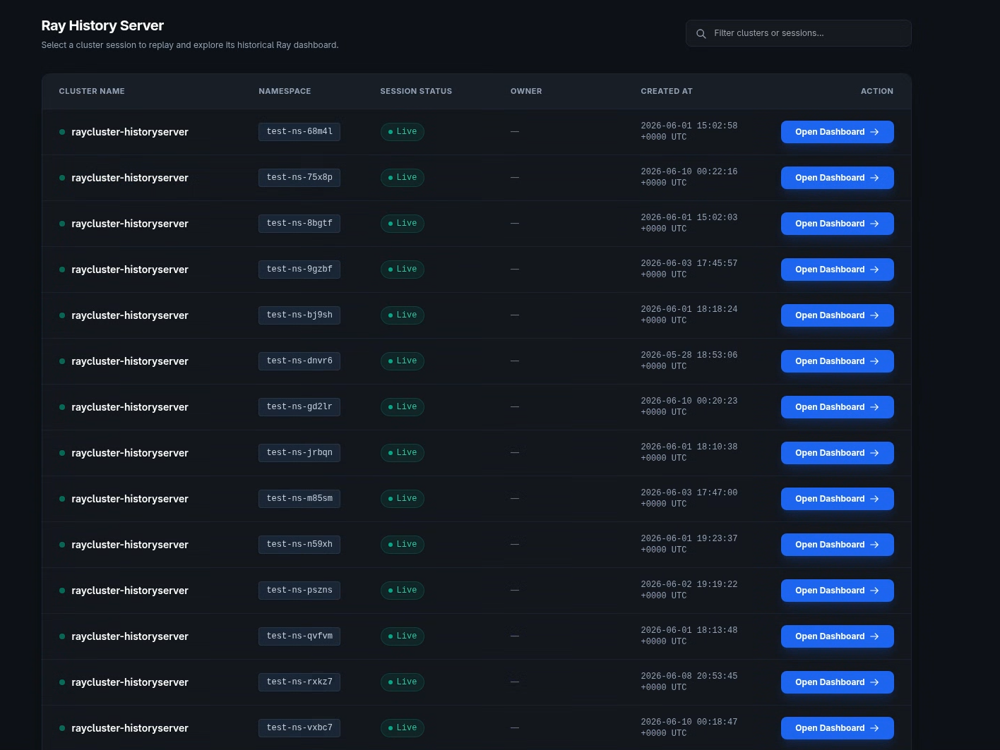
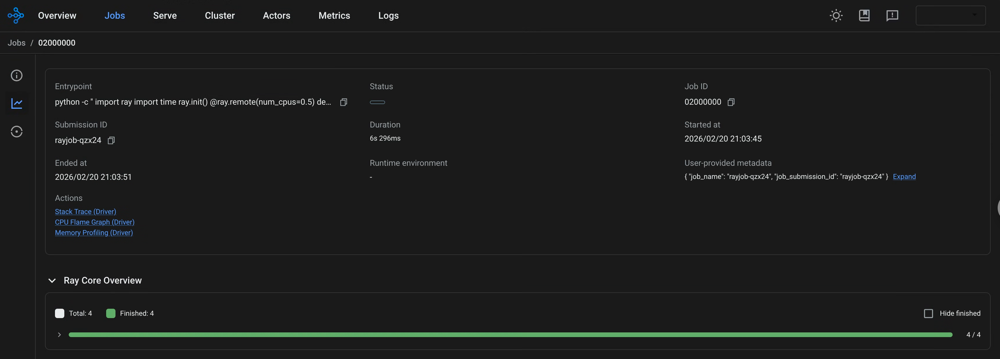
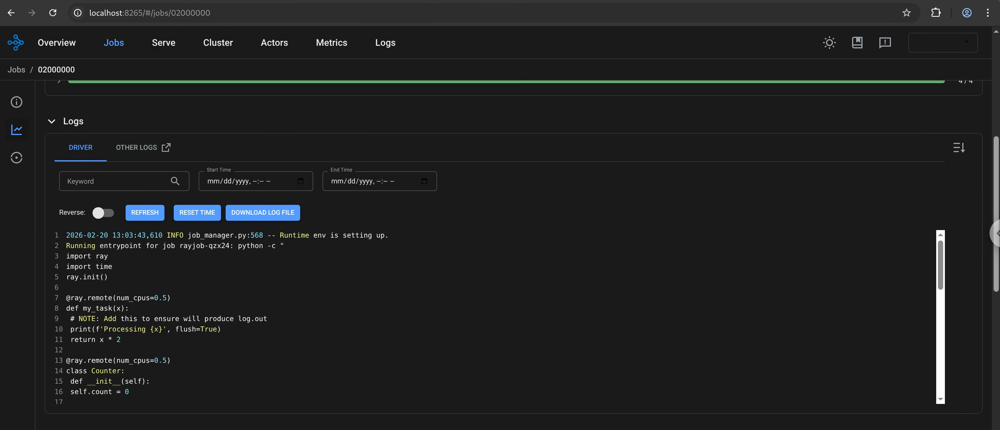

---
myst:
  html_meta:
    description: "Set up the Ray History Server with KubeRay to access logs, events, and the Ray Dashboard for RayCluster, RayJob, and RayService workloads after they terminate."
---

(kuberay-history-server)=

# Ray History Server with KubeRay

This guide covers how to set up and configure the Ray History Server with KubeRay.

The Ray History Server powers the Ray Dashboard's backend. For information about how to use the Ray Dashboard, see [Ray Dashboard](https://docs.ray.io/en/latest/ray-observability/getting-started.html).

:::{note}
The Ray History Server is in beta and ready for testing. We welcome feedback and contributions from the community.
:::

## What is the Ray History Server?

The Ray History Server is a KubeRay component for accessing and debugging Ray workload resources after they terminate. It supports `RayCluster`, `RayJob`, and `RayService`.

The Ray History Server has two parts:

1. **Collector**: runs as a sidecar container on Ray nodes and exports events and logs to object storage, compressing event streams before upload.
1. **History Server**: a standalone deployment that serves the Ray Dashboard API. It parses a stored cluster session only when you open that session, so memory use stays bounded and startup time doesn't grow with the number of stored sessions.

## Prerequisites

This guide requires the following:

* A Kubernetes cluster. This guide uses GKE and `gcloud`, but the steps apply to other Kubernetes distributions.
* [Helm](https://helm.sh/docs/intro/install/), installed and updated.
* KubeRay v1.7 or later.
* Ray 2.55 or later.

## Create a GKE cluster with Workload Identity enabled

If you don't already have a Kubernetes cluster, create a standard GKE cluster with Workload Identity enabled:

```sh
export PROJECT_ID=<PROJECT_ID>
export REGION=<REGION>
export GKE_CLUSTER_NAME=<GKE_CLUSTER_NAME>

gcloud container clusters create ${GKE_CLUSTER_NAME} \
    --region=${REGION} \
    --workload-pool=${PROJECT_ID}.svc.id.goog
```

Get cluster authentication credentials for `kubectl`:

```sh
gcloud container clusters get-credentials ${GKE_CLUSTER_NAME} --region=${REGION} --project=${PROJECT_ID}
```

## Install the KubeRay operator

Follow [Install KubeRay operator](../getting-started/kuberay-operator-installation.md#step-2-install-kuberay-operator) to install the KubeRay operator from the Helm repository.

## Configure Google Cloud Storage and Workload Identity permissions

Configure Google Cloud Storage bucket access and Workload Identity permissions for your GKE cluster. See [Create a Kubernetes service account](gke-gcs-bucket.md#create-a-kubernetes-service-account).

## Set up role-based access control (RBAC)

Create the required ClusterRole and ClusterRoleBinding for the Ray History Server components:

```sh
export NAMESPACE=default
export KSA=<KUBERNETES_SERVICE_ACCOUNT_NAME>

kubectl apply -f - <<EOF
apiVersion: rbac.authorization.k8s.io/v1
kind: ClusterRole
metadata:
  name: rayclusters-reader
rules:
- apiGroups: ["ray.io"]
  resources: ["rayclusters"]
  verbs: ["get", "list", "watch"]
---
apiVersion: rbac.authorization.k8s.io/v1
kind: ClusterRoleBinding
metadata:
  name: historyserver-sa-binding
subjects:
- kind: ServiceAccount
  name: ${KSA}
  namespace: ${NAMESPACE}
roleRef:
  kind: ClusterRole
  name: rayclusters-reader
  apiGroup: rbac.authorization.k8s.io
EOF
```

## History Server and collector images

KubeRay publishes prebuilt container images for the History Server and the collector on Quay.io:

* **History Server**: `quay.io/kuberay/historyserver:nightly`
* **Collector**: `quay.io/kuberay/collector:nightly`

To build the images from source and push them to your own registry, see [the image build and push guide](https://github.com/ray-project/kuberay/blob/master/historyserver/docs/image-build-push-guide.md).

## Deploy the History Server

Using the example provided [here](https://raw.githubusercontent.com/ray-project/kuberay/refs/heads/master/historyserver/config/historyserver-gcs.yaml), deploy a History Server that connects to Google Cloud Storage:

```sh
export GCS_BUCKET=<GCS_BUCKET>
export HISTORY_SERVER_IMAGE=quay.io/kuberay/historyserver:nightly

curl https://raw.githubusercontent.com/ray-project/kuberay/refs/heads/master/historyserver/config/historyserver-gcs.yaml | envsubst | kubectl apply -f -
```

## Deploy an example RayJob with collector sidecar

The collector runs on every RayCluster Pod, where it collects logs and events and exports them to object storage.

Create a RayJob with the collector sidecar using the [`rayjob-gcs.yaml` example manifest](https://raw.githubusercontent.com/ray-project/kuberay/refs/heads/master/historyserver/config/rayjob-gcs.yaml):

```sh
export GCS_BUCKET=<GCS_BUCKET>
export COLLECTOR_IMAGE=quay.io/kuberay/collector:nightly
export RAY_JOB=rayjob-historyserver-gcs

curl https://raw.githubusercontent.com/ray-project/kuberay/refs/heads/master/historyserver/config/rayjob-gcs.yaml | envsubst | kubectl apply -f -
```

### Environment variables in the example manifest

The preceding example manifest sets the following environment variables. They're listed here for reference:

#### Primary Ray container environment variables (event export)

To enable event streaming to the collector sidecar, set these environment variables on the primary Ray container:

* `RAY_TMP_ROOT`: Path to the shared Ray temporary directory (default `"/tmp/ray"`).
* `RAY_enable_ray_event`: Enables the Ray event export subsystem (`"true"`).
* `RAY_enable_core_worker_ray_event_to_aggregator`: Enables Core Worker event forwarding to the agent aggregator (`"true"`).
* `RAY_DASHBOARD_AGGREGATOR_AGENT_EVENTS_EXPORT_ADDR`: Target HTTP endpoint for the collector's event server, for example `"http://localhost:8084/v1/events"`.
* `RAY_DASHBOARD_AGGREGATOR_AGENT_EXPOSABLE_EVENT_TYPES`: Comma-separated list of event types to collect. The example manifest sets `"ALL"`. To narrow the set, pass a comma-separated list instead, for example `"TASK_DEFINITION_EVENT,TASK_LIFECYCLE_EVENT,ACTOR_TASK_DEFINITION_EVENT,TASK_PROFILE_EVENT,DRIVER_JOB_DEFINITION_EVENT,DRIVER_JOB_LIFECYCLE_EVENT,ACTOR_DEFINITION_EVENT,ACTOR_LIFECYCLE_EVENT,NODE_DEFINITION_EVENT,NODE_LIFECYCLE_EVENT"`.

#### Collector container variables

Configure the collector sidecar container with the following environment variables:

:::{list-table} Collector container variables
:header-rows: 1

* - Environment variable
  - CLI flag
  - Required
  - Description
* - `POD_IP`
  - 
  - Yes (all nodes)
  - IP address of the Pod, populated from `status.podIP` with the Kubernetes Downward API.
* - `FQ_RAY_IP`
  - 
  - Yes (all nodes)
  - Fully qualified domain name or service address of the Ray head node, for example `raycluster-historyserver-head-svc.default.svc.cluster.local`.
* - `RAY_TMP_ROOT`
  - 
  - Yes (all nodes)
  - Path to the shared Ray temporary directory (default `"/tmp/ray"`).
* - `GCS_BUCKET`
  - 
  - Yes (all nodes)
  - Object storage bucket or account name. For other cloud providers, use `S3_BUCKET` or `AZURE_STORAGE_ACCOUNT`.
* - `STORAGE_BACKEND`
  - `--runtime-class-name`
  - Yes (all nodes)
  - Storage backend type (`gcs`, `s3`, `azureblob`, `aliyunoss`). The `--runtime-class-name` flag is specific to the collector storage backend.
* - `RAY_ROLE`
  - `--role`
  - Yes (all nodes)
  - Node role (`"Head"` or `"Worker"`).
* - `RAY_CLUSTER_NAME`
  - `--ray-cluster-name`
  - Yes (all nodes)
  - Name of the target `RayCluster`. For a RayJob, KubeRay generates this name, so read it from the `ray.io/cluster` Pod label with the Kubernetes Downward API rather than setting it literally.
* - `RAY_DASHBOARD_ADDRESS`
  - 
  - Yes (head node)
  - URL of the local Ray Dashboard, for example `"http://localhost:8265"`. Used by the head node collector to fetch cluster metadata and poll dashboard APIs. Worker collectors don't require this.
* - `RAY_COLLECTOR_ADDITIONAL_ENDPOINTS`
  - 
  - No (head node)
  - Comma-separated list of extra Ray Dashboard API endpoints to periodically poll and store, for example `"/api/train/v2/runs/v1"`. The head collector already polls the Ray Serve, placement group, and Ray Data endpoints by default; this variable adds to that set rather than replacing it. Each path must match the History Server replay request URI exactly, query string included.
* - `RAY_COLLECTOR_POLL_INTERVAL`
  - 
  - No (head node)
  - Polling frequency interval for additional endpoints (defaults to `"30s"`).
* - `RAY_CLUSTER_NAMESPACE`
  - `--ray-cluster-namespace`
  - No
  - The namespace of the target `RayCluster` (defaults to `"default"`).
* - `OWNER_KIND`
  - 
  - No
  - Owner resource kind (`"rayjob"` or `"rayservice"`), if applicable.
* - `OWNER_NAME`
  - 
  - No
  - Owner resource name, if applicable.
* - `STORAGE_ROOT_DIR`
  - `--storage-root-dir`
  - No
  - Root path prefix inside the object storage bucket (defaults to `""`).
* - `EVENTS_PORT`
  - `--events-port`
  - No
  - Event server listening port matching the Ray container export address (defaults to `8080`). The example manifest sets this to `8084`.
:::

:::{important}
**Shared `/tmp/ray` volume**: The collector sidecar must share the `/tmp/ray` directory with the primary Ray container through a read-write `emptyDir` volume, for example `ray-logs`. The collector needs that volume to read session logs from the Ray process and to move logs from previous sessions into `/tmp/ray/prev-logs` before Ray overwrites them. Events don't use this volume. The Ray container pushes them to the collector's event server over HTTP.
:::

## Verify the deployment

### Verify Pod status

Check that the History Server and RayJob Pods are running:

```sh
kubectl get pods -o wide
```

Check the RayJob status. The entrypoint script takes about a minute to finish:

```sh
kubectl get rayjob ${RAY_JOB}
```

### Verify collector output in Google Cloud Storage

Check the collector sidecar logs to confirm that event export and session logging are active:

```sh
kubectl logs -l ray.io/node-type=head -c collector --tail=20
```

List the bucket contents to confirm session log uploads:

```sh
gcloud storage ls gs://${GCS_BUCKET}/
```

## Terminate the RayJob

Metadata and logs persist after termination, allowing for the safe deletion of the RayJob.

The `ttlSecondsAfterFinished` setting in the manifest automatically deletes the RayJob custom resource once the TTL elapses after completion. To skip the TTL wait, delete the RayJob directly:

```sh
kubectl delete rayjob ${RAY_JOB} -n ${NAMESPACE}
```

After the RayJob terminates, the collector uploads the final events and logs to object storage.

### Storage layout

The collector organizes files in object storage according to the following directory structure (if `STORAGE_ROOT_DIR` is set, paths are prefixed with that directory):

```text
gs://${GCS_BUCKET}/
├── cluster-metadata/
│   ├── raycluster/
│   │   └── <namespace>_<cluster_name>/
│   │       └── <session_name>                            # Empty marker file
│   └── <rayjob|rayservice>/
│       └── <namespace>_<owner_name>_<cluster_name>/
│           └── <session_name>
└── cluster-history/
    ├── raycluster/
    │   └── <namespace>/
    │       └── <cluster_name>/
    │           └── <session_name>/
    │               └── <node_id>/
    │                   ├── logs/
    │                   │   ├── dashboard_agent.log
    │                   │   ├── raylet.out
    │                   │   └── ...
    │                   ├── node_events/
    │                   │   └── <node_id>-<date_hour>     # Node event logs
    │                   └── job_events/
    │                       └── <job_id>/
    │                           └── <node_id>-<date_hour> # Job event logs
    └── <rayjob|rayservice>/
        └── <namespace>/
            └── <owner_name>/
                └── <cluster_name>/
                    └── <session_name>/                   # Same node layout as above
```

For `RayJob` and `RayService`, the paths carry an extra `<owner_name>` segment, and the
`cluster-metadata` directory name joins the owner name into the underscore-separated key. In this guide, `<owner_name>` is `rayjob-historyserver-gcs`, and `<cluster_name>` is the RayCluster name KubeRay generated for the job.


To list the objects in storage, run the following command:

```sh
gcloud storage ls --recursive gs://${GCS_BUCKET}
```

```text
gs://BUCKET/cluster-metadata/rayjob/NAMESPACE_rayjob-historyserver-gcs_rayjob-historyserver-gcs-lz9xt/session_2026-07-28_17-07-51_736134_1
gs://BUCKET/cluster-history/rayjob/NAMESPACE/rayjob-historyserver-gcs/rayjob-historyserver-gcs-lz9xt/session_2026-07-28_17-07-51_736134_1/0a46878b6f144cdb0ed62e9871caaeb16083547bf34acb5025832ace/logs/dashboard_agent.log
gs://BUCKET/cluster-history/rayjob/NAMESPACE/rayjob-historyserver-gcs/rayjob-historyserver-gcs-lz9xt/session_2026-07-28_17-07-51_736134_1/0a46878b6f144cdb0ed62e9871caaeb16083547bf34acb5025832ace/node_events/0a46878b6f144cdb0ed62e9871caaeb16083547bf34acb5025832ace-2026-07-28-17
gs://BUCKET/cluster-history/rayjob/NAMESPACE/rayjob-historyserver-gcs/rayjob-historyserver-gcs-lz9xt/session_2026-07-28_17-07-51_736134_1/0a46878b6f144cdb0ed62e9871caaeb16083547bf34acb5025832ace/job_events/AQAAAA==/0a46878b6f144cdb0ed62e9871caaeb16083547bf34acb5025832ace-2026-07-28-17
```

## Access a terminated RayJob from the Ray Dashboard

To view terminated Ray clusters, set up a local Ray Dashboard that uses the History Server as its backend.

### Port-forward the History Server

For the local Ray Dashboard to reach the History Server, port-forward its service:

```sh
kubectl port-forward svc/historyserver 8080:30080
```

Query the cluster list endpoint to verify the History Server API:

```sh
curl -s http://localhost:8080/clusters
```

### Start the local Ray Dashboard

Install Ray locally. Make sure to use at least Ray `v2.55`.

```sh
pip uninstall -y ray
pip install -U "ray[default]==2.55.0"
```

Run the `ray start` command:

```sh
ray start --head --num-cpus=1 --proxy-server-url=http://localhost:8080
```

Notice the `--proxy-server-url` parameter that points to the port-forwarded History Server.

### Configure RayCluster for the Ray Dashboard

The Ray Dashboard uses cookies to identify which RayCluster to look at. To select a historical cluster, first get the list of all Ray clusters and their sessions.

In your browser, list your Ray cluster sessions by navigating to the following URL:

```text
http://localhost:8265/clusters
```

The endpoint call result should look something like the following:

```json
[
 {
  "name": "rayjob-historyserver-gcs-lz9xt",
  "namespace": "default",
  "sessionName": "session_2026-07-28_17-07-51_736134_1",
  "createTime": "2026-07-28T17:07:51Z",
  "createTimeStamp": 1785258471,
  "ownerKind": "rayjob",
  "ownerName": "rayjob-historyserver-gcs"
 },
 {
  "name": "ray-cluster-hs",
  "namespace": "default",
  "sessionName": "session_2026-03-18_17-11-25_410478_1",
  "createTime": "2026-03-18T17:11:25Z",
  "createTimeStamp": 1773853885
 },
 {
  "name": "raycluster-historyserver",
  "namespace": "default",
  "sessionName": "session_2026-02-20_13-03-16_320452_1",
  "createTime": "2026-02-20T13:03:16Z",
  "createTimeStamp": 1771592596
 }
]
```

The `/enter_cluster` endpoint sets session cookies so the local Ray Dashboard knows which cluster to display. It takes the form `/enter_cluster/{namespace}/{resourceType}/{resourceName}/{session}`:

* `{namespace}`: The Kubernetes namespace of the workload, such as `default`.
* `{resourceType}`: The resource type. One of `raycluster`, `rayjob`, or `rayservice`.
* `{resourceName}`: The name of the target resource. For a RayJob or RayService, this is the owner name, not the generated RayCluster name.
* `{session}`: Optional. The session ID, such as `session_2026-07-28_17-07-51_736134_1`. Use `"latest"` for the most recent session, or `"live"` for an active cluster. Defaults to `"latest"`.

Copy a Ray cluster session and navigate to the `/enter_cluster` endpoint in your browser:

```text
http://localhost:8265/enter_cluster/default/rayjob/rayjob-historyserver-gcs/<SELECTED_SESSION_ID>
```

Alternatively, omit the session ID to automatically load the latest session using `/enter_cluster/{namespace}/{resourceType}/{resourceName}`:

```text
http://localhost:8265/enter_cluster/default/rayjob/rayjob-historyserver-gcs
```

Loading the endpoint initializes the session cookies (`cluster_name`, `cluster_namespace`, `session_name`, `owner_kind`, `owner_name`).

A successful request produces output like the following:

```json
{
 "name": "rayjob-historyserver-gcs-lz9xt",
 "namespace": "default",
 "result": "success",
 "session": "session_2026-07-28_17-07-51_736134_1"
}
```

### Cluster selection page

Alternatively, navigate to the History Server cluster selection page:

```text
http://localhost:8265/select_cluster
```

This page lists every stored cluster session with its name, namespace, status, and creation timestamp. Each row has an **Open Dashboard** button that switches the Ray Dashboard to that session.



Ray job page using Ray History Server as a backend:





## Data retention

The Ray History Server doesn't purge data or enforce a retention window, because retention requirements vary by deployment. To manage log expiration and control storage costs, configure object lifecycle policies with your cloud storage provider.

For Google Cloud Storage (GCS), see [Object Lifecycle Management](https://cloud.google.com/storage/docs/lifecycle).
