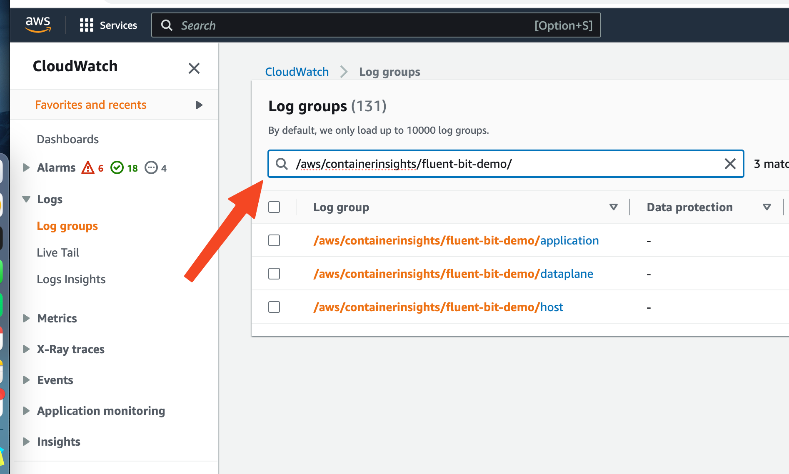
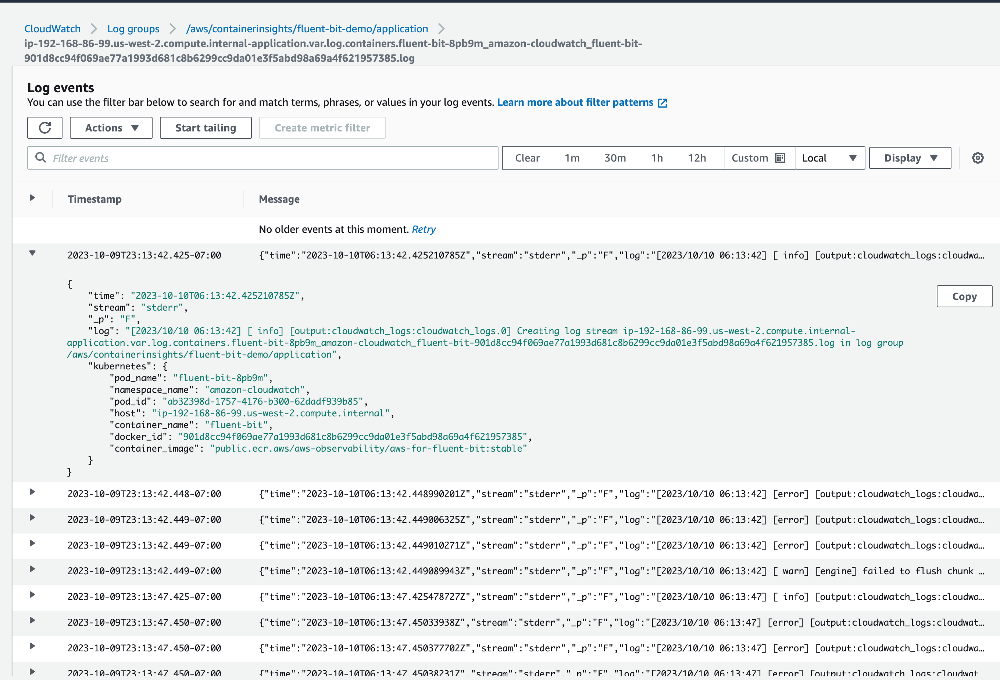

(kuberay-logging)=

# Log Persistence

Logs (both system and application logs) are useful for troubleshooting Ray applications and Clusters. For example, you may want to access system logs if a node terminates unexpectedly.

Similar to Kubernetes, Ray does not provide a native storage solution for log data. Users need to manage the lifecycle of the logs by themselves. This page provides instructions on how to collect logs from Ray Clusters that are running on Kubernetes.

:::{tip}
Skip to {ref}`the deployment instructions <kuberay-logging-tldr>`
for a sample configuration showing how to extract logs from a Ray pod.
:::

## Ray log directory
By default, Ray writes logs to files in the directory `/tmp/ray/session_*/logs` on each Ray pod's file system, including application and system logs. Learn more about the {ref}`log directory and log files <logging-directory>` and the {ref}`log rotation configuration <log-rotation>` before you start to collect the logs.

## Log processing tools
There are a number of open source log processing tools available within the Kubernetes ecosystem. This page shows how to extract Ray logs using [Fluent Bit][FluentBit].
Other popular tools include [Vector][Vector], [Fluentd][Fluentd], [Filebeat][Filebeat], and [Promtail][Promtail].

## Log collection strategies
To write collected logs to a pod's filesystem ,use one of two logging strategies:
**sidecar containers** or **daemonsets**. Read more about these logging
patterns in the [Kubernetes documentation][KubDoc].

### Sidecar containers
We provide an {ref}`example <kuberay-fluentbit>` of the sidecar strategy in this guide.
You can process logs by configuring a log-processing sidecar
for each Ray pod. Ray containers should be configured to share the `/tmp/ray`
directory with the logging sidecar via a volume mount.

You can configure the sidecar to do either of the following:
* Stream Ray logs to the sidecar's stdout.
* Export logs to an external service.

### Daemonset
Alternatively, it is possible to collect logs at the Kubernetes node level.
To do this, one deploys a log-processing daemonset onto the Kubernetes cluster's
nodes. With this strategy, it is key to mount
the Ray container's `/tmp/ray` directory to the relevant `hostPath`.

(kuberay-fluentbit)=
## Setting up logging sidecars with Fluent Bit
In this section, we give an example of how to set up log-emitting
[Fluent Bit][FluentBit] sidecars for Ray pods.

See the full config for a single-pod RayCluster with a logging sidecar [here][ConfigLink].
We now discuss this configuration and show how to deploy it.

### Configuring log processing
The first step is to create a ConfigMap with configuration
for Fluent Bit.

Here is a minimal ConfigMap which tells a Fluent Bit sidecar to
* Tail Ray logs.
* Output the logs to the container's stdout.
```{literalinclude} ../configs/ray-cluster.log.yaml
:language: yaml
:start-after: Fluent Bit ConfigMap
:end-before: ---
```
A few notes on the above config:
- In addition to streaming logs to stdout, you can use an [OUTPUT] clause to export logs to any
  [storage backend][FluentBitStorage] supported by Fluent Bit.
- The `Path_Key true` line above ensures that file names are included in the log records
  emitted by Fluent Bit.
- The `Refresh_Interval 5` line asks Fluent Bit to refresh the list of files
  in the log directory once per 5 seconds, rather than the default 60.
  The reason is that the directory `/tmp/ray/session_latest/logs/` does not exist
  initially (Ray must create it first). Setting the `Refresh_Interval` low allows us to see logs
  in the Fluent Bit container's stdout sooner.


### Adding logging sidecars to RayCluster Custom Resource (CR)

#### Adding log and config volumes
For each pod template in our RayCluster CR, we
need to add two volumes: One volume for Ray's logs
and another volume to store Fluent Bit configuration from the ConfigMap
applied above.
```{literalinclude} ../configs/ray-cluster.log.yaml
:language: yaml
:start-after: Log and config volumes
```

#### Mounting the Ray log directory
Add the following volume mount to the Ray container's configuration.
```{literalinclude} ../configs/ray-cluster.log.yaml
:language: yaml
:start-after: Share logs with Fluent Bit
:end-before: Fluent Bit sidecar
```

#### Adding the Fluent Bit sidecar
Finally, add the Fluent Bit sidecar container to each Ray pod config
in your RayCluster CR.
```{literalinclude} ../configs/ray-cluster.log.yaml
:language: yaml
:start-after: Fluent Bit sidecar
:end-before: Log and config volumes
```
Mounting the `ray-logs` volume gives the sidecar container access to Ray's logs.
The <nobr>`fluentbit-config`</nobr> volume gives the sidecar access to logging configuration.

#### Putting everything together
Putting all of the above elements together, we have the following yaml configuration
for a single-pod RayCluster will a log-processing sidecar.
```{literalinclude} ../configs/ray-cluster.log.yaml
:language: yaml
```

(kuberay-logging-tldr)=
### Deploying a RayCluster with logging sidecar


To deploy the configuration described above, deploy the KubeRay Operator if you haven't yet:
Refer to the {ref}`Getting Started guide <kuberay-operator-deploy>`
for instructions on this step.

Now, run the following commands to deploy the Fluent Bit ConfigMap and a single-pod RayCluster with
a Fluent Bit sidecar.
```shell
kubectl apply -f https://raw.githubusercontent.com/ray-project/ray/releases/2.4.0/doc/source/cluster/kubernetes/configs/ray-cluster.log.yaml
```

Determine the Ray pod's name with
```shell
kubectl get pod | grep raycluster-complete-logs
```

Examine the FluentBit sidecar's STDOUT to see logs for Ray's component processes.
```shell
# Substitute the name of your Ray pod.
kubectl logs raycluster-complete-logs-head-xxxxx -c fluentbit
```

(kuberay-fluentbit-ds)=
## Set up logging on a DaemonSet with Fluent Bit

Fluent Bit is a lightweight agent that allows you to collect logs from your Kubernetes cluster and send them to a variety of destinations such as Elasticsearch, CloudWatch, S3, etc.
The following steps set up [Fluent Bit][FluentBit] as a DaemonSet to send logs to CloudWatch Logs.

### Setup for AWS EKS

Create an Amazon EKS cluster named `fluent-bit-demo` in `us-west-2` region using `eksctl`, as shown in the [EKS docs](https://docs.aws.amazon.com/eks/latest/userguide/getting-started-eksctl.html).

```shell
eksctl create cluster --name fluent-bit-demo --region us-west-2
```

View your cluster nodes:
```shell
$ kubectl get nodes -o wide
NAME                                          STATUS   ROLES    AGE    VERSION               INTERNAL-IP     EXTERNAL-IP      OS-IMAGE         KERNEL-VERSION                  CONTAINER-RUNTIME
ip-192-168-59-62.us-west-2.compute.internal   Ready    <none>   157m   v1.27.5-eks-43840fb   192.168.59.62   54.190.144.241   Amazon Linux 2   5.10.192-183.736.amzn2.x86_64   containerd://1.6.19
ip-192-168-86-99.us-west-2.compute.internal   Ready    <none>   157m   v1.27.5-eks-43840fb   192.168.86.99   34.219.16.107    Amazon Linux 2   5.10.192-183.736.amzn2.x86_64   containerd://1.6.19
```

EKS cluster nodes need to have access to CloudWatch Logs for Fluent Bit.
Attach the `CloudWatchLogsFullAccess` policy to the IAM role that is attached to the cluster nodes:

```shell
ROLE_NAME=$(eksctl get nodegroup --cluster fluent-bit-demo --region us-west-2 -o json | jq -r '.[].NodeInstanceRoleARN' | cut -f2 -d/)

aws iam attach-role-policy \
  --role-name $ROLE_NAME \
  --policy-arn arn:aws:iam::aws:policy/CloudWatchLogsFullAccess
```

### Deploy Fluent Bit DaemonSet

If you don't already have a namespace called `amazon-cloudwatch`, create one by entering the following command:

```bash
kubectl apply -f https://raw.githubusercontent.com/aws-samples/amazon-cloudwatch-container-insights/latest/k8s-deployment-manifest-templates/deployment-mode/daemonset/container-insights-monitoring/cloudwatch-namespace.yaml
```

Run the following command to create a ConfigMap named `cluster-info` with the cluster name and the Region to send logs to:

```shell
ClusterName=fluent-bit-demo
RegionName=us-west-2  
FluentBitHttpPort='2020'
FluentBitReadFromHead='Off'
[[ ${FluentBitReadFromHead} = 'On' ]] && FluentBitReadFromTail='Off'|| FluentBitReadFromTail='On'
[[ -z ${FluentBitHttpPort} ]] && FluentBitHttpServer='Off' || FluentBitHttpServer='On'
kubectl create configmap fluent-bit-cluster-info \
    --from-literal=cluster.name=${ClusterName} \
    --from-literal=http.server=${FluentBitHttpServer} \
    --from-literal=http.port=${FluentBitHttpPort} \
    --from-literal=read.head=${FluentBitReadFromHead} \
    --from-literal=read.tail=${FluentBitReadFromTail} \
    --from-literal=logs.region=${RegionName} -n amazon-cloudwatch
```

Deploy the Fluent Bit DaemonSet to the cluster by running the following commands:

```shell
kubectl apply -f https://raw.githubusercontent.com/aws-samples/amazon-cloudwatch-container-insights/latest/k8s-deployment-manifest-templates/deployment-mode/daemonset/container-insights-monitoring/fluent-bit/fluent-bit.yaml
```

Validate whether you successfully deployed Fluent Bit by entering the following command:

```shell
kubectl -n amazon-cloudwatch logs ds/fluent-bit
```

Verify that the command created log groups:

```shell
...
[2023/10/10 06:13:55] [ info] [output:cloudwatch_logs:cloudwatch_logs.0] Created log group /aws/containerinsights/fluent-bit-demo/application
[2023/10/10 06:13:57] [ info] [output:cloudwatch_logs:cloudwatch_logs.2] Created log group /aws/containerinsights/fluent-bit-demo/host
[2023/10/10 06:13:57] [ info] [output:cloudwatch_logs:cloudwatch_logs.1] Created log group /aws/containerinsights/fluent-bit-demo/dataplane
...
```

### Check the CloudWatch dashboard

Finally, check the CloudWatch dashboard to see the logs.
Open the CLoudWatch console at https://console.aws.amazon.com/cloudwatch/.

Type `/aws/containerinsights/fluent-bit-demo/` in the search box.



Select `/aws/containerinsights/fluent-bit-demo/application`. You should see the logs from the application pods including Ray.

Under the log streams, click any log stream. You should see the logs from the pods:



You can specify filters based on pod name, namespace, etc.
Learn how to write filters in this [filter pattern syntax doc](https://docs.aws.amazon.com/AmazonCloudWatch/latest/logs/FilterAndPatternSyntax.html#matching-terms-events).

[Vector]: https://vector.dev/
[FluentBit]: https://docs.fluentbit.io/manual
[FluentBitStorage]: https://docs.fluentbit.io/manual
[Filebeat]: https://www.elastic.co/guide/en/beats/filebeat/7.17/index.html
[Fluentd]: https://docs.fluentd.org/
[Promtail]: https://grafana.com/docs/loki/latest/clients/promtail/
[KubDoc]: https://kubernetes.io/docs/concepts/cluster-administration/logging/
[ConfigLink]: https://raw.githubusercontent.com/ray-project/ray/releases/2.4.0/doc/source/cluster/kubernetes/configs/ray-cluster.log.yaml

(redirect-to-stderr)=
## Redirecting Ray logs to stderr

By default, Ray writes logs to files in the `/tmp/ray/session_*/logs` directory.
If your log processing tool is capable of capturing log records written to stderr, you can redirect Ray logs to the stderr stream of Ray containers by setting the environment variable `RAY_LOG_TO_STDERR=1` on all Ray nodes.

```{admonition} Alert: this practice isn't recommended.
:class: caution

If `RAY_LOG_TO_STDERR=1` is set, Ray doesn't write logs to files.
Consequently, this behavior can cause some Ray features that rely on log files to malfunction.
For instance, {ref}`worker log redirection to driver <log-redirection-to-driver>` doesn't work if you redirect Ray logs to stderr.
If you need these features, consider using the {ref}`Fluent Bit solution <kuberay-fluentbit>` mentioned above.
For clusters on VMs, don't redirect logs to stderr. Instead, follow {ref}`this guide <vm-logging>` to persist logs.
```

Redirecting logging to stderr also prepends a `({component})` prefix, for example, `(raylet)`, to each log record message.

```bash
[2022-01-24 19:42:02,978 I 1829336 1829336] (gcs_server) grpc_server.cc:103: GcsServer server started, listening on port 50009.
[2022-01-24 19:42:06,696 I 1829415 1829415] (raylet) grpc_server.cc:103: ObjectManager server started, listening on port 40545.
2022-01-24 19:42:05,087 INFO (dashboard) dashboard.py:95 -- Setup static dir for dashboard: /mnt/data/workspace/ray/python/ray/dashboard/client/build
2022-01-24 19:42:07,500 INFO (dashboard_agent) agent.py:105 -- Dashboard agent grpc address: 0.0.0.0:49228
```

These prefixes allow you to filter the stderr stream of logs by the component of interest. Note, however, that multi-line log records **don't** have this component marker at the beginning of each line.

Follow the steps below to set the environment variable ``RAY_LOG_TO_STDERR=1`` on all Ray nodes

  ::::{tab-set}

  :::{tab-item} Single-node local cluster
  **Start the cluster explicitly with CLI** <br/>
  ```bash
  env RAY_LOG_TO_STDERR=1 ray start
  ```

  **Start the cluster implicitly with `ray.init`** <br/>
  ```python
  os.environ["RAY_LOG_TO_STDERR"] = "1"
  ray.init()
  ```
  :::

  :::{tab-item} KubeRay
  Set the `RAY_LOG_TO_STDERR` environment variable to `1` in the Ray container of each Ray Pod.
  Use this [example YAML file](https://gist.github.com/kevin85421/3d676abae29ebd5677428ddbbd4c8d74) as a reference.
  :::


  ::::


