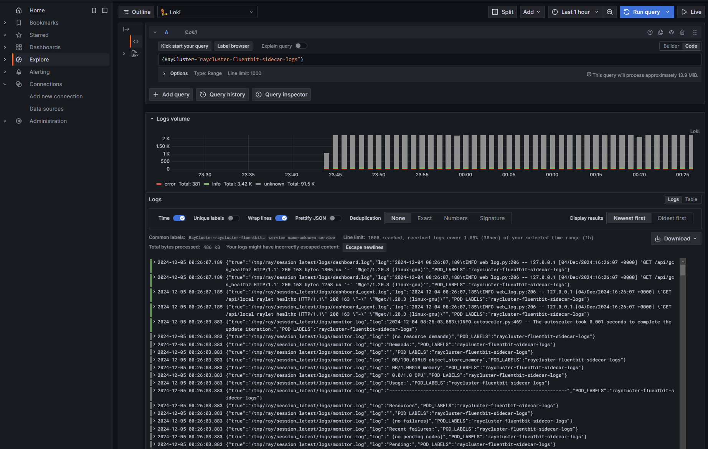

(persist-kuberay-custom-resource-logs)=

# Persist KubeRay custom resource logs

Logs (both system and application logs) are useful for troubleshooting Ray applications and Clusters. For example, you may want to access system logs if a node terminates unexpectedly.

Similar to Kubernetes, Ray does not provide a native storage solution for log data. Users need to manage the lifecycle of the logs by themselves. This page provides instructions on how to collect logs from Ray Clusters that are running on Kubernetes.

## Ray log directory
By default, Ray writes logs to files in the directory `/tmp/ray/session_*/logs` on each Ray pod's file system, including application and system logs. Learn more about the {ref}`log directory and log files <logging-directory>` and the {ref}`log rotation configuration <log-rotation>` before you start to collect the logs.

## Log processing tools
There are a number of open source log processing tools available within the Kubernetes ecosystem. This page shows how to extract Ray logs using [Fluent Bit][FluentBit].
Other popular tools include [Vector][Vector], [Fluentd][Fluentd], [Filebeat][Filebeat], and [Promtail][Promtail].

## Log collection strategies
To write collected logs to a pod's filesystem ,use one of two logging strategies:
**sidecar containers** or **daemonsets**. Read more about these logging
patterns in the [Kubernetes documentation][KubDoc].

### Sidecar containers
We provide an {ref}`example <kuberay-fluentbit>` of the sidecar strategy in this guide.
You can process logs by configuring a log-processing sidecar
for each Ray pod. Ray containers should be configured to share the `/tmp/ray`
directory with the logging sidecar via a volume mount.

You can configure the sidecar to do either of the following:
* Stream Ray logs to the sidecar's stdout.
* Export logs to an external service.

### Daemonset
Alternatively, it is possible to collect logs at the Kubernetes node level.
To do this, one deploys a log-processing daemonset onto the Kubernetes cluster's
nodes. With this strategy, it is key to mount
the Ray container's `/tmp/ray` directory to the relevant `hostPath`.

(kuberay-fluentbit)=
## Setting up logging sidecars with Fluent Bit
In this section, we give an example of how to set up log-emitting
[Fluent Bit][FluentBit] sidecars for Ray pods to send logs to [Grafana Loki][GrafanaLoki], enabling centralized log management and querying.

See the full config for a single-pod RayCluster with a logging sidecar [here][ConfigLink].
We now discuss this configuration and show how to deploy it.

### Deploy Loki monolithic mode

Follow [Deploy Loki monolithic mode](deploy-loki-monolithic-mode) to deploy Grafana Loki in monolithic mode.

### Deploy Grafana

Follow [Deploy Grafana](deploy-grafana) to set up Grafana Loki datasource and deploy Grafana.

### Configuring log processing
The first step is to create a ConfigMap with configuration
for Fluent Bit.

The following ConfigMap example configures a Fluent Bit sidecar to:
* Tail Ray logs.
* Send logs to a Grafana Loki endpoint.
* Add metadata to the logs for filtering by labels, for example, `RayCluster`.

```yaml
apiVersion: v1
kind: ConfigMap
metadata:
  name: fluentbit-config
data:
  fluent-bit.conf: |
    [INPUT]
        Name tail
        Path /tmp/ray/session_latest/logs/*
        Tag ray
        Path_Key true
        Refresh_Interval 5
    [FILTER]
        Name modify
        Match ray
        Add POD_LABELS ${POD_LABELS}
    [OUTPUT]
        Name loki
        Match *
        Host loki-gateway
        Port 80
        Labels RayCluster=${POD_LABELS}
        tenant_id test
```

A few notes on the above config:
- The `Path_Key true` line above ensures that file names are included in the log records
  emitted by Fluent Bit.
- The `Refresh_Interval 5` line asks Fluent Bit to refresh the list of files
  in the log directory once per 5 seconds, rather than the default 60.
  The reason is that the directory `/tmp/ray/session_latest/logs/` does not exist
  initially (Ray must create it first). Setting the `Refresh_Interval` low allows us to see logs
  in the Fluent Bit container's stdout sooner.
- The [Kubernetes downward API][KubernetesDownwardAPI] populates the `POD_LABELS` variable used in the `FILTER` section. It pulls the label from the pod's metadata label `ray.io/cluster`, which is defined in the Fluent Bit sidecar container's environment.
- The `tenant_id` field allows you to assign logs to different tenants. In this example, Fluent Bit sidecar sends the logs to the `test` tenant. You can adjust this configuration to match the tenant ID set up in your Grafana Loki instance, enabling multi-tenancy support in Grafana.


### Adding logging sidecars to RayCluster Custom Resource (CR)

#### Adding log and config volumes
For each pod template in our RayCluster CR, we
need to add two volumes: One volume for Ray's logs
and another volume to store Fluent Bit configuration from the ConfigMap
applied above.

```yaml
        volumes:
        - name: ray-logs
          emptyDir: {}
        - name: fluentbit-config
          configMap:
            name: fluentbit-config
```

#### Mounting the Ray log directory
Add the following volume mount to the Ray container's configuration.

```yaml
          volumeMounts:
          - mountPath: /tmp/ray
            name: ray-logs
```

#### Adding the Fluent Bit sidecar
Finally, add the Fluent Bit sidecar container to each Ray pod config
in your RayCluster CR.

```yaml
        - name: fluentbit
          image: fluent/fluent-bit:3.2.2
          # Get Kubernetes metadata via downward API
          env:
          - name: POD_LABELS
            valueFrom:
              fieldRef:
                fieldPath: metadata.labels['ray.io/cluster']
          # These resource requests for Fluent Bit should be sufficient in production.
          resources:
            requests:
              cpu: 100m
              memory: 128Mi
            limits:
              cpu: 100m
              memory: 128Mi
          volumeMounts:
          - mountPath: /tmp/ray
            name: ray-logs
          - mountPath: /fluent-bit/etc/fluent-bit.conf
            subPath: fluent-bit.conf
            name: fluentbit-config
```

Mounting the `ray-logs` volume gives the sidecar container access to Ray's logs.
The <nobr>`fluentbit-config`</nobr> volume gives the sidecar access to logging configuration.

#### Putting everything together
Putting all of the above elements together, we have the following yaml configuration
for a single-pod RayCluster will a log-processing sidecar.

```yaml
# Fluent Bit ConfigMap
apiVersion: v1
kind: ConfigMap
metadata:
  name: fluentbit-config
data:
  fluent-bit.conf: |
    [INPUT]
        Name tail
        Path /tmp/ray/session_latest/logs/*
        Tag ray
        Path_Key true
        Refresh_Interval 5
    [FILTER]
        Name modify
        Match ray
        Add POD_LABELS ${POD_LABELS}
    [OUTPUT]
        Name loki
        Match *
        Host loki-gateway
        Port 80
        Labels RayCluster=${POD_LABELS}
        tenant_id test
---
# RayCluster CR with a FluentBit sidecar
apiVersion: ray.io/v1
kind: RayCluster
metadata:
  name: raycluster-fluentbit-sidecar-logs
spec:
  rayVersion: '2.9.0'
  headGroupSpec:
    rayStartParams: {}
    template:
      spec:
        containers:
        - name: ray-head
          image: rayproject/ray:2.9.0
          # This config is meant for demonstration purposes only.
          # Use larger Ray containers in production!
          resources:
            limits:
              cpu: 1
              memory: 2Gi
            requests:
              cpu: 500m
              memory: 1Gi
          # Share logs with Fluent Bit
          volumeMounts:
          - mountPath: /tmp/ray
            name: ray-logs
        # Fluent Bit sidecar
        - name: fluentbit
          image: fluent/fluent-bit:3.2.2
          # Get Kubernetes metadata via downward API
          env:
          - name: POD_LABELS
            valueFrom:
              fieldRef:
                fieldPath: metadata.labels['ray.io/cluster']
          # These resource requests for Fluent Bit should be sufficient in production.
          resources:
            requests:
              cpu: 100m
              memory: 128Mi
            limits:
              cpu: 100m
              memory: 128Mi
          volumeMounts:
          - mountPath: /tmp/ray
            name: ray-logs
          - mountPath: /fluent-bit/etc/fluent-bit.conf
            subPath: fluent-bit.conf
            name: fluentbit-config
        # Log and config volumes
        volumes:
        - name: ray-logs
          emptyDir: {}
        - name: fluentbit-config
          configMap:
            name: fluentbit-config

```

### Deploying a RayCluster with logging sidecar

To deploy the configuration described above, deploy the KubeRay Operator if you haven't yet:
Refer to the {ref}`Getting Started guide <kuberay-operator-deploy>`
for instructions on this step.

Now, run the following commands to deploy the Fluent Bit ConfigMap and a single-pod RayCluster with
a Fluent Bit sidecar.
```shell
kubectl apply -f https://raw.githubusercontent.com/ray-project/kuberay/refs/heads/master/ray-operator/config/samples/ray-cluster-fluentbit-sidecar.yaml
```

To access Grafana from your local machine, set up port forwarding by running:
```shell
export POD_NAME=$(kubectl get pods --namespace default -l "app.kubernetes.io/name=grafana,app.kubernetes.io/instance=grafana" -o jsonpath="{.items[0].metadata.name}")
kubectl --namespace default port-forward $POD_NAME 3000
```

This command makes Grafana available locally at `http://localhost:3000`.

* Username: "admin"
* Password: Get the password using the following command:

```shell
kubectl get secret --namespace default grafana -o jsonpath="{.data.admin-password}" | base64 --decode ; echo
```

Finally, use a LogQL query to view logs for a specific RayCluster or RayJob, and filter by `RayCluster`, as set in the FluentBit ConfigMap OUTPUT configuration in this example.
```shell
{RayCluster="raycluster-fluentbit-sidecar-logs"}
```


[Vector]: https://vector.dev/
[FluentBit]: https://docs.fluentbit.io/manual
[FluentBitStorage]: https://docs.fluentbit.io/manual
[Filebeat]: https://www.elastic.co/guide/en/beats/filebeat/7.17/index.html
[Fluentd]: https://docs.fluentd.org/
[Promtail]: https://grafana.com/docs/loki/latest/clients/promtail/
[GrafanaLoki]: https://grafana.com/oss/loki/
[KubDoc]: https://kubernetes.io/docs/concepts/cluster-administration/logging/
[ConfigLink]: https://raw.githubusercontent.com/ray-project/ray/releases/2.4.0/doc/source/cluster/kubernetes/configs/ray-cluster.log.yaml
[KubernetesDownwardAPI]: https://kubernetes.io/docs/concepts/workloads/pods/downward-api/

(redirect-to-stderr)=
## Redirecting Ray logs to stderr

By default, Ray writes logs to files in the `/tmp/ray/session_*/logs` directory.
If your log processing tool is capable of capturing log records written to stderr, you can redirect Ray logs to the stderr stream of Ray containers by setting the environment variable `RAY_LOG_TO_STDERR=1` on all Ray nodes.

```{admonition} Alert: this practice isn't recommended.
:class: caution

If `RAY_LOG_TO_STDERR=1` is set, Ray doesn't write logs to files.
Consequently, this behavior can cause some Ray features that rely on log files to malfunction.
For instance, {ref}`worker log redirection to driver <log-redirection-to-driver>` doesn't work if you redirect Ray logs to stderr.
If you need these features, consider using the {ref}`Fluent Bit solution <kuberay-fluentbit>` mentioned above.
For clusters on VMs, don't redirect logs to stderr. Instead, follow {ref}`this guide <vm-logging>` to persist logs.
```

Redirecting logging to stderr also prepends a `({component})` prefix, for example, `(raylet)`, to each log record message.

```bash
[2022-01-24 19:42:02,978 I 1829336 1829336] (gcs_server) grpc_server.cc:103: GcsServer server started, listening on port 50009.
[2022-01-24 19:42:06,696 I 1829415 1829415] (raylet) grpc_server.cc:103: ObjectManager server started, listening on port 40545.
2022-01-24 19:42:05,087 INFO (dashboard) dashboard.py:95 -- Setup static dir for dashboard: /mnt/data/workspace/ray/python/ray/dashboard/client/build
2022-01-24 19:42:07,500 INFO (dashboard_agent) agent.py:105 -- Dashboard agent grpc address: 0.0.0.0:49228
```

These prefixes allow you to filter the stderr stream of logs by the component of interest. Note, however, that multi-line log records **don't** have this component marker at the beginning of each line.

Follow the steps below to set the environment variable ``RAY_LOG_TO_STDERR=1`` on all Ray nodes

  ::::{tab-set}

  :::{tab-item} Single-node local cluster
  **Start the cluster explicitly with CLI** <br/>
  ```bash
  env RAY_LOG_TO_STDERR=1 ray start
  ```

  **Start the cluster implicitly with `ray.init`** <br/>
  ```python
  os.environ["RAY_LOG_TO_STDERR"] = "1"
  ray.init()
  ```
  :::

  :::{tab-item} KubeRay
  Set the `RAY_LOG_TO_STDERR` environment variable to `1` in the Ray container of each Ray Pod.
  Use this [example YAML file](https://gist.github.com/kevin85421/3d676abae29ebd5677428ddbbd4c8d74) as a reference.
  :::


  ::::
