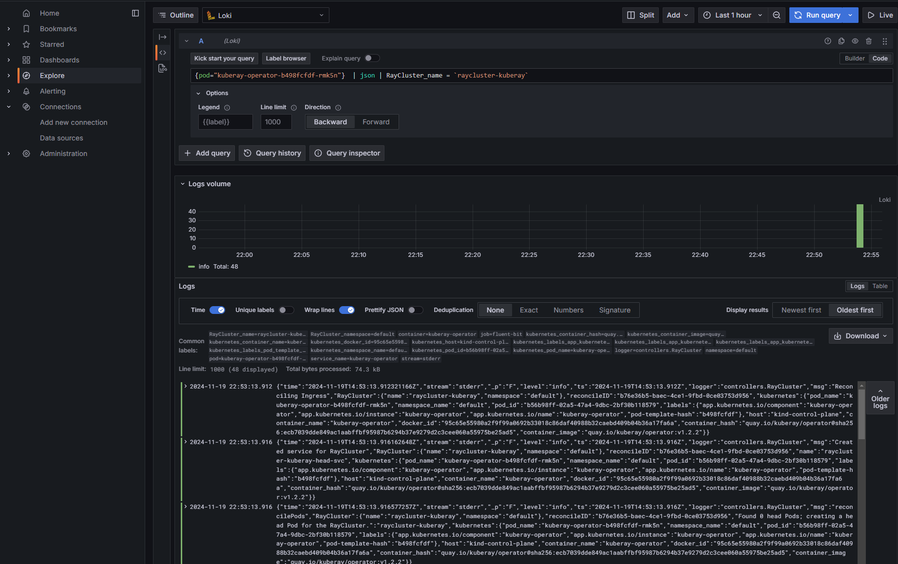

(persist-kuberay-operator-logs)=

# Persist KubeRay Operator Logs

The KubeRay Operator plays a vital role in managing Ray clusters on Kubernetes. Persisting its logs is essential for effective troubleshooting and monitoring. This guide describes methods to set up centralized logging for KubeRay Operator logs.

## Grafana Loki

[Grafana Loki][GrafanaLoki] is a log aggregation system optimized for Kubernetes, providing efficient log storage and querying. The following steps set up [Fluent Bit][FluentBit] as a DaemonSet to collect logs from Kubernetes containers and send them to Loki for centralized storage and analysis.

(deploy-loki-monolithic-mode)=
### Deploy Loki monolithic mode

Loki’s Helm chart supports three deployment methods to fit different scalability and performance needs: Monolithic, Simple Scalable, and Microservices. This guide demonstrates the monolithic method. For details on each deployment mode, see the [Loki deployment](https://grafana.com/docs/loki/latest/get-started/deployment-modes/) modes documentation.

Deploy the Loki deployment with the [Helm chart repository](https://github.com/grafana/loki/tree/main/production/helm/loki).

```shell
helm repo add grafana https://grafana.github.io/helm-charts
helm repo update

# Install Loki with single replica mode
helm install loki grafana/loki --version 6.21.0 -f https://raw.githubusercontent.com/grafana/loki/refs/heads/main/production/helm/loki/single-binary-values.yaml
```

### Configure log processing

Create a `fluent-bit-config.yaml` file, which configures Fluent Bit to:

* Tail log files from Kubernetes containers.
* Parse multi-line logs for Docker and Container Runtime Interface (CRI) formats.
* Enrich logs with Kubernetes metadata such as namespace, pod, and container names.
* Send the logs to Loki for centralized storage and querying.
```{literalinclude} ../configs/loki.log.yaml
:language: yaml
:start-after: Fluent Bit Config
:end-before: ---
```

A few notes on the above config:

* Inputs: The `tail` input reads log files from `/var/log/containers/*.log`, with `multiline.parser` to handle complex log messages across multiple lines.
* Filters: The `kubernetes` filter adds metadata like namespace, pod, and container names to each log, enabling more efficient log management and querying in Loki.
* Outputs: The `loki` output block specifies Loki as the target. The `Host` and `Port` define the Loki service endpoint, and `Labels` adds metadata for easier querying in Grafana. Additionally, `tenant_id` allows for multi-tenancy if required by the Loki setup.

Deploy the Fluent Bit deployment with the [Helm chart repository](https://github.com/fluent/helm-charts/tree/main/charts/fluent-bit).

```shell
helm repo add fluent https://fluent.github.io/helm-charts
helm repo update

helm install fluent-bit fluent/fluent-bit --version 0.48.2 -f fluent-bit-config.yaml
```

### Install the KubeRay Operator

Follow [Deploy a KubeRay operator](kuberay-operator-deploy) to install the KubeRay operator.


### Deploy a RayCluster

Follow [Deploy a RayCluster custom resource](raycluster-deploy) to deploy a RayCluster.

(deploy-grafana)=
### Deploy Grafana

Create a `datasource-config.yaml` file with the following configuration to set up Grafana's Loki datasource:
```{literalinclude} ../configs/loki.log.yaml
:language: yaml
:start-after: Grafana Datasource Config
```

Deploy the Grafana deployment with the [Helm chart repository](https://github.com/grafana/helm-charts/tree/main/charts/grafana).

```shell
helm repo add grafana https://grafana.github.io/helm-charts
helm repo update

helm install grafana grafana/grafana --version 8.6.2 -f datasource-config.yaml
```

### Check the Grafana Dashboard

```shell
# Verify that the Grafana pod is running in the `default` namespace.
kubectl get pods --namespace default -l "app.kubernetes.io/name=grafana"
# NAME                       READY   STATUS    RESTARTS   AGE
# grafana-54d5d747fd-5fldc   1/1     Running   0          8m21s
```

To access Grafana from your local machine, set up port forwarding by running:
```shell
export POD_NAME=$(kubectl get pods --namespace default -l "app.kubernetes.io/name=grafana,app.kubernetes.io/instance=grafana" -o jsonpath="{.items[0].metadata.name}")
kubectl --namespace default port-forward $POD_NAME 3000
```

This command makes Grafana available locally at `http://localhost:3000`.

* Username: "admin"
* Password: Get the password using the following command:

```shell
kubectl get secret --namespace default grafana -o jsonpath="{.data.admin-password}" | base64 --decode ; echo
```

Finally, use a LogQL query to view logs for a specific pod, such as the KubeRay Operator, and filter logs by the `RayCluster_name`:

```
{pod="kuberay-operator-xxxxxxxx-xxxxx"} | json | RayCluster_name = `raycluster-kuberay`
```



You can use LogQL's JSON syntax to filter logs based on specific fields, such as `RayCluster_name`. See  [Log query language doc](https://grafana.com/docs/loki/latest/query/) for more information about LogQL filtering.

[GrafanaLoki]: https://grafana.com/oss/loki/
[FluentBit]: https://docs.fluentbit.io/manual
