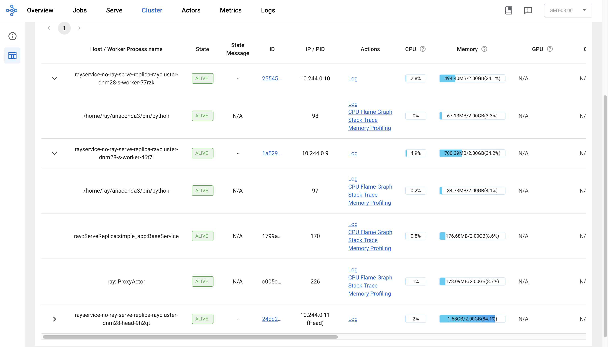

(kuberay-rayservice-no-ray-serve-replica)=

# RayService worker Pods aren't ready

This guide explores a specific scenario in KubeRay's RayService API where a Ray worker Pod remains in an unready state due to the absence of a Ray Serve replica.

To better understand this section, you should be familiar with the following Ray Serve components: 
the [Ray Serve replica and ProxyActor](https://docs.ray.io/en/latest/serve/architecture.html#high-level-view).

ProxyActor is responsible for forwarding incoming requests to the corresponding Ray Serve replicas. 
Hence, if a Ray Pod without a running ProxyActor receives requests, those requests will fail.
KubeRay's readiness probe fails, rendering the Pods unready and preventing ProxyActor from sending requests to them.

The default behavior of Ray Serve only creates ProxyActor on Ray Pods with running Ray Serve replicas.
To illustrate, the following example serves one simple Ray Serve app using RayService.


## Step 1: Create a Kubernetes cluster with Kind

```sh
kind create cluster --image=kindest/node:v1.26.0
```

## Step 2: Install the KubeRay operator

Follow [this document](kuberay-operator-deploy) to install the latest stable KubeRay operator using Helm repository.

## Step 3: Install a RayService

```sh
curl -O https://raw.githubusercontent.com/ray-project/kuberay/master/ray-operator/config/samples/ray-service.no-ray-serve-replica.yaml
kubectl apply -f ray-service.no-ray-serve-replica.yaml
```

Look at the Ray Serve configuration `serveConfigV2` embedded in the RayService YAML. Notice the only deployment in `deployments` of the application named `simple_app`:
  * `num_replicas`: Controls the number of replicas, that handle requests to this deployment, to run. Initialize to 1 to ensure the overall number of the Ray Serve replicas is 1.
  * `max_replicas_per_node`: Controls the maximum number of replicas on a single pod.  

See [Ray Serve Documentation](https://docs.ray.io/en/master/serve/configure-serve-deployment.html) for more details.
```yaml
serveConfigV2: |
  applications:
    - name: simple_app
      import_path: ray-operator.config.samples.ray-serve.single_deployment_dag:DagNode
      route_prefix: /basic
      runtime_env:
        working_dir: "https://github.com/ray-project/kuberay/archive/master.zip"
      deployments:
        - name: BaseService
          num_replicas: 1
          max_replicas_per_node: 1
          ray_actor_options:
            num_cpus: 0.1
```

Look at the head Pod configuration `rayClusterConfig:headGroupSpec` embedded in the RayService YAML.  
The configuration sets the CPU resources for the head Pod to 0 by passing the option `num-cpus: "0"` to `rayStartParams`. This setup avoids Ray Serve replicas running on the head Pod.
See [rayStartParams](https://github.com/ray-project/kuberay/blob/master/docs/guidance/rayStartParams.md) for more details.  
```sh
headGroupSpec:
  rayStartParams:
    num-cpus: "0"
  template: ...
```

## Step 4: Why 1 worker Pod isn't ready?

```sh
# Step 4.1: Wait until the RayService is ready to serve requests.
kubectl describe rayservices.ray.io rayservice-no-ray-serve-replica

# [Example output]
#  Conditions:
#    Last Transition Time:  2025-03-18T14:14:43Z
#    Message:               Number of serve endpoints is greater than 0
#    Observed Generation:   1
#    Reason:                NonZeroServeEndpoints
#    Status:                True
#    Type:                  Ready
#    Last Transition Time:  2025-03-18T14:12:03Z
#    Message:               Active Ray cluster exists and no pending Ray cluster
#    Observed Generation:   1
#    Reason:                NoPendingCluster
#    Status:                False
#    Type:                  UpgradeInProgress

# Step 4.2: List all Ray Pods in the `default` namespace.
kubectl get pods -l=ray.io/is-ray-node=yes

# [Example output]
# NAME                                                              READY   STATUS    RESTARTS   AGE
# rayservice-no-ray-serve-replica-raycluster-dnm28-head-9h2qt       1/1     Running   0          2m21s
# rayservice-no-ray-serve-replica-raycluster-dnm28-s-worker-46t7l   1/1     Running   0          2m21s
# rayservice-no-ray-serve-replica-raycluster-dnm28-s-worker-77rzk   0/1     Running   0          2m20s

# Step 4.3: Check unready worker pod events
kubectl describe pods {YOUR_UNREADY_WORKER_POD_NAME}

# [Example output]
# Events:
#   Type     Reason     Age                   From               Message
#   ----     ------     ----                  ----               -------
#   Normal   Scheduled  3m4s                  default-scheduler  Successfully assigned default/rayservice-no-ray-serve-replica-raycluster-dnm28-s-worker-77rzk to kind-control-plane
#   Normal   Pulled     3m3s                  kubelet            Container image "rayproject/ray:2.46.0" already present on machine
#   Normal   Created    3m3s                  kubelet            Created container wait-gcs-ready
#   Normal   Started    3m3s                  kubelet            Started container wait-gcs-ready
#   Normal   Pulled     2m57s                 kubelet            Container image "rayproject/ray:2.46.0" already present on machine
#   Normal   Created    2m57s                 kubelet            Created container ray-worker
#   Normal   Started    2m57s                 kubelet            Started container ray-worker
#   Warning  Unhealthy  78s (x19 over 2m43s)  kubelet            Readiness probe failed: success
```

Look at the output of Step 4.2. One worker Pod is running and ready, while the other is running but not ready.  
Starting from Ray 2.8, a Ray worker Pod that doesn't have any Ray Serve replica won't have a Proxy actor.  
Starting from KubeRay v1.1.0, KubeRay adds a readiness probe to every worker Pod's Ray container to check if the worker Pod has a Proxy actor or not.  
If the worker Pod lacks a Proxy actor, the readiness probe fails, rendering the worker Pod unready, and thus, it doesn't receive any traffic.  

With `spec.serveConfigV2`, KubeRay only creates one Ray Serve replica and schedules it to one of the worker Pods.
KubeRay sets up the worker Pod with a Ray Serve replica with a Proxy actor and marks it as ready.
KubeRay marks the other worker Pod, which doesn't have any Ray Serve replica and a Proxy actor, as unready.

## Step 5: Verify the status of the Serve apps

```sh
kubectl port-forward svc/rayservice-no-ray-serve-replica-head-svc 8265:8265
```

See [rayservice-troubleshooting.md](kuberay-raysvc-troubleshoot) for more details on RayService observability.  

Below is a screenshot example of the Serve page in the Ray dashboard.  
Note that a `ray::ServeReplica::simple_app::BaseService` and a `ray::ProxyActor` are running on one of the worker pod, while no Ray Serve replica and Proxy actor is running on the another. KubeRay marks the former as ready and the later as unready.
  

## Step 6: Send requests to the Serve apps by the Kubernetes serve service

`rayservice-no-ray-serve-serve-svc` does traffic routing among all the workers that have Ray Serve replicas.
Although one worker Pod is unready, Ray Serve can still route the traffic to the ready worker Pod with a Ray Serve replica running. Therefore, users can still send requests to the app and receive responses from it.

```sh
# Step 6.1: Run a curl Pod.
# If you already have a curl Pod, you can use `kubectl exec -it <curl-pod> -- sh` to access the Pod.
kubectl run curl --image=radial/busyboxplus:curl -i --tty

# Step 6.2: Send a request to the simple_app.
curl -X POST -H 'Content-Type: application/json' rayservice-no-ray-serve-replica-serve-svc:8000/basic
# [Expected output]: hello world
```

## Step 7: In-place update for Ray Serve apps

Update the `num_replicas` for the app from `1` to `2` in `ray-service.no-ray-serve-replica.yaml`. This change reconfigures the existing RayCluster.

```sh
# Step 7.1: Update the num_replicas of the app from 1 to 2.
# [ray-service.no-ray-serve-replica.yaml]
# deployments:
#   - name: BaseService
#     num_replicas: 2
#     max_replicas_per_node: 1
#     ray_actor_options:
#       num_cpus: 0.1

# Step 7.2: Apply the updated RayService config.
kubectl apply -f ray-service.no-ray-serve-replica.yaml

# Step 7.3: List all Ray Pods in the `default` namespace.
kubectl get pods -l=ray.io/is-ray-node=yes

# [Example output]
# NAME                                                              READY   STATUS    RESTARTS   AGE
# rayservice-no-ray-serve-replica-raycluster-dnm28-head-9h2qt       1/1     Running   0          46m
# rayservice-no-ray-serve-replica-raycluster-dnm28-s-worker-46t7l   1/1     Running   0          46m
# rayservice-no-ray-serve-replica-raycluster-dnm28-s-worker-77rzk   1/1     Running   0          46m
```

After reconfiguration, KubeRay requests the head Pod to create an additional Ray Serve replica to match the `num_replicas` configuration. Because the `max_replicas_per_node` is `1`, the new Ray Serve replica runs on the worker Pod without any replicas. After that, KubeRay marks the worker Pod as ready.

## Step 8: Clean up the Kubernetes cluster

```sh
# Delete the RayService.
kubectl delete -f ray-service.no-ray-serve-replica.yaml

# Uninstall the KubeRay operator.
helm uninstall kuberay-operator

# Delete the curl Pod.
kubectl delete pod curl
```

## Next steps

* See [RayService troubleshooting guide](kuberay-raysvc-troubleshoot) if you encounter any issues.
* See [Examples](kuberay-examples) for more RayService examples.
