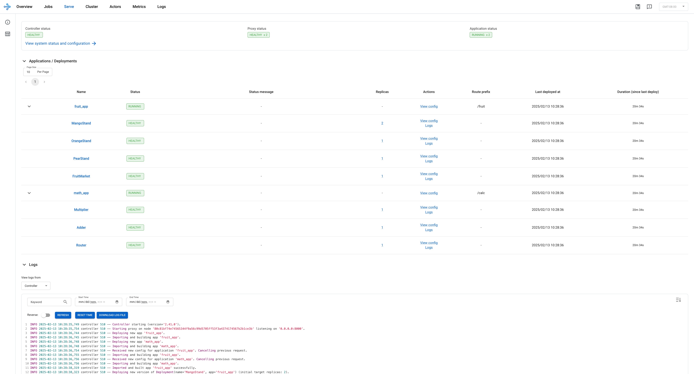

(kuberay-rayservice)=

# Deploy Ray Serve Applications

## Prerequisites

This guide focuses solely on the Ray Serve multi-application API, which is available starting from Ray version 2.4.0.

* Ray 2.4.0 or newer.
* KubeRay 0.6.0, KubeRay nightly, or newer.

## What's a RayService?

A RayService manages two components:

* **RayCluster**: Manages resources in a Kubernetes cluster.
* **Ray Serve Applications**: Manages users' applications.

## What does the RayService provide?

* **Kubernetes-native support for Ray clusters and Ray Serve applications:** After using a Kubernetes config to define a Ray cluster and its Ray Serve applications, you can use `kubectl` to create the cluster and its applications.
* **In-place updates for Ray Serve applications:** Users can update the Ray Serve config in the RayService CR config and use `kubectl apply` to update the applications. See [Step 7](#step-7-in-place-update-for-ray-serve-applications) for more details.
* **Zero downtime upgrades for Ray clusters:** Users can update the Ray cluster config in the RayService CR config and use `kubectl apply` to update the cluster. RayService temporarily creates a pending cluster and waits for it to be ready, then switches traffic to the new cluster and terminates the old one. See [Step 8](#step-8-zero-downtime-upgrade-for-ray-clusters) for more details.
* **Services HA:** RayService monitors the Ray cluster and Serve deployments' health statuses. If RayService detects an unhealthy status for a period of time, RayService tries to create a new Ray cluster and switch traffic to the new cluster when it's ready. See [this documentation](kuberay-rayservice-ha) for more details.

## Example: Serve two simple Ray Serve applications using RayService

## Step 1: Create a Kubernetes cluster with Kind

```sh
kind create cluster --image=kindest/node:v1.23.0
```

## Step 2: Install the KubeRay operator

Follow [this document](kuberay-operator-deploy) to install the latest stable KubeRay operator via Helm repository.
Note that the YAML file in this example uses `serveConfigV2` to specify a multi-application Serve config, which is supported starting from KubeRay v0.6.0.

## Step 3: Install a RayService

```sh
# Step 3.1: Download `ray_v1alpha1_rayservice.yaml`
curl -LO https://raw.githubusercontent.com/ray-project/kuberay/v1.0.0/ray-operator/config/samples/ray_v1alpha1_rayservice.yaml

# Step 3.2: Create a RayService
kubectl apply -f ray_v1alpha1_rayservice.yaml
```

* First look at the Ray Serve config (that is, `serveConfigV2`) embedded in the RayService YAML. Notice two high-level applications: a fruit stand app and a calculator app. Take note of some details about the fruit stand application:
  * The fruit stand application is contained in the `deployment_graph` variable in `fruit.py` in the [test_dag](https://github.com/ray-project/test_dag/tree/41d09119cbdf8450599f993f51318e9e27c59098) repo, so `import_path` in the config points to this variable to tell Serve from where to import the application.
  * The fruit app is hosted at the route prefix `/fruit`, meaning HTTP requests with routes that start with the prefix `/fruit` are sent to the fruit stand application.
  * The working directory points to the [test_dag](https://github.com/ray-project/test_dag/tree/41d09119cbdf8450599f993f51318e9e27c59098) repo, which is downloaded at runtime, and RayService starts your application in this directory. See {ref}`Runtime Environments <runtime-environments>`. for more details.
  * For more details on configuring Ray Serve deployments, see [Ray Serve Documentation](https://docs.ray.io/en/master/serve/configure-serve-deployment.html).
  * Similarly, the calculator app is imported from the `conditional_dag.py` file in the same repo, and it's hosted at the route prefix `/calc`.
  ```yaml
  serveConfigV2: |
    applications:
      - name: fruit_app
        import_path: fruit.deployment_graph
        route_prefix: /fruit
        runtime_env:
          working_dir: "https://github.com/ray-project/test_dag/archive/41d09119cbdf8450599f993f51318e9e27c59098.zip"
        deployments: ...
      - name: math_app
        import_path: conditional_dag.serve_dag
        route_prefix: /calc
        runtime_env:
          working_dir: "https://github.com/ray-project/test_dag/archive/41d09119cbdf8450599f993f51318e9e27c59098.zip"
        deployments: ...
  ```

## Step 4: Verify the Kubernetes cluster status

```sh
# Step 4.1: List all RayService custom resources in the `default` namespace.
kubectl get rayservice

# [Example output]
# NAME                AGE
# rayservice-sample   2m42s

# Step 4.2: List all RayCluster custom resources in the `default` namespace.
kubectl get raycluster

# [Example output]
# NAME                                 DESIRED WORKERS   AVAILABLE WORKERS   STATUS   AGE
# rayservice-sample-raycluster-6mj28   1                 1                   ready    2m27s

# Step 4.3: List all Ray Pods in the `default` namespace.
kubectl get pods -l=ray.io/is-ray-node=yes

# [Example output]
# ervice-sample-raycluster-6mj28-worker-small-group-kg4v5   1/1     Running   0          3m52s
# rayservice-sample-raycluster-6mj28-head-x77h4             1/1     Running   0          3m52s

# Step 4.4: List services in the `default` namespace.
kubectl get services

# NAME                                          TYPE        CLUSTER-IP      EXTERNAL-IP   PORT(S)                                                   AGE
# ...
# rayservice-sample-head-svc                    ClusterIP   10.96.34.90     <none>        10001/TCP,8265/TCP,52365/TCP,6379/TCP,8080/TCP,8000/TCP   4m58s
# rayservice-sample-raycluster-6mj28-head-svc   ClusterIP   10.96.171.184   <none>        10001/TCP,8265/TCP,52365/TCP,6379/TCP,8080/TCP,8000/TCP   6m21s
# rayservice-sample-serve-svc                   ClusterIP   10.96.161.84    <none>        8000/TCP                                                  4m58s
```

KubeRay creates a RayCluster based on `spec.rayClusterConfig` defined in the RayService YAML for a RayService custom resource.
Next, after the head Pod is running and ready, KubeRay submits a request to the head's dashboard agent port (default: 52365) to create the Ray Serve applications defined in `spec.serveConfigV2`.

When the Ray Serve applications are healthy and ready, KubeRay creates a head service and a serve service for the RayService custom resource (e.g., `rayservice-sample-head-svc` and `rayservice-sample-serve-svc` in Step 4.4).
Users can access the head Pod through both the head service managed by RayService (that is, `rayservice-sample-head-svc`) and the head service managed by RayCluster (that is, `rayservice-sample-raycluster-6mj28-head-svc`).
However, during a zero downtime upgrade, a new RayCluster is created, and a new head service is created for the new RayCluster.
If you don't use`rayservice-sample-head-svc`, you need to update the ingress configuration to point to the new head service.
However, if you use `rayservice-sample-head-svc`, KubeRay automatically updates the selector to point to the new head Pod, eliminating the need to update the ingress configuration.


> Note: Default ports and their definitions.

| Port  | Definition          |
|-------|---------------------|
| 6379  | Ray GCS             |
| 8265  | Ray Dashboard       |
| 10001 | Ray Client          |
| 8000  | Ray Serve           |
| 52365 | Ray Dashboard Agent |

## Step 5: Verify the status of the Serve applications

```sh
# Step 5.1: Check the status of the RayService.
kubectl describe rayservices rayservice-sample

# Active Service Status:
#   Application Statuses:
#     fruit_app:
#       Health Last Update Time:  2023-07-11T22:21:24Z
#       Last Update Time:         2023-07-11T22:21:24Z
#       Serve Deployment Statuses:
#         fruit_app_FruitMarket:
#           Health Last Update Time:  2023-07-11T22:21:24Z
#           Last Update Time:         2023-07-11T22:21:24Z
#           Status:                   HEALTHY
#         fruit_app_PearStand:
#           ...
#       Status:                       RUNNING
#     math_app:
#       Health Last Update Time:  2023-07-11T22:21:24Z
#       Last Update Time:         2023-07-11T22:21:24Z
#       Serve Deployment Statuses:
#         math_app_Adder:
#           Health Last Update Time:  2023-07-11T22:21:24Z
#           Last Update Time:         2023-07-11T22:21:24Z
#           Status:                   HEALTHY
#         math_app_Multiplier:
#           ...
#       Status:                       RUNNING

# Step 5.2: Check the Serve applications in the Ray dashboard.
# (1) Forward the dashboard port to localhost.
# (2) Check the Serve page in the Ray dashboard at http://localhost:8265/#/serve.
kubectl port-forward svc/rayservice-sample-head-svc --address 0.0.0.0 8265:8265
```

* See [rayservice-troubleshooting.md](kuberay-raysvc-troubleshoot) for more details on RayService observability.
Below is a screenshot example of the Serve page in the Ray dashboard.
  

## Step 6: Send requests to the Serve applications via the Kubernetes serve service

```sh
# Step 6.1: Run a curl Pod.
# If you already have a curl Pod, you can use `kubectl exec -it <curl-pod> -- sh` to access the Pod.
kubectl run curl --image=radial/busyboxplus:curl -i --tty

# Step 6.2: Send a request to the fruit stand app.
curl -X POST -H 'Content-Type: application/json' rayservice-sample-serve-svc:8000/fruit/ -d '["MANGO", 2]'
# [Expected output]: 6

# Step 6.3: Send a request to the calculator app.
curl -X POST -H 'Content-Type: application/json' rayservice-sample-serve-svc:8000/calc/ -d '["MUL", 3]'
# [Expected output]: "15 pizzas please!"
```

* `rayservice-sample-serve-svc` is HA in general. It does traffic routing among all the workers which have Serve deployments and always tries to point to the healthy cluster, even during upgrading or failing cases.

(step-7-in-place-update-for-ray-serve-applications)=
## Step 7: In-place update for Ray Serve applications

You can update the configurations for the applications by modifying `serveConfigV2` in the RayService config file. Reapplying the modified config with `kubectl apply` reapplies the new configurations to the existing RayCluster instead of creating a new RayCluster.

Update the price of mangos from `3` to `4` for the fruit stand app in [ray_v1alpha1_rayservice.yaml](https://github.com/ray-project/kuberay/blob/v1.0.0/ray-operator/config/samples/ray_v1alpha1_rayservice.yaml). This change reconfigures the existing MangoStand deployment, and future requests will use the updated Mango price.

```sh
# Step 7.1: Update the price of mangos from 3 to 4.
# [ray_v1alpha1_rayservice.yaml]
# - name: MangoStand
#   num_replicas: 1
#   user_config:
#     price: 4

# Step 7.2: Apply the updated RayService config.
kubectl apply -f ray_v1alpha1_rayservice.yaml

# Step 7.3: Check the status of the RayService.
kubectl describe rayservices rayservice-sample
# [Example output]
# Serve Deployment Statuses:
# - healthLastUpdateTime: "2023-07-11T23:50:13Z"
#   lastUpdateTime: "2023-07-11T23:50:13Z"
#   name: MangoStand
#   status: UPDATING

# Step 7.4: Send a request to the fruit stand app again after the Serve deployment status changes from UPDATING to HEALTHY.
# (Execute the command in the curl Pod from Step 6)
curl -X POST -H 'Content-Type: application/json' rayservice-sample-serve-svc:8000/fruit/ -d '["MANGO", 2]'
# [Expected output]: 8
```

(step-8-zero-downtime-upgrade-for-ray-clusters)=
## Step 8: Zero downtime upgrade for Ray clusters

In Step 7, modifying `serveConfigV2` doesn't trigger a zero downtime upgrade for Ray clusters.
Instead, it reapplies the new configurations to the existing RayCluster.
However, if you modify `spec.rayClusterConfig` in the RayService YAML file, it triggers a zero downtime upgrade for Ray clusters.
RayService temporarily creates a new RayCluster and waits for it to be ready, then switches traffic to the new RayCluster by updating the selector of the head service managed by RayService (that is, `rayservice-sample-head-svc`) and terminates the old one.

During the zero downtime upgrade process, RayService creates a new RayCluster temporarily and waits for it to become ready.
Once the new RayCluster is ready, RayService updates the selector of the head service managed by RayService (that is, `rayservice-sample-head-svc`) to point to the new RayCluster to switch the traffic to the new RayCluster.
Finally, the old RayCluster is terminated.

Certain exceptions don't trigger a zero downtime upgrade.
Only the fields managed by Ray Autoscaler, `replicas` and `scaleStrategy.workersToDelete`, don't trigger a zero downtime upgrade.
When you update these fields, KubeRay doesn't propagate the update from RayService to RayCluster custom resources, so nothing happens.

```sh
# Step 8.1: Update `spec.rayClusterConfig.workerGroupSpecs[0].replicas` in the RayService YAML file from 1 to 2.
# This field is an exception that doesn't trigger a zero downtime upgrade, and nothing happens.
kubectl apply -f ray_v1alpha1_rayservice.yaml

# Step 8.2: Check RayService CR
kubectl describe rayservices rayservice-sample
# Worker Group Specs:
#   ...
#   Replicas:  2

# Step 8.3: Check RayCluster CR. The update doesn't propagate to the RayCluster CR.
kubectl describe rayclusters $YOUR_RAY_CLUSTER
# Worker Group Specs:
#   ...
#   Replicas:  1

# Step 8.4: Update `spec.rayClusterConfig.rayVersion` to `2.100.0`.
# This field determines the Autoscaler sidecar image, and triggers a zero downtime upgrade.
kubectl apply -f ray_v1alpha1_rayservice.yaml

# Step 8.5: List all RayCluster custom resources in the `default` namespace.
# Note that the new RayCluster is created based on the updated RayService config to have 2 workers.
kubectl get raycluster

# NAME                                 DESIRED WORKERS   AVAILABLE WORKERS   STATUS   AGE
# rayservice-sample-raycluster-6mj28   1                 1                   ready    142m
# rayservice-sample-raycluster-sjj67   2                 2                   ready    44s

# Step 8.6: Wait for the old RayCluster terminate.

# Step 8.7: Submit a request to the fruit stand app via the same serve service.
curl -X POST -H 'Content-Type: application/json' rayservice-sample-serve-svc:8000/fruit/ -d '["MANGO", 2]'
# [Expected output]: 8
```

### Other possible scenarios that trigger a new RayCluster preparation

> Note: The following behavior is for KubeRay v0.6.2 or newer.
For older versions, see [kuberay#1293](https://github.com/ray-project/kuberay/pull/1293) for more details.

KubeRay also triggers a new RayCluster preparation if it considers a RayCluster unhealthy.
In the RayService, KubeRay can mark a RayCluster as unhealthy in two possible scenarios.

* Case 1: The KubeRay operator can't connect to the dashboard agent on the head Pod for more than the duration defined by the `deploymentUnhealthySecondThreshold` parameter. Both the default value and values in sample YAML files of `deploymentUnhealthySecondThreshold` are 300 seconds.

* Case 2: The KubeRay operator marks a RayCluster as unhealthy if the status of a serve application is `DEPLOY_FAILED` or `UNHEALTHY` for a duration exceeding the `serviceUnhealthySecondThreshold` parameter. Both the default value and values in sample YAML files of `serviceUnhealthySecondThreshold` are 900 seconds.

After KubeRay marks a RayCluster as unhealthy, it initiates the creation of a new RayCluster. Once the new RayCluster is ready, KubeRay redirects network traffic to it, and subsequently deletes the old RayCluster.

## Step 9: Clean up the Kubernetes cluster

```sh
# Delete the RayService.
kubectl delete -f ray_v1alpha1_rayservice.yaml

# Uninstall the KubeRay operator.
helm uninstall kuberay-operator

# Delete the curl Pod.
kubectl delete pod curl
```

## Next steps

* See [RayService high availability](kuberay-rayservice-ha) for more details on RayService HA.
* See [RayService troubleshooting guide](kuberay-raysvc-troubleshoot) if you encounter any issues.
* See [Examples](kuberay-examples) for more RayService examples.
The [MobileNet example](kuberay-mobilenet-rayservice-example) is a good example to start with because it doesn't require GPUs and is easy to run on a local machine.
