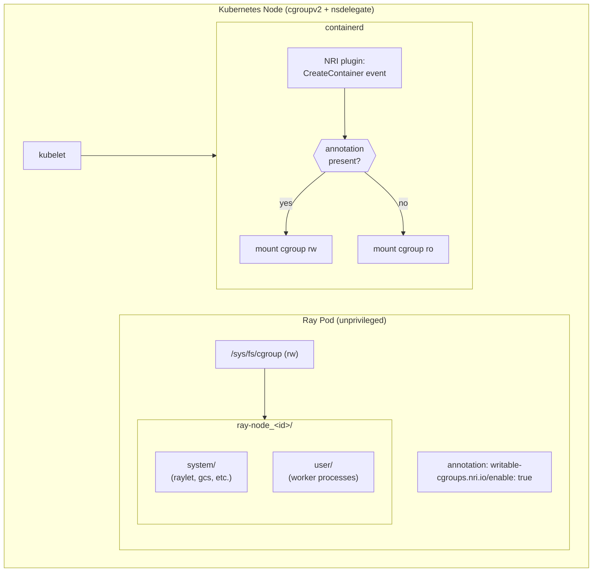

# Resource Isolation with Writable Cgroups via an NRI Plugin

Ray's [resource isolation](https://docs.ray.io/en/latest/ray-core/resource-isolation-with-cgroupv2.html)
feature (introduced in 2.51.0, enhanced in 2.56.0) uses cgroups v2 to reserve
CPU and memory for Ray's system processes (the raylet, GCS server, dashboard
agent, etc.), preventing user tasks from starving them. To set up its cgroup
hierarchy, Ray needs read-write access to `/sys/fs/cgroup` inside the container.
The container runtime mounts this cgroup hierarchy read-only by default.

Running Ray in a privileged container would grant write access, but privileged
containers have broadly overgranted capabilities and it would be insecure to use
them for this purpose. Instead, this guide uses an
[NRI](https://github.com/containerd/nri) plugin to selectively modify
`CreateContainer` requests to use an `rw` cgroup mount instead of the default
`ro`, but only when a specific well-known pod annotation is present.

With the containerd runtime, by default each pod has its own cgroup namespace.
This means that each pod has its own set of cgroup root directories, and a
process running within a cgroup namespace can have no knowledge of cgroups
higher up in the cgroup hierarchy. As an additional security measure, the
`nsdelegate` mount option should be used when mounting the root-level (or
system-level) cgroup hierarchy. Please note that the `nsdelegate` mount option
is ignored in all cgroup namespaces other than the outermost (i.e. the one that
is mounted upon booting a machine); that is, we need `nsdelegate` not on the
pod's cgroup mount but on the root cgroup mount. `nsdelegate` enforces a
kernel-level security boundary, with the result that Ray containers can create
and manage sub-cgroups, but cannot modify their own resource limits.

:::{note}
All commands and expected outputs were validated on Azure Kubernetes Service
(AKS). They have not been tested on every platform.
:::

:::{tip}
**"I just want writable cgroups in Kubernetes."**

If you want to evaluate Ray resource isolation in a non-production
environment without performing manual node setup, skip to the [quick
start](#quick-start-non-production).
:::

## Overview

Two things are needed to give an unprivileged Ray container writable cgroups
safely:

1. An **NRI plugin** that intercepts `CreateContainer` events from the container
   runtime. When the plugin sees the annotation `writable-cgroups.nri.io/enable:
   "true"` (or a user-defined custom annotation) on a pod, it replaces the `ro`
   option on the cgroup mount with `rw`. Pods without the annotation are left
   alone.

2. The **`nsdelegate` mount option** on the node's root cgroup filesystem.
   `nsdelegate` instructs the kernel to enforce cgroup namespace delegation
   boundaries: a process inside a cgroup namespace can `mkdir` sub-cgroups
   and write to their control files (`cpu.weight`, `memory.min`, etc.), but
   writes to the namespace root's own control files (`memory.max`, `cpu.max`,
   etc.) are rejected by the kernel. This is what prevents a container from
   raising its own resource limits, even with a writable cgroup mount.

The annotation key is configurable via the plugin's `--annotation-key`
flag. The default is `writable-cgroups.nri.io/enable`.

```bash
# example: use a custom annotation key
/opt/nri/plugins/10-writable-cgroups --annotation-key "my-org.com/writable-cgroups"
```

The plugin source is at
[github.com/pmengelbert/nri-writable-cgroups](https://github.com/pmengelbert/nri-writable-cgroups).

### NRI

[NRI (Node Resource Interface)](https://github.com/containerd/nri) is a
plugin framework for OCI-compatible container runtimes
([containerd](https://github.com/containerd/containerd),
[CRI-O](https://github.com/cri-o/cri-o)). Plugins are daemon-like processes
that subscribe to container lifecycle events and can modify container
configuration before the container is created. The NRI protocol is defined
in protobuf and is not tied to a specific runtime implementation. Plugins
can inspect pod and container annotations, and can modify mounts, environment
variables, resource limits, devices, and other OCI spec fields at creation
time.

### Architecture



## Prerequisites

- **Linux kernel >= 5.8** with **cgroup v2** (unified hierarchy). Hard requirement.
- **containerd >= 1.7**. See [Enabling NRI](#step-4-enable-nri-in-containerd) for version-specific details.
- **`kubectl`** configured for your cluster.
- **[KubeRay operator](https://docs.ray.io/en/latest/cluster/kubernetes/getting-started/kuberay-operator-installation.html)** installed.
- **Ray >= 2.56.0**.
- **Go toolchain** (to build the NRI plugin from source).

:::{warning}
**cgroup v1 is not supported.** Resource isolation requires cgroup v2.
cgroup v1 lacks the namespace delegation model (`nsdelegate`) that
enforces the security boundary described above; attempting to use it
may produce undefined behavior.
:::

:::{note}
**Non-containerd runtimes** (e.g., CRI-O) are out of scope. NRI itself
is runtime-agnostic and CRI-O supports it, but the configuration steps
below are specific to containerd. Consult the
[NRI documentation](https://github.com/containerd/nri) if you need to
adapt them.
:::

## Cluster administrator setup

The steps below must be performed on every node that will run Ray pods
with resource isolation. They are the same operations that the
[setup DaemonSet](#quick-start-non-production) automates. They are
presented here so that administrators can understand, audit, and adapt
each one.

Nodes can be accessed by SSH or via a privileged debug pod:

::::{tab-set}

:::{tab-item} SSH
```bash
ssh <user>@<node-ip>
```
:::

:::{tab-item} Privileged debug pod
```bash
$ kubectl apply -f - <<'EOF'
apiVersion: v1
kind: Pod
metadata:
  name: node-debug
spec:
  hostPID: true
  nodeName: <target-node-name>
  volumes:
    - name: host
      hostPath:
        path: "/"
  containers:
    - name: debug
      image: ubuntu
      command: ["sleep", "3600"]
      volumeMounts:
        - name: host
          mountPath: "/host"
      securityContext:
        privileged: true
EOF

$ kubectl exec -it node-debug -- chroot /host /bin/bash
```
:::

::::

### Step 1: Verify cgroup v2

```bash
$ mount | grep cgroup2
cgroup2 on /sys/fs/cgroup type cgroup2 (rw,nosuid,nodev,noexec,relatime)
```

If this produces no output, the node is running cgroup v1 and cannot be
used.

```bash
$ stat -fc %T /sys/fs/cgroup
cgroup2fs
```

### Step 2: Build the NRI plugin

```bash
$ git clone https://github.com/pmengelbert/nri-writable-cgroups.git
$ cd nri-writable-cgroups
$ go build -o 10-writable-cgroups .
```

The `10-` prefix is the NRI plugin index, which determines ordering when
multiple plugins handle the same event. The rest of the filename
(`writable-cgroups`) is the plugin's registered name.

### Step 3: Install the plugin

Copy the binary to containerd's NRI plugin directory:

```bash
$ sudo mkdir -p /opt/nri/plugins
$ sudo cp 10-writable-cgroups /opt/nri/plugins/
$ sudo chmod +x /opt/nri/plugins/10-writable-cgroups
```

containerd discovers and launches plugins placed in this directory
automatically (when NRI is enabled). No separate registration is required.

### Step 4: Enable NRI in containerd

::::{tab-set}

:::{tab-item} containerd >= 2.0

NRI is enabled by default. Verify it has not been explicitly disabled:

```bash
$ containerd config dump | grep -A 5 'nri'
```

`disable = false` (or the absence of an NRI section entirely) means
defaults are in effect and no changes are needed. If `disable = true`,
remove or change that setting.
:::

:::{tab-item} containerd 1.7-1.x

NRI is available but disabled by default in containerd 1.7.x. Add the
NRI configuration block to `/etc/containerd/config.toml`.

:::{warning}
Merge the following into the existing `config.toml`. Do not overwrite the
file; the cluster's runtime, CRI, and snapshot configuration must be
preserved.
:::

```toml
[plugins.'io.containerd.nri.v1.nri']
    disable = false
    disable_connections = false
    plugin_config_path = "/etc/nri/conf.d"
    plugin_path = "/opt/nri/plugins"
    plugin_registration_timeout = "5s"
    plugin_request_timeout = "2s"
    socket_path = "/var/run/nri/nri.sock"
```

Create the directories referenced above:

```bash
$ sudo mkdir -p /etc/nri/conf.d
$ sudo mkdir -p /opt/nri/plugins
```

:::

::::

### Step 5: Remount root cgroup with `nsdelegate`

`nsdelegate` is the mount option that makes writable cgroups safe. Check
whether it is already present:

```bash
$ mount | grep cgroup2
cgroup2 on /sys/fs/cgroup type cgroup2 (rw,nosuid,nodev,noexec,relatime,nsdelegate,memory_recursiveprot)
```

If `nsdelegate` does not appear, remount:

```bash
$ sudo mount -t cgroup2 -o remount,rw,nosuid,nodev,noexec,relatime,nsdelegate cgroup2 /sys/fs/cgroup
```

:::{warning}
This remount does not survive a reboot. For persistence, configure it in
your node image, cloud-init, or a systemd mount unit:

```ini
# /etc/systemd/system/sys-fs-cgroup.mount.d/nsdelegate.conf
[Mount]
Options=rw,nosuid,nodev,noexec,relatime,nsdelegate
```
:::

### Step 6: Restart containerd

```bash
$ sudo systemctl restart containerd
```

Verify the plugin is running:

```bash
$ ps aux | grep writable-cgroups
root  12345  0.0  0.0  712345  6789 ?  Ssl  12:00  0:00  /opt/nri/plugins/10-writable-cgroups
```

The kubelet does not need to be restarted. It reconnects to containerd's
CRI socket automatically.

### Step 7: Label the node

```bash
$ kubectl label node <node-name> writable-cgroups.nri.io/enabled=true
```

Ray pods must carry a `nodeSelector` for this label to ensure they land
on prepared nodes. Without it, a pod could be scheduled on a node without
the NRI plugin and silently receive a read-only cgroup mount. Admission
webhooks that would inject this `nodeSelector` automatically are out of
scope for this guide; the selector must be set manually in the pod spec.

### Step 8: Verify

Deploy two test pods --- one with the annotation, one without:

```yaml
# writable-pod.yaml
apiVersion: v1
kind: Pod
metadata:
  name: writable-cgroup-test
  annotations:
    writable-cgroups.nri.io/enable: "true"
spec:
  nodeSelector:
    writable-cgroups.nri.io/enabled: "true"
  containers:
    - name: test
      image: alpine
      command: ["sleep", "3600"]
      resources:
        limits:
          memory: "256Mi"
          cpu: "0.5"
        requests:
          memory: "256Mi"
          cpu: "0.5"
```

```yaml
# nonwritable-pod.yaml
apiVersion: v1
kind: Pod
metadata:
  name: nonwritable-cgroup-test
spec:
  containers:
    - name: test
      image: alpine
      command: ["sleep", "3600"]
      resources:
        limits:
          memory: "256Mi"
          cpu: "0.5"
        requests:
          memory: "256Mi"
          cpu: "0.5"
```

```bash
$ kubectl apply -f writable-pod.yaml -f nonwritable-pod.yaml
```

The annotated pod should show `rw` and `nsdelegate`:

```bash
$ kubectl exec writable-cgroup-test -- mount | grep cgroup
cgroup2 on /sys/fs/cgroup type cgroup2 (rw,nosuid,nodev,noexec,relatime,nsdelegate)
```

The non-annotated pod should show `ro`:

```bash
$ kubectl exec nonwritable-cgroup-test -- mount | grep cgroup
cgroup2 on /sys/fs/cgroup type cgroup2 (ro,nosuid,nodev,noexec,relatime,nsdelegate)
```

Sub-cgroup creation should succeed in the annotated pod:

```bash
$ kubectl exec writable-cgroup-test -- mkdir /sys/fs/cgroup/test-subcgroup
$ kubectl exec writable-cgroup-test -- ls /sys/fs/cgroup/test-subcgroup/
cgroup.controllers
cgroup.events
cgroup.freeze
...
```

Clean up:

```bash
$ kubectl delete pod writable-cgroup-test nonwritable-cgroup-test
```

---

## Quick start (non-production)

A DaemonSet is provided that automates the [administrator
setup](#cluster-administrator-setup) above. It runs a short-lived
privileged init container on each node; after setup completes, the
remaining container is the unprivileged `pause` image.

:::{warning}
This DaemonSet has only been tested on AKS. It is not suitable for
production. Use it at your own risk.

The intended workflow is to evaluate the feature in a test cluster, then
work with a cluster administrator to configure production nodes using
the [manual steps](#cluster-administrator-setup).
:::

### What it does

**cgroups** (control groups) are a Linux kernel mechanism for organizing
processes into groups and controlling their resource consumption (CPU,
memory, etc.). Kubernetes uses cgroups to enforce the resource requests
and limits declared on containers. By default, the cgroup filesystem
inside a container is mounted read-only.

Ray's resource isolation feature needs write access to the cgroup
filesystem so it can create sub-cgroups that partition resources between
Ray's internal processes and user workloads. Without isolation, a
runaway user task can starve the raylet or GCS server of CPU or memory
and crash the node.

[NRI (Node Resource Interface)](https://github.com/containerd/nri) is a
plugin framework built into the
[containerd](https://containerd.io/) container runtime (and
[CRI-O](https://github.com/cri-o/cri-o)). NRI plugins can modify
container configuration at creation time. The plugin used here changes
the cgroup mount from `ro` to `rw` for pods that carry a specific
annotation. NRI is runtime-agnostic by design, though this guide covers
containerd only.

`nsdelegate` is a mount option on the cgroup filesystem that enforces
cgroup namespace delegation boundaries at the kernel level. With
`nsdelegate`, a container can create and manage sub-cgroups within its
own namespace but cannot write to its own root cgroup's resource control
files (`memory.max`, `cpu.max`, etc.). This is what makes writable
cgroups safe for unprivileged containers.

The DaemonSet's init container performs the following on each node:

1. Copies the NRI plugin binary (`10-writable-cgroups`) to
   `/opt/nri/plugins/`.
2. Merges the NRI configuration block into containerd's config.
3. Remounts the root cgroup filesystem with `nsdelegate`.
4. Restarts containerd to launch the plugin.

After the DaemonSet runs, any pod annotated with
`writable-cgroups.nri.io/enable: "true"` on that node will have its
cgroup filesystem mounted `rw`. All other pods are unaffected.

### Deploy

Build and push the DaemonSet image from the plugin repository:

```bash
$ git clone https://github.com/pmengelbert/nri-writable-cgroups.git
$ cd nri-writable-cgroups

# Build the NRI plugin binary
$ go build -o 10-writable-cgroups .

# Build and push the DaemonSet image
$ docker build -t <YOUR_REGISTRY>/setup-cgroup:latest .
$ docker push <YOUR_REGISTRY>/setup-cgroup:latest
```

Apply the DaemonSet (replace `<YOUR_REGISTRY>`):

```yaml
# daemonset-setup.yaml
apiVersion: apps/v1
kind: DaemonSet
metadata:
  name: writable-cgroups-setup
  labels:
    app: writable-cgroups-setup
spec:
  selector:
    matchLabels:
      app: writable-cgroups-setup
  template:
    metadata:
      labels:
        app: writable-cgroups-setup
    spec:
      hostPID: true
      volumes:
        - name: host
          hostPath:
            path: "/"
      initContainers:
        - name: setup
          image: <YOUR_REGISTRY>/setup-cgroup:latest
          volumeMounts:
            - name: host
              mountPath: "/rootpath"
          securityContext:
            privileged: true
      containers:
        - name: pause
          image: registry.k8s.io/pause
```

```bash
$ kubectl apply -f daemonset-setup.yaml
```

```bash
$ kubectl get daemonset writable-cgroups-setup
NAME                      DESIRED   CURRENT   READY   UP-TO-DATE   AVAILABLE
writable-cgroups-setup    3         3         3       3            3
```

Label the nodes:

```bash
$ kubectl label node --all writable-cgroups.nri.io/enabled=true
```

To label only specific nodes (e.g., a dedicated node pool):

```bash
$ kubectl label node <node-1> <node-2> writable-cgroups.nri.io/enabled=true
```

:::{note}
If a node reboots, the `nsdelegate` remount and containerd configuration
changes may be lost. Restart the DaemonSet to re-apply:

```bash
$ kubectl rollout restart daemonset writable-cgroups-setup
```
:::

---

## Enable Ray resource isolation

With the NRI plugin running (via either the [manual
setup](#cluster-administrator-setup) or the
[DaemonSet](#quick-start-non-production)), deploy a RayCluster with
resource isolation enabled. Three things are needed in the manifest:

1. The annotation `writable-cgroups.nri.io/enable: "true"` on the pod
   templates for both head and worker groups, so the NRI plugin mounts
   cgroups `rw`.

2. `enable-resource-isolation: "true"` in `rayStartParams` for both head
   and worker groups, so Ray creates its cgroup hierarchy and reserves
   resources for system processes.

3. A `nodeSelector` for `writable-cgroups.nri.io/enabled: "true"`, so
   Ray pods land only on prepared nodes.

```yaml
# raycluster-writable-cgroups.yaml
apiVersion: ray.io/v1
kind: RayCluster
metadata:
  name: raycluster-writable-cgroups
spec:
  rayVersion: "2.56.0"
  headGroupSpec:
    rayStartParams:
      enable-resource-isolation: "true"
    template:
      metadata:
        annotations:
          writable-cgroups.nri.io/enable: "true"
      spec:
        nodeSelector:
          writable-cgroups.nri.io/enabled: "true"
        containers:
        - name: ray-head
          image: rayproject/ray:2.56.0
          resources:
            limits:
              cpu: "2"
              memory: "8Gi"
            requests:
              cpu: "2"
              memory: "8Gi"
          ports:
          - containerPort: 6379
            name: gcs-server
          - containerPort: 8265
            name: dashboard
          - containerPort: 10001
            name: client
  workerGroupSpecs:
  - replicas: 1
    minReplicas: 1
    maxReplicas: 5
    groupName: workergroup
    rayStartParams:
      enable-resource-isolation: "true"
    template:
      metadata:
        annotations:
          writable-cgroups.nri.io/enable: "true"
      spec:
        nodeSelector:
          writable-cgroups.nri.io/enabled: "true"
        containers:
        - name: ray-worker
          image: rayproject/ray:2.56.0
          resources:
            limits:
              cpu: "2"
              memory: "8Gi"
            requests:
              cpu: "2"
              memory: "8Gi"
```

```bash
$ kubectl apply -f raycluster-writable-cgroups.yaml
```

```bash
$ kubectl get raycluster raycluster-writable-cgroups
NAME                             DESIRED WORKERS   AVAILABLE WORKERS   CPUS   MEMORY   GPUS   STATUS   AGE
raycluster-writable-cgroups      1                 1                   4      16Gi     0      ready    2m
```

## Verification

### Cgroup mount

```bash
$ HEAD_POD=$(kubectl get po -l ray.io/cluster=raycluster-writable-cgroups,ray.io/node-type=head \
    -o custom-columns=NAME:.metadata.name --no-headers)

$ kubectl exec -it $HEAD_POD -- mount | grep cgroup
cgroup2 on /sys/fs/cgroup type cgroup2 (rw,nosuid,nodev,noexec,relatime,nsdelegate)
```

### Cgroup hierarchy

```bash
$ kubectl exec -it $HEAD_POD -- ls /sys/fs/cgroup/ray-node*/system
cgroup.controllers  cgroup.procs  cpu.stat  cpu.weight  leaf  memory.current  memory.min  ...

$ kubectl exec -it $HEAD_POD -- ls /sys/fs/cgroup/ray-node*/user
cgroup.controllers  cgroup.procs  cpu.stat  cpu.weight  non-ray  workers  ...
```

### System-reserved CPU weight

The manifest above requests 2 CPUs per pod. Ray's default reservation
formula (`min(3.0, max(1.0, 0.05 * num_cpus))`) reserves 1 CPU for
system processes. cgroup v2 expresses CPU as weights summing to 10000;
a 1:1 split yields 5000:

```bash
$ kubectl exec -it $HEAD_POD -- cat /sys/fs/cgroup/ray-node*/system/cpu.weight
5000
```

### System process isolation

```bash
$ kubectl exec -it $HEAD_POD -- bash -c \
    'for pid in $(cat /sys/fs/cgroup/ray-node*/system/leaf/cgroup.procs); do
       ps -p $pid -o pid=,comm= 2>/dev/null
     done'
    26 gcs_server
    99 raylet
   ...
```

### User processes

The workers cgroup should initially be empty:

```bash
$ kubectl exec -it $HEAD_POD -- cat /sys/fs/cgroup/ray-node*/user/workers/cgroup.procs
```

Submit a test job:

```bash
$ kubectl exec -it $HEAD_POD -- \
    ray job submit --address http://localhost:8265 --no-wait -- \
    python -c "import ray; import time; ray.init(); time.sleep(100)"
```

Worker processes should appear:

```bash
$ kubectl exec -it $HEAD_POD -- cat /sys/fs/cgroup/ray-node*/user/workers/cgroup.procs
95794
95795
96093
```

```bash
$ kubectl exec -it $HEAD_POD -- ps 95795
    PID TTY      STAT   TIME COMMAND
  95795 ?        Sl     0:00 python -c import ray; import time; ray.init(); time.sleep(100)
```

## Troubleshooting

### cgroup v1

If `stat -fc %T /sys/fs/cgroup` returns `tmpfs` instead of `cgroup2fs`,
the node is using cgroup v1. cgroup v1 is not supported. Use nodes with
cgroup v2 enabled; most modern distributions and managed Kubernetes
services default to cgroup v2.

### NRI plugin not running

If annotated pods still show `ro`:

1. Confirm the binary is present and executable:
   ```bash
   $ ls -la /opt/nri/plugins/10-writable-cgroups
   -rwxr-xr-x 1 root root 12345678 ... /opt/nri/plugins/10-writable-cgroups
   ```

2. Check containerd logs:
   ```bash
   $ journalctl -u containerd | grep -i nri
   ```

3. On containerd < 2.0, verify the NRI block is present in
   `/etc/containerd/config.toml` with `disable = false`.

4. Restart containerd:
   ```bash
   $ sudo systemctl restart containerd
   ```

### Managed platform reverting configuration

Some managed Kubernetes services (AKS, EKS, etc.) periodically reconcile
node configuration and may revert changes to `/etc/containerd/config.toml`
or undo the `nsdelegate` remount. If the setup stops working:

- Check whether the NRI config block is still in `config.toml`.
- Check whether `nsdelegate` is still in the cgroup mount options.
- If using the DaemonSet, `kubectl rollout restart daemonset writable-cgroups-setup`.
- For a permanent solution, use the cloud provider's node customization
  mechanisms (custom node images, cloud-init, startup scripts).

### `SystemdCgroup = true`

Many clusters (including kubeadm-created ones) configure containerd to use
the systemd cgroup driver (`SystemdCgroup = true` in the runc options).
This is compatible with the NRI plugin approach. The `nsdelegate` remount
operates on the root cgroup filesystem regardless of which cgroup driver
manages pod-level cgroups. If you encounter issues, verify `nsdelegate`
is present in the mount options and check containerd logs.

## Known limitations

- **Reboot persistence:** the `nsdelegate` remount and containerd config
  changes do not survive a reboot by default. Administrators should use
  node customization (custom images, cloud-init, systemd units) for
  persistence. DaemonSet users can restart it after a reboot.

- **New and autoscaled nodes:** the DaemonSet handles new nodes
  automatically. The manual approach requires re-running the steps on
  each new node.

- **Admission policy:** this guide does not include admission webhooks
  or `ValidatingAdmissionPolicy` rules. `nodeSelector` injection and
  annotation validation are planned for a future revision. In the
  meantime, rely on RBAC and namespace-level controls.

- **Annotation key:** `writable-cgroups.nri.io/enable` is provisional
  and may change as the feature matures.

- **Container restarts:** NRI intercepts every `CreateContainer` event.
  If a container is restarted (OOM kill, liveness probe failure, etc.),
  the plugin re-applies the writable mount automatically.

## Cleanup

```bash
$ kubectl delete raycluster raycluster-writable-cgroups
```

If the DaemonSet was deployed:

```bash
$ kubectl delete daemonset writable-cgroups-setup
```

:::{note}
Deleting the DaemonSet does not undo node changes. The plugin binary
remains in `/opt/nri/plugins/`, containerd config changes persist until
reverted, and `nsdelegate` remains until the next reboot.
:::

## References

- [Resource Isolation with cgroup v2](https://docs.ray.io/en/latest/ray-core/resource-isolation-with-cgroupv2.html) --- Ray's resource isolation documentation.
- [NRI project](https://github.com/containerd/nri) --- Node Resource Interface specification and reference implementation.
- [Writable-cgroups NRI plugin](https://github.com/pmengelbert/nri-writable-cgroups) --- source code and Dockerfile for the plugin and DaemonSet image.
- [containerd NRI configuration](https://github.com/containerd/containerd/blob/main/docs/NRI.md) --- containerd-specific NRI setup reference.
- [Kernel cgroup v2 documentation](https://docs.kernel.org/admin-guide/cgroup-v2.html) --- authoritative reference for cgroup v2 and `nsdelegate`.
