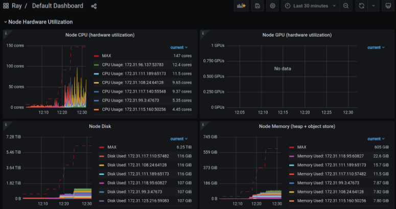

(collect-metrics)=
# Collecting and monitoring metrics
Metrics are useful for monitoring and troubleshooting Ray applications and Clusters. For example, you may want to access a node's metrics if it terminates unexpectedly.

Ray records and emits time-series metrics using the [Prometheus format](https://prometheus.io/docs/instrumenting/exposition_formats/). Ray does not provide a native storage solution for metrics. Users need to manage the lifecycle of the metrics by themselves. This page provides instructions on how to collect and monitor metrics from Ray Clusters.


## System and application metrics
Ray exports metrics if you use `ray[default]` or {ref}`other installation commands <installation>` that include Dashboard component. Dashboard agent process is responsible for aggregating and reporting metrics to the endpoints for Prometheus to scrape.

**System metrics**: Ray exports a number of system metrics. View {ref}`system metrics <system-metrics>` for more details about the emitted metrics.

**Application metrics**: Application-specific metrics are useful for monitoring your application states. View {ref}`adding application metrics <application-level-metrics>` for how to record metrics.

(prometheus-setup)=
## Setting up Prometheus

You can use Prometheus to scrape metrics from Ray Clusters. Ray doesn't start Prometheus servers for you. You need to decide where to host and configure it to scrape the metrics from Clusters.

For a quick demo, you can run Prometheus locally on your machine. Follow the quickstart instructions below to set up Prometheus and scrape metrics from a local single-node Ray Cluster.

### Quickstart: Running Prometheus locally

Run the following command to download and start Prometheus locally with a configuration that scrapes metrics from a local Ray Cluster.

```bash
ray metrics launch-prometheus
```

You should see the following output:

```text
2024-01-11 16:08:45,805 - INFO - Prometheus installed successfully.
2024-01-11 16:08:45,810 - INFO - Prometheus has started.
Prometheus is running with PID 1234.
To stop Prometheus, use the command: 'kill 1234', or if you need to force stop, use 'kill -9 1234'.
```

You should also see some logs from Prometheus:

```shell
[...]
ts=2024-01-12T00:47:29.761Z caller=main.go:1009 level=info msg="Server is ready to receive web requests."
ts=2024-01-12T00:47:29.761Z caller=manager.go:1012 level=info component="rule manager" msg="Starting rule manager..."
```

Now you can access Ray metrics from the default Prometheus URL, http://localhost:9090.

To demonstrate that Prometheus is scraping metrics from Ray, run the following command:

```shell
ray start --head --metrics-export-port=8080
```

Then go to the Prometheus UI and run the following query:

```shell
ray_dashboard_api_requests_count_requests_total
```

You can then see the number of requests to the Ray Dashboard API over time.

To stop Prometheus, run `kill <PID>` where `<PID>` is the PID of the Prometheus process that was printed out when you ran the command. To find the PID, you can also run `ps aux | grep prometheus`.

### [Optional] Manual: Running Prometheus locally

If the preceding automatic script doesn't work or you would prefer to install and start Prometheus manually, follow these instructions.

First, [download Prometheus](https://prometheus.io/download/). Make sure to download the correct binary for your operating system. (For example, Darwin for macOS X.)

Then, unzip the archive into a local directory using the following command:

```bash
tar xvfz prometheus-*.tar.gz
cd prometheus-*
```

Ray provides a Prometheus config that works out of the box. After running Ray, you can find the config at `/tmp/ray/session_latest/metrics/prometheus/prometheus.yml`.

```yaml
global:
  scrape_interval: 15s
  evaluation_interval: 15s

scrape_configs:
# Scrape from each Ray node as defined in the service_discovery.json provided by Ray.
- job_name: 'ray'
  file_sd_configs:
  - files:
    - '/tmp/ray/prom_metrics_service_discovery.json'
```

Next, start Prometheus:

```shell
./prometheus --config.file=/tmp/ray/session_latest/metrics/prometheus/prometheus.yml
```
```{admonition} Note
:class: note
If you are using macOS, you may receive an error at this point about trying to launch an application where the developer has not been verified. See the "Troubleshooting" guide below to fix the issue.
```

Now, you can access Ray metrics from the default Prometheus URL, `http://localhost:9090`.

### Running Prometheus in production

For a production environment, view [Prometheus documentation](https://prometheus.io/docs/introduction/overview/) for the best strategy to set up your Prometheus server. The Prometheus server should live outside of the Ray Cluster, so that metrics are still accessible if the Cluster is down. For KubeRay users, follow [these instructions](kuberay-prometheus-grafana) to set up Prometheus.

### Troubleshooting
#### Using Ray configurations in Prometheus with Homebrew on macOS X
Homebrew installs Prometheus as a service that is automatically launched for you.
To configure these services, you cannot simply pass in the config files as command line arguments.

Instead, change the --config-file line in `/usr/local/etc/prometheus.args` to read `--config.file /tmp/ray/session_latest/metrics/prometheus/prometheus.yml`.

You can then start or restart the services with `brew services start prometheus`.


#### macOS does not trust the developer to install Prometheus
You may receive the following error:


When downloading binaries from the internet, macOS requires that the binary be signed by a trusted developer ID.
Many developers are not on macOS's trusted list. Users can manually override this requirement.

See [these instructions](https://support.apple.com/guide/mac-help/open-a-mac-app-from-an-unidentified-developer-mh40616/mac) for how to override the restriction and install or run the application.

#### Loading Ray Prometheus configurations with Docker Compose
In the Ray container, the symbolic link "/tmp/ray/session_latest/metrics" points to the latest active Ray session. However, Docker does not support the mounting of symbolic links on shared volumes and you may fail to load the Prometheus configuration files.

To fix this issue, employ an automated shell script for seamlessly transferring the Prometheus configurations from the Ray container to a shared volume. To ensure a proper setup, mount the shared volume on the respective path for the container, which contains the recommended configurations to initiate the Prometheus servers.

(scrape-metrics)=
## Scraping metrics
Ray runs a metrics agent per node to export system and application metrics. Each metrics agent collects metrics from the local
node and exposes them in a Prometheus format. You can then scrape each endpoint to access the metrics.

To scrape the endpoints, we need to ensure service discovery, which allows Prometheus to find the metrics agents' endpoints on each node.

### Auto-discovering metrics endpoints

You can allow Prometheus to dynamically find the endpoints to scrape by using Prometheus' [file based service discovery](https://prometheus.io/docs/guides/file-sd/#installing-configuring-and-running-prometheus).
Use auto-discovery to export Prometheus metrics when using the Ray {ref}`cluster launcher <vm-cluster-quick-start>`, as node IP addresses can often change as the cluster scales up and down.

Ray auto-generates a Prometheus [service discovery file](https://prometheus.io/docs/guides/file-sd/#installing-configuring-and-running-prometheus) on the head node to facilitate metrics agents' service discovery. This function allows you to scrape all metrics in the cluster without knowing their IPs. The following information guides you on the setup.

The service discovery file is generated on the {ref}`head node <cluster-head-node>`. On this node, look for ``/tmp/ray/prom_metrics_service_discovery.json`` (or the equivalent file if using a custom Ray ``temp_dir``). Ray periodically updates this file with the addresses of all metrics agents in the cluster.

Ray automatically produces a Prometheus config, which scrapes the file for service discovery found at `/tmp/ray/session_latest/metrics/prometheus/prometheus.yml`. You can choose to use this config or modify your own config to enable this behavior. See the details of the config below. Find the full documentation [here](https://prometheus.io/docs/prometheus/latest/configuration/configuration/).

With this config, Prometheus automatically updates the addresses that it scrapes based on the contents of Ray's service discovery file.

```yaml
# Prometheus config file

# my global config
global:
  scrape_interval:     2s
  evaluation_interval: 2s

# Scrape from Ray.
scrape_configs:
- job_name: 'ray'
  file_sd_configs:
  - files:
    - '/tmp/ray/prom_metrics_service_discovery.json'
```

### Manually discovering metrics endpoints

If you know the IP addresses of the nodes in your Ray Cluster, you can configure Prometheus to read metrics from a static list of endpoints.
Set a fixed port that Ray should use to export metrics. If you're using the VM Cluster Launcher, pass ``--metrics-export-port=<port>`` to ``ray start``.  If you're using KubeRay, specify ``rayStartParams.metrics-export-port`` in the RayCluster configuration file. You must specify the port on all nodes in the cluster.

If you do not know the IP addresses of the nodes in your Ray Cluster, you can also programmatically discover the endpoints by reading the Ray Cluster information. The following example uses a Python script and the {py:obj}`ray.nodes` API to find the metrics agents' URLs, by combining the ``NodeManagerAddress`` with the ``MetricsExportPort``.

```python
# On a cluster node:
import ray
ray.init()
from pprint import pprint
pprint(ray.nodes())

"""
Pass the <NodeManagerAddress>:<MetricsExportPort> from each of these entries
to Prometheus.
[{'Alive': True,
  'MetricsExportPort': 8080,
  'NodeID': '2f480984702a22556b90566bdac818a4a771e69a',
  'NodeManagerAddress': '192.168.1.82',
  'NodeManagerHostname': 'host2.attlocal.net',
  'NodeManagerPort': 61760,
  'ObjectManagerPort': 61454,
  'ObjectStoreSocketName': '/tmp/ray/session_2020-08-04_18-18-16_481195_34255/sockets/plasma_store',
  'RayletSocketName': '/tmp/ray/session_2020-08-04_18-18-16_481195_34255/sockets/raylet',
  'Resources': {'CPU': 1.0,
                'memory': 123.0,
                'node:192.168.1.82': 1.0,
                'object_store_memory': 2.0},
  'alive': True},
{'Alive': True,
  'MetricsExportPort': 8080,
  'NodeID': 'ce6f30a7e2ef58c8a6893b3df171bcd464b33c77',
  'NodeManagerAddress': '192.168.1.82',
  'NodeManagerHostname': 'host1.attlocal.net',
  'NodeManagerPort': 62052,
  'ObjectManagerPort': 61468,
  'ObjectStoreSocketName': '/tmp/ray/session_2020-08-04_18-18-16_481195_34255/sockets/plasma_store.1',
  'RayletSocketName': '/tmp/ray/session_2020-08-04_18-18-16_481195_34255/sockets/raylet.1',
  'Resources': {'CPU': 1.0,
                'memory': 134.0,
                'node:192.168.1.82': 1.0,
                'object_store_memory': 2.0},
  'alive': True}]
"""
```

## Processing and exporting metrics
If you need to process and export metrics into other storage or management systems, check out open source metric processing tools like [Vector][Vector].

[Vector]: https://vector.dev/


## Monitoring metrics
To visualize and monitor collected metrics, there are 3 common paths:

1. **Simplest**: Use Grafana with Ray-provided configurations, which include default Grafana dashboards showing some of the most valuable metrics for debugging Ray applications.
2. **Recommended**: Use Ray Dashboard which embeds Grafana visualizations and look at metrics together with logs, Job info and so on in a single pane of glass.
3. **Manual**: Set up Grafana or other tools like CloudWatch, Cloud Monitoring, and Datadog from scratch.

Here are some instructions for each of the paths:

(grafana)=
### Simplest: Setting up Grafana with Ray-provided configurations
Grafana is a tool that supports advanced visualizations of Prometheus metrics and allows you to create custom dashboards with your favorite metrics. 

::::{tab-set}

:::{tab-item} Creating a new Grafana server

```{admonition} Note
:class: note
The instructions below describe one way of starting a Grafana server on a macOS machine. Refer to the [Grafana documentation](https://grafana.com/docs/grafana/latest/setup-grafana/start-restart-grafana/#start-the-grafana-server) for how to start Grafana servers in different systems. 

For KubeRay users, follow [these instructions](kuberay-prometheus-grafana) to set up Grafana.
```

First, [download Grafana](https://grafana.com/grafana/download). Follow the instructions on the download page to download the right binary for your operating system.

Go to the location of the binary and run Grafana using the built-in configuration found in the `/tmp/ray/session_latest/metrics/grafana` folder.

```shell
./bin/grafana-server --config /tmp/ray/session_latest/metrics/grafana/grafana.ini web
```

Access Grafana using the default grafana URL, `http://localhost:3000`.
See the default dashboard by going to dashboards -> manage -> Ray -> Default Dashboard. The same {ref}`metric graphs <system-metrics>` are accessible in {ref}`Ray Dashboard <observability-getting-started>` after you integrate Grafana with Ray Dashboard.

```{admonition} Note
:class: note
If this is your first time using Grafana, login with the username: `admin` and password `admin`.
```




**Troubleshooting**
***Using Ray configurations in Grafana with Homebrew on macOS X***

Homebrew installs Grafana as a service that is automatically launched for you.
Therefore, to configure these services, you cannot simply pass in the config files as command line arguments.

Instead, update the `/usr/local/etc/grafana/grafana.ini` file so that it matches the contents of `/tmp/ray/session_latest/metrics/grafana/grafana.ini`.

You can then start or restart the services with `brew services start grafana` and `brew services start prometheus`.

***Loading Ray Grafana configurations with Docker Compose***
In the Ray container, the symbolic link "/tmp/ray/session_latest/metrics" points to the latest active Ray session. However, Docker does not support the mounting of symbolic links on shared volumes and you may fail to load the Grafana configuration files and default dashboards.

To fix this issue, employ an automated shell script for seamlessly transferring the necessary Grafana configurations and dashboards from the Ray container to a shared volume. To ensure a proper setup, mount the shared volume on the respective path for the container, which contains the recommended configurations and default dashboards to initiate Grafana servers.

:::

:::{tab-item} Using an existing Grafana server

After your Grafana server is running, start a Ray Cluster and find the Ray-provided default Grafana dashboard JSONs at `/tmp/ray/session_latest/metrics/grafana/dashboards`. [Copy the JSONs over and import the Grafana dashboards](https://grafana.com/docs/grafana/latest/dashboards/manage-dashboards/#import-a-dashboard) to your Grafana.

If Grafana reports that the datasource is not found, [add a datasource variable](https://grafana.com/docs/grafana/latest/dashboards/variables/add-template-variables/?pg=graf&plcmt=data-sources-prometheus-btn-1#add-a-data-source-variable). The datasource's name must be the same as value in the `RAY_PROMETHEUS_NAME` environment. By default, `RAY_PROMETHEUS_NAME` equals `Prometheus`.
:::

::::


### Recommended: Use Ray Dashboard with embedded Grafana visualizations
1. Follow the instructions above to set up Grafana with Ray-provided visualizations
2. View {ref}`configuring and managing Ray Dashboard <embed-grafana-in-dashboard>` for how to embed Grafana visualizations into Dashboard
3. View {ref}`Dashboard's metrics view<dash-metrics-view>` for how to inspect the metrics in Ray Dashboard.


### Manual: Set up Grafana, or other tools like CloudWatch, Cloud Monitoring and Datadog from scratch
Refer to the documentation of these tools for how to query and visualize the metrics.

```{admonition} Tip
:class: tip
If you need to write Prometheus queries manually, check out the Prometheus queries in Ray-provided Grafana dashboard JSON at `/tmp/ray/session_latest/metrics/grafana/dashboards/default_grafana_dashboard.json` for inspiration.
```
