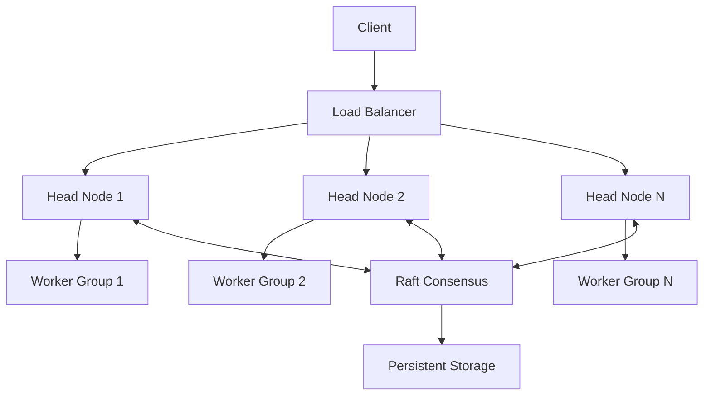

# Multiple Head Node Support for Ray Clusters

## Overview
This document outlines the design for supporting multiple head nodes in Ray clusters to enable massive scaling (10K+ worker nodes). The design covers architectural changes, implementation details, and testing strategies.

## Table of Contents
1. [Architecture](#architecture)
2. [Components](#components)
3. [Implementation Details](#implementation-details)
4. [Testing Strategy](#testing-strategy)
5. [Migration Guide](#migration-guide)
6. [Performance Considerations](#performance-considerations)

## Architecture

### High-Level Design


### Key Components

#### 1. Raft-Based GCS Coordination
- Multiple GCS instances form a Raft group
- Leader election for coordination
- State replication across GCS instances
- Fault tolerance and recovery

#### 2. Sharded Resource Management
- Resources distributed across head nodes
- Consistent hashing for resource assignment
- Dynamic rebalancing of resources
- Cross-head node resource coordination

#### 3. Load Balancing
- Client request distribution
- Worker node assignment
- Resource allocation optimization
- Health-based routing

#### 4. State Management
- Distributed state storage
- State synchronization
- Conflict resolution
- Recovery mechanisms

## Components

### 1. RaftGcsCoordinator
```cpp
class RaftGcsCoordinator {
    // Raft group management
    std::unique_ptr<RaftGroup<ConsensusState>> raft_group_;
    
    // Configuration
    RaftConfig config_;
    
    // State management
    void SubmitUpdate(const StateUpdate &update);
    void SyncState(const ConsensusState &state);
    
    // Leader election
    void HandleLeaderElection(bool is_leader);
};
```

### 2. ShardedResourceManager
```cpp
class ShardedResourceManager {
    // Resource sharding
    std::vector<ResourceShard> shards;
    
    // Resource assignment
    void assign_resources();
    
    // Resource updates
    void handle_resource_update();
    
    // Rebalancing
    void rebalance_resources();
};
```

### 3. LoadBalancer
```cpp
class LoadBalancer {
    // Request distribution
    void distribute_requests();
    
    // Health checking
    void check_health();
    
    // Dynamic routing
    void update_routing();
};
```

## Implementation Details

### 1. Core Components

#### a. RaftGcsCoordinator
```cpp
class RaftGcsCoordinator {
    // Raft group management
    std::unique_ptr<RaftGroup<ConsensusState>> raft_group_;
    
    // Configuration
    RaftConfig config_;
    
    // State management
    void SubmitUpdate(const StateUpdate &update);
    void SyncState(const ConsensusState &state);
    
    // Leader election
    void HandleLeaderElection(bool is_leader);
};
```

#### b. RaftGroup
```cpp
template <typename State>
class RaftGroup {
    // Leader election
    int64_t election_timeout_;
    int64_t heartbeat_interval_;
    
    // State management
    std::vector<LogEntry> log_;
    State current_state_;
    
    // Follower tracking
    std::map<std::string, FollowerInfo> followers_;
    
    // Network operations
    void SendHeartbeats();
    void HandleVoteRequest(const VoteRequest &request);
    void HandleAppendEntriesRequest(const AppendEntriesRequest &request);
};
```

#### c. RaftNetwork
```cpp
class RaftNetwork {
    // Network configuration
    instrumented_io_context &io_context_;
    const RaftConfig &config_;
    
    // Connection management
    boost::asio::ip::tcp::acceptor acceptor_;
    std::unordered_map<std::string, std::shared_ptr<boost::asio::ip::tcp::socket>> sockets_;
    
    // Message handling
    void SendVoteRequest(const std::string &target_node_id, const VoteRequest &request);
    void SendAppendEntriesRequest(const std::string &target_node_id, const AppendEntriesRequest &request);
};
```

#### d. RaftStorage
```cpp
class RaftStorage {
    // State persistence
    virtual Status SaveCurrentTerm(int64_t term) = 0;
    virtual Status SaveLogEntry(const LogEntry &entry) = 0;
    virtual Status SaveSnapshot(const Snapshot &snapshot) = 0;
    
    // State recovery
    virtual Status LoadCurrentTerm(int64_t *term) = 0;
    virtual Status LoadLogEntries(std::vector<LogEntry> *entries) = 0;
    virtual Status LoadSnapshot(Snapshot *snapshot) = 0;
};
```

### 2. State Management

#### a. ConsensusState
```cpp
class ConsensusState {
    // Current term and leader
    int64_t term;
    std::string leader_id;
    
    // Cluster state
    ResourceView resource_view;
    ActorTable actor_table;
    TaskTable task_table;
    NodeTable node_table;
    PlacementGroupTable placement_group_table;
    
    // Serialization
    bool SerializeToString(std::string *output) const;
    bool ParseFromString(const std::string &input);
};
```

#### b. State Updates
```cpp
class StateUpdate {
    enum class Type : std::uint8_t {
        RESOURCE_UPDATE,
        ACTOR_UPDATE,
        TASK_UPDATE,
        NODE_UPDATE,
        PLACEMENT_GROUP_UPDATE
    };
    
    Type type;
    std::string data;
    
    void ApplyTo(ConsensusState &state) const;
};
```

### 3. Network Protocol

#### a. Message Types
```protobuf
// Raft configuration
message RaftConfig {
    string node_id = 1;
    repeated string node_addresses = 2;
    int64 election_timeout = 3;
    int64 heartbeat_interval = 4;
    int64 max_log_entries = 5;
    int64 snapshot_interval = 6;
}

// Log entry
message LogEntry {
    int64 term = 1;
    int64 index = 2;
    StateUpdate update = 3;
}

// Vote request/response
message VoteRequest {
    int64 term = 1;
    string candidate_id = 2;
    int64 last_log_index = 3;
    int64 last_log_term = 4;
}

message VoteResponse {
    int64 term = 1;
    bool vote_granted = 2;
    string follower_id = 3;
}

// Append entries request/response
message AppendEntriesRequest {
    int64 term = 1;
    string leader_id = 2;
    int64 prev_log_index = 3;
    int64 prev_log_term = 4;
    repeated LogEntry entries = 5;
    int64 leader_commit = 6;
}

message AppendEntriesResponse {
    int64 term = 1;
    bool success = 2;
    string follower_id = 3;
    int64 match_index = 4;
}
```

### 4. Storage Implementation

#### a. Redis Storage
```cpp
class RedisRaftStorage : public RaftStorage {
    // Redis connection
    std::string redis_address_;
    bool is_initialized_;
    
    // State persistence
    Status SaveCurrentTerm(int64_t term) override;
    Status SaveLogEntry(const LogEntry &entry) override;
    Status SaveSnapshot(const Snapshot &snapshot) override;
    
    // State recovery
    Status LoadCurrentTerm(int64_t *term) override;
    Status LoadLogEntries(std::vector<LogEntry> *entries) override;
    Status LoadSnapshot(Snapshot *snapshot) override;
};
```

### 5. Build Configuration

#### a. Dependencies
```python
ray_cc_library(
    name = "raft_types",
    deps = [
        "//src/ray/common:status",
        "//src/ray/protobuf:raft_cc_proto",
        "//src/ray/protobuf:gcs_tables_cc_proto",
    ],
)

ray_cc_library(
    name = "raft_network",
    deps = [
        ":raft_types",
        "//src/ray/common:asio",
        "//src/ray/common:status",
        "//src/ray/protobuf:raft_cc_proto",
        "@boost//:asio",
    ],
)
```

## Testing Strategy

### 1. Unit Tests
- Raft coordination
- Resource sharding
- Load balancing
- State management

### 2. Integration Tests
- Multi-head node coordination
- Resource management
- Fault tolerance
- Recovery scenarios

### 3. Performance Tests
- Scalability benchmarks
- Latency measurements
- Resource utilization
- Network bandwidth

### 4. Stress Tests
- Large cluster simulation
- Failure scenarios
- Network partitions
- Resource contention

## Migration Guide

### 1. Configuration Changes
```yaml
cluster_config:
  multi_head:
    enabled: true
    num_head_nodes: 3
    raft_config:
      election_timeout: 1000
      heartbeat_interval: 100
    shard_config:
      num_shards: 10
      rebalance_threshold: 0.8
```

### 2. Deployment Steps
1. Deploy new head nodes
2. Enable Raft coordination
3. Migrate resources
4. Update client configuration

### 3. Rollback Plan
- Maintain backward compatibility
- Version control for state
- Gradual feature rollout
- Monitoring and alerts

## Performance Considerations

### 1. Scalability
- Horizontal scaling of head nodes
- Resource distribution
- Network optimization
- State management efficiency

### 2. Latency
- Request routing optimization
- State synchronization
- Network topology
- Cache management

### 3. Resource Usage
- Memory management
- CPU utilization
- Network bandwidth
- Storage requirements

### 4. Monitoring
- Health metrics
- Performance indicators
- Resource utilization
- Error tracking

## Future Improvements

### 1. Advanced Features
- Dynamic head node scaling
- Advanced load balancing
- Improved fault tolerance
- Enhanced monitoring

### 2. Optimizations
- State compression
- Network optimization
- Cache improvements
- Resource management

### 3. Integration
- Cloud provider integration
- Container orchestration
- Monitoring systems
- Management tools 