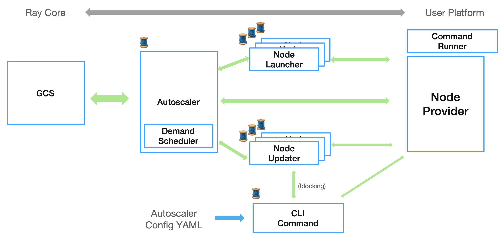

.. _node-provider:

NodeProvider Development Guide 
================================

:Version: 1 (July 19, 2022)
:Authors: - Tingkai Liu (University of Illinois at Urbana-Champaign / IBM)
          - Dmitri Gekhtman (Anyscale)

This section provides development guide on how to implement the NodeProvider interface to enable Ray cluster launcher and autoscaler on a customize platform. 

The :ref:`APIs <APIs>` are classified into 3 main catagories:

1. Cluster config
.. parsed-literal::

    bootstrap_config()
    fillout_available_node_types_resources()
    prepare_for_head_node()
    max_terminate_nodes()
    is_readonly()

2. Node operations (creation, setup, and termination)
.. parsed-literal::

    create_node()
    create_node_with_resources()
    get_command_runner()
    terminate_node()
    terminate_nodes()

3. Node info setting and query
.. parsed-literal::

    non_terminated_nodes()
    is_running()
    is_terminated()
    set_node_tags()
    node_tags()
    external_ip()
    internal_ip()
    get_node_id()

The following guides aims to assist the implementation of those APIs. 

Node Information
------------------------

Node information includes node id, node states, and node tags. Additional information could also be stored for customize usage.

Node id
^^^^^^^^^^^^^^^^^^^^^^^^

Node ids should be unqiue for every node.  

Node states
^^^^^^^^^^^^^^^^^^^^^^^^

Nodes may be in one of three states: {pending, running, terminated}. 
    * pending: The node has been created, but haven't started the Ray runtime
    * running: The node has active Ray runtime
    * terminated: The node has been terminated

The states may be represented in any kind of format internally, as long as is_running(), is_terminated(), and non_terminate_nodes() reflects them correctly. 

Node tags
^^^^^^^^^^^^^^^^^^^^^^^^

Node tags are formatted as Dict[str, str], with key to be tag name and value to be tag value. For example, a node can have tag:

``
{TAG_RAY_NODE_KIND  : NODE_KIND_WORKER, TAG_RAY_NODE_STATUS: STATUS_UP_TO_DATE}
``

where "TAG_RAY_NODE_KIND" and "TAG_RAY_NODE_STATUS" are the tag names, and "NODE_KIND_WORKER" and "STATUS_UP_TO_DATE" are the tag values for this node. If tag-specific operations are needed, which is not common, see ray.autoscaler.tags for detail tag names and values. 

Autoscaler Assumptions
------------------------

Assumptions made by the autoscaler that NodeProvider should follow:

#. NodeProviders are namespaced by the `cluster_name` parameter; they only operate on nodes within that namespace.
#. The "nodes" are VM-like that could run setup commands remotely (such as via SSH) and receive remote file mount (such as via rsync) using a command runner. 
#. The node creation and node setup are done in seperate steps.
#. The IP addresses of the nodes are unique. Altough GCS uses ip+port to distinguish different nodes, the autoscaler uses only IPs and rely on it to collect node statistics.
#. External_ips are used in "Ray up" when starting the head node. Internal_ips are used for communication within the cluster.
#. Nodes should appear immediately once started by `create_node`, and transition immediately to terminated when `terminate_node` is called. This means any APIs, that are affected by the nodes states, especially non_terminate_nodes(), should reflect the changes immediately.
#. Node tags should be readable by node_tags() immediately after set_node_tags() returns.  
#. The instance of this class can be constructed and destructed from multiple threads simultaneously. As a result:

    1. All data operations should be thread-safe
    2. State information should not be stored as class variables that are lost when the class instance is destructed

Autoscaler Config YAML
------------------------

A customized NodeProvider goes with a customized autoscaler YAML. Besides the parts that is required by the launching process and the autoscaler, some parts of the autoscaler config YAML is only used by the NodeProvider class. As a result, those parts can also have any kind of format that helps the implementation of NodeProvider.

The YAML file section that is only used by NodeProvider:

* provider (besides "type" and "module")
* available_node_types.*.node_config
* auth (for command runner)

The autoscaler tries to fill the fields available in the minimal default config, if those fields are not provided. (See ray.autoscaler._private.providers._get_default_config for detail.) The NodeProvider can always modify the config after filled using the cluster config APIs (the first catagories). 

Advance
------------------------

A general overview of how autoscaler is connected to node_provider:

#. The booting process from command line includes: (see autoscaler._private.command)

    1. Fills the autoscaler config 
    2. Start the head node
    3. A modified copy of autoscaling config is copied to the head node. 

#. All the worker nodes are created by autoscaler (a daemon running at the head node, see autoscaler._private.autoscaler), which is not a part of the booting process.
#. The autoscaler start a new thread (node launcher) for each batches of node creation. (see autoscaler._private.node_launcher)
#. The autoscaler start another thread (node updater, which is different from the node creation thread) to set up the nodes. If the node is not ready to run a command, this thread keeps trying until success or raise failure after timeout. (see autoscaler._private.updater)
#. The node termination is done by the main autoscaler thread, based on the node statistic collected from GCS and the failure raises by node updater. 

API Reference
------------------------

.. _APIs: 
.. autoclass:: ray.autoscaler.node_provider.NodeProvider
    :members:
