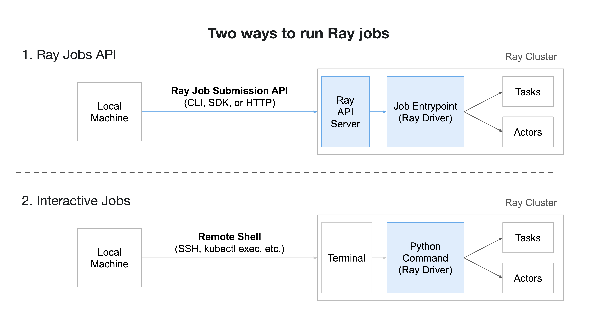

(jobs-overview)=

# Ray Jobs Overview

Once you have deployed a Ray cluster (on [VMs](vm-cluster-quick-start) or [Kubernetes](kuberay-quickstart)), you are ready to run a Ray application!


## Ray Jobs API

The recommended way to run a job on a Ray cluster is to use the *Ray Jobs API*, which consists of a CLI tool, Python SDK, and a REST API.

The Ray Jobs API allows you to submit locally developed applications to a remote Ray Cluster for execution.
It simplifies the experience of packaging, deploying, and managing a Ray application.

A submission to the Ray Jobs API consists of:

1. An entrypoint command, like `python my_script.py`, and
2. A [runtime environment](runtime-environments), which specifies the application's file and package dependencies.

A job can be submitted by a remote client that lives outside of the Ray Cluster.
We will show this workflow in the following user guides.

After a job is submitted, it runs once to completion or failure, regardless of the original submitter's connectivity.
Retries or different runs with different parameters should be handled by the submitter.
Jobs are bound to the lifetime of a Ray cluster, so if the cluster goes down, all running jobs on that cluster will be terminated.

To get started with the Ray Jobs API, check out the [quickstart](jobs-quickstart) guide, which walks you through the CLI tools for submitting and interacting with a Ray Job.
This is suitable for any client that can communicate over HTTP to the Ray Cluster.
If needed, the Ray Jobs API also provides APIs for [programmatic job submission](ray-job-sdk) and [job submission using REST](ray-job-rest-api).

## Retrying failed jobs in place

By default, a submitted job runs once to completion or failure (see the note above). You can instead ask Ray to retry a job's driver *in place* on failure by passing an optional `retry_policy`. An in-place retry re-runs the driver using the **same** `submission_id` and the **same** Ray cluster, after an exponential backoff, instead of failing immediately. This is useful for recovering from transient failures (for example, a driver out-of-memory caused by another process, or a preempted worker) without recreating the cluster.

The `retry_policy` accepts the following fields:

- `max_retries`: Maximum number of retries after the initial attempt. `0` (the default) disables retries.
- `backoff`: Exponential backoff between retries, with `initial_delay_seconds`, `max_delay_seconds`, and `multiplier` (which must be `>= 1`).
- `retry_on`: Conditions under which to retry. One or more of `"NON_ZERO_EXIT"` (any non-zero driver exit code) and `"DRIVER_OOM"` (a driver that appears to have been OOM-killed). Defaults to `["NON_ZERO_EXIT"]`.
- `no_retry_on_exit_codes`: Driver exit codes that should never be retried. Takes precedence over `retry_on`.

For example, using the Python SDK:

```python
from ray.job_submission import JobSubmissionClient

client = JobSubmissionClient("http://127.0.0.1:8265")
submission_id = client.submit_job(
    entrypoint="python my_script.py",
    retry_policy={
        "max_retries": 3,
        "backoff": {
            "initial_delay_seconds": 30,
            "max_delay_seconds": 600,
            "multiplier": 2.0,
        },
        "retry_on": ["NON_ZERO_EXIT", "DRIVER_OOM"],
        "no_retry_on_exit_codes": [130],
    },
)
```

While retrying, the job stays in the `RUNNING` state and its `attempt_number` is incremented (observable through the status APIs). Only a terminal `SUCCEEDED` or `FAILED` state is written once retries are exhausted or the job succeeds.

```{note}
In-place retries recover from driver and worker failures on the existing cluster. A head node failure still requires the cluster to be restarted, which is outside the scope of `retry_policy`.
```

## Running Jobs Interactively

If you would like to run an application *interactively* and see the output in real time (for example, during development or debugging), you can:

- (Recommended) Run your script directly on a cluster node (e.g. after SSHing into the node using [`ray attach`](ray-attach-doc)), or
- (For Experts only) Use [Ray Client](ray-client-ref) to run a script from your local machine while maintaining a connection to the cluster.

Note that jobs started in these ways are not managed by the Ray Jobs API, so the Ray Jobs API will not be able to see them or interact with them (with the exception of `ray job list` and `JobSubmissionClient.list_jobs()`).

## Contents

```{toctree}
:maxdepth: '1'

quickstart
sdk
jobs-package-ref
cli
rest
ray-client
```
