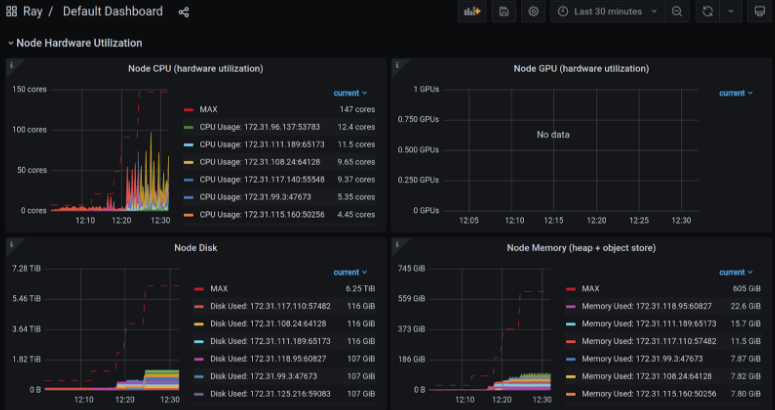

Cluster Monitoring
------------------

Ray ships with the following observability features:

1. :ref:`The dashboard <ray-dashboard>`, for viewing cluster state.
2. CLI tools such as the :ref:`Ray state APIs <state-api-overview-ref>` and :ref:`ray status <monitor-cluster>`, for checking application and cluster status.
3. :ref:`Prometheus metrics <multi-node-metrics>` for internal and custom user-defined metrics.

For more information on these tools, check out the more comprehensive :ref:`Observability guide <observability>`.

The rest of this page will focus on how to access these services when running a Ray Cluster.

.. _monitor-cluster-via-dashboard:

Monitoring the cluster via the dashboard
^^^^^^^^^^^^^^^^^^^^^^^^^^^^^^^^^^^^^^^^

:ref:`The dashboard <ray-dashboard>` provides detailed information about the state of the cluster,
including the running jobs, actors, workers, nodes, etc.
By default, the :ref:`cluster launcher <vm-cluster-quick-start>` and :ref:`KubeRay operator <kuberay-quickstart>` will launch the dashboard, but will
not publicly expose the port.

.. tab-set::

    .. tab-item:: If using the VM cluster launcher

        You can securely port-forward local traffic to the dashboard via the ``ray
        dashboard`` command.

        .. code-block:: shell

            $ ray dashboard [-p <port, 8265 by default>] <cluster config file>

        The dashboard will now be visible at ``http://localhost:8265``.

    .. tab-item:: If using Kubernetes

        The KubeRay operator makes the dashboard available via a Service targeting
        the Ray head pod, named ``<RayCluster name>-head-svc``. You can access the
        dashboard from within the Kubernetes cluster at ``http://<RayCluster name>-head-svc:8265``.

        You can also view the dashboard from outside the Kubernetes cluster by
        using port-forwarding:

        .. code-block:: shell

            $ kubectl port-forward service/raycluster-autoscaler-head-svc 8265:8265

        For more information about configuring network access to a Ray cluster on
        Kubernetes, see the :ref:`networking notes <kuberay-networking>`.

Using Ray Cluster CLI tools
^^^^^^^^^^^^^^^^^^^^^^^^^^^

Ray provides several CLI tools for observing the current cluster and
application state.  The ``ray status`` command provides information about the
current status of nodes in the cluster, as well as information about
autoscaling. Other Ray CLI tools allow you to read logs across the cluster and
summarize application state such as the currently running tasks and actors.
These tools are summarized :ref:`here <state-api-overview-ref>`.

These CLI commands can be run on any node in a Ray Cluster. Examples for
executing these commands from a machine outside the Ray Cluster are provided
below.

.. tab-set::

    .. tab-item:: If using the VM cluster launcher

        Execute a command on the cluster using ``ray exec``:

        .. code-block:: shell

            $ ray exec <cluster config file> "ray status"

    .. tab-item:: If using Kubernetes

        Execute a command on the cluster using ``kubectl exec`` and the configured
        RayCluster name. We will use the Service targeting the Ray head pod to
        execute a CLI command on the cluster.

        .. code-block:: shell

            # First, find the name of the Ray head service.
            $ kubectl get pod | grep <RayCluster name>-head
            # NAME                                             READY   STATUS    RESTARTS   AGE
            # <RayCluster name>-head-xxxxx                     2/2     Running   0          XXs

            # Then, use the name of the Ray head service to run `ray status`.
            $ kubectl exec <RayCluster name>-head-xxxxx -- ray status

.. _multi-node-metrics:

Prometheus
^^^^^^^^^^
Ray supports Prometheus for emitting and recording time-series metrics.
See :ref:`metrics <ray-metrics>` for more details of the metrics emitted.
To use Prometheus in a Ray cluster, decide where to host it, then configure
it so that it can scrape the metrics from Ray.

Scraping metrics
################

Ray runs a metrics agent per node to export :ref:`metrics <ray-metrics>` about Ray core as well as
custom user-defined metrics. Each metrics agent collects metrics from the local
node and exposes these in a Prometheus format. You can then scrape each
endpoint to access Ray's metrics.

To scrape the endpoints, we need to ensure service discovery, allowing
Prometheus to find the metrics agents' endpoints on each node.

Auto-discovering metrics endpoints
##################################

You can allow Prometheus to dynamically find endpoints it should scrape by using Prometheus' `file based service discovery <https://prometheus.io/docs/guides/file-sd/#installing-configuring-and-running-prometheus>`_.
This is the recommended way to export Prometheus metrics when using the Ray :ref:`cluster launcher <vm-cluster-quick-start>`, as node IP addresses can often change as the cluster scales up and down.

Ray auto-generates a Prometheus `service discovery file <https://prometheus.io/docs/guides/file-sd/#installing-configuring-and-running-prometheus>`_ on the head node to facilitate metrics agents' service discovery.
This allows you to scrape all metrics in the cluster without knowing their IPs. Let's walk through how to acheive this.

The service discovery file is generated on the :ref:`head node <cluster-head-node>`. On this node, look for ``/tmp/ray/prom_metrics_service_discovery.json`` (or the eqiuvalent file if using a custom Ray ``temp_dir``).
Ray will periodically update this file with the addresses of all metrics agents in the cluster.

Ray automatically produces a Prometheus config which scrapes the file for service discovery found at `/tmp/ray/session_latest/metrics/prometheus/prometheus.yml`.
You can choose to use this config or modify your own to enable this behavior. The details of the config can be seen below and full documentation can be found at `here <https://prometheus.io/docs/prometheus/latest/configuration/configuration/>`.

With this config, Prometheus will automatically update the addresses that it scrapes based on the contents of Ray's service discovery file.

.. code-block:: yaml

    # Prometheus config file

    # my global config
    global:
      scrape_interval:     2s
      evaluation_interval: 2s

    # Scrape from Ray.
    scrape_configs:
    - job_name: 'ray'
      file_sd_configs:
      - files:
        - '/tmp/ray/prom_metrics_service_discovery.json'

Manually discovering metrics endpoints
######################################

If you already know the IP addresses of all nodes in your Ray Cluster, you can
configure Prometheus to read metrics from a static list of endpoints. To
do this, first set a fixed port that Ray should use to export metrics.  If
using the cluster launcher, pass ``--metrics-export-port=<port>`` to ``ray
start``.  If using KubeRay, you can specify
``rayStartParams.metrics-export-port`` in the RayCluster configuration file.
The port must be specified on all nodes in the cluster.

If you do not know the IP addresses of the nodes in your Ray cluster,
you can also programmatically discover the endpoints by reading the
Ray Cluster information. Here, we will use a Python script and the
``ray.nodes()`` API to find the metrics agents' URLs, by combining the
``NodeManagerAddress`` with the ``MetricsExportPort``. For example:

.. code-block:: python

    # On a cluster node:
    import ray
    ray.init()
    from pprint import pprint
    pprint(ray.nodes())

    """
    The <NodeManagerAddress>:<MetricsExportPort> from each of these entries
    should be passed to Prometheus.
    [{'Alive': True,
      'MetricsExportPort': 8080,
      'NodeID': '2f480984702a22556b90566bdac818a4a771e69a',
      'NodeManagerAddress': '192.168.1.82',
      'NodeManagerHostname': 'host2.attlocal.net',
      'NodeManagerPort': 61760,
      'ObjectManagerPort': 61454,
      'ObjectStoreSocketName': '/tmp/ray/session_2020-08-04_18-18-16_481195_34255/sockets/plasma_store',
      'RayletSocketName': '/tmp/ray/session_2020-08-04_18-18-16_481195_34255/sockets/raylet',
      'Resources': {'CPU': 1.0,
                    'memory': 123.0,
                    'node:192.168.1.82': 1.0,
                    'object_store_memory': 2.0},
      'alive': True},
    {'Alive': True,
     'MetricsExportPort': 8080,
     'NodeID': 'ce6f30a7e2ef58c8a6893b3df171bcd464b33c77',
     'NodeManagerAddress': '192.168.1.82',
     'NodeManagerHostname': 'host1.attlocal.net',
     'NodeManagerPort': 62052,
     'ObjectManagerPort': 61468,
     'ObjectStoreSocketName': '/tmp/ray/session_2020-08-04_18-18-16_481195_34255/sockets/plasma_store.1',
     'RayletSocketName': '/tmp/ray/session_2020-08-04_18-18-16_481195_34255/sockets/raylet.1',
     'Resources': {'CPU': 1.0,
                    'memory': 134.0,
                    'node:192.168.1.82': 1.0,
                    'object_store_memory': 2.0},
     'alive': True}]
    """

.. _multi-node-metrics-grafana:

Grafana
^^^^^^^
Ray dashboard integrates with Grafana to show visualizations of time-series metrics.

First decide where to host Grafana. A common location is on the head node of the cluster.
See :ref:`instructions <grafana>` for installing Grafana and using the default Grafana configurations
exported by Ray.

Next, the head node must be able to access Prometheus and Grafana, and the browser of the dashboard user
must be able to access Grafana. Configure these settings using the `RAY_GRAFANA_HOST`, `RAY_PROMETHEUS_HOST`,
and `RAY_GRAFANA_IFRAME_HOST` environment variables.

* Set `RAY_GRAFANA_HOST` to an address that the head node can use to access Grafana.
* Set `RAY_PROMETHEUS_HOST` to an address the head node can use to access Prometheus.
*  You can set`RAY_GRAFANA_IFRAME_HOST` to an address for the user's browsers to access Grafana. By default, `RAY_GRAFANA_IFRAME_HOST` is equal to `RAY_GRAFANA_HOST`.

For example, if the IP of the head node is 55.66.77.88 and Grafana is hosted on port 3000. Set the value
to `RAY_GRAFANA_HOST=55.66.77.88:3000`.

.. _multi-node-metrics-grafana-existing:

Using an existing Grafana instance
##################################

To use an existing Grafana instance, set up the environment variable `RAY_GRAFANA_HOST` environment variable with a URL of your Grafana, before starting your Ray cluster. After starting Ray, find the Grafana dashboard JSON at `/tmp/ray/session_latest/metrics/grafana/dashboards/default_grafana_dashboard.json`. `Import this dashboard <https://grafana.com/docs/grafana/latest/dashboards/manage-dashboards/#import-a-dashboard>`_ to your Grafana.

If Grafana reports that datasource is not found, you can `add a datasource variable <https://grafana.com/docs/grafana/latest/dashboards/variables/add-template-variables/?pg=graf&plcmt=data-sources-prometheus-btn-1#add-a-data-source-variable>`_ and using `JSON model view <https://grafana.com/docs/grafana/latest/dashboards/build-dashboards/modify-dashboard-settings/#view-dashboard-json-model>`_ change all values of `datasource` key in the imported `default_grafana_dashboard.json` to the name of the variable. For example, if the variable name is `data_source`, all `"datasource"` mappings should be:

.. code-block:: json

  "datasource": {
    "type": "prometheus",
    "uid": "$data_source"
  }

When existing Grafana instance requires user authentication, the following settings have to be in its `configuration file <https://grafana.com/docs/grafana/latest/setup-grafana/configure-grafana/>`_ to correctly embed in Ray dashboard:

.. code-block:: ini

  [security]
  allow_embedding = true
  cookie_secure = true
  cookie_samesite = none

If Grafana is exposed via nginx ingress on Kubernetes cluster, the following line should be present in the Grafana ingress annotation:

.. code-block:: yaml

  nginx.ingress.kubernetes.io/configuration-snippet: |
      add_header X-Frame-Options SAMEORIGIN always;

When both Grafana and Ray cluster are on the same Kubernetes cluster, it is important to set `RAY_GRAFANA_HOST` to the external URL of the Grafana ingress. For successful embedding, `RAY_GRAFANA_HOST` needs to be accessible to both Ray cluster backend and Ray dashboard frontend:

* On the backend, *Ray cluster head* does health checks on Grafana. Hence `RAY_GRAFANA_HOST` needs to be accessible in the Kubernetes pod which is running the head node.
* When accessing *Ray dashboard* from the browser, frontend embeds Grafana dashboard using the URL specified in `RAY_GRAFANA_HOST`. Hence `RAY_GRAFANA_HOST` needs to be accessible from the browser as well.
