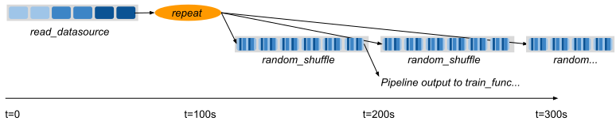

.. _data_pipeline_usage:

--------------------------
Advanced Pipeline Examples
--------------------------

This page covers more advanced examples for dataset pipelines.

.. _dataset-pipeline-per-epoch-shuffle:

Pre-repeat vs post-repeat transforms
====================================

Transformations prior to the call to ``.repeat()`` will be cached. However, note that the initial read will not be cached unless there is a subsequent transformation or ``.fully_executed()`` call. Transformations made to the DatasetPipeline after the repeat will always be executed once for each repetition of the Dataset.

For example, in the following pipeline, the ``map(func)`` transformation only occurs once. However, the random shuffle is applied to each repetition in the pipeline. However, if we omitted the map transformation, then the pipeline would re-read from the base data on each repetition.

.. note::
  Global per-epoch shuffling is an expensive operation that will slow down your ML
  ingest pipeline, prevents you from using a fully-streaming ML ingest pipeline, and
  can cause large increases in memory utilization and spilling to disk; only use
  global per-epoch shuffling if your model benefits from it! If your model doesn't
  benefit from global per-epoch shuffling and/or you run into performance or stability
  issues, you should try out windowed or local per-epoch shuffling.

**Code**:

.. code-block:: python

    # Create a pipeline that loops over its source dataset indefinitely.
    pipe: DatasetPipeline = ray.data \
        .read_datasource(...) \
        .map(func) \
        .repeat() \
        .random_shuffle_each_window()

    @ray.remote(num_gpus=1)
    def train_func(pipe: DatasetPipeline):
        model = MyModel()
        for batch in pipe.iter_torch_batches():
            model.fit(batch)

    # Read from the pipeline in a remote training function.
    ray.get(train_func.remote(pipe))

**Pipeline**:

.. important::

    Result caching only applies if there are *transformation* stages prior to the pipelining operation. If you ``repeat()`` or ``window()`` a Dataset right after the read call (e.g., ``ray.data.read_parquet(...).repeat()``), then the read will still be re-executed on each repetition. This optimization saves memory, at the cost of repeated reads from the datasource. To force result caching in all cases, use ``.fully_executed().repeat()``.

Changing Pipeline Structure
===========================

Sometimes, you may want to change the structure of an existing pipeline. For example, after generating a pipeline with ``ds.window(k)``, you may want to repeat that windowed pipeline ``n`` times. This can be done with ``ds.window(k).repeat(n)``. As another example, suppose you have a repeating pipeline generated with ``ds.repeat(n)``. The windowing of that pipeline can be changed with ``ds.repeat(n).rewindow(k)``. Note the subtle difference in the two examples: the former is repeating a windowed pipeline that has a base window size of ``k``, while the latter is re-windowing a pipeline of initial window size of ``ds.num_blocks()``. The latter may produce windows that span multiple copies of the same original data if ``preserve_epoch=False`` is set:

.. code-block:: python

    # Window followed by repeat.
    ray.data.from_items([0, 1, 2, 3, 4]) \
        .window(blocks_per_window=2) \
        .repeat(2) \
        .show_windows()
    # ->
    # ------ Epoch 0 ------
    # === Window 0 ===
    # 0
    # 1
    # === Window 1 ===
    # 2
    # 3
    # === Window 2 ===
    # 4
    # ------ Epoch 1 ------
    # === Window 3 ===
    # 0
    # 1
    # === Window 4 ===
    # 2
    # 3
    # === Window 5 ===
    # 4

    # Repeat followed by window. Since preserve_epoch=True, at epoch boundaries
    # windows may be smaller than the target size. If it was set to False, all
    # windows except the last would be the target size.
    ray.data.from_items([0, 1, 2, 3, 4]) \
        .repeat(2) \
        .rewindow(blocks_per_window=2, preserve_epoch=True) \
        .show_windows()
    # ->
    # ------ Epoch 0 ------
    # === Window 0 ===
    # 0
    # 1
    # === Window 1 ===
    # 2
    # 3
    # === Window 2 ===
    # 4
    # ------ Epoch 1 ------
    # === Window 3 ===
    # 0
    # 1
    # === Window 4 ===
    # 2
    # 3
    # === Window 5 ===
    # 4

