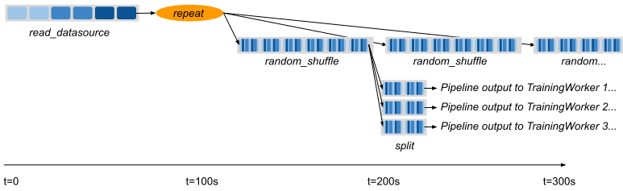

.. _data_pipeline_usage:

-----------------------
Advanced Pipeline Usage
-----------------------

Handling Epochs
===============

It's common in ML training to want to divide data ingest into epochs, or repetitions over the original source dataset.
DatasetPipeline provides a convenient ``.iter_epochs()`` method that can be used to split up the pipeline into epoch-delimited pipeline segments.
Epochs are defined by the last call to ``.repeat()`` in a pipeline, for example:

.. code-block:: python

    pipe = ray.data.from_items([0, 1, 2, 3, 4]) \
        .repeat(3) \
        .random_shuffle_each_window()
    for i, epoch in enumerate(pipe.iter_epochs()):
        print("Epoch {}", i)
        for row in epoch.iter_rows():
            print(row)
    # ->
    # Epoch 0
    # 2
    # 1
    # 3
    # 4
    # 0
    # Epoch 1
    # 3
    # 4
    # 0
    # 2
    # 1
    # Epoch 2
    # 3
    # 2
    # 4
    # 1
    # 0

Note that while epochs commonly consist of a single window, they can also contain multiple windows if ``.window()`` is used or there are multiple ``.repeat()`` calls.

Example: Pipelined Batch Inference
==================================

In this example, we pipeline the execution of a three-stage Dataset application to minimize GPU idle time. Let's revisit the batch inference example from the previous page:

.. code-block:: python

    def preprocess(image: bytes) -> bytes:
        return image

    class BatchInferModel:
        def __init__(self):
            self.model = ImageNetModel()
        def __call__(self, batch: pd.DataFrame) -> pd.DataFrame:
            return self.model(batch)

    # Load data from storage.
    ds: Dataset = ray.data.read_binary_files("s3://bucket/image-dir")

    # Preprocess the data.
    ds = ds.map(preprocess)

    # Apply GPU batch inference to the data.
    ds = ds.map_batches(BatchInferModel, compute="actors", batch_size=256, num_gpus=1)

    # Save the output.
    ds.write_json("/tmp/results")

Ignoring the output, the above script has three separate stages: loading, preprocessing, and inference. Assuming we have a fixed-sized cluster, and that each stage takes 100 seconds each, the cluster GPUs will be idle for the first 200 seconds of execution:

..
  https://docs.google.com/drawings/d/1UMRcpbxIsBRwD8G7hR3IW6DPa9rRSkd05isg9pAEx0I/edit

.. image:: images/dataset-pipeline-1.svg

Enabling Pipelining
===================

We can optimize this by *pipelining* the execution of the dataset with the ``.window()`` call, which returns a DatasetPipeline instead of a Dataset object. The pipeline supports similar transformations to the original Dataset:

.. code-block:: python

    # Convert the Dataset into a DatasetPipeline.
    pipe: DatasetPipeline = ray.data \
        .read_binary_files("s3://bucket/image-dir") \
        .window(blocks_per_window=2)

    # The remainder of the steps do not change.
    pipe = pipe.map(preprocess)
    pipe = pipe.map_batches(BatchInferModel, compute="actors", batch_size=256, num_gpus=1)
    pipe.write_json("/tmp/results")

Here we specified ``blocks_per_window=2``, which means that the Dataset is split into smaller sub-Datasets of two blocks each. Each transformation or *stage* of the pipeline is operating over these two-block Datasets in parallel. This means batch inference processing can start as soon as two blocks are read and preprocessed, greatly reducing the GPU idle time:

.. image:: images/dataset-pipeline-2.svg

Tuning Parallelism
==================

Tune the throughput vs latency of your pipeline with the ``blocks_per_window`` setting. As a rule of thumb, higher parallelism settings perform better, however ``blocks_per_window == num_blocks`` effectively disables pipelining, since the DatasetPipeline will only contain a single Dataset. The other extreme is setting ``blocks_per_window=1``, which minimizes the latency to initial output but only allows one concurrent transformation task per stage:

.. image:: images/dataset-pipeline-3.svg

.. _dataset-pipeline-per-epoch-shuffle:

Per-Epoch Shuffle Pipeline
==========================
.. tip::

    If you interested in distributed ingest for deep learning, it is
    recommended to use Ray Datasets in conjunction with :ref:`Ray Train <train-docs>`.
    See the :ref:`example below<dataset-pipeline-ray-train>` for more info.

..
  https://docs.google.com/drawings/d/1vWQ-Zfxy2_Gthq8l3KmNsJ7nOCuYUQS9QMZpj5GHYx0/edit

The other method of creating a pipeline is calling ``.repeat()`` on an existing Dataset.
This creates a DatasetPipeline over an infinite sequence of the same original Dataset.
Readers pulling batches from the pipeline will see the same data blocks repeatedly, which is useful for distributed training.

Pre-repeat vs post-repeat transforms
====================================

Transformations made prior to the Dataset prior to the call to ``.repeat()`` are executed once. Transformations made to the DatasetPipeline after the repeat will be executed once for each repetition of the Dataset.

For example, in the following pipeline, the datasource read only occurs once. However, the random shuffle is applied to each repetition in the pipeline.

**Code**:

.. code-block:: python

    # Create a pipeline that loops over its source dataset indefinitely.
    pipe: DatasetPipeline = ray.data \
        .read_datasource(...) \
        .repeat() \
        .random_shuffle_each_window()

    @ray.remote(num_gpus=1)
    def train_func(pipe: DatasetPipeline):
        model = MyModel()
        for batch in pipe.to_torch():
            model.fit(batch)

    # Read from the pipeline in a remote training function.
    ray.get(train_func.remote(pipe))

**Pipeline**:

Splitting pipelines for distributed ingest
==========================================

Similar to how you can ``.split()`` a Dataset, you can also split a DatasetPipeline with the same method call. This returns a number of DatasetPipeline shards that share a common parent pipeline. Each shard can be passed to a remote task or actor.

**Code**:

.. code-block:: python

    # Create a pipeline that loops over its source dataset indefinitely.
    pipe: DatasetPipeline = ray.data \
        .read_parquet("s3://bucket/dir") \
        .repeat() \
        .random_shuffle_each_window()

    @ray.remote(num_gpus=1)
    class TrainingWorker:
        def __init__(self, rank: int, shard: DatasetPipeline):
            self.rank = rank
            self.shard = shard
        ...

    shards: List[DatasetPipeline] = pipe.split(n=3)
    workers = [TrainingWorker.remote(rank, s) for rank, s in enumerate(shards)]
    ...

**Pipeline**:

.. _dataset-pipeline-ray-train:

Distributed Ingest with Ray Train
=================================

Ray Datasets integrates with :ref:`Ray Train <train-docs>`, further simplifying your distributed ingest pipeline.

Ray Train is a lightweight library for scalable deep learning on Ray.

1. It allows you to focus on the training logic and automatically handles distributed setup for your framework of choice (PyTorch, Tensorflow, or Horovod).
2. It has out of the box fault-tolerance and elastic training
3. And it comes with support for standard ML tools and features that practitioners love such as checkpointing and logging.

**Code**

.. code-block:: python

    def train_func():
        # This is a dummy train function just iterating over the dataset shard.
        # You should replace this with your training logic.
        shard = ray.train.get_dataset_shard()
        for row in shard.iter_rows():
            print(row)

    # Create a pipeline that loops over its source dataset indefinitely.
    pipe: DatasetPipeline = ray.data \
        .read_parquet(...) \
        .repeat() \
        .random_shuffle_each_window()

    # Pass in the pipeline to the Trainer.
    # The Trainer will automatically split the DatasetPipeline for you.
    trainer = Trainer(num_workers=8, backend="torch")
    result = trainer.run(
        train_func,
        config={"worker_batch_size": 64, "num_epochs": 2},
        dataset=pipe)

Ray Train is responsible for the orchestration of the training workers and will automatically split the Dataset for you.
See :ref:`the Train User Guide <train-dataset-pipeline>` for more details.

Changing Pipeline Structure
===========================

Sometimes, you may want to change the structure of an existing pipeline. For example, after generating a pipeline with ``ds.window(k)``, you may want to repeat that windowed pipeline ``n`` times. This can be done with ``ds.window(k).repeat(n)``. As another example, suppose you have a repeating pipeline generated with ``ds.repeat(n)``. The windowing of that pipeline can be changed with ``ds.repeat(n).rewindow(k)``. Note the subtle difference in the two examples: the former is repeating a windowed pipeline that has a base window size of ``k``, while the latter is re-windowing a pipeline of initial window size of ``ds.num_blocks()``. The latter may produce windows that span multiple copies of the same original data if ``preserve_epoch=False`` is set:

.. code-block:: python

    # Window followed by repeat.
    ray.data.from_items([0, 1, 2, 3, 4]) \
        .window(blocks_per_window=2) \
        .repeat(2) \
        .show_windows()
    # ->
    # ------ Epoch 0 ------
    # === Window 0 ===
    # 0
    # 1
    # === Window 1 ===
    # 2
    # 3
    # === Window 2 ===
    # 4
    # ------ Epoch 1 ------
    # === Window 3 ===
    # 0
    # 1
    # === Window 4 ===
    # 2
    # 3
    # === Window 5 ===
    # 4

    # Repeat followed by window. Since preserve_epoch=True, at epoch boundaries
    # windows may be smaller than the target size. If it was set to False, all
    # windows except the last would be the target size.
    ray.data.from_items([0, 1, 2, 3, 4]) \
        .repeat(2) \
        .rewindow(blocks_per_window=2, preserve_epoch=True) \
        .show_windows()
    # ->
    # ------ Epoch 0 ------
    # === Window 0 ===
    # 0
    # 1
    # === Window 1 ===
    # 2
    # 3
    # === Window 2 ===
    # 4
    # ------ Epoch 1 ------
    # === Window 3 ===
    # 0
    # 1
    # === Window 4 ===
    # 2
    # 3
    # === Window 5 ===
    # 4

