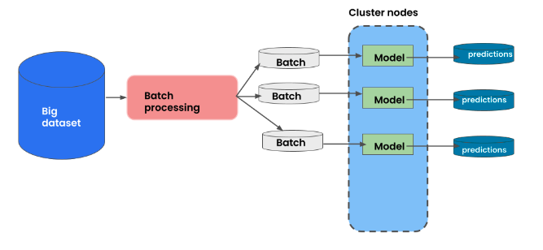
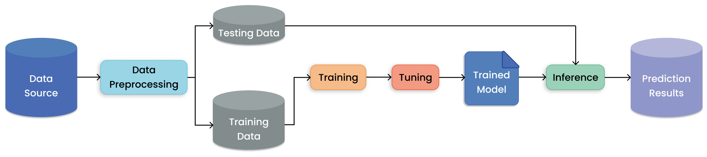

.. _batch_inference_home:

Running Batch Inference
=======================

.. note::

    In this tutorial you'll learn what batch inference is, why you might want to use
    Ray for it, and how to use Ray Data effectively for this task.
    If you are familiar with the basics of inference tasks, jump straight to
    code in the :ref:`quickstart section <batch_inference_quickstart>` or the
    :ref:`advanced guide<batch_inference_advanced_pytorch_example>`.

Batch inference refers to generating model predictions on a set of input data.
The model can range from a simple Python function to a complex neural network.
In batch inference, also known as offline inference, your model is run on a large
batch of data on demand.
This is in contrast to online inference, where the model is run immediately on a
data point when it becomes available.

Here's a simple schematic of batch inference, "mapping" batches to predictions
via model inference:

  Evaluating a batch of input data with a model to get predictions.

Batch inference is a foundational workload for many AI companies, especially since
more and more pre-trained models become available.
And while batch inference looks simple at the surface, it can be challenging to do right in production.
For instance, your data batches can be excessively large, too slow to process sequentially,
or might need custom preprocessing before being fed into your models.
To run inference workloads effectively at scale, you need to:

- manage your compute infrastructure and cloud clusters
- parallelize data processing and utilize all your cluster resources (CPUs and GPUs)
- efficiently transfer data between cloud storage, CPUs for preprocessing, and GPUs for model inference

Here's a realistic view of batch inference for modern AI applications:

  Evaluating a batch of input data with a model to get predictions.

Why use Ray Data for batch inference?
-------------------------------------

There are reasons to use Ray for batch inference, even if your current
use case does not require scaling yet:

1. **Faster and Cheaper for modern Deep Learning Applications**:
    Ray is built for
    complex workloads and supports loading and preprocessing data with CPUs and model inference on GPUs.
2. **Cloud, framework, and data format agnostic**:
    Ray Data works on any cloud provider or
    any ML framework (like PyTorch and Tensorflow) and does not require a particular file format.
3. **Out of the box scaling**:
    The same code that works on one machine also runs on a
    large cluster without any changes.
4. **Python first**:
    You can express your inference job directly in Python instead of
    YAML files or other formats.

.. _batch_inference_quickstart:

Quick Start
-----------

Install Ray with the data processing library, Ray Data:

.. code-block:: bash

    pip install ray[data]

Running batch inference is conceptually easy and requires three steps:

1. Load your data and optionally apply any preprocessing you need.
2. Define your model for inference.
3. Run inference on your data by using the :meth:`ds.map_batches() <ray.data.Datastream.map_batches>`
   method from Ray Data.

The last step also defines how your batch processing job gets distributed across your (local) cluster.
We start with very simple use cases here and build up to more complex ones in other guides and tutorials.

.. note::

    All advanced use cases ultimately boil down to extensions of the above three steps,
    like loading and storing data from cloud storage, using complex preprocessing functions,
    demanding model setups, additional postprocessing, or other customizations.
    We'll cover these advanced use cases in the next sections.

1. Loading and preprocessing data
~~~~~~~~~~~~~~~~~~~~~~~~~~~~~~~~~

For this quick start guide we use very small, in-memory datasets by
leveraging common Python libraries like NumPy and Pandas.
In general, once you load your data using Ray Data, you also want to apply some preprocessing steps.
We skip this step here for simplicity.
In any case, the result of this step is a Ray Datastream ``ds`` that we can use to run inference on.

.. margin::

    For larger data sets, you can use Ray Data to load data from cloud storage like S3 or GCS.
    We'll cover this later on.

.. tabs::

    .. group-tab:: HuggingFace

        Create a Pandas
        DataFrame with text data to run a GPT-2 model on.

        .. literalinclude:: ./doc_code/hf_quick_start.py
            :language: python
            :start-after: __hf_quickstart_load_start__
            :end-before: __hf_quickstart_load_end__

    .. group-tab:: PyTorch

        Create a NumPy array with 100
        entries, which represents the input to a feed-forward neural network.

        .. literalinclude:: ./doc_code/pytorch_quick_start.py
            :language: python
            :start-after: __pt_quickstart_load_start__
            :end-before: __pt_quickstart_load_end__

    .. group-tab:: TensorFlow

       Create a NumPy array with 100
       entries, which represents the input to a feed-forward neural network.

       .. literalinclude:: ./doc_code/tf_quick_start.py
           :language: python
           :start-after: __tf_quickstart_load_start__
           :end-before: __tf_quickstart_load_end__

2. Setting up your model
~~~~~~~~~~~~~~~~~~~~~~~~

Next, you want to set up your model for inference, by defining a predictor.
The core idea is to define a class that loads your model in its ``__init__`` method and
and implements a ``__call__`` method that takes a batch of data and returns a batch of predictions.
Below you find examples for PyTorch, TensorFlow, and HuggingFace.

.. tabs::

    .. group-tab:: HuggingFace

        .. callout::

            .. literalinclude:: ./doc_code/hf_quick_start.py
                :language: python
                :start-after: __hf_quickstart_model_start__
                :end-before: __hf_quickstart_model_end__

            .. annotations::
                <1> Use the constructor (``__init__``) to initialize your model.

                <2> The ``__call__`` method runs inference on a batch of data.

    .. group-tab:: PyTorch

        .. callout::

            .. literalinclude:: ./doc_code/pytorch_quick_start.py
                :language: python
                :start-after: __pt_quickstart_model_start__
                :end-before: __pt_quickstart_model_end__

            .. annotations::
                <1> Use the constructor (``__init__``) to initialize your model.

                <2> The ``__call__`` method runs inference on a batch of data.

    .. group-tab:: TensorFlow

        .. callout::

            .. literalinclude:: ./doc_code/tf_quick_start.py
                :language: python
                :start-after: __tf_quickstart_model_start__
                :end-before: __tf_quickstart_model_end__

            .. annotations::
                <1> Use the constructor (``__init__``) to initialize your model.

                <2> The ``__call__`` method runs inference on a batch of data.

3. Getting predictions with Ray Data
~~~~~~~~~~~~~~~~~~~~~~~~~~~~~~~~~~~~

Once you have your Ray Datastream ``ds`` and your predictor class, you can use
:meth:`ds.map_batches() <ray.data.Datastream.map_batches>` to get predictions.
``map_batches`` takes your predictor class as an argument and allows you to specify
``compute`` resources by defining the :class:`ActorPoolStrategy <ray.data.ActorPoolStrategy>`.
In the example below, we use two CPUs to run inference in parallel and then print the results.
We cover resource allocation in more detail in :ref:`the configuration section of this guide <batch_inference_config>`.

.. note::

    Defining your :meth:`ds.map_batches() <ray.data.Dataset.map_batches>` function requires
    you to write a Python function that takes a batch of data and returns a batch of predictions.
    An easy way to do this and validate it is to use :meth:`ds.take_batch(N) <ray.data.Dataset.take_batch>` to get a batch of data
    first, and then locally test your predictor function on that batch, without using Ray.
    Once you are happy with the results, you can use the same function in ``map_batches``
    on the full dataset. The examples below show you how.

.. tabs::

    .. group-tab:: HuggingFace

        .. literalinclude:: ./doc_code/hf_quick_start.py
            :language: python
            :start-after: __hf_quickstart_prediction_start__
            :end-before: __hf_quickstart_prediction_end__

    .. group-tab:: PyTorch

        .. literalinclude:: ./doc_code/pytorch_quick_start.py
            :language: python
            :start-after: __pt_quickstart_prediction_start__
            :end-before: __pt_quickstart_prediction_end__

    .. group-tab:: TensorFlow

        .. literalinclude:: ./doc_code/tf_quick_start.py
            :language: python
            :start-after: __tf_quickstart_prediction_start__
            :end-before: __tf_quickstart_prediction_end__

.. _batch_inference_advanced_pytorch_example:

Advanced batch inference guide
------------------------------

 Let's use batch inference on a pre-trained PyTorch model for image classification
to illustrate advanced concepts of batch processing with Ray.

.. important::

    If you want to dive right into example use cases next, consider reading the following
    tutorials next:

    .. grid:: 1 2 3 4
        :gutter: 1
        :class-container: container pb-3

        .. grid-item-card::
            :img-top: /images/ray_logo.png
            :class-img-top: pt-2 w-75 d-block mx-auto fixed-height-img

            .. button-ref:: /data/examples/ocr_example

                Batch OCR processing using Ray Data

        .. grid-item-card::
            :img-top: /images/ray_logo.png
            :class-img-top: pt-2 w-75 d-block mx-auto fixed-height-img

            .. button-ref:: /data/examples/torch_detection

                Fine-tuning an Object Detection Model and using it for Batch Inference

        .. grid-item-card::
            :img-top: /images/ray_logo.png
            :class-img-top: pt-2 w-75 d-block mx-auto fixed-height-img

            .. button-ref:: /data/examples/torch_image_example

                Training an Image Classifier and using it for Batch Inference

Loading data with Ray Data
~~~~~~~~~~~~~~~~~~~~~~~~~~~~~~~

In the quick start guide we glossed over the details of loading data with Ray Data.
Your data might be stored in a variety of formats, and you might want to load it from different sources.
Ray Data supports multiple formats and sources out of the box.
The :ref:`guide to loading data <loading_data>` is the ultimate resource
to learn more about loading data with Ray Data, but we'll cover the basics here, too.

.. hint::

    With Ray Data, you can :ref:`create synthetic data in Python <datastream_generate_data>`,
    :ref:`load data from various storage solutions <datastream_reading_from_storage>` such as S3,
    HDFS, or GCS, using common formats such as CSV, JSON, Text, Images, Binary,
    TFRecords, Parquet, and more. Ray Data also supports reading from common SQL and NoSQL
    databases, and allows you to define your own, custom data sources.

    You can also read :ref:`common Python library formats <datastream_from_in_memory_data_single_node>`
    such as Pandas, NumPy, Arrow, or plain Python objects, as well as from
    :ref:`distributed data processing frameworks <datastream_from_in_memory_data_distributed>`
    such as Spark, Dask, Modin, or Mars.

    Of course, Ray Data also supports :ref:`reading data from common ML frameworks <datastream_from_torch_tf>`
    like PyTorch, TensorFlow or HuggingFace.

.. callout::

    .. literalinclude:: ./doc_code/torch_image_batch_trained.py
        :language: python
        :start-after: __pt_load_start__
        :end-before: __pt_load_end__

    .. annotations::
        <1> We use one gigabyte of image data from the Imagenet dataset from S3.

        <2> We use :func:`read_images <ray.data.read_images>` from Ray Data and limit the number of images to 1000.

The process of loading data with Ray Data is as diverse as the data you have.
For instance, in the example above we didn't load the text labels for our images,
which would require a different data source and loading function.
For any advanced use cases, we recommend you read the
:ref:`guide to loading data <loading_data>`.

Preprocessing with Ray Data
~~~~~~~~~~~~~~~~~~~~~~~~~~~

After loading your data, it often needs to be preprocessed prior to inference.
This may include cropping or resizing images, or tokenizing raw text.

To introduce common terminology, with :ref:`Ray Data <data>` you can define
user-defined functions that transform batches of your data.
As you've seen before, applying these functions via
:meth:`ds.map_batches() <ray.data.Datastream.map_batches>` outputs a new, transformed datastream.

.. note::

    The way we do preprocessing here is conceptually close to how we do batch
    inference, and we use the same :meth:`ds.map_batches() <ray.data.Datastream.map_batches>`
    call from Ray Data to run this task.
    The main difference is that we don't use a machine learning model to transform our data,
    which has some practical consequences. For instance, in the example below we simply
    define a map function that we pass into ``map_batches``, and not a class.

To transform our raw images loaded from S3 in the last step, we use functionality from
the ``torchvision`` package to define a function called ``preprocess_images``.

.. callout::

    .. literalinclude:: ./doc_code/torch_image_batch_trained.py
        :language: python
        :start-after: __pt_preprocess_start__
        :end-before: __pt_preprocess_end__

    .. annotations::
        <1> We compose PyTorch tensor creation with image preprocessing, so that our processed images "fit" into a ``ResNet18`` PyTorch model.

        <2> We then define a simple function to transform batches of raw data accordingly. Note that these batches come as dictionaries of NumPy images stored in the ``"images"`` key.

        <3> Finally, we apply the function to our datastream using ``map_batches``.

.. tip::

    For the full suite of transformations available in Ray Data, read
    :ref:`the data transformation guide <transforming_data>`.

Defining predictors as stateful classes
~~~~~~~~~~~~~~~~~~~~~~~~~~~~~~~~~~~~~~~

One of the key value adds of Ray over other distributed systems is the support for
distributed stateful operations. These stateful operations are especially useful
for inference since the model only needs to be initialized once, instead of per batch.

.. margin::

    In short, running model inference means applying
    :meth:`ds.map_batches() <ray.data.Datastream.map_batches>`
    to a datastream with a trained model as a class.

You've already seen how to do this in the quickstart section of this guide, but now
that you're equipped with more knowledge, let's have a look at how to define a
stateful class with Ray for our pretrained ResNet model:

.. callout::

    .. literalinclude:: ./doc_code/torch_image_batch_trained.py
        :language: python
        :start-after: __pt_model_start__
        :end-before: __pt_model_end__

    .. annotations::
        <1> The ``__init__`` method is used to initialize the model once. Ray takes care of distributing and managing this state for our batch processing task.

        <2> The ``__call__`` method is used to apply the model to a batch of data.

        <3> We're free to use any custom code in a stateful class, and here we prepare the data to run on GPUs.

        <4> Finally, we return the ``"class"`` key of the model predictions as Numpy array.

Scalable inference with Ray Data
~~~~~~~~~~~~~~~~~~~~~~~~~~~~~~~~

To get predictions, we call :meth:`ds.map_batches() <ray.data.Datastream.map_batches>`,
by making sure to specify a :class:`ActorPoolStrategy <ray.data.ActorPoolStrategy>`
which defines how many workers to use for inference.

.. callout::

    .. literalinclude:: ./doc_code/torch_image_batch_trained.py
        :language: python
        :start-after: __pt_prediction_start__
        :end-before: __pt_prediction_end__

    .. annotations::
        <1> In this example we use a total of four Ray Actors to run inference on our datastream.

        <2> Each actor should use one GPU.

To summarize, mapping a function over batches is the simplest transform for Ray Datastreams.
The function defines the logic for transforming individual batches of data of the datastream
Performing operations over batches of data is more performant than single element
operations as it can leverage the underlying vectorization capabilities of Pandas or NumPy.

.. note::

    You can use :meth:`ds.map_batches() <ray.data.Datastream.map_batches>` on functions, too.
    This is mostly useful for quick transformations of your data that doesn't require
    an ML model or other stateful objects.
    To handle state, using classes like we did above is the recommended way.
    In the dropdown below you find an example of mapping data with a simple Python
    function.

    .. dropdown:: Example using ``map_batches`` with functions

        This example transforms example data using a simple Python function.
        The ``map_function`` uses the fact that our ``data`` batches in this particular
        example are Pandas dataframes.
        Note that by using a map function instead of a class, we don't have to define
        :class:`ActorPoolStrategy <ray.data.ActorPoolStrategy>` to specify compute resources.

        .. literalinclude:: ./doc_code/batch_formats.py
            :language: python
            :start-after: __simple_map_function_start__
            :end-before: __simple_map_function_end__

.. _batch_inference_formats:

Working with batch formats
--------------------------

Now that you've seen examples of batch inference with Ray, let's have a closer look
at how to deal with different data formats for batches.
First of all, you need to distinguish between two types of batch formats:

- Input batch formats: This is the format of the input to your transformation function. You will often have to
  refer to the right format name to run batch inference on your data.
- Output batch formats: This is the format your function return.

In many standard cases, the input batch format is the same as the output batch format,
but it's good to be aware of the differences.

.. margin::
    We refer to batch formats by name in Ray Data (using strings).
    For instance, the batch format used to represent Pandas dataframes is called ``"pandas"``.
    We often use batch format names and the libraries they represent interchangeably.

Let's focus on the three available input batch formats first,
namely NumPy, Pandas and Arrow, and how they're used in Ray Data.
By default, the batch format will be ``"numpy"``, but you can specify other formats
as you see fit.

.. tabbed:: NumPy (default)

  The ``"numpy"`` batch format presents batches as dictionary of
  `numpy.ndarray <https://numpy.org/doc/stable/reference/generated/numpy.ndarray.html>`__ (``Dict[str, np.ndarray]``), with each key-value pair representing one column.

  .. literalinclude:: ./doc_code/batch_formats.py
    :language: python
    :start-after: __simple_numpy_start__
    :end-before: __simple_numpy_end__

.. tabbed:: Pandas

  The ``"pandas"`` batch format presents batches in
  `pandas.DataFrame <https://pandas.pydata.org/docs/reference/api/pandas.DataFrame.html>`__
  format.

  .. literalinclude:: ./doc_code/batch_formats.py
    :language: python
    :start-after: __simple_pandas_start__
    :end-before: __simple_pandas_end__

.. tabbed:: Arrow

    The ``"pyarrow"`` batch format presents batches in ``pyarrow.Table`` format.

    .. literalinclude:: ./doc_code/batch_formats.py
        :language: python
        :start-after: __simple_pyarrow_start__
        :end-before: __simple_pyarrow_end__

When defining the return value of your function, you can choose between
dictionaries of NumPy arrays (``Dict[str, np.ndarray]``), Pandas dataframes
(``pandas.DataFrame``), and Arrow tables (``pyarrow.Table``).

You can learn more about output formats in :ref:`the transforming data guide <transforming_data>`.

.. important::

    No matter which batch format you use, you will always have to be familiar with
    the underlying APIs used to represent your data. For instance, if you use the
    ``"pandas"`` batch format, you will need to know the basics of interacting with
    dataframes to make your batch inference jobs work.

.. seealso::

    As we've discussed in this guide, using :meth:`ds.map_batches() <ray.data.Datastream.map_batches>`
    on a class defining your model
    should be your default choice for running inference with Ray.
    For instance, if you're already using the Ray AIR framework for running your ML workflows,
    you may want to use the
    :ref:`framework-specific batch predictor implementations<air_framework_predictors>`.

    To see an extension of the quick start example using an AIR
    ``HuggingFacePredictor``, see the following example:

    .. dropdown:: Batch inference example with HuggingFace and Ray AIR

        .. literalinclude:: ./doc_code/hf_quick_start.py
            :language: python
            :start-after: __hf_quickstart_air_start__
            :end-before: __hf_quickstart_air_end__

.. _batch_inference_config:

Configuration & Troubleshooting
-------------------------------

Configuring Batch Size
~~~~~~~~~~~~~~~~~~~~~~

An important parameter to set for :meth:`ds.map_batches() <ray.data.Datastream.map_batches>`
is ``batch_size``, which controls the size of the batches provided to the function.
Here's a simple example of loading the IRIS dataset (which has Pandas format by default)
and processing it with a batch size of `10`:

.. literalinclude:: ./doc_code/batch_formats.py
  :language: python
  :start-after: __simple_map_function_start__
  :end-before: __simple_map_function_end__

Increasing ``batch_size`` can result in faster execution by better leveraging vectorized
operations and hardware, reducing batch slicing and concatenation overhead, and overall
saturation of CPUs or GPUs.
On the other hand, this will also result in higher memory utilization, which can
lead to out-of-memory (OOM) failures.
If encountering OOMs, decreasing your ``batch_size`` may help.

.. caution::
  The default ``batch_size`` of ``4096`` may be too large for datasets with large rows
  (e.g. tables with many columns or a collection of large images).

Using GPUs in batch inference
-----------------------------

To use GPUs for inference, first pdate the callable class implementation to
move the model and data to and from Cuda device.
Here's a quick example for a PyTorch model:

.. code-block:: diff

    from torchvision.models import resnet18

    class TorchModel:
        def __init__(self):
            self.model = resnet18(pretrained=True)
    +       self.model = self.model.cuda()
            self.model.eval()

        def __call__(self, batch: Dict[str, np.ndarray]):
            torch_batch = torch.stack(batch["data"])
    +       torch_batch = torch_batch.cuda()
            with torch.inference_mode():
                prediction = self.model(torch_batch)
    -           return {"class": prediction.argmax(dim=1).detach().numpy()}
    +           return {"class": prediction.argmax(dim=1).detach().cpu().numpy()}

Next, specify ``num_gpus=N`` in :meth:`ds.map_batches() <ray.data.Datastream.map_batches>`
to indicate that each inference worker should use ``N`` GPUs.

.. code-block:: diff

    predictions = ds.map_batches(
        TorchModel,
        compute=ray.data.ActorPoolStrategy(size=2),
    +   num_gpus=1
    )

**How should I configure num_cpus and num_gpus for my model?**

By default, Ray will assign 1 CPU per task or actor. For example, on a machine
with 16 CPUs, this will result in 16 tasks or actors running concurrently for inference.
To change this, you can specify ``num_cpus=N``, which will tell Ray to reserve more CPUs
for the task or actor, or ``num_gpus=N``, which will tell Ray to reserve/assign GPUs
(GPUs will be assigned via `CUDA_VISIBLE_DEVICES` env var).

.. code-block:: python

    # Use 16 actors, each of which is assigned 1 GPU (16 GPUs total).
    ds = ds.map_batches(
        MyFn,
        compute=ActorPoolStrategy(size=16),
        num_gpus=1
    )

    # Use 16 actors, each of which is reserved 8 CPUs (128 CPUs total).
    ds = ds.map_batches(
        MyFn,
        compute=ActorPoolStrategy(size=16),
        num_cpus=8)

**How should I deal with OOM errors due to heavy model memory usage?**

It's common for models to consume a large amount of heap memory. For example, if a model
uses 5GB of RAM when created / run, and a machine has 16GB of RAM total, then no more
than three of these models can be run at the same time. The default resource assignments
of one CPU per task/actor will likely lead to OutOfMemoryErrors from Ray in this situation.

Let's suppose our machine has 16GiB of RAM and 8 GPUs. To tell Ray to construct at most
3 of these actors per node, we can override the CPU or memory:

.. code-block:: python

    # Require 5 CPUs per actor (so at most 3 can fit per 16 CPU node).
    ds = ds.map_batches(
        MyFn,
        compute=ActorPoolStrategy(size=16),
        num_cpus=5)

Learn more
----------

Batch inference is just one small part of the Machine Learning workflow, and only
a fraction of what Ray can do.

  How batch inference fits into the bigger picture of training and prediction AI models.

To learn more about Ray and batch inference, check out the following
tutorials and examples:

.. grid:: 1 2 3 4
    :gutter: 1
    :class-container: container pb-3

    .. grid-item-card::
        :img-top: /images/ray_logo.png
        :class-img-top: pt-2 w-75 d-block mx-auto fixed-height-img

        .. button-link:: https://github.com/ray-project/ray-educational-materials/blob/main/Computer_vision_workloads/Semantic_segmentation/Scaling_batch_inference.ipynb

            Scalable Batch Inference with Ray for Semantic Segmentation

    .. grid-item-card::
        :img-top: /images/ray_logo.png
        :class-img-top: pt-2 w-75 d-block mx-auto fixed-height-img

        .. button-ref:: /data/examples/nyc_taxi_basic_processing

            Batch Inference on NYC taxi data using Ray Data

    .. grid-item-card::
        :img-top: /images/ray_logo.png
        :class-img-top: pt-2 w-75 d-block mx-auto fixed-height-img

        .. button-ref:: /data/examples/ocr_example

            Batch OCR processing using Ray Data

    .. grid-item-card::
        :img-top:  /images/ray_logo.png
        :class-img-top: pt-2 w-75 d-block mx-auto fixed-height-img

        .. button-ref:: /data/examples/torch_detection

            Fine-tuning an Object Detection Model and using it for Batch Inference

    .. grid-item-card::
        :img-top: /images/ray_logo.png
        :class-img-top: pt-2 w-75 d-block mx-auto fixed-height-img

        .. button-ref:: /data/examples/torch_image_example

            Training an Image Classifier and using it for Batch Inference
