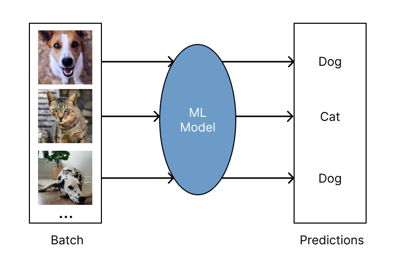

.. _batch_inference_home:

TODO move this whole guide to Ray Data guides

Running Batch Inference with Ray
================================

TODO what's going to happen here / TOC

.. note::

   If you already know the basics ... TODO (examples, etc.)

Batch inference refers to generating model predictions on a set of input data.
The model can range from a simple a Python function to a complex neural network.
In batch inference, also known as offline inference, your model is run on a large
batch of data on demand.
This is in contrast to online inference, where the model is run immediately on a
data point when it becomes available.
Here's a simple schematic of batch inference, "mapping" batches to predictions
via model inference:

  Evaluating a batch of input data with a model to get predictions.

Batch inference is a foundational workload for many AI companies, especially since more and more pre-trained models become available.
And while batch inference looks simple at the surface, it can be challenging to do right in production.
For instance, your data batches can be excessively large, too slow to process sequentially, or might need custom preprocessing before being fed into your models.
To run inference workloads effectively at scale, you need to

- manage your compute infrastructure and cloud clusters
- parallelize data processing and utilize all your cluster resources (CPUs & GPUs)
- efficiently transferring data between cloud storage, CPUs for preprocessing, and GPUs for model inference.

Here's a more realistic view of batch inference for modern AI applications:

.. figure:: images/batch_inference_overview.png

  Evaluating a batch of input data with a model to get predictions.

Why use Ray for batch inference?
---------------------------------

1. **Faster and Cheaper for modern Deep Learning Applications**: Ray is built for complex workloads and supports loading and preprocessing data with CPUs and model inference on GPUs.
2. **Cloud, framework, and data format agnostic**. Ray Data works on any cloud provider, any ML framework (like PyTorch and Tensorflow) and does not require a particular file format.
3. **Out of the box scaling**: The same code that works on one machine also runs on a large cluster without any changes.
4. **Python first** You can express your inference job directly in Python instead of YAML files or other formats.

Quick Start
-----------

To get started with batch inference with Ray, the first thing you need to do is
install Ray together with its data processing library Ray Data:

.. code-block:: bash

    pip install ray[data]

Running batch inference is conceptually easy and requires just three simple steps
that we'll walk through in this guide:

1. Load your data into a Ray ``Datastream`` and optionally apply any preprocessing you need.
2. Define your model for inference.
3. Run inference on your data by using the ``.map_batches()`` method from Ray Data.

The last step also defines how your batch processing job gets distributed across your (local) cluster.
We start with very simple use cases here and build up to more complex ones in other guides and tutorials.

Advanced use cases ultimately all boil down to extensions of the above three steps,
like loading and storing data from cloud storage, using complex preprocessing functions,
demanding model setups, additional postprocessing, or other customizations.

1. Loading and Preprocessing Data
~~~~~~~~~~~~~~~~~~~~~~~~~~~~~~~~~

For this quick-start guide we'll simply use very small, in-memory data sets by
leveraging common Python libraries like NumPy and Pandas.
For larger data sets, you can use Ray Data to load data from cloud storage like S3 or GCS.
In general, once you loaded your datasets using Ray Data, you also want to apply some preprocessing steps.
We skip this step here for simplicity.
In any case, the result of this step is a Ray Datastream ``ds`` that we can use to run inference on.

.. tabs::

    .. group-tab:: HuggingFace

        .. literalinclude:: ./doc_code/hf_quick_start.py
            :language: python
            :start-after: __hf_quickstart_load_start__
            :end-before: __hf_quickstart_load_end__

    .. group-tab:: PyTorch

        .. literalinclude:: ./doc_code/pytorch_quick_start.py
            :language: python
            :start-after: __pt_quickstart_load_start__
            :end-before: __pt_quickstart_load_end__

    .. group-tab:: TensorFlow

        .. literalinclude:: ./doc_code/tf_quick_start.py
            :language: python
            :start-after: __tf_quickstart_load_start__
            :end-before: __tf_quickstart_load_end__

2. Setting up your Model
~~~~~~~~~~~~~~~~~~~~~~~~

Next, you want to define your model for inference.
Below you find easy examples for HuggingFace, PyTorch, and TensorFlow.
The core idea is to define a "predictor" class that loads your model in its ``__init__`` method and
and implements a ``__call__`` method that takes a batch of data and returns a batch of predictions.
It's important to understand that Ray Data has different batch modes,
depending on the type of data you're processing and how you loaded it in the first place.
For this quick-start guide, we consider this part an implementation detail and just focus on the models themselves.

.. tabs::

    .. group-tab:: HuggingFace

        .. literalinclude:: ./doc_code/hf_quick_start.py
            :language: python
            :start-after: __hf_quickstart_model_start__
            :end-before: __hf_quickstart_model_end__

    .. group-tab:: PyTorch

        .. literalinclude:: ./doc_code/pytorch_quick_start.py
            :language: python
            :start-after: __pt_quickstart_model_start__
            :end-before: __pt_quickstart_model_end__

    .. group-tab:: TensorFlow

        .. literalinclude:: ./doc_code/tf_quick_start.py
            :language: python
            :start-after: __tf_quickstart_model_start__
            :end-before: __tf_quickstart_model_end__

3. Getting Predictions with Ray Data
~~~~~~~~~~~~~~~~~~~~~~~~~~~~~~~~~~~~

Once you have your Ray Datastream ``ds`` and your predictor class, you can finally use
``ds.map_batches(...)`` to get predictions.
Mapping batches this way is the recommended way to run inference with Ray, but there are also other options.
``map_batches`` takes your predictor class as an argument and allows you to specify
``compute`` resources by defining a so-called ``ActorPoolStrategy``.
In the example below, we use 2 CPUs to run inference in parallel and then print the results.
We cover resource allocation in more detail in other parts of this guide.

.. tabs::

    .. group-tab:: HuggingFace

        .. literalinclude:: ./doc_code/hf_quick_start.py
            :language: python
            :start-after: __hf_quickstart_prediction_start__
            :end-before: __hf_quickstart_prediction_end__

    .. group-tab:: PyTorch

        .. literalinclude:: ./doc_code/pytorch_quick_start.py
            :language: python
            :start-after: __pt_quickstart_prediction_start__
            :end-before: __pt_quickstart_prediction_end__

    .. group-tab:: TensorFlow

        .. literalinclude:: ./doc_code/tf_quick_start.py
            :language: python
            :start-after: __tf_quickstart_prediction_start__
            :end-before: __tf_quickstart_prediction_end__

TODO: quick note on just using map_batches on a function (dropdown)
TODO: link to AIR batch prediction?

Advanced PyTorch Example
------------------------

Focusing on one pretrained PyTorch model here to illustrate advanced concepts.

Data Loading and Preprocessing
~~~~~~~~~~~~~~~~~~~~~~~~~~~~~~

TODO add stuff from Ray Data guide on loading, but what exactly?

.. literalinclude:: ./doc_code/torch_image_batch_trained.py
    :language: python
    :start-after: __pt_load_start__
    :end-before: __pt_load_end__

After loading your data, it often needs to be preprocessed prior to inference.
This may include cropping or resizing images, or tokenizing raw text.

With :ref:`Ray Data <datasets>`, you can define user-defined functions (UDFs) that
transform batches of your data. Applying these UDFs via
:meth:`ds.map_batches() <ray.data.Dataset.map_batches>` will output a new, transformed Dataset.

.. note::

    The way we do preprocessing here is conceptually quite close to how we do batch
    inference, and we use the same ``map_batches`` call from Ray Data to run this task.

Here's how to do this in our example:

.. literalinclude:: ./doc_code/torch_image_batch_trained.py
    :language: python
    :start-after: __pt_preprocess_start__
    :end-before: __pt_preprocess_end__

.. tip::

    For the full suite of Dataset transformations, read :ref:`transforming_datasets`.

Model Inference
~~~~~~~~~~~~~~~

Model inferencing involves applying a
:meth:`ds.map_batches() <ray.data.Dataset.map_batches>` to our transformed dataset with
a pre-trained model as a user-defined function (UDF).

One of the key value adds of Ray over other distributed systems is the support for
distributed stateful operations. These stateful operations are especially useful
for inferencing since the model only needs to be initialized once, instead of per batch.

First, define a callable class:

1. The ``__init__`` method  will load the model
2. The ``__call__`` method defines the logic for inferencing on a single batch.

.. literalinclude:: ./doc_code/torch_image_batch_trained.py
    :language: python
    :start-after: __pt_model_start__
    :end-before: __pt_model_end__

Then, call :meth:`ds.map_batches() <ray.data.Dataset.map_batches>`, except making sure
to specify a `ActorPoolStrategy <ray.data.compute.ActorPoolStrategy>` which defines
how many workers to use for inferencing.

.. literalinclude:: ./doc_code/torch_image_batch_trained.py
    :language: python
    :start-after: __pt_prediction_start__
    :end-before: __pt_prediction_end__

Mapping a UDF over batches is the simplest transform for Ray Datasets.
The UDF defines the logic for transforming individual batches of data of the dataset
Performing operations over batches of data is more performant than single element
operations as it can leverage the underlying vectorization capabilities of Pandas or NumPy.

Working with batch formats
--------------------------

The batches that your UDF accepts can be different formats depending on the `batch_format`
that is passed to :meth:`ds.map_batches() <ray.data.Dataset.map_batches>`

Here is an overview of the available batch formats:

.. tabbed:: "default"

  The "default" batch format presents data as follows for each Dataset type:

  * **Tabular Datasets**: Each batch will be a
    `pandas.DataFrame <https://pandas.pydata.org/docs/reference/api/pandas.DataFrame.html>`__.
    This may incur a conversion cost if the underlying Dataset block is not
    zero-copy convertible from an Arrow table.

    .. literalinclude:: ../data/doc_code/transforming_datasets.py
      :language: python
      :start-after: __writing_default_udfs_tabular_begin__
      :end-before: __writing_default_udfs_tabular_end__

  * **Tensor Datasets** (single-column): Each batch will be a single
    `numpy.ndarray <https://numpy.org/doc/stable/reference/generated/numpy.ndarray.html>`__
    containing the single tensor column for this batch.

    .. literalinclude:: ../data/doc_code/transforming_datasets.py
      :language: python
      :start-after: __writing_default_udfs_tensor_begin__
      :end-before: __writing_default_udfs_tensor_end__

  * **Simple Datasets**: Each batch will be a Python list.

    .. literalinclude:: ../data/doc_code/transforming_datasets.py
      :language: python
      :start-after: __writing_default_udfs_list_begin__
      :end-before: __writing_default_udfs_list_end__

.. tabbed:: "pandas"

  The ``"pandas"`` batch format presents batches in
  `pandas.DataFrame <https://pandas.pydata.org/docs/reference/api/pandas.DataFrame.html>`__
  format. If converting a simple dataset to Pandas DataFrame batches, a single-column
  dataframe with the column ``"__value__"`` will be created.

  .. literalinclude:: ../data/doc_code/transforming_datasets.py
    :language: python
    :start-after: __writing_pandas_udfs_begin__
    :end-before: __writing_pandas_udfs_end__

.. tabbed:: "numpy"

  The ``"numpy"`` batch format presents batches in
  `numpy.ndarray <https://numpy.org/doc/stable/reference/generated/numpy.ndarray.html>`__
  format as follows:

  * **Tabular Datasets**: Each batch will be a dictionary of NumPy
    ndarrays (``Dict[str, np.ndarray]``), with each key-value pair representing a column
    in the table.

  * **Tensor Datasets** (single-column): Each batch will be a single
    `numpy.ndarray <https://numpy.org/doc/stable/reference/generated/numpy.ndarray.html>`__
    containing the single tensor column for this batch.

  * **Simple Datasets**: Each batch will be a single NumPy ndarray, where Datasets will
    attempt to convert each list-batch to an ndarray.

  .. literalinclude:: ../data/doc_code/transforming_datasets.py
    :language: python
    :start-after: __writing_numpy_udfs_begin__
    :end-before: __writing_numpy_udfs_end__

Configuration & Troubleshooting
-------------------------------

Configuring Batch Size
~~~~~~~~~~~~~~~~~~~~~~

An important parameter to set for :meth:`ds.map_batches() <ray.data.Dataset.map_batches>`
is ``batch_size``, which controls the size of the batches provided to the UDF.

.. literalinclude:: ../data/doc_code/transforming_datasets.py
  :language: python
  :start-after: __configuring_batch_size_begin__
  :end-before: __configuring_batch_size_end__

Increasing ``batch_size`` can result in faster execution by better leveraging vectorized
operations and hardware, reducing batch slicing and concatenation overhead, and overall
saturation of CPUs/GPUs, but will also result in higher memory utilization, which can
lead to out-of-memory failures. If encountering OOMs, decreasing your ``batch_size`` may
help.

.. note::
  The default ``batch_size`` of ``4096`` may be too large for datasets with large rows
  (e.g. tables with many columns or a collection of large images).

Using GPUs
----------

Do the following to use GPUs for inference:

1. Update the callable class implementation to move the model and data to and from Cuda device.

.. code-block:: diff

    from torchvision.models import resnet18

    class TorchModel:
        def __init__(self):
            self.model = resnet18(pretrained=True)
    +       self.model = self.model.cuda()
            self.model.eval()

        def __call__(self, batch: List[torch.Tensor]):
            torch_batch = torch.stack(batch)
    +       torch_batch = torch_batch.cuda()
            with torch.inference_mode():
                prediction = self.model(torch_batch)
    -           return {"class": prediction.argmax(dim=1).detach().numpy()}
    +           return {"class": prediction.argmax(dim=1).detach().cpu().numpy()}

2. Specify ``num_gpus=1`` in :meth:`ds.map_batches() <ray.data.Dataset.map_batches>` to indiciate that each inference worker should use 1 GPU.

.. code-block:: diff

    predictions = dataset.map_batches(
        TorchModel,
        compute=ray.data.ActorPoolStrategy(size=2),
    +   num_gpus=1
    )

**How should I configure num_cpus and num_gpus for my model?**

By default, Ray will assign 1 CPU per task or actor. For example, on a machine
with 16 CPUs, this will result in 16 tasks or actors running concurrently for inference.
To change this, you can specify num_cpus=N, which will tell Ray to reserve more CPUs
for the task or actor, or ``num_gpus=N``, which will tell Ray to reserve/assign GPUs
(GPUs will be assigned via `CUDA_VISIBLE_DEVICES` env var).

.. code-block:: python

    # Use 16 actors, each of which is assigned 1 GPU (16 GPUs total).
    ds = ds.map_batches(
        MyFn,
        compute=ActorPoolStrategy(size=16),
        num_gpus=1
    )

    # Use 16 actors, each of which is reserved 8 CPUs (128 CPUs total).
    ds = ds.map_batches(
        MyFn,
        compute=ActorPoolStrategy(size=16),
        num_cpus=8)

**How should I deal with OOM errors due to heavy model memory usage?**

It's common for models to consume a large amount of heap memory. For example, if a model
uses 5GB of RAM when created / run, and a machine has 16GB of RAM total, then no more
than three of these models can be run at the same time. The default resource assignments
of 1 CPU per task/actor will likely lead to OutOfMemoryErrors from Ray in this situation.

Let's suppose our machine has 16GiB of RAM and 8 GPUs. To tell Ray to construct at most
3 of these actors per node, we can override the CPU or memory:

.. code-block:: python

    # Require 5 CPUs per actor (so at most 3 can fit per 16 CPU node).
    ds = ds.map_batches(MyFn,
    compute=ActorPoolStrategy(size=16), num_cpus=5)

Learn more
----------

TODO add the right examples here, maybe create a new one.

Batch inference is just one small part of the Machine Learning workflow, and only
a fraction of what Ray can do.

.. figure:: images/train_predict_pipeline.png

  How batch inference fits into the bigger picture of training and prediction AI models.

To learn more about Ray and batch inference, check out the following resources:

.. panels::
    :container: container pb-3
    :column: col-md-3 px-1 py-1
    :img-top-cls: p-2 w-75 d-block mx-auto fixed-height-img

    ---
    :img-top: /images/ray_logo.png

    .. link-button:: https://github.com/ray-project/ray-educational-materials/blob/main/Computer_vision_workloads/Semantic_segmentation/Scaling_batch_inference.ipynb
        :type: url
        :text: [Tutorial] Architectures for Scalable Batch Inference with Ray
        :classes: btn-link btn-block stretched-link scalableBatchInference
    ---
    :img-top: /images/ray_logo.png

    .. link-button:: /ray-core/examples/batch_prediction
        :type: ref
        :text: [Example] Batch Prediction using Ray Core
        :classes: btn-link btn-block stretched-link batchCore
    ---
    :img-top: /images/ray_logo.png

    .. link-button:: /data/examples/nyc_taxi_basic_processing
        :type: ref
        :text: [Example] Batch Inference on NYC taxi data using Ray Data
        :classes: btn-link btn-block stretched-link nycTaxiData

    ---
    :img-top: /images/ray_logo.png

    .. link-button:: /data/examples/ocr_example
        :type: ref
        :text: [Example] Batch OCR processing using Ray Data
        :classes: btn-link btn-block stretched-link batchOcr
