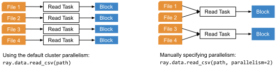

.. _creating_datasets:

=================
Creating Datasets
=================

A :class:`Dataset <ray.data.Dataset>` can be created from:

* generated synthetic data,
* local and distributed in-memory data, and
* local and external storage systems (local disk, cloud storage, HDFS, etc.).

Creation from existing in-memory data is enabled via Datasets' integrations
with familiar single-node data libraries (`Pandas <https://pandas.pydata.org/>`__,
`NumPy <https://numpy.org/>`__, `Arrow <https://arrow.apache.org/>`__) and distributed
data processing frameworks (:ref:`Dask <dask-on-ray>`, :ref:`Spark <spark-on-ray>`,
:ref:`Modin <modin-on-ray>`, :ref:`Mars <mars-on-ray>`). Creating datasets from
persistent storage is enabled by Datasets' support for reading many common file
formats (Parquet, CSV, JSON, NPY, text, binary).

A :class:`Dataset <ray.data.Dataset>` can hold plain Python objects (simple datasets),
Arrow records (Arrow datasets), or Pandas records (Pandas datasets). These records are
grouped into one or more data **blocks**, and these blocks can be spread across
multiple Ray nodes. Simple datasets are represented by simple blocks (lists of Python
objects), Arrow datasets are represented by Arrow blocks (
`Arrow Tables <https://arrow.apache.org/docs/python/generated/pyarrow.Table.html>`__
), and Pandas
datasets are represented by Pandas blocks (
`Pandas DataFrames <https://pandas.pydata.org/docs/reference/api/pandas.DataFrame.html>`__
).

The method of
creating the dataset will determine the format of its internal block representation.

.. dropdown:: See more about Datasets' internal block representation

  The following details the block representation for each creation method:

  * Reading tabular files (Parquet, CSV, JSON) and converting directly from Arrow produces Arrow datasets.
  * Converting from Pandas, Dask, Modin, and Mars produces Pandas datasets.
  * Reading NumPy files or converting from NumPy ndarrays produces Arrow datasets.
  * Reading text and raw binary files produces simple datasets.

  The following figure visualizes a ``Dataset`` that has three
  `Arrow Table <https://arrow.apache.org/docs/python/generated/pyarrow.Table.html>`__
  blocks, each block holding 1000 rows:

  .. image:: images/dataset-arch.svg

This guide surveys the many ways to create a ``Dataset``. If none of these meet your
needs, please reach out on `Discourse <https://discuss.ray.io/>`__ or open a feature
request on the `Ray GitHub repo <https://github.com/ray-project/ray>`__, and check out
our :ref:`guide for implementing a custom Datasets datasource <datasets_custom_datasource>`
if you're interested in rolling your own integration!

.. _dataset_generate_data:

-------------------------
Generating Synthetic Data
-------------------------

Using Datasets with small, generated data is a great way to test out some of Datasets'
features. Each of these synthetic data generators will generate data in Ray tasks that
will execute in parallel and will be load-balanced across your Ray cluster; the
``Dataset`` will hold a set of futures representing the return values of those tasks,
serving as pointers to a collection of distributed data blocks.

.. tabbed:: Int Range

  Create a ``Dataset`` from a range of integers.

  .. literalinclude:: ./doc_code/creating_datasets.py
    :language: python
    :start-after: __gen_synth_int_range_begin__
    :end-before: __gen_synth_int_range_end__

.. tabbed:: Tabular Range

  Create an Arrow (tabular) ``Dataset`` from a range of integers,
  with a single column containing this integer range.

  .. literalinclude:: ./doc_code/creating_datasets.py
    :language: python
    :start-after: __gen_synth_tabular_range_begin__
    :end-before: __gen_synth_tabular_range_end__

.. tabbed:: Tensor Range

  Create a tensor dataset from a range of integers, packing this integer range into
  tensors of the provided shape.

  .. literalinclude:: ./doc_code/creating_datasets.py
    :language: python
    :start-after: __gen_synth_tensor_range_begin__
    :end-before: __gen_synth_tensor_range_end__

.. _dataset_from_in_memory_data:

-----------------------------------------
From Local and Distributed In-Memory Data
-----------------------------------------

Datasets can be constructed from existing in-memory data. In addition to being able to
construct a ``Dataset`` from plain Python objects, Datasets also interoperates with popular
single-node libraries (`Pandas <https://pandas.pydata.org/>`__,
`NumPy <https://numpy.org/>`__, `Arrow <https://arrow.apache.org/>`__) as well as
distributed frameworks (:ref:`Dask <dask-on-ray>`, :ref:`Spark <spark-on-ray>`,
:ref:`Modin <modin-on-ray>`, :ref:`Mars <mars-on-ray>`).

.. _dataset_from_in_memory_data_single_node:

Integration with Single-Node Data Libraries
===========================================

In this section, we demonstrate creating a ``Dataset`` from single-node in-memory data.

.. tabbed:: Pandas

  Create a ``Dataset`` from a Pandas DataFrame. This constructs a ``Dataset``
  backed by a single Pandas DataFrame block.

  .. literalinclude:: ./doc_code/creating_datasets.py
    :language: python
    :start-after: __from_pandas_begin__
    :end-before: __from_pandas_end__

  We can also build a ``Dataset`` from more than one Pandas DataFrame, where each said
  DataFrame will become a block in the ``Dataset``.

  .. literalinclude:: ./doc_code/creating_datasets.py
    :language: python
    :start-after: __from_pandas_mult_begin__
    :end-before: __from_pandas_mult_end__

.. tabbed:: NumPy

  Create a ``Dataset`` from a NumPy ndarray. This constructs a ``Dataset``
  backed by a single-column Arrow table block; the outer dimension of the ndarray
  will be treated as the row dimension, and the column will have name ``"__value__"``.

  .. literalinclude:: ./doc_code/creating_datasets.py
    :language: python
    :start-after: __from_numpy_begin__
    :end-before: __from_numpy_end__

  We can also build a ``Dataset`` from more than one NumPy ndarray, where each said
  ndarray will become a single-column Arrow table block in the ``Dataset``.

  .. literalinclude:: ./doc_code/creating_datasets.py
    :language: python
    :start-after: __from_numpy_mult_begin__
    :end-before: __from_numpy_mult_end__

.. tabbed:: Arrow

  Create a ``Dataset`` from an
  `Arrow Table <https://arrow.apache.org/docs/python/generated/pyarrow.Table.html>`__.
  This constructs a ``Dataset`` backed by a single Arrow ``Table`` block.

  .. literalinclude:: ./doc_code/creating_datasets.py
    :language: python
    :start-after: __from_arrow_begin__
    :end-before: __from_arrow_end__

  We can also build a ``Dataset`` from more than one Arrow Table, where each said
  ``Table`` will become a block in the ``Dataset``.

  .. literalinclude:: ./doc_code/creating_datasets.py
    :language: python
    :start-after: __from_arrow_mult_begin__
    :end-before: __from_arrow_mult_end__

.. tabbed:: Python Objects

  Create a ``Dataset`` from a list of Python objects; since each object in this
  particular list is a dictionary, Datasets will treat this list as a list of tabular
  records, and will construct an Arrow ``Dataset``.

  .. literalinclude:: ./doc_code/creating_datasets.py
    :language: python
    :start-after: __from_items_begin__
    :end-before: __from_items_end__

.. _dataset_from_in_memory_data_distributed:

Integration with Distributed Data Processing Frameworks
=======================================================

In addition to working with single-node in-memory data, Datasets can be constructed from
distributed (multi-node) in-memory data, interoperating with popular distributed
data processing frameworks such as :ref:`Dask <dask-on-ray>`, :ref:`Spark <spark-on-ray>`,
:ref:`Modin <modin-on-ray>`, and :ref:`Mars <mars-on-ray>`.

The common paradigm used by
these conversions is to send out Ray tasks converting each Dask/Spark/Modin/Mars
data partition to a format that Datasets can understand (if needed), and using the
futures representing the return value of those conversion tasks as the ``Dataset`` block
futures. If the upstream framework's data partitions are already in a format that
Datasets understands (e.g. Arrow or Pandas), Datasets will elide the conversion task and
will instead reinterpret those data partitions directly as its blocks.

.. note::

  These data processing frameworks must be running on Ray in order for these Datasets
  integrations to work. See how these frameworks can be run on Ray in our
  :ref:`data processing integrations docs <data_integrations>`.

.. tabbed:: Dask

  Create a ``Dataset`` from a
  `Dask DataFrame <https://docs.dask.org/en/stable/dataframe.html>`__. This constructs a
  ``Dataset`` backed by the distributed Pandas DataFrame partitions that underly the
  Dask DataFrame.

  .. note::

    This conversion should have near-zero overhead: it involves zero data copying and
    zero data movement. Datasets simply reinterprets the existing Dask DataFrame partitions
    as Ray Datasets partitions without touching the underlying data.

  .. literalinclude:: ./doc_code/creating_datasets.py
    :language: python
    :start-after: __from_dask_begin__
    :end-before: __from_dask_end__

.. tabbed:: Spark

  Create a ``Dataset`` from a `Spark DataFrame
  <https://spark.apache.org/docs/latest/api/python/reference/pyspark.sql/dataframe.html>`__.
  This constructs a ``Dataset`` backed by the distributed Spark DataFrame partitions
  that underly the Spark DataFrame. When this conversion happens, Spark-on-Ray (RayDP)
  will save the Spark DataFrame partitions to Ray's object store in the Arrow format,
  which Datasets will then interpret as its blocks.

  .. literalinclude:: ./doc_code/creating_datasets.py
    :language: python
    :start-after: __from_spark_begin__
    :end-before: __from_spark_end__

.. tabbed:: Modin

  Create a ``Dataset`` from a Modin DataFrame. This constructs a ``Dataset``
  backed by the distributed Pandas DataFrame partitions that underly the Modin DataFrame.

  .. note::

    This conversion should have near-zero overhead: it involves zero data copying and
    zero data movement. Datasets simply reinterprets the existing Modin DataFrame partitions
    as Ray Datasets partitions without touching the underlying data.

  .. literalinclude:: ./doc_code/creating_datasets.py
    :language: python
    :start-after: __from_modin_begin__
    :end-before: __from_modin_end__

.. tabbed:: Mars

  Create a ``Dataset`` from a Mars DataFrame. This constructs a ``Dataset``
  backed by the distributed Pandas DataFrame partitions that underly the Mars DataFrame.

  .. note::

    This conversion should have near-zero overhead: it involves zero data copying and
    zero data movement. Datasets simply reinterprets the existing Mars DataFrame partitions
    as Ray Datasets partitions without touching the underlying data.

  .. literalinclude:: ./doc_code/creating_datasets.py
    :language: python
    :start-after: __from_mars_begin__
    :end-before: __from_mars_end__

.. _dataset_reading_from_storage:

--------------------------
Reading Files From Storage
--------------------------

Using the ``ray.data.read_*()`` APIs, Datasets can be created from files on local disk
or remote storage system such as S3, GCS, Azure Blob Storage, or HDFS. Any filesystem
`supported by pyarrow <http://arrow.apache.org/docs/python/generated/pyarrow.fs.FileSystem.html>`__
can be used to specify file locations, and many common file formats are supported:
Parquet, CSV, JSON, NPY, text, binary.

Parallel + Distributed Reading
==============================

Each of these APIs take a path or list of paths to files or directories. Any directories
provided will be walked in order to obtain concrete file paths, at which point all files
will be read in parallel.

Datasets uses a default parallelism of 200, truncated by the number of files being read:
``parallelism = min(num_files, 200)``. ``parallelism`` parallel read tasks will be
launched, each reading one or more files and each creating a single block of data.
When reading from remote datasources, these parallel read tasks will be spread across
the nodes in your Ray cluster, creating the distributed collection of blocks that makes
up a distributed Ray Dataset.

This default parallelism can be overridden via the ``parallelism`` argument; see the
:ref:`performance guide <data_performance_tips>`  for tips on how to tune this read
parallelism.

.. _dataset_deferred_reading:

Deferred Read Task Execution
============================

Datasets created via the ``ray.data.read_*()`` APIs are semi-lazy: initially, only the
first read task will be executed. This avoids blocking Dataset creation on the reading
of all data files, enabling inspection functions like
:meth:`ds.schema() <ray.data.Dataset.schema>` and
:meth:`ds.show() <ray.data.Dataset.show>` to be used right away. Executing further
transformations on the Dataset will trigger execution of all read tasks, and execution
of all read tasks can be triggered manually using the
:meth:`ds.fully_executed() <ray.data.Dataset.fully_executed>` API.

.. _dataset_supported_file_formats:

Supported File Formats
======================

.. tabbed:: Parquet

  Read Parquet files into a tabular ``Dataset``. The Parquet data will be read into
  `Arrow Table <https://arrow.apache.org/docs/python/generated/pyarrow.Table.html>`__
  blocks. Although this simple example demonstrates reading a single file, note that
  Datasets can also read directories of Parquet files, with one tabular block created
  per file. For Parquet in particular, we also support reading partitioned Parquet
  datasets with partition column values pulled from the file paths.

  .. literalinclude:: ./doc_code/creating_datasets.py
    :language: python
    :start-after: __read_parquet_begin__
    :end-before: __read_parquet_end__

  Datasets' Parquet reader also supports projection and filter pushdown, allowing column
  selection and row filtering to be pushed down to the file scan. For column selection,
  unselected columns will never be read from the file.

  .. literalinclude:: ./doc_code/creating_datasets.py
    :language: python
    :start-after: __read_parquet_pushdown_begin__
    :end-before: __read_parquet_pushdown_end__

  See the API docs for :func:`read_parquet() <ray.data.read_parquet>`.

.. tabbed:: CSV

  Read CSV files into a tabular ``Dataset``. The CSV data will be read into
  `Arrow Table <https://arrow.apache.org/docs/python/generated/pyarrow.Table.html>`__
  blocks. Although this simple example demonstrates reading a single file, note that
  Datasets can also read directories of CSV files, with one tabular block created
  per file.

  .. literalinclude:: ./doc_code/creating_datasets.py
    :language: python
    :start-after: __read_csv_begin__
    :end-before: __read_csv_end__

  See the API docs for :func:`read_csv() <ray.data.read_csv>`.

.. tabbed:: JSON

  Read JSON files into a tabular ``Dataset``. The JSON data will be read into
  `Arrow Table <https://arrow.apache.org/docs/python/generated/pyarrow.Table.html>`__
  blocks. Although this simple example demonstrates reading a single file, note that
  Datasets can also read directories of JSON files, with one tabular block created
  per file.

  Currently, only newline-delimited JSON (NDJSON) is supported.

  .. literalinclude:: ./doc_code/creating_datasets.py
    :language: python
    :start-after: __read_json_begin__
    :end-before: __read_json_end__

  See the API docs for :func:`read_json() <ray.data.read_json>`.

.. tabbed:: NumPy

  Read NumPy files into a tensor ``Dataset``. The NumPy ndarray data will be read into
  single-column
  `Arrow Table <https://arrow.apache.org/docs/python/generated/pyarrow.Table.html>`__
  blocks using our
  :class:`tensor extension type <ray.data.extensions.tensor_extension.ArrowTensorType>`,
  treating the outermost ndarray dimension as the row dimension. See our
  :ref:`tensor data guide <datasets_tensor_support>` for more information on working
  with tensors in Datasets. Although this simple example demonstrates reading a single
  file, note that Datasets can also read directories of JSON files, with one tensor
  block created per file.

  .. literalinclude:: ./doc_code/creating_datasets.py
    :language: python
    :start-after: __read_numpy_begin__
    :end-before: __read_numpy_end__

  See the API docs for :func:`read_numpy() <ray.data.read_numpy>`.

.. tabbed:: Text

  Read text files into a ``Dataset``. Each line in each text file will be treated as a
  row in the dataset, resulting in a list-of-strings block being created for each text
  file.

  .. literalinclude:: ./doc_code/creating_datasets.py
    :language: python
    :start-after: __read_text_begin__
    :end-before: __read_text_end__

  See the API docs for :func:`read_text() <ray.data.read_text>`.

.. tabbed:: Binary

  Read binary files into a ``Dataset``. Each binary file will be treated as a single row
  of opaque bytes. These bytes can be decoded into tensor, tabular, text, or any other
  kind of data using ``ds.map()`` to apply a per-row decoding UDF.

  Although this simple example demonstrates reading a single file, note that Datasets
  can also read directories of binary files, with one bytes block created per file.

  .. literalinclude:: ./doc_code/creating_datasets.py
    :language: python
    :start-after: __read_binary_begin__
    :end-before: __read_binary_end__

  See the API docs for :func:`read_binary_files() <ray.data.read_binary_files>`.

.. _dataset_reading_remote_storage:

Reading from Remote Storage
===========================

All of the file formats mentioned above can be read from remote storage, such as S3,
GCS, Azure Blob Storage, and HDFS. These storage systems are supported via Arrow's
filesystem APIs natively for S3 and HDFS, and as a wrapper around fsspec for GCS and
HDFS. All ``ray.data.read_*()`` APIs expose a ``filesystem`` argument that accepts both
`Arrow FileSystem <https://arrow.apache.org/docs/python/filesystems.html>`__ instances
and `fsspec FileSystem <https://filesystem-spec.readthedocs.io/en/latest/>`__ instances,
allowing you to configure this connection to the remote storage system, such as
authn/authz and buffer/block size.

For S3 and HDFS, the underlying `FileSystem
<https://arrow.apache.org/docs/python/generated/pyarrow.fs.FileSystem.html>`__
implementation will be inferred from the URL scheme (``"s3://"`` and ``"hdfs://"``); if
the default connection configuration suffices for your workload, you won't need to
specify a ``filesystem`` argument.

We use Parquet files for the below examples, but all of the aforementioned file formats
are supported for each of these storage systems.

.. tabbed:: S3

  The AWS S3 storage system is inferred from the URI scheme (``s3://``), with required connection
  configuration such as S3 credentials being pulled from the machine's environment
  (e.g. the ``AWS_ACCESS_KEY_ID`` and ``AWS_SECRET_ACCESS_KEY`` environment variables).

  .. literalinclude:: ./doc_code/creating_datasets.py
    :language: python
    :start-after: __read_parquet_s3_begin__
    :end-before: __read_parquet_s3_end__

  If needing to customize this S3 storage system connection (credentials, region,
  endpoint override, etc.), you can pass in an
  `S3FileSystem <https://arrow.apache.org/docs/python/filesystems.html#s3>`__ instance
  to :func:`read_parquet() <ray.data.read_parquet>`.

  .. note::

    This example is not runnable as-is; to run it on your own private S3 data, add in a
    path to your private bucket and specify your S3 credentials.

  .. literalinclude:: ./doc_code/creating_datasets.py
    :language: python
    :start-after: __read_parquet_s3_with_fs_begin__
    :end-before: __read_parquet_s3_with_fs_end__

.. tabbed:: HDFS

  The HDFS storage system is inferred from the URI scheme (``hdfs://``), with required connection
  configuration such as the host and the port being derived from the URI.

  .. note::

    This example is not runnable as-is; you'll need to point it at your HDFS
    cluster/data.

  .. literalinclude:: ./doc_code/creating_datasets.py
    :language: python
    :start-after: __read_parquet_hdfs_begin__
    :end-before: __read_parquet_hdfs_end__

  If needing to customize this HDFS storage system connection (host, port, user, kerb
  ticket, etc.), you can pass in an `HDFSFileSystem
  <https://arrow.apache.org/docs/python/filesystems.html#hadoop-distributed-file-system-hdfs>`__
  instance to :func:`read_parquet() <ray.data.read_parquet>`.

  .. note::

    This example is not runnable as-is; you'll need to point it at your HDFS
    cluster/data.

  .. literalinclude:: ./doc_code/creating_datasets.py
    :language: python
    :start-after: __read_parquet_hdfs_with_fs_begin__
    :end-before: __read_parquet_hdfs_with_fs_end__

.. tabbed:: GCS

  Data can be read from Google Cloud Storage by providing a configured
  `gcsfs GCSFileSystem <https://gcsfs.readthedocs.io/en/latest/>`__, where the
  appropriate Google Cloud project and credentials can be specified.

  .. note::
    This example is not runnable as-is; you'll need to point it at your GCS bucket and
    configure your GCP project and credentials.

  .. literalinclude:: ./doc_code/creating_datasets.py
    :language: python
    :start-after: __read_parquet_gcs_begin__
    :end-before: __read_parquet_gcs_end__

.. tabbed:: ADL/ABS (Azure)

  Data can be read from Azure Blob Storage by providing a configured
  `adlfs AzureBlobFileSystem <https://github.com/fsspec/adlfs>`__, where the appropriate
  account name and account key can be specified.

  .. literalinclude:: ./doc_code/creating_datasets.py
    :language: python
    :start-after: __read_parquet_az_begin__
    :end-before: __read_parquet_az_end__

.. _dataset_from_torch_tf:

-------------------------
From Torch and TensorFlow
-------------------------

.. tabbed:: PyTorch

    If you already have a Torch dataset available, you can create a Ray Dataset using
    :py:class:`~ray.data.datasource.SimpleTorchDatasource`.

    .. warning::
        :py:class:`~ray.data.datasource.SimpleTorchDatasource` doesn't support parallel
        reads. You should only use this datasource for small datasets like MNIST or
        CIFAR.

    .. code-block:: python

        import ray.data
        from ray.data.datasource import SimpleTorchDatasource
        import torchvision

        dataset_factory = lambda: torchvision.datasets.MNIST("data", download=True)
        dataset = ray.data.read_datasource(
            SimpleTorchDatasource(), parallelism=1, dataset_factory=dataset_factory
        )
        dataset.take(1)
        # (<PIL.Image.Image image mode=L size=28x28 at 0x1142CCA60>, 5)

.. tabbed:: TensorFlow

    If you already have a TensorFlow dataset available, you can create a Ray Dataset
    using :py:class:`SimpleTensorFlowDatasource`.

    .. warning::
        :py:class:`SimpleTensorFlowDatasource` doesn't support parallel reads. You
        should only use this datasource for small datasets like MNIST or CIFAR.

    .. code-block:: python

        import ray.data
        from ray.data.datasource import SimpleTensorFlowDatasource
        import tensorflow_datasets as tfds

        def dataset_factory():
            return tfds.load("cifar10", split=["train"], as_supervised=True)[0]

        dataset = ray.data.read_datasource(
            SimpleTensorFlowDatasource(),
            parallelism=1,
            dataset_factory=dataset_factory
        )
        features, label = dataset.take(1)[0]
        features.shape  # TensorShape([32, 32, 3])
        label  # <tf.Tensor: shape=(), dtype=int64, numpy=7>

.. _dataset_from_huggingface:

-------------------------------
From 🤗 (Hugging Face) Datasets
-------------------------------

You can convert 🤗 Datasets into Ray Datasets by using
:py:class:`~ray.data.from_huggingface`. This function accesses the underlying Arrow table and
converts it into a Ray Dataset directly.

.. warning::
    :py:class:`~ray.data.from_huggingface` doesn't support parallel
    reads. This will not usually be an issue with in-memory 🤗 Datasets,
    but may fail with large memory-mapped 🤗 Datasets. 🤗 ``IterableDataset``
    objects are not supported.

.. code-block:: python

    import ray.data
    from datasets import load_dataset

    hf_datasets = load_dataset("wikitext", "wikitext-2-raw-v1")
    ray_datasets = ray.data.from_huggingface(hf_datasets)
    ray_datasets["train"].take(2)
    # [{'text': ''}, {'text': ' = Valkyria Chronicles III = \n'}]
