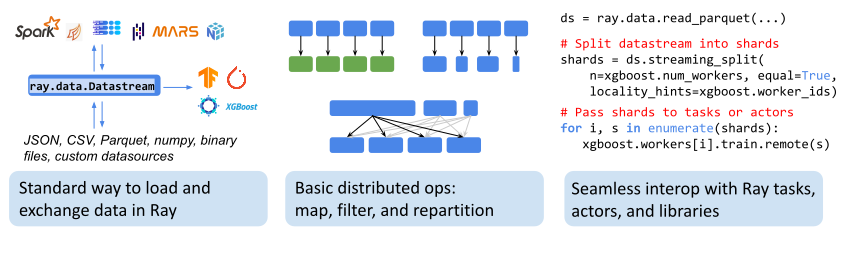
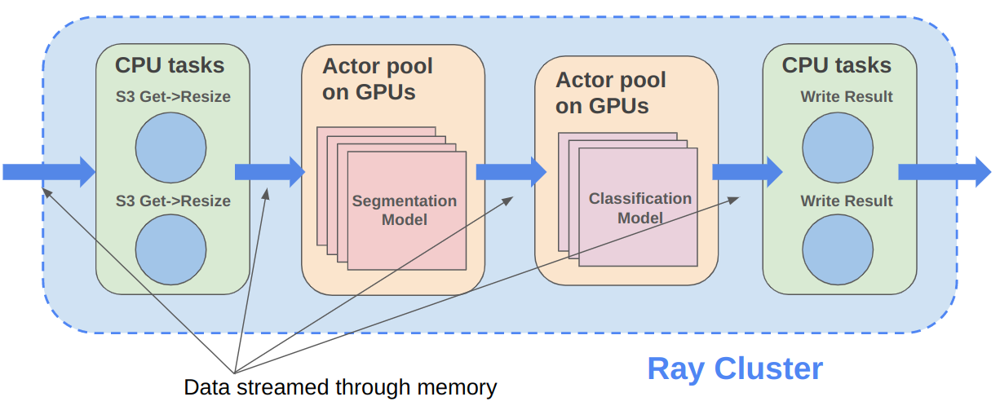
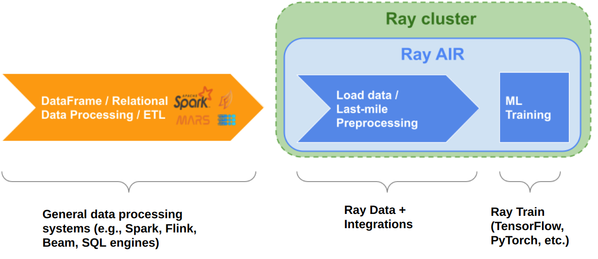

.. include:: /_includes/data/announcement.rst

.. _data:

======================================
Ray Data: Distributed ML Preprocessing
======================================

.. _data-intro:

Ray Data is the standard way to load and exchange data in Ray libraries and applications.
It provides streaming distributed transformations such as maps
(:meth:`map_batches <ray.data.Datastream.map_batches>`),
global and grouped aggregations (:class:`GroupedData <ray.data.grouped_data.GroupedData>`), and
shuffling operations (:meth:`random_shuffle <ray.data.Datastream.random_shuffle>`,
:meth:`sort <ray.data.Datastream.sort>`,
:meth:`repartition <ray.data.Datastream.repartition>`),
and is compatible with a variety of file formats, data sources, and distributed frameworks.

Read on for an overview of the main use cases and operations supported by Ray Data.

..
  https://docs.google.com/drawings/d/16AwJeBNR46_TsrkOmMbGaBK7u-OPsf_V8fHjU-d2PPQ/edit

-------------------------
Streaming Batch Inference
-------------------------

Ray Data simplifies general purpose parallel GPU and CPU compute in Ray through its
powerful :ref:`Datastream <datastream_concept>` primitive. Datastreams enable workloads such as 
:ref:`GPU batch inference <ref-use-cases-batch-infer>` to run efficiently on large datasets,
maximizing resource utilization by keeping the working data fitting into Ray object store memory.

..
 https://docs.google.com/presentation/d/1l03C1-4jsujvEFZUM4JVNy8Ju8jnY5Lc_3q7MBWi2PQ/edit#slide=id.g230eb261ad2_0_0

As part of the Ray ecosystem, Ray Data can leverage the full functionality of Ray's distributed scheduler,
e.g., using actors for optimizing setup time and GPU scheduling, and supports data throughputs of
100GiB/s or more for common inference workloads.

To learn more about the features Ray Data supports, read the 
:ref:`Data User Guide <data_user_guide>`.

---------------------------------------
Streaming Preprocessing for ML Training
---------------------------------------

Use Ray Data to load and preprocess data for distributed :ref:`ML training pipelines <train-docs>` in a streaming fashion.
Ray Data is intended to serve as a last-mile bridge from storage or ETL pipeline outputs to distributed 
applications and libraries in Ray. Don't use it as a replacement for more general data 
processing systems.

..
  https://docs.google.com/presentation/d/1l03C1-4jsujvEFZUM4JVNy8Ju8jnY5Lc_3q7MBWi2PQ/edit

----------------------
Where to Go from Here?
----------------------

As new user of Ray Data, you may want to start with our :ref:`Getting Started Guide <data_getting_started>`.
If you've run your first examples already, you might want to dive into Ray Data'
:ref:`key concepts <data_key_concepts>` or our :ref:`User Guide <data_user_guide>` instead.
Advanced users can refer directly to the Ray Data :ref:`API reference <data-api>` for their projects.

.. grid:: 1 2 2 2
    :gutter: 1
    :class-container: container pb-6

    .. grid-item-card::

        **Getting Started**
        ^^^

        Start with our quick start tutorials for working with Data.
        These concrete examples will give you an idea of how to use Ray Data.

        +++
        .. button-ref:: data_getting_started
            :color: primary
            :outline:
            :expand:

            Get Started with Ray Data

    .. grid-item-card::

        **Key Concepts**
        ^^^

        Understand the key concepts behind Ray Data.
        Learn what :ref:`Datastreams <datastream_concept>` are and how they are executed in Ray
        Data.

        +++
        .. button-ref:: data_key_concepts
            :color: primary
            :outline:
            :expand:

            Learn Key Concepts

    .. grid-item-card::

        **User Guides**
        ^^^

        Learn how to :ref:`load data <loading_data>`, :ref:`save
        data <saving_data>`, :ref:`transform data <transforming_data>`,
        :ref:`access and exchange data <consuming_data>`, or
        :ref:`work with tensor data <data_tensor_support>`.

        +++
        .. button-ref:: data_user_guide
            :color: primary
            :outline:
            :expand:

            Start Using Ray Data

    .. grid-item-card::

        **Examples**
        ^^^

        Find both simple and scaling-out examples of using Ray Data for data
        processing and ML ingest.

        +++
        .. button-ref:: data-recipes
            :color: primary
            :outline:
            :expand:

            Ray Data Examples

    .. grid-item-card::

        **Ray Data FAQ**
        ^^^

        Find answers to commonly asked questions in our detailed FAQ.

        +++
        .. button-ref:: data_faq
            :color: primary
            :outline:
            :expand:

            Ray Data FAQ

    .. grid-item-card::

        **API**
        ^^^

        Get more in-depth information about the Ray Data API.

        +++
        .. button-ref:: data-api
            :color: primary
            :outline:
            :expand:

            Read the API Reference

    .. grid-item-card::

        **Other Data Processing Solutions**
        ^^^

        For running ETL pipelines, check out :ref:`Spark-on-Ray <spark-on-ray>`. For scaling
        up your data science workloads, check out :ref:`Dask-on-Ray <dask-on-ray>`,
        :ref:`Modin <modin-on-ray>`, and :ref:`Mars-on-Ray <mars-on-ray>`.

        +++
        .. button-ref:: integrations
            :color: primary
            :outline:
            :expand:

            Check Out Other Data Processing Options

------------------------
Datasource Compatibility
------------------------

Ray Data supports reading and writing many file formats.
To view supported formats, read the :ref:`Input/Output reference <input-output>`.

If your use case isn't supported, reach out on `Discourse <https://discuss.ray.io/>`__ or open a feature
request on the `Ray GitHub repo <https://github.com/ray-project/ray>`__, and check out
our :ref:`guide for implementing a custom datasource <data_custom_datasource>`
if you're interested in rolling your own integration!

----------
Contribute
----------

Contributions to Ray Data are :ref:`welcome <getting-involved>`!
There are many potential improvements, including:

- Supporting more data sources and transforms.
- Integration with more ecosystem libraries.
- Performance optimizations.

.. include:: /_includes/data/announcement_bottom.rst
