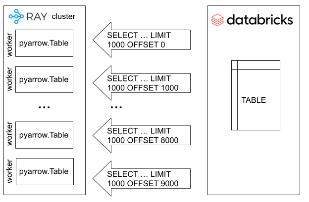

.. _dataset_database_support:

.. _Python DB API 2: https://peps.python.org/pep-0249/

======================================================
Working with databases, data warehouses and data lakes
======================================================

Ray :class:`Datasets <ray.data.Dataset>` can be read from:
* Any table or query from a database with a `Python DB API 2`_ library
* Databricks tables or SQL queries
* Snowflake tables or SQL queries
* MongoDB documents or document queries

Ray :class:`Datasets <ray.data.Dataset>` can be written to:
* Any table in a database with a compliant `Python DB API 2`_  library
* Delta Lake tables
* Snowflake tables
* MongoDB documents

.. note::
    This guide surveys the current database integrations. If none of these meet your
    needs, please reach out to us on `Discourse <https://discuss.ray.io/>`__ or open a feature
    request on the `Ray GitHub repo <https://github.com/ray-project/ray>`__, and check out
    our :ref:`guide for implementing a custom Datasets datasource <custom_datasources>`
    if you're interested in rolling your own integration.

.. _dataset_db_api2:

----------------------------------
From an DB API 2 compliant library
----------------------------------
Any database that provides a `Python DB API 2`_ compliant library can be read from and written 
to using Ray Datasets with the :py:class:`~ray.data.read_dbapi2` 
and :py:class:`~ray.data.Dataset.write_dbapi2` methods.

Connection properties
==========================
Connection properties need to be provided to these methods. The 
required properties depend on the underlying databases connection properties, 
but typically ``user`` and ``password`` are required. 

Below are examples of creating connect properties in code, loading them with yaml or 
reading them from the environment.

.. warning:: 
  For security, avoid putting password and other sensitive properties directly in the code.

.. literalinclude:: ./doc_code/database_support.py
  :language: python
  :start-after: __connect_props_begin__
  :end-before: __connect_props_end__

Reading and writing
===================
A dataset can be read from a database using the :py:class:`~ray.data.read_dbapi2` method,
and written to a database using the :py:class:`~ray.data.Dataset.write_dbapi2` method.
Both methods require that connection properties and the native DB API 2 connect function 
for the database be provided.

The below is an example how to import the sqlite DB API 2 connector that
comes with Python.

.. note::
  SQLite is part of the standard Python packages, and does not need to be installed.

.. warning::
  For parallel reads to work with SQLite on a multi-instance cluster, 
  the database needs to be located in a shared storage location accessible 
  to all nodes in the cluster. This could be a storage device mounted to 
  all nodes in the cluster with NFS. 

.. literalinclude:: ./doc_code/database_support.py
  :language: python
  :start-after: __database_support_import_begin__
  :end-before: __database_support_import_end__

The example below shows how to read and write from and to a database. 
For reading from the database, a table name or a full query can be specified. For writing, 
the name of a table that has already been created in the database must be provided. 
In order to read and write to Postgress, MySQL, or any database with a DB API 2
compliant library, the underlying library needs to be installed onto all nodes of the cluster.

.. literalinclude:: ./doc_code/database_support.py
  :language: python
  :start-after: __database_support_read_write_begin__
  :end-before: __database_support_read_write_end__

How reading works
=================
The default read mode is `partition`. In this mode, reading will be done in parallel 
according to the paralellism. This is accomplished by issuing multiple queries using 
LIMIT and OFFSET. This may be VERY inefficient depending on the internals of how the database
can use indexes and cache query results. Be sure to understand how the database will deal with
multiple parallel queries, as it may neccesary to implement optimizations such as indexes,
materialized views, etc.

.. image:: images/database/dbapi2_read.png)
  :width: 200

If the data set size is small enough, setting the read mode to `direct`, Ray data will cause only 
a single query to be excuted, and the results parsed within a single task.

How writing works
=================
The default write mode is `direct`. In this mode, every partition in the dataset will
be written to a destination table in parallel using `executemany` calls and `INSERT` statements.

.. image:: images/database/dbapi2_write.png)
  :width: 200

The write mode `stage` will write every partition to a stage table in parallel and then upon successful 
completion of the partition writes, a `COPY INTO` query is executed to copy the stage tables into
the destination table. All staging tables are cleaned up after a `write_dbapi2` operation, regardless of 
success or not.

.. image:: images/database/dbapi2_write_staged.png)
  :width: 200

Controlling parallelism
=======================
Ray datasets are read and written to and from the cluster in parallel to the database. 
For reading, a query is created using standard SQL `LIMIT`` and `OFFSET`` semantics, 
and each of these queries is then issued by a seperate Ray task according to the parallism specified.

For writing, a write task is created for each partition of the dataset. To control
the number of parallel write operations the dataset can be repartitioned prior to writing.

If needed, a dataset can be written to staging tables, prior to being copied into 
a single destination table. To enable this, you need to specify ``stage`` mode when writing. 
This will cause each partition in the dataset to be written to an individual stage table. 
Stage tables are named according to the destination table name and a suffix of 
`_stage_<partition number>`.  The staging tables are created prior to writing. After all partitions
are written to a satge table, the stages are then copied to the destination table. After the destination
table has been copied to from all stages, the staging tables are then dropped.

The example below shows how to specify parallelism when reading and writing, and 
how to turn on staging for writes.

.. literalinclude:: ./doc_code/database_support.py
  :language: python
  :start-after: __database_support_parallelism_begin__
  :end-before: __database_support_parallelism_end__

For more control over staging table creation and cleanup, you can use 
the :py:class:`~ray.data.datasource.database.DBAPI2Datasource` and the 
:py:class:`~ray.data.read_datasource` method and :py:class:`~ray.data.Dataset.write_datasource` method
and specify custom queries. See the :py:class:`~ray.data.datasource.database.DBAPI2Datasource` 
API documentation for more details.

.. _datasets_databricks:

---------------
From Databricks
---------------
To take advantage of optimisations to read from and write to Databricks, use the 
:py:class:`~ray.data.read_databricks` and :py:class:`~ray.data.Dataset.write_databricks` methods.

.. _Databricks Python SQL Connector: https://docs.databricks.com/dev-tools/python-sql-connector.html
.. _execute: https://docs.databricks.com/dev-tools/python-sql-connector.html#execute-method

Connection properties
=====================
The minimal required connection properties for Databricks are `http_path`, `server_hostname` and
`access_token`. Optional properties like `database` and `schema` can also be provided at construction 
or be included in the fully specified table name of format `db.schema.table` when calling read 
or write methods.

Reading
===================================
Ray data uses the `Databricks Python SQL Connector`_ `execute`_ method to parallelize 
loading the results of queries across the cluster using `LIMIT` and `OFFSET`.

Additional read parameters
==========================
The native `Databricks Python SQL Connector`_  arguments are also available when reading. 
The `timeout` and `params` arguments may be used in the method.

Writing
=======
Ray data uses the write_parquet method to first write data to intermediate cloud storage, 
and the the `Databricks Python SQL Connector`_ `execute`_ method to copy the parquet file 
into a Delta tables in parallel from each partition in the dataset.
After the copy operation is complete, the intermediate parquet data is deleted.

.. image:: images/database/databricks_write.png)
  :width: 200

Example
========
The code below will read in a tpch sample customer table from Databricks.

.. literalinclude:: ./doc_code/database_support.py
  :language: python
  :start-after: __database_support_databricks_begin__
  :end-before: __database_support_databricks_end__

.. _datasets_snowflake:

--------------
From Snowflake
--------------
The `Snowflake Python API`_ includes extra methods to read and write in 
parallel more eficiently. To take advantage of these optimisations, use the 
:py:class:`~ray.data.read_snowflake` and :py:class:`~ray.data.Dataset.write_snowflake` methods.

.. _Snowflake Python API: https://docs.snowflake.com/en/user-guide/python-connector.html
.. _get_result_batches: https://docs.snowflake.com/en/user-guide/python-connector-api.html#get_result_batches
.. _write_pandas: https://docs.snowflake.com/en/user-guide/python-connector-api.html#write_pandas

Connection properties
=====================
The minimal required connection properties for Snowflake are `user`, `password`, `account` and 
`warehouse`. To use API keys instead of `password`, functionality to load Snowflake API keys is 
also provided. API keys can be loaded from a file specified by the `private_key_file` 
property, or can be passed directly via the `private_key` property. 
If the key is password protected, the password can be given via the `pk_password` property.  
Optional properties like database and schema can also be provided at construction or be included 
in the fully specified table name of format `db.schema.table` when calling read or write methods.

Reading
===================================
Ray data uses the `Snowflake Python API`_ `get_result_batches`_ method to parallelize 
loading the results of queries across the cluster.

.. image:: images/snowflake_read_table.png
  :width: 200

.. warning::
  The `get_result_batches`_ has no way to specify the number of batches returned. Setting parallism 
  during :py:class:`~ray.data.read_snowflake` will have no affect on the number of read tasks.

Additional read parameters
==========================
The native `Snowflake Python API`_  arguments are also available when reading. 
The `timeout` and `params` arguments may be used in the method.

Writing
=======
Ray data uses the `Snowflake Python API`_  `write_pandas`_ method to write Ray datasets to 
Snowflake tables. Each partition in the Ray dataset will call this method in parallel. 
`write_pandas`_ method will write data to a Snowflake stage, and then upon successful 
write to the stage, copy the data into the destination table.

.. image:: images/snowflake_write_table.png)
  :width: 200

Additional write parameters
===========================
The native `Snowflake Python API`_  arguments are also available from the `write_pandas`_ method.
- ``auto_create_table``: When true, will automatically create a table with corresponding columns for each column in the passed in DataFrame. The table will not be created if it already exists
- ``overwrite``: When true, and if auto_create_table is true, then it drops the table. Otherwise, it truncates the table. In both cases it will replace the existing contents of the table with that of the passed in Pandas DataFrame.
- ``table_type``: The table type of to-be-created table. 
The supported table types include ``temp``/``temporary`` and ``transient``. 
Empty means permanent table as per SQL convention.

Example
========
The code below will read in a sample customer table from the Snowflake tpch sample database.

.. literalinclude:: ./doc_code/database_support.py
  :language: python
  :start-after: __database_support_snowflake_begin__
  :end-before: __database_support_snowflake_end__