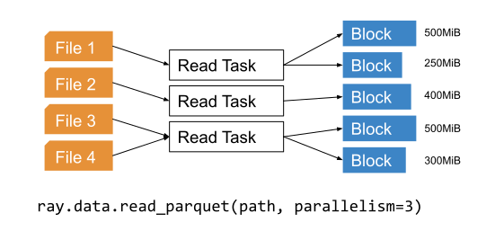
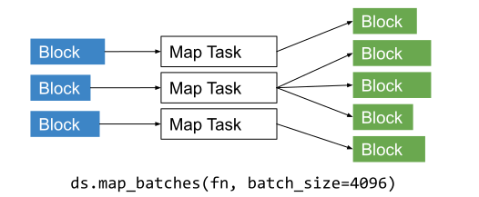
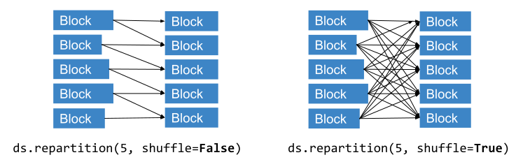
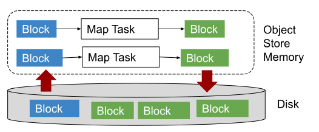

Dataset Execution Model
=======================

This page overviews the execution model of Datasets, which may be useful for understanding and tuning performance.

Reading Data
------------

Datasets uses Ray tasks to read data from remote storage. When reading from a file-based datasource (e.g., S3, GCS), it creates a number of read tasks equal to the specified read parallelism (200 by default). One or more files will be assigned to each read task. Each read task reads its assigned files and produces one or more output blocks (Ray objects):

..
  https://docs.google.com/drawings/d/15B4TB8b5xN15Q9S8-s0MjW6iIvo_PrH7JtV1fL123pU/edit

In the common case, each read task produces a single output block. Read tasks may split the output into multiple blocks if the data exceeds the target max block size (2GiB by default). This automatic block splitting avoids out-of-memory errors when reading very large single files (e.g., a 100-gigabyte CSV file). All of the built-in datasources except for JSON currently support automatic block splitting.

.. note::

  Block splitting is currently off by default. See the block size tuning section below on how to enable block splitting (beta).

Deferred Read Task Execution
~~~~~~~~~~~~~~~~~~~~~~~~~~~~

When a Dataset is created using ``ray.data.read_*``, only the first read task will be executed initially. This avoids blocking Dataset creation on the reading of all data files, enabling inspection functions like ``ds.schema()`` and ``ds.show()`` to be used right away. Executing further transformations on the Dataset will trigger execution of all read tasks.

Dataset Transforms
------------------

Datasets use either Ray tasks or Ray actors to transform datasets (i.e., for ``.map``, ``.flat_map``, or ``.map_batches``). By default, tasks are used (``compute="tasks"``). Actors can be specified with ``compute="actors"``, in which case an autoscaling pool of Ray actors will be used to apply transformations. Using actors allows for expensive state initialization (e.g., for GPU-based tasks) to be re-used. Whichever compute strategy is used, each map task generally takes in one block and produces one or more output blocks. The output block splitting rule is the same as for file reads (blocks are split after hitting the target max block size of 2GiB):

..
  https://docs.google.com/drawings/d/1MGlGsPyTOgBXswJyLZemqJO1Mf7d-WiEFptIulvcfWE/edit

Shuffling Data
--------------

Certain operations like ``.sort`` and ``.groupby`` require data blocks to be partitioned by value. Datasets executes this in three phases. First, a wave of sampling tasks determines suitable partition boundaries based on a random sample of data. Second, map tasks divide each input block into a number of output blocks equal to the number of reduce tasks. Third, reduce tasks take assigned output blocks from each map task and combines them into one block. Overall, this strategy generates ``O(n^2)`` intermediate objects where ``n`` is the number of input blocks.

You can also change the partitioning of a Dataset using ``.random_shuffle`` or ``.repartition``. The former should be used if you want to randomize the order of elements in the dataset. The second should be used if you only want to equalize the size of the Dataset blocks (e.g., after a read or transformation that may skew the distribution of block sizes). Note that repartition has two modes, ``shuffle=False``, which performs the minimal data movement needed to equalize block sizes, and ``shuffle=True``, which performs a full (non-random) distributed shuffle:

..
  https://docs.google.com/drawings/d/132jhE3KXZsf29ho1yUdPrCHB9uheHBWHJhDQMXqIVPA/edit

Memory Management
-----------------

This section deals with how Datasets manages execution and object store memory.

Execution Memory
~~~~~~~~~~~~~~~~

During execution, certain types of intermediate data must fit in memory. This includes the input block of a task, as well as at least one of the output blocks of the task (when a task has multiple output blocks, only one needs to fit in memory at any given time). The input block consumes object stored shared memory (Python heap memory for non-Arrow data). The output blocks consume Python heap memory (prior to putting in the object store) as well as object store memory (after being put in the object store).

This means that large block sizes can lead to potential out-of-memory situations. To avoid OOM errors, Datasets tries to split blocks during map and read tasks into pieces smaller than the target max block size. In some cases, this splitting is not possible (e.g., if a single item in a block is extremely large, or the function given to ``.map_batches`` returns a very large batch). To avoid these issues, make sure no single item in your Datasets is too large, and always call ``.map_batches`` with batch size small enough such that the output batch can comfortably fit into memory.

Object Store Memory
~~~~~~~~~~~~~~~~~~~

Datasets uses the Ray object store to store data blocks, which means it inherits the memory management features of the Ray object store. This section discusses the relevant features:

**Object Spilling**: Since Datasets uses the Ray object store to store data blocks, any blocks that can't fit into object store memory are automatically spilled to disk. The objects are automatically reloaded when needed by downstream compute tasks:

..
  https://docs.google.com/drawings/d/1H_vDiaXgyLU16rVHKqM3rEl0hYdttECXfxCj8YPrbks/edit

**Locality Scheduling**: Ray will preferentially schedule compute tasks on nodes that already have a local copy of the object, reducing the need to transfer objects between nodes in the cluster.

**Reference Counting**: Dataset blocks are kept alive by object store reference counting as long as there is any Dataset that references them. To free memory, delete any Python references to the Dataset object.

**Load Balancing**: Datasets uses Ray scheduling hints to spread read tasks out across the cluster to balance memory usage.

Performance Tips and Tuning
---------------------------

Batching Transforms
~~~~~~~~~~~~~~~~~~~

Mapping individual records using ``.map(fn)`` can be quite slow. Instead, consider using ``.map_batches(batch_fn, batch_format="pandas")`` and writing your ``batch_fn`` to perform vectorized pandas operations.

Parquet Column Pruning
~~~~~~~~~~~~~~~~~~~~~~

Current Datasets will read all Parquet columns into memory. If you only need a subset of the columns, make sure to specify the list of columns explicitly when calling ``ray.data.read_parquet()`` to avoid loading unnecessary data.

Tuning Read Parallelism
~~~~~~~~~~~~~~~~~~~~~~~

By default, Ray requests 0.5 CPUs per read task, which means two read tasks can concurrently execute per CPU. For datasources that can benefit from higher degress of I/O parallelism, you can specify a lower ``num_cpus`` value for the read function via the ``ray_remote_args`` parameter. For example, use ``ray.data.read_parquet(path, ray_remote_args={"num_cpus": 0.25})`` to allow up to four read tasks per CPU.

The number of read tasks can also be increased by increasing the ``parallelism`` parameter. For example, use ``ray.data.read_parquet(path, parallelism=1000)`` to create up to 1000 read tasks. Typically, increasing the number of read tasks only helps if you have more cluster CPUs than the default parallelism.

Tuning Max Block Size
~~~~~~~~~~~~~~~~~~~~~

Block splitting is off by default. To enable block splitting (beta), run ``ray.data.context.DatasetContext.get_current().block_splitting_enabled = True``.

Once enabled, the max target block size can be adjusted via the Dataset context API. For example, to configure a max target block size of 8GiB, run ``ray.data.context.DatasetContext.get_current().target_max_block_size = 8192 * 1024 * 1024`` prior to creating the Dataset. Lower block sizes reduce the max amount of object store and Python heap memory required during execution. However, having too many blocks may introduce task scheduling overheads.

We do not recommend adjusting this value for most workloads. However, if shuffling a large amount of data, increasing the block size limit reduces the number of intermediate blocks (as a rule of thumb, shuffle creates ``O(num_blocks**2)`` intermediate blocks). Alternatively, you can ``.repartition()`` the dataset to reduce the number of blocks prior to shuffle/groupby operations. If you're seeing out of memory errors during map tasks, reducing the max block size may also be worth trying.

Note that the number of blocks a Dataset created from ``ray.data.read_*`` contains is not fully known until all read tasks are fully executed. The number of blocks printed in the Dataset's string representation is initially set to the number of read tasks generated. To view the actual number of blocks created after block splitting, use ``len(ds.get_internal_block_refs())``, which will block until all data has been read.
