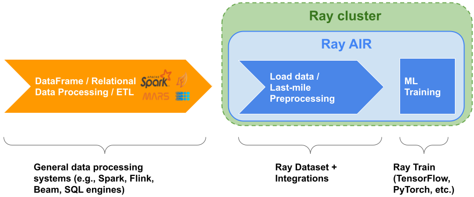
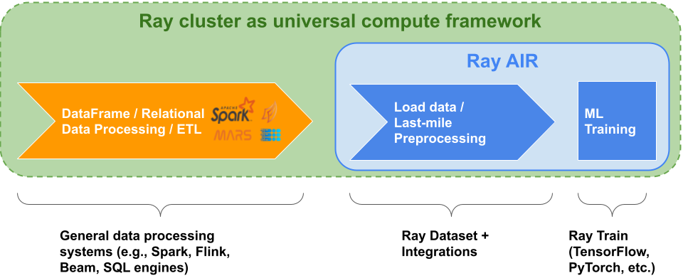

.. _datasets-ml-preprocessing:

================
ML Preprocessing
================

Ray Datasets are designed to load and preprocess data for distributed :ref:`ML training pipelines <train-docs>`.
Compared to other loading solutions, Datasets are more flexible (e.g., can express higher-quality `per-epoch global shuffles <examples/big_data_ingestion.html>`__) and provides `higher overall performance <https://www.anyscale.com/blog/why-third-generation-ml-platforms-are-more-performant>`__.

Datasets is not intended as a replacement for more general data processing systems.
Its utility is as the last-mile bridge from ETL pipeline outputs to distributed applications and libraries in Ray:

..
  https://docs.google.com/presentation/d/1l03C1-4jsujvEFZUM4JVNy8Ju8jnY5Lc_3q7MBWi2PQ/edit

Ray-integrated DataFrame libraries can also be seamlessly used with Datasets, to enable running a full data to
ML pipeline completely within Ray without requiring data to be materialized to external storage:

See below for information on how to use Datasets as the
last-mile bridge to model training and inference, and see :ref:`the Talks section <data-talks>` for more
Datasets ML use cases and benchmarks.

-----------------------
Last-mile Preprocessing
-----------------------

Datasets supports data preprocessing transformations commonly performed just before model training and model inference, which we refer to as **last-mile preprocessing**. These transformations are carried out via a few key operations: mapping, groupbys + aggregations, and random shuffling.

Mapping
=======

Many common preprocessing transformations, such as:

- adding new columns
- transforming existing columns
- dropping columns
- dropping nulls
- one-hot encoding

can be efficiently applied to a :class:`~ray.data.Dataset` using
:ref:`user-defined functions <transform_datasets_writing_udfs>` (UDFs) and
:meth:`~ray.data.Dataset.map_batches`; this will execute these transformations in
parallel over the :class:`~ray.data.Dataset` blocks, and allows you to apply vectorized
Pandas operations to the block columns within the UDF.

.. code-block:: python

    # A Pandas DataFrame UDF for transforming the underlying blocks of a Dataset in parallel.
    def transform_batch(df: pd.DataFrame):
        # Drop nulls.
        df = df.dropna(subset=["feature_1"])
        # Add new column.
        df["new_col"] = df["feature_1"] - 2 * df["feature_2"] + df["feature_3"] / 3
        # Transform existing column.
        df["feature_1"] = 2 * df["feature_1"] + 1
        # Drop column.
        df.drop(columns="feature_2", inplace=True)
        # One-hot encoding.
        categories = ["cat_1", "cat_2", "cat_3"]
        for category in categories:
            df[f"category_{category}"] = df["category"].map(
                collections.defaultdict(int, **{category: 1}))
        return df

    # batch_format="pandas" tells Datasets to provide the transformer with blocks
    # represented as Pandas DataFrames.
    ds = ds.map_batches(transform_batch, batch_format="pandas")

.. _datasets-groupbys:

Group-bys and aggregations
==========================

Other preprocessing operations require global operations, such as groupbys and grouped/global aggregations. Just like other transformations, grouped/global aggregations are executed *eagerly* and block until the aggregation has been computed.

.. code-block:: python

    ds: ray.data.Dataset = ray.data.from_items([
        {"A": x % 3, "B": 2 * x, "C": 3 * x}
        for x in range(10)])

    # Group by the A column and calculate the per-group mean for B and C columns.
    agg_ds: ray.data.Dataset = ds.groupby("A").mean(["B", "C"])
    # -> Sort Sample: 100%|███████████████████████████████████████| 10/10 [00:01<00:00,  9.04it/s]
    # -> GroupBy Map: 100%|███████████████████████████████████████| 10/10 [00:00<00:00, 23.66it/s]
    # -> GroupBy Reduce: 100%|████████████████████████████████████| 10/10 [00:00<00:00, 937.21it/s]
    # -> Dataset(num_blocks=10, num_rows=3, schema={})
    agg_ds.to_pandas()
    # ->
    #    A  mean(B)  mean(C)
    # 0  0      9.0     13.5
    # 1  1      8.0     12.0
    # 2  2     10.0     15.0

    # Global mean on B column.
    ds.mean("B")
    # -> GroupBy Map: 100%|███████████████████████████████████████| 10/10 [00:00<00:00, 2851.91it/s]
    # -> GroupBy Reduce: 100%|████████████████████████████████████| 1/1 [00:00<00:00, 319.69it/s]
    # -> 9.0

    # Global mean on multiple columns.
    ds.mean(["B", "C"])
    # -> GroupBy Map: 100%|███████████████████████████████████████| 10/10 [00:00<00:00, 1730.32it/s]
    # -> GroupBy Reduce: 100%|████████████████████████████████████| 1/1 [00:00<00:00, 231.41it/s]
    # -> {'mean(B)': 9.0, 'mean(C)': 13.5}

    # Multiple global aggregations on multiple columns.
    from ray.data.aggregate import Mean, Std
    ds.aggregate(Mean("B"), Std("B", ddof=0), Mean("C"), Std("C", ddof=0))
    # -> GroupBy Map: 100%|███████████████████████████████████████| 10/10 [00:00<00:00, 1568.73it/s]
    # -> GroupBy Reduce: 100%|████████████████████████████████████| 1/1 [00:00<00:00, 133.51it/s]
    # -> {'mean(A)': 0.9, 'std(A)': 0.8306623862918076, 'mean(B)': 9.0, 'std(B)': 5.744562646538029}

These aggregations can be combined with batch mapping to transform a dataset using computed statistics. For example, you can efficiently standardize feature columns and impute missing values with calculated column means.

.. code-block:: python

    # Impute missing values with the column mean.
    b_mean = ds.mean("B")
    # -> GroupBy Map: 100%|███████████████████████████████████████| 10/10 [00:00<00:00, 4054.03it/s]
    # -> GroupBy Reduce: 100%|████████████████████████████████████| 1/1 [00:00<00:00, 359.22it/s]
    # -> 9.0

    def impute_b(df: pd.DataFrame):
        df["B"].fillna(b_mean)
        return df

    ds = ds.map_batches(impute_b, batch_format="pandas")
    # -> Map Progress: 100%|██████████████████████████████████████| 10/10 [00:00<00:00, 132.66it/s]
    # -> Dataset(num_blocks=10, num_rows=10, schema={A: int64, B: int64, C: int64})

    # Standard scaling of all feature columns.
    stats = ds.aggregate(Mean("B"), Std("B"), Mean("C"), Std("C"))
    # -> GroupBy Map: 100%|███████████████████████████████████████| 10/10 [00:00<00:00, 1260.99it/s]
    # -> GroupBy Reduce: 100%|████████████████████████████████████| 1/1 [00:00<00:00, 128.77it/s]
    # -> {'mean(B)': 9.0, 'std(B)': 6.0553007081949835, 'mean(C)': 13.5, 'std(C)': 9.082951062292475}

    def batch_standard_scaler(df: pd.DataFrame):
        def column_standard_scaler(s: pd.Series):
            s_mean = stats[f"mean({s.name})"]
            s_std = stats[f"std({s.name})"]
            return (s - s_mean) / s_std

        cols = df.columns.difference(["A"])
        df.loc[:, cols] = df.loc[:, cols].transform(column_standard_scaler)
        return df

    ds = ds.map_batches(batch_standard_scaler, batch_format="pandas")
    # -> Map Progress: 100%|██████████████████████████████████████| 10/10 [00:00<00:00, 144.79it/s]
    # -> Dataset(num_blocks=10, num_rows=10, schema={A: int64, B: double, C: double})

Random shuffle
==============

Randomly shuffling data is an important part of training machine learning models: it decorrelates samples, preventing overfitting and improving generalization. For many models, even between-epoch shuffling can drastically improve the precision gain per step/epoch. Datasets has a hyper-scalable distributed random shuffle that allows you to realize the model accuracy benefits of per-epoch shuffling without sacrificing training throughput, even at large data scales and even when doing distributed data-parallel training across multiple GPUs/nodes.

.. code-block:: python

    ds = ray.data.range(10)
    # -> [0, 1, ..., 9]

    # Global random shuffle.
    ds = ds.random_shuffle()
    # -> Shuffle Map: 100%|███████████████████████████████████████| 10/10 [00:00<00:00, 12.35it/s]
    # -> Shuffle Reduce: 100%|████████████████████████████████████| 10/10 [00:00<00:00, 45.54it/s]
    # -> [7, 1, ..., 3]

    # Scales to terabytes of data with the same simple API.
    ds = ray.data.read_parquet("s3://ursa-labs-taxi-data")  # open, tabular, NYC taxi dataset
    # -> Dataset(num_blocks=125, num_rows=1547741381, schema={
    #        vendor_id: string, pickup_at: timestamp[us], dropoff_at: timestamp[us],
    #        passenger_count: int8, trip_distance: float, ...})

    # Don't run this next one on your laptop; it will probably crash since it will
    # try to read and shuffle ~99 GB of data!
    ds = ds.random_shuffle()
    # -> Shuffle Map: 100%|███████████████████████████████████████| 125/125 [00:00<00:00, 5021.94it/s]
    # -> Shuffle Reduce: 100%|████████████████████████████████████| 125/125 [00:00<00:00, 4034.33it/s]
    # -> Dataset(num_blocks=125, num_rows=1547741381, schema={
    #        vendor_id: string, pickup_at: timestamp[us], dropoff_at: timestamp[us],
    #        passenger_count: int8, trip_distance: float, ...})

    # Per-epoch shuffling is as simple as changing where we invoke the shuffle:
    #   - Before repeating => dataset is shuffled once.
    #   - After repeating  => dataset is shuffled on every epoch.
    num_epochs = 20

    # Shuffle once, then repeat this once-shuffled dataset for num_epochs epochs.
    ds.random_shuffle().repeat(num_epochs)
    # -> Shuffle Map: 100%|███████████████████████████████████████| 10/10 [00:00<00:00, 13.43it/s]
    # -> Shuffle Reduce: 100%|████████████████████████████████████| 10/10 [00:00<00:00, 42.70it/s]
    # -> DatasetPipeline(num_windows=10, num_stages=1)

    # Shuffle repeatedly, where the original dataset is shuffled into a different
    # order at the beginning of each epoch.
    ds.repeat(num_epochs).random_shuffle_each_window()
    # -> DatasetPipeline(num_windows=10, num_stages=2)

See the `large-scale ML ingest example <examples/big_data_ingestion.html>`__ for an end-to-end example of per-epoch shuffled data loading for distributed training.

Random block order
~~~~~~~~~~~~~~~~~~

For a low-cost way to perform a pseudo global shuffle that does not require loading the full Dataset into memory,
you can randomize the order of the *blocks* with :meth:`Dataset.randomize_block_order <ray.data.Dataset.randomize_block_order>`.

.. code-block:: python

    import ray

    ds = ray.data.range(12).repartition(4)
    print(ds.take())
    # -> [0, 1, 2, 3, 4, 5, 6, 7, 8, 9, 10, 11]

    random_ds = ds.randomize_block_order(seed=0)
    print(random_ds.take())
    # -> [6, 7, 8, 0, 1, 2, 3, 4, 5, 9, 10, 11]
