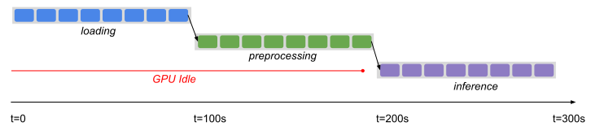
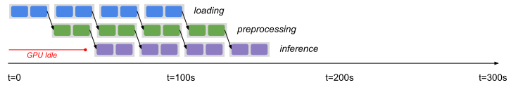
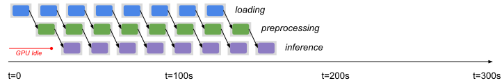
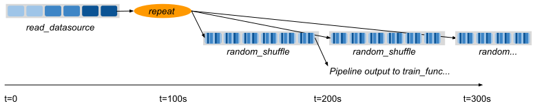
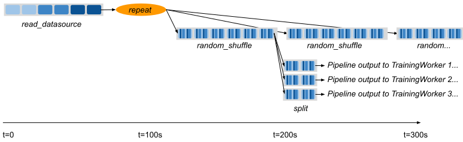

Dataset Pipelines
=================

Overview
--------

Datasets execute their transformations synchronously in blocking calls. However, it can be useful to overlap dataset computations with output. This can be done with a `DatasetPipeline <package-ref.html#datasetpipeline-api>`__.

A DatasetPipeline is an unified iterator over a (potentially infinite) sequence of Ray Datasets. Conceptually it is similar to a `Spark DStream <https://spark.apache.org/docs/latest/streaming-programming-guide.html#discretized-streams-dstreams>`__, but manages execution over a bounded amount of source data instead of an unbounded stream. Ray computes each dataset on-demand and stitches their output together into a single logical data iterator. DatasetPipeline implements most of the same transformation and output methods as Datasets (e.g., map, filter, split, iter_rows, to_torch, etc.).

Creating a DatasetPipeline
~~~~~~~~~~~~~~~~~~~~~~~~~~

A DatasetPipeline can be constructed in two ways: either by pipelining the execution of an existing Dataset (via ``Dataset.pipeline``), or generating repeats of an existing Dataset (via ``Dataset.repeat``). Similar to Datasets, you can freely pass DatasetPipelines between Ray tasks, actors, and libraries. Get started with this synthetic data example:

.. code-block:: python

    import ray

    def func1(i: int) -> int:
        return i + 1

    def func2(i: int) -> int:
        return i * 2

    def func3(i: int) -> int:
        return i % 3

    # Create a dataset and then create a pipeline from it.
    base = ray.data.range(1000000)
    print(base)
    # -> Dataset(num_blocks=200, num_rows=1000000, schema=<class 'int'>)
    pipe = base.pipeline(parallelism=10)
    print(pipe)
    # -> DatasetPipeline(length=20, num_stages=1)

    # Applying transforms to pipelines adds more pipeline stages.
    pipe = pipe.map(func1)
    pipe = pipe.map(func2)
    pipe = pipe.map(func3)
    print(pipe)
    # -> DatasetPipeline(length=20, num_stages=4)

    # Output can be pulled from the pipeline concurrently with its execution.
    num_rows = 0
    for row in pipe.iter_rows():
        num_rows += 1
    # ->
    # Stage 0:  55%|█████████████████████████                |11/20 [00:02<00:00,  9.86it/s]
    # Stage 1:  50%|██████████████████████                   |10/20 [00:02<00:01,  9.45it/s]
    # Stage 2:  45%|███████████████████                      | 9/20 [00:02<00:01,  8.27it/s]
    # Stage 3:  35%|████████████████                         | 8/20 [00:02<00:02,  5.33it/s]
    print("Total num rows", num_rows)
    # -> Total num rows 1000000

You can also create a DatasetPipeline from a custom iterator over dataset creators using ``DatasetPipeline.from_iterable``. For example, this is how you would implement ``Dataset.repeat`` and ``Dataset.pipeline`` using ``from_iterable``:

.. code-block:: python

    import ray
    from ray.data.dataset_pipeline import DatasetPipeline

    # Equivalent to ray.data.range(1000).repeat(times=4)
    source = ray.data.range(1000)
    pipe = DatasetPipeline.from_iterable(
        [lambda: source, lambda: source, lambda: source, lambda: source])

    # Equivalent to ray.data.range(1000).pipeline(parallelism=10)
    splits = ray.data.range(1000, parallelism=200).split(20)
    pipe = DatasetPipeline.from_iterable([lambda s=s: s for s in splits])

Example: Pipelined Batch Inference
----------------------------------

In this example, we pipeline the execution of a three-stage Dataset application to minimize GPU idle time. Let's revisit the batch inference example from the previous page:

.. code-block:: python

    def preprocess(image: bytes) -> bytes:
        return image

    class BatchInferModel:
        def __init__(self):
            self.model = ImageNetModel()
        def __call__(self, batch: pd.DataFrame) -> pd.DataFrame:
            return self.model(batch)

    # Load data from storage.
    ds: Dataset = ray.data.read_binary_files("s3://bucket/image-dir")

    # Preprocess the data.
    ds = ds.map(preprocess)

    # Apply GPU batch inference to the data.
    ds = ds.map_batches(BatchInferModel, compute="actors", batch_size=256, num_gpus=1)

    # Save the output.
    ds.write_json("/tmp/results")

Ignoring the output, the above script has three separate stages: loading, preprocessing, and inference. Assuming we have a fixed-sized cluster, and that each stage takes 100 seconds each, the cluster GPUs will be idle for the first 200 seconds of execution:

..
  https://docs.google.com/drawings/d/1UMRcpbxIsBRwD8G7hR3IW6DPa9rRSkd05isg9pAEx0I/edit

Enabling Pipelining
~~~~~~~~~~~~~~~~~~~

We can optimize this by *pipelining* the execution of the dataset with the ``.pipeline()`` call, which returns a DatasetPIpeline instead of a Dataset object. The pipeline supports similar transformations to the original Dataset:

.. code-block:: python

    # Convert the Dataset into a DatasetPipeline.
    pipe: DatasetPipeline = ray.data \
        .read_binary_files("s3://bucket/image-dir") \
        .pipeline(parallelism=2)

    # The remainder of the steps do not change.
    pipe = pipe.map(preprocess)
    pipe = pipe.map_batches(BatchInferModel, compute="actors", batch_size=256, num_gpus=1)
    pipe.write_json("/tmp/results")

Here we specified ``parallelism=2``, which means that the Dataset is split into smaller sub-Datasets of two blocks each. Each transformation or *stage* of the pipeline is operating over these two-block Datasets in parallel. This means batch inference processing can start as soon as two blocks are read and preprocessed, greatly reducing the GPU idle time:

Tuning Parallelism
~~~~~~~~~~~~~~~~~~

Tune the throughput vs latency of your pipeline with the ``parallelism`` setting. As a rule of thumb, higher parallelism settings perform better, however ``parallelism == num_blocks`` effectively disables pipelining, since the DatasetPipeline will only contain a single Dataset. The other extreme is setting ``parallelism=1``, which minimizes the latency to initial output but only allows one concurrent transformation task per stage:

Example: Per-Epoch Shuffle Pipeline
-----------------------------------

..
  https://docs.google.com/drawings/d/1vWQ-Zfxy2_Gthq8l3KmNsJ7nOCuYUQS9QMZpj5GHYx0/edit

The other method of creating a pipeline is calling ``.repeat()`` on an existing Dataset. This creates a DatasetPipeline over an infinite sequence of the same original Dataset. Readers pulling batches from the pipeline will see the same data blocks repeatedly, which is useful for distributed training.

Pre-repeat vs post-repeat transforms
~~~~~~~~~~~~~~~~~~~~~~~~~~~~~~~~~~~~

Transformations made prior to the Dataset prior to the call to ``.repeat()`` are executed once. Transformations made to the DatasetPipeline after the repeat will be executed once for each repetition of the Dataset. For example, in the following pipeline, the datasource read only occurs once. However, the random shuffle is applied to each repetition in the pipeline.

**Code**:

.. code-block:: python

    # Create a pipeline that loops over its source dataset indefinitely.
    pipe: DatasetPipeline = ray.data \
        .read_datasource(...) \
        .repeat() \
        .random_shuffle()

    @ray.remote(num_gpus=1)
    def train_func(pipe: DatasetPipeline):
        model = MyModel()
        for batch in pipe.to_torch():
            model.fit(batch)

    # Read from the pipeline in a remote training function.
    ray.get(train_func.remote(pipe))

**Pipeline**:

Splitting pipelines for distributed ingest
~~~~~~~~~~~~~~~~~~~~~~~~~~~~~~~~~~~~~~~~~~

Similar to how you can ``.split()`` a Dataset, you can also split a DatasetPipeline with the same method call. This returns a number of DatasetPipeline shards that share a common parent pipeline. Each shard can be passed to a remote task or actor.

**Code**:

.. code-block:: python

    # Create a pipeline that loops over its source dataset indefinitely.
    pipe: DatasetPipeline = ray.data \
        .read_parquet("s3://bucket/dir") \
        .repeat() \
        .random_shuffle()

    @ray.remote(num_gpus=1)
    class TrainingWorker:
        def __init__(self, rank: int, shard: DatasetPipeline):
            self.rank = rank
            self.shard = shard
        ...

    shards: List[DatasetPipeline] = pipe.split(n=3)
    workers = [TrainingWorker.remote(rank, s) for rank, s in enumerate(shards)]
    ...

**Pipeline**:

