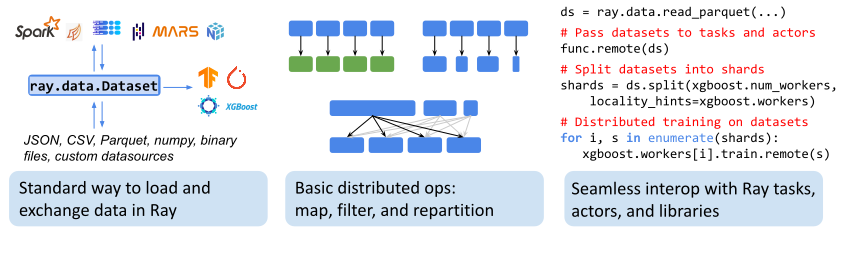
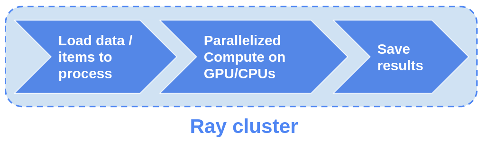

.. include:: /_includes/data/announcement.rst

.. _datasets:

==================================================
Ray Datasets: Distributed Data Loading and Compute
==================================================

Ray Datasets are the standard way to load and exchange data in Ray libraries and applications.
They provide basic distributed data transformations such as ``map``, ``filter``, and ``repartition``,
and are compatible with a variety of file formats, data sources, and distributed frameworks.

Here's an overview of the integrations with other processing frameworks, file formats, and supported operations,
as well as glimpse at the Ray Datasets API.
Check our :ref:`compatibility matrix<data-compatibility>` to see if your favorite format is supported already.

..
  https://docs.google.com/drawings/d/16AwJeBNR46_TsrkOmMbGaBK7u-OPsf_V8fHjU-d2PPQ/edit

Ray Datasets simplifies general purpose parallel GPU and CPU compute in Ray; for instance, for `GPU batch inference <dataset.html#transforming-datasets>`__.
It provides a higher level API for Ray tasks and actors in such embarrassingly parallel compute situations,
internally handling operations like batching, pipelining, and memory management.

As part of the Ray ecosystem, Ray Datasets can leverage the full functionality of Ray's distributed scheduler,
e.g., using actors for optimizing setup time and GPU scheduling.

----------------------------------------------
Data Loading and Preprocessing for ML Training
----------------------------------------------

Ray Datasets are designed to load and preprocess data for distributed :ref:`ML training pipelines <train-docs>`.
Compared to other loading solutions, Datasets are more flexible (e.g., can express higher-quality `per-epoch global shuffles <examples/big_data_ingestion.html>`__) and provides `higher overall performance <https://www.anyscale.com/blog/why-third-generation-ml-platforms-are-more-performant>`__.

Ray Datasets is not intended as a replacement for more general data processing systems.
:ref:`Learn more about how Ray Datasets works with other ETL systems <datasets-ml-preprocessing>`.

----------------------
Where to Go from Here?
----------------------

As new user of Ray Datasets, you may want to start with our :ref:`Getting Started Guide<datasets_getting_started>`.
If you've run your first examples already, you might want to dive into Ray Datasets' key concepts or our User Guide instead.
Advanced users can utilize the Ray Datasets API reference for their projects.

.. panels::
    :container: text-center
    :column: col-lg-6 px-2 py-2
    :card:

    Getting Started
    ^^^

    Start with our quick start tutorials for :ref:`working with Datasets<ray_datasets_quick_start>`
    and :ref:`Dataset Pipelines<pipelining_datasets>`.
    These concrete examples will give you an idea of how to use Ray Datasets.

    +++
    .. link-button:: datasets_getting_started
        :type: ref
        :text: Get Started with Ray Datasets
        :classes: btn-outline-info btn-block
    ---

    Key Concepts
    ^^^

    Understand the key concepts behind Ray Datasets.
    Learn what :ref:`Datasets<dataset_concept>` and :ref:`Dataset Pipelines<dataset_pipeline_concept>` are
    and :ref:`how they get executed<dataset_execution_concept>` in Ray Datasets.

    +++
    .. link-button:: data_key_concepts
        :type: ref
        :text: Learn Key Concepts
        :classes: btn-outline-info btn-block
    ---

    User Guide
    ^^^

    Learn how to :ref:`load and process data for ML<datasets-ml-preprocessing>`,
    work with :ref:`tensor data<datasets_tensor_support>`, or :ref:`use pipelines<data_pipeline_usage>`.
    Run your first :ref:`Dask <dask-on-ray>`, :ref:`Spark <spark-on-ray>`, :ref:`Mars <mars-on-ray>`
    and :ref:`Modin <modin-on-ray>` examples on Ray Datasets.

    +++
    .. link-button:: data_user_guide
        :type: ref
        :text: Start Using Ray Datasets
        :classes: btn-outline-info btn-block
    ---

    API
    ^^^

    Get more in-depth information about the Ray Datasets API.

    +++
    .. link-button:: data_api
        :type: ref
        :text: Read the API Reference
        :classes: btn-outline-info btn-block

.. _data-compatibility:

------------------------
Datasource Compatibility
------------------------

Ray Datasets supports reading and writing many formats.
The following two compatibility matrices will help you understand which formats are currently available.

Supported Input Formats
=======================

.. list-table:: Input compatibility matrix
   :header-rows: 1

   * - Input Type
     - Read API
     - Status
   * - CSV File Format
     - :func:`ray.data.read_csv()`
     - ✅
   * - JSON File Format
     - :func:`ray.data.read_json()`
     - ✅
   * - Parquet File Format
     - :func:`ray.data.read_parquet()`
     - ✅
   * - Numpy File Format
     - :func:`ray.data.read_numpy()`
     - ✅
   * - Text Files
     - :func:`ray.data.read_text()`
     - ✅
   * - Binary Files
     - :func:`ray.data.read_binary_files()`
     - ✅
   * - Python Objects
     - :func:`ray.data.from_items()`
     - ✅
   * - Spark Dataframe
     - :func:`ray.data.from_spark()`
     - ✅
   * - Dask Dataframe
     - :func:`ray.data.from_dask()`
     - ✅
   * - Modin Dataframe
     - :func:`ray.data.from_modin()`
     - ✅
   * - MARS Dataframe
     - :func:`ray.data.from_mars()`
     - ✅
   * - Pandas Dataframe Objects
     - :func:`ray.data.from_pandas()`
     - ✅
   * - NumPy ndarray Objects
     - :func:`ray.data.from_numpy()`
     - ✅
   * - Arrow Table Objects
     - :func:`ray.data.from_arrow()`
     - ✅
   * - 🤗 (Hugging Face) Dataset
     - :func:`ray.data.from_huggingface()`
     - ✅
   * - Custom Datasource
     - :func:`ray.data.read_datasource()`
     - ✅

Supported Output Formats
========================

.. list-table:: Output compatibility matrix
   :header-rows: 1

   * - Output Type
     - Dataset API
     - Status
   * - CSV File Format
     - :meth:`ds.write_csv() <ray.data.Dataset.write_csv>`
     - ✅
   * - JSON File Format
     - :meth:`ds.write_json() <ray.data.Dataset.write_json>`
     - ✅
   * - Parquet File Format
     - :meth:`ds.write_parquet() <ray.data.Dataset.write_parquet>`
     - ✅
   * - Numpy File Format
     - :meth:`ds.write_numpy() <ray.data.Dataset.write_numpy>`
     - ✅
   * - Spark Dataframe
     - :meth:`ds.to_spark() <ray.data.Dataset.to_spark>`
     - ✅
   * - Dask Dataframe
     - :meth:`ds.to_dask() <ray.data.Dataset.to_dask>`
     - ✅
   * - Modin Dataframe
     - :meth:`ds.to_modin() <ray.data.Dataset.to_modin>`
     - ✅
   * - MARS Dataframe
     - :meth:`ds.to_mars() <ray.data.Dataset.to_mars>`
     - ✅
   * - Arrow Table Objects
     - :meth:`ds.to_arrow_refs() <ray.data.Dataset.to_arrow_refs>`
     - ✅
   * - Arrow Table Iterator
     - :meth:`ds.iter_batches(batch_format="pyarrow") <ray.data.Dataset.iter_batches>`
     - ✅
   * - Single Pandas Dataframe
     - :meth:`ds.to_pandas() <ray.data.Dataset.to_pandas>`
     - ✅
   * - Pandas Dataframe Objects
     - :meth:`ds.to_pandas_refs() <ray.data.Dataset.to_pandas_refs>`
     - ✅
   * - NumPy ndarray Objects
     - :meth:`ds.to_numpy_refs() <ray.data.Dataset.to_numpy_refs>`
     - ✅
   * - Pandas Dataframe Iterator
     - :meth:`ds.iter_batches(batch_format="pandas") <ray.data.Dataset.iter_batches>`
     - ✅
   * - PyTorch Iterable Dataset
     - :meth:`ds.to_torch() <ray.data.Dataset.to_torch>`
     - ✅
   * - TensorFlow Iterable Dataset
     - :meth:`ds.to_tf() <ray.data.Dataset.to_tf>`
     - ✅
   * - Random Access Dataset
     - :meth:`ds.to_random_access_dataset() <ray.data.Dataset.to_random_access_dataset>`
     - ✅
   * - Custom Datasource
     - :meth:`ds.write_datasource() <ray.data.Dataset.write_datasource>`
     - ✅

.. _data-talks:

----------
Learn More
----------

- [slides] `Talk given at PyData 2021 <https://docs.google.com/presentation/d/1zANPlmrxQkjPU62I-p92oFO3rJrmjVhs73hL4YbM4C4>`_
- [blog] `Data Ingest in a Third Generation ML Architecture <https://www.anyscale.com/blog/deep-dive-data-ingest-in-a-third-generation-ml-architecture>`_
- [blog] `Building an end-to-end ML pipeline using Mars and XGBoost on Ray <https://www.anyscale.com/blog/building-an-end-to-end-ml-pipeline-using-mars-and-xgboost-on-ray>`_
- [blog] `Ray Datasets for large-scale machine learning ingest and scoring <https://www.anyscale.com/blog/ray-datasets-for-machine-learning-training-and-scoring>`_

----------
Contribute
----------

Contributions to Ray Datasets are `welcome <https://docs.ray.io/en/master/development.html#python-develop>`__!
There are many potential improvements, including:

- Supporting more data sources and transforms.
- Integration with more ecosystem libraries.
- Adding features that require partitioning such as `groupby()` and `join()`.
- Performance optimizations.

.. include:: /_includes/data/announcement_bottom.rst
