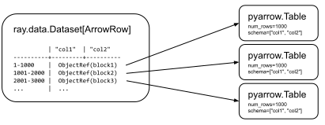

.. _datasets:

Datasets: Distributed Data Loading and Compute
==============================================

.. tip::

  Datasets is available as **beta** in Ray 1.8+. Please file feature requests and bug reports on GitHub Issues or join the discussion on the `Ray Slack <https://forms.gle/9TSdDYUgxYs8SA9e8>`__.

Ray Datasets are the standard way to load and exchange data in Ray libraries and applications. Datasets provide basic distributed data transformations such as ``map``, ``filter``, and ``repartition``, and are compatible with a variety of file formats, datasources, and distributed frameworks.

.. image:: dataset.svg

..
  https://docs.google.com/drawings/d/16AwJeBNR46_TsrkOmMbGaBK7u-OPsf_V8fHjU-d2PPQ/edit

Data Loading for ML Training
----------------------------

Ray Datasets are designed to load and preprocess data for distributed :ref:`ML training pipelines <train-docs>`. Compared to other loading solutions, Datasets is more flexible (e.g., can express higher-quality `per-epoch global shuffles <examples/big_data_ingestion.html>`__) and provides `higher overall performance <https://www.anyscale.com/blog/why-third-generation-ml-platforms-are-more-performant>`__.

Datasets is not intended as a replacement for more general data processing systems. Its utility is as the last-mile bridge from ETL pipeline outputs to distributed applications and libraries in Ray:

..
  https://docs.google.com/presentation/d/1l03C1-4jsujvEFZUM4JVNy8Ju8jnY5Lc_3q7MBWi2PQ/edit

Ray-integrated DataFrame libraries can also be seamlessly used with Datasets, to enable running a full data to ML pipeline completely within Ray without requiring data to be materialized to external storage:

See :ref:`the Talks section <data-talks>` for more Dataset ML use cases and benchmarks.

General Parallel Compute
------------------------

Beyond data loading, Datasets simplifies general purpose parallel GPU/CPU compute in Ray (e.g., for `GPU batch inference <dataset.html#transforming-datasets>`__). Datasets provides a higher level API for Ray tasks and actors in such embarassingly parallel compute situations, internally handling operations like batching, pipelining, and memory management.

Since it is built on Ray, Datasets can leverage the full functionality of Ray's distributed scheduler, e.g., using actors for optimizing setup time and GPU scheduling via the ``num_gpus`` argument.

Concepts
--------
Ray Datasets implement `Distributed Arrow <https://arrow.apache.org/>`__. A Dataset consists of a list of Ray object references to *blocks*. Each block holds a set of items in either an `Arrow table <https://arrow.apache.org/docs/python/data.html#tables>`__ or a Python list (for Arrow incompatible objects). Having multiple blocks in a dataset allows for parallel transformation and ingest of the data (e.g., into :ref:`Ray Train <train-docs>` for ML training).

The following figure visualizes a Dataset that has three Arrow table blocks, each block holding 1000 rows each:

..
  https://docs.google.com/drawings/d/1PmbDvHRfVthme9XD7EYM-LIHPXtHdOfjCbc1SCsM64k/edit

Since a Ray Dataset is just a list of Ray object references, it can be freely passed between Ray tasks, actors, and libraries like any other object reference. This flexibility is a unique characteristic of Ray Datasets.

Compared to `Spark RDDs <https://spark.apache.org/docs/latest/rdd-programming-guide.html>`__ and `Dask Bags <https://docs.dask.org/en/latest/bag.html>`__, Datasets offers a more basic set of features, and executes operations eagerly for simplicity. It is intended that users cast Datasets into more featureful dataframe types (e.g., ``ds.to_dask()``) for advanced operations.

Datasource Compatibility Matrices
---------------------------------

.. list-table:: Input compatibility matrix
   :header-rows: 1

   * - Input Type
     - Read API
     - Status
   * - CSV File Format
     - ``ray.data.read_csv()``
     - ✅
   * - JSON File Format
     - ``ray.data.read_json()``
     - ✅
   * - Parquet File Format
     - ``ray.data.read_parquet()``
     - ✅
   * - Numpy File Format
     - ``ray.data.read_numpy()``
     - ✅
   * - Text Files
     - ``ray.data.read_text()``
     - ✅
   * - Binary Files
     - ``ray.data.read_binary_files()``
     - ✅
   * - Python Objects
     - ``ray.data.from_items()``
     - ✅
   * - Spark Dataframe
     - ``ray.data.from_spark()``
     - ✅
   * - Dask Dataframe
     - ``ray.data.from_dask()``
     - ✅
   * - Modin Dataframe
     - ``ray.data.from_modin()``
     - ✅
   * - MARS Dataframe
     - ``ray.data.from_mars()``
     - (todo)
   * - Pandas Dataframe Objects
     - ``ray.data.from_pandas()``
     - ✅
   * - NumPy ndarray Objects
     - ``ray.data.from_numpy()``
     - ✅
   * - Arrow Table Objects
     - ``ray.data.from_arrow()``
     - ✅
   * - Custom Datasource
     - ``ray.data.read_datasource()``
     - ✅

.. list-table:: Output compatibility matrix
   :header-rows: 1

   * - Output Type
     - Dataset API
     - Status
   * - CSV File Format
     - ``ds.write_csv()``
     - ✅
   * - JSON File Format
     - ``ds.write_json()``
     - ✅
   * - Parquet File Format
     - ``ds.write_parquet()``
     - ✅
   * - Numpy File Format
     - ``ds.write_numpy()``
     - ✅
   * - Spark Dataframe
     - ``ds.to_spark()``
     - ✅
   * - Dask Dataframe
     - ``ds.to_dask()``
     - ✅
   * - Modin Dataframe
     - ``ds.to_modin()``
     - ✅
   * - MARS Dataframe
     - ``ds.to_mars()``
     - (todo)
   * - Arrow Table Objects
     - ``ds.to_arrow_refs()``
     - ✅
   * - Arrow Table Iterator
     - ``ds.iter_batches(batch_format="pyarrow")``
     - ✅
   * - Single Pandas Dataframe
     - ``ds.to_pandas()``
     - ✅
   * - Pandas Dataframe Objects
     - ``ds.to_pandas_refs()``
     - ✅
   * - NumPy ndarray Objects
     - ``ds.to_numpy_refs()``
     - ✅
   * - Pandas Dataframe Iterator
     - ``ds.iter_batches(batch_format="pandas")``
     - ✅
   * - PyTorch Iterable Dataset
     - ``ds.to_torch()``
     - ✅
   * - TensorFlow Iterable Dataset
     - ``ds.to_tf()``
     - ✅
   * - Custom Datasource
     - ``ds.write_datasource()``
     - ✅

Creating Datasets
-----------------

.. tip::

   Run ``pip install "ray[data]"`` to get started!

Get started by creating Datasets from synthetic data using ``ray.data.range()`` and ``ray.data.from_items()``. Datasets can hold either plain Python objects (schema is a Python type), or Arrow records (schema is Arrow).

.. code-block:: python

    import ray

    # Create a Dataset of Python objects.
    ds = ray.data.range(10000)
    # -> Dataset(num_blocks=200, num_rows=10000, schema=<class 'int'>)

    ds.take(5)
    # -> [0, 1, 2, 3, 4]

    ds.count()
    # -> 10000

    # Create a Dataset of Arrow records.
    ds = ray.data.from_items([{"col1": i, "col2": str(i)} for i in range(10000)])
    # -> Dataset(num_blocks=200, num_rows=10000, schema={col1: int64, col2: string})

    ds.show(5)
    # -> {'col1': 0, 'col2': '0'}
    # -> {'col1': 1, 'col2': '1'}
    # -> {'col1': 2, 'col2': '2'}
    # -> {'col1': 3, 'col2': '3'}
    # -> {'col1': 4, 'col2': '4'}

    ds.schema()
    # -> col1: int64
    # -> col2: string

Datasets can be created from files on local disk or remote datasources such as S3. Any filesystem `supported by pyarrow <http://arrow.apache.org/docs/python/generated/pyarrow.fs.FileSystem.html>`__ can be used to specify file locations:

.. code-block:: python

    # Read a directory of files in remote storage.
    ds = ray.data.read_csv("s3://bucket/path")

    # Read multiple local files.
    ds = ray.data.read_csv(["/path/to/file1", "/path/to/file2"])

    # Read multiple directories.
    ds = ray.data.read_csv(["s3://bucket/path1", "s3://bucket/path2"])

Finally, you can create a ``Dataset`` from existing data in the Ray object store or Ray-compatible distributed DataFrames:

.. code-block:: python

    import pandas as pd
    import dask.dataframe as dd

    # Create a Dataset from a list of Pandas DataFrame objects.
    pdf = pd.DataFrame({"one": [1, 2, 3], "two": ["a", "b", "c"]})
    ds = ray.data.from_pandas([pdf])

    # Create a Dataset from a Dask-on-Ray DataFrame.
    dask_df = dd.from_pandas(pdf, npartitions=10)
    ds = ray.data.from_dask(dask_df)

Saving Datasets
---------------

Datasets can be written to local or remote storage using ``.write_csv()``, ``.write_json()``, and ``.write_parquet()``.

.. code-block:: python

    # Write to csv files in /tmp/output.
    ray.data.range(10000).write_csv("/tmp/output")
    # -> /tmp/output/data0.csv, /tmp/output/data1.csv, ...

    # Use repartition to control the number of output files:
    ray.data.range(10000).repartition(1).write_csv("/tmp/output2")
    # -> /tmp/output2/data0.csv

You can also convert a ``Dataset`` to Ray-compatibile distributed DataFrames:

.. code-block:: python

    # Convert a Ray Dataset into a Dask-on-Ray DataFrame.
    dask_df = ds.to_dask()

Transforming Datasets
---------------------

Datasets can be transformed in parallel using ``.map()``. Transformations are executed *eagerly* and block until the operation is finished. Datasets also supports ``.filter()`` and ``.flat_map()``.

.. code-block:: python

    ds = ray.data.range(10000)
    ds = ds.map(lambda x: x * 2)
    # -> Map Progress: 100%|████████████████████| 200/200 [00:00<00:00, 1123.54it/s]
    # -> Dataset(num_blocks=200, num_rows=10000, schema=<class 'int'>)
    ds.take(5)
    # -> [0, 2, 4, 6, 8]

    ds.filter(lambda x: x > 5).take(5)
    # -> Map Progress: 100%|████████████████████| 200/200 [00:00<00:00, 1859.63it/s]
    # -> [6, 8, 10, 12, 14]

    ds.flat_map(lambda x: [x, -x]).take(5)
    # -> Map Progress: 100%|████████████████████| 200/200 [00:00<00:00, 1568.10it/s]
    # -> [0, 0, 2, -2, 4]

To take advantage of vectorized functions, use ``.map_batches()``. Note that you can also implement ``filter`` and ``flat_map`` using ``.map_batches()``, since your map function can return an output batch of any size.

.. code-block:: python

    ds = ray.data.range_arrow(10000)
    ds = ds.map_batches(
        lambda df: df.applymap(lambda x: x * 2), batch_format="pandas")
    # -> Map Progress: 100%|████████████████████| 200/200 [00:00<00:00, 1927.62it/s]
    ds.take(5)
    # -> [{'value': 0}, {'value': 2}, ...]

By default, transformations are executed using Ray tasks. For transformations that require setup, specify ``compute="actors"`` and Ray will use an autoscaling actor pool to execute your transforms instead. The following is an end-to-end example of reading, transforming, and saving batch inference results using Datasets:

.. code-block:: python

    # Example of GPU batch inference on an ImageNet model.
    def preprocess(image: bytes) -> bytes:
        return image

    class BatchInferModel:
        def __init__(self):
            self.model = ImageNetModel()
        def __call__(self, batch: pd.DataFrame) -> pd.DataFrame:
            return self.model(batch)

    ds = ray.data.read_binary_files("s3://bucket/image-dir")

    # Preprocess the data.
    ds = ds.map(preprocess)
    # -> Map Progress: 100%|████████████████████| 200/200 [00:00<00:00, 1123.54it/s]

    # Apply GPU batch inference with actors, and assign each actor a GPU using
    # ``num_gpus=1`` (any Ray remote decorator argument can be used here).
    ds = ds.map_batches(BatchInferModel, compute="actors", batch_size=256, num_gpus=1)
    # -> Map Progress (16 actors 4 pending): 100%|██████| 200/200 [00:07, 27.60it/s]

    # Save the results.
    ds.repartition(1).write_json("s3://bucket/inference-results")

Last-mile preprocessing
-------------------------------------

Datasets supports data preprocessing transformations commonly performed just before model training and model inference, which we refer to as **last-mile preprocessing**. These transformations are carried out via a few key operations: mapping, groupbys + aggregations, and random shuffling.

Mapping
~~~~~~~

Many common preprocessing transformations, such as:

- adding new columns
- transforming existing columns
- dropping columns
- dropping nulls
- one-hot encoding

can be efficiently applied to a dataset using Pandas DataFrame UDFs and ``.map_batches()``; this will do these transformations in parallel over the dataset's blocks, and will allow you to apply vectorized Pandas operations to columns.

.. code-block:: python

    # A Pandas DataFrame UDF for transforming the underlying blocks of a Dataset in parallel.
    def transform_batch(df: pd.DataFrame):
        # Drop nulls.
        df = df.dropna(subset=["feature_1"])
        # Add new column.
        df["new_col"] = df["feature_1"] - 2 * df["feature_2"] + df["feature_3"] / 3
        # Transform existing column.
        df["feature_1"] = 2 * df["feature_1"] + 1
        # Drop column.
        df.drop(columns="feature_2", inplace=True)
        # One-hot encoding.
        fruits = ["apple", "orange", "banana"]
        categories = ["cat_1", "cat_2", "cat_3"]
        for category in categories:
            df[f"category_{category}"] = df["category"].map(
                collections.defaultdict(int, **{category: 1}))
        return df

    # batch_format="pandas" tells Datasets to give our transformer Pandas DataFrames.
    ds = ds.map_batches(transform_batch, batch_format="pandas")

Groupbys and aggregations
~~~~~~~~~~~~~~~~~~~~~~~~~

Other preprocessing operations require global operations, such as groupbys and grouped/global aggregations. Just like other transformations, grouped/global aggregations are executed *eagerly* and block until the aggregation has been computed.

.. code-block:: python

    ds: ray.data.Dataset = ray.data.from_items([
        {"A": x % 3, "B": 2 * x, "C": 3 * x}
        for x in range(10)])

    # Group by the A column and calculate the per-group mean for B and C columns.
    agg_ds: ray.data.Dataset = ds.groupby("A").mean(["B", "C"])
    agg_ds.to_pandas()
    # ->
    #    A  mean(B)  mean(C)
    # 0  0      9.0     13.5
    # 1  1      8.0     12.0
    # 2  2     10.0     15.0

    # Global mean on B column.
    ds.mean("B")
    # -> 9.0

    # Global mean on multiple columns.
    ds.mean(["B", "C"])
    # -> {'mean(B)': 9.0, 'mean(C)': 13.5} 

    # Multiple global aggregations on multiple columns.
    from ray.data.aggregate import Mean, Std
    ds.aggregate(Mean("B"), Std("B", ddof=0), Mean("C"), Std("C", ddof=0))
    # -> {'mean(A)': 0.9, 'std(A)': 0.8306623862918076, 'mean(B)': 9.0, 'std(B)': 5.744562646538029}

These aggregations can be combined with batch mapping to transform a dataset using computed statiastics. For example, you can efficiently standardize feature columns and impute missing values with calculated statistics.

.. code-block:: python

    # Impute missing values with the column mean.
    b_mean = ds.mean("B")

    def impute_b(df: pd.DataFrame):
        df["B"].fillna(b_mean)
        return df

    ds = ds.map_batches(impute_b, batch_format="pandas")

    # Standard scaling of all feature columns.
    stats = ds.aggregate(Mean("B"), Std("B"), Mean("C"), Std("C"))

    def batch_standard_scaler(df: pd.DataFrame):
        def column_standard_scaler(s: pd.Series):
            s_mean = stats[f"mean({s.name})"]
            s_std = stats[f"std({s.name})"]
            return (s - s_mean) / s_std

        cols = df.columns.difference(["label"])
        return df.loc[cols].transform(column_standard_scaler)

    ds = ds.map_batches(batch_standard_scaler, batch_format="pandas")

Random shuffle
~~~~~~~~~~~~~~

Randomly shuffling data is an important part of training machine learning models: it decorrelates samples, preventing overfitting and improving generalization. For many models, even between-epoch shuffling can drastically improve the precision gain per step/epoch. Datasets has a hyper-scalable distributed random shuffle:

.. code-block:: python

    ds = ray.data.range(10)
    # -> [0, 1, ..., 9]

    # Global random shuffle.
    ds = ds.random_shuffle()
    # -> [6, 2, ..., 4]

    # Scales to terabytes of data with the same simple API.
    ds = ray.data.read_parquet("s3://ursa-labs-taxi-data")  # open, tabular, NYC taxi dataset
    # -> Dataset(num_blocks=125, num_rows=1547741381, schema={
    #        vendor_id: string, pickup_at: timestamp[us], dropoff_at: timestamp[us],
    #        passenger_count: int8, trip_distance: float, ...})
    ds = ds.random_shuffle()
    # -> Dataset(num_blocks=125, num_rows=1547741381, schema={
    #        vendor_id: string, pickup_at: timestamp[us], dropoff_at: timestamp[us],
    #        passenger_count: int8, trip_distance: float, ...})

    # Per-epoch shuffling is as simple as changing where we invoke the shuffle:
    #   - Before repeating => dataset is shuffled once.
    #   - After repeating  => dataset is shuffled on every epoch.
    num_epochs = 20
    # Shuffle once, then repeat this once-shuffled dataset for num_epochs epochs.
    ds.random_shuffle().repeat(num_epochs)
    # Shuffle repeatedly, where each of the num_epochs datasets is shuffled into
    # a different order.
    ds.repeat(num_epochs).random_shuffle_each_window()

See the `large-scale ML ingest example <examples/big_data_ingestion.html>`__ for an end-to-end example of per-epoch shuffled data loading for distributed training.

Exchanging datasets
-------------------

Datasets can be passed to Ray tasks or actors and read with ``.iter_batches()`` or ``.iter_rows()``. This does not incur a copy, since the blocks of the Dataset are passed by reference as Ray objects:

.. code-block:: python

    @ray.remote
    def consume(data: Dataset[int]) -> int:
        num_batches = 0
        for batch in data.iter_batches():
            num_batches += 1
        return num_batches

    ds = ray.data.range(10000)
    ray.get(consume.remote(ds))
    # -> 200

Datasets can be split up into disjoint sub-datasets. Locality-aware splitting is supported if you pass in a list of actor handles to the ``split()`` function along with the number of desired splits. This is a common pattern useful for loading and splitting data between distributed training actors:

.. code-block:: python

    @ray.remote(num_gpus=1)
    class Worker:
        def __init__(self, rank: int):
            pass

        def train(self, shard: ray.data.Dataset[int]) -> int:
            for batch in shard.iter_batches(batch_size=256):
                pass
            return shard.count()

    workers = [Worker.remote(i) for i in range(16)]
    # -> [Actor(Worker, ...), Actor(Worker, ...), ...]

    ds = ray.data.range(10000)
    # -> Dataset(num_blocks=200, num_rows=10000, schema=<class 'int'>)

    shards = ds.split(n=16, locality_hints=workers)
    # -> [Dataset(num_blocks=13, num_rows=650, schema=<class 'int'>),
    #     Dataset(num_blocks=13, num_rows=650, schema=<class 'int'>), ...]

    ray.get([w.train.remote(s) for s in shards])
    # -> [650, 650, ...]

Custom datasources
------------------

Datasets can read and write in parallel to `custom datasources <package-ref.html#custom-datasource-api>`__ defined in Python.

.. code-block:: python

    # Read from a custom datasource.
    ds = ray.data.read_datasource(YourCustomDatasource(), **read_args)

    # Write to a custom datasource.
    ds.write_datasource(YourCustomDatasource(), **write_args)

.. _data-talks:

Talks and Materials
-------------------

- [slides] `Talk given at PyData 2021 <https://docs.google.com/presentation/d/1zANPlmrxQkjPU62I-p92oFO3rJrmjVhs73hL4YbM4C4>`_

Contributing
------------

Contributions to Datasets are `welcome <https://docs.ray.io/en/master/development.html#python-develop>`__! There are many potential improvements, including:

- Supporting more datasources and transforms.
- Integration with more ecosystem libraries.
- Adding features that require partitioning such as groupby() and join().
- Performance optimizations.
