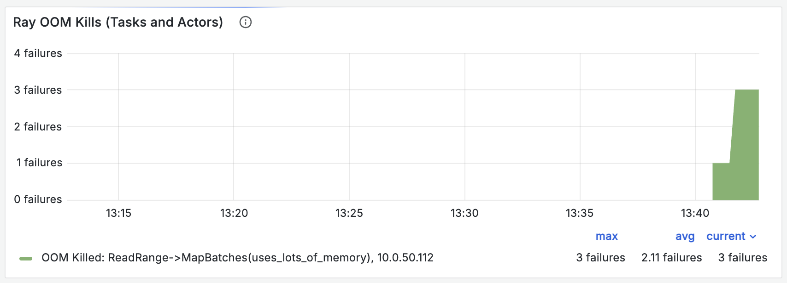
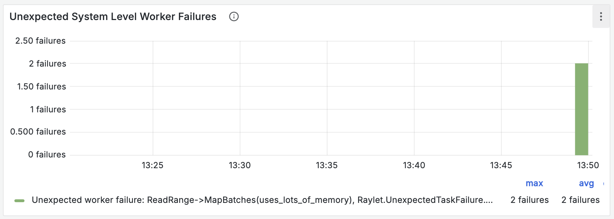
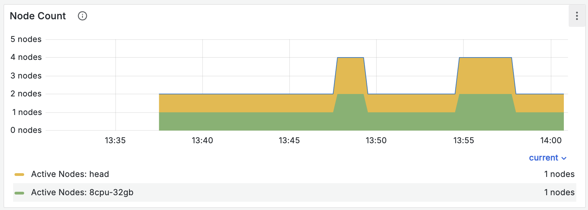

# How to avoid out-of-memory errors (OOMs)

Out-of-memory errors (OOMs) are one of the most common issues Ray Data users encounter.

This guide describes what OOMs look like and provides practical guidance for mitigating 
them.

For a lower-level explanation of how Ray Data treats memory, read 
{ref}`Ray Data Memory Model <data_memory_management>` and  
{doc}`Ray Core Resource Isolation </ray-core/resource-isolation-with-cgroupv2>`


## What OOMs look like

OOMs show up in several ways. If you see one or more of these error messages, your
job might be using too much memory.

### Ray OOM kills

When the Ray OOM killer proactively kills a task or actor, you might see an error like
this:

```
  Task hungry_hippo failed due to oom. There are infinite oom retries remaining, so the task will be retried. Error: 2 worker(s) were killed due to the node running low on memory. Memory on the node (IP: <ip address>, ID: 92edc4e97e4dac3cee61126133ee7ab6d0a2ee73803623d24a02979d) was 110.69GB / 124.35GB (0.890161)
  OOM kill reason: user cgroup memory upper bound was met or exceeded
  Object store memory usage: [- objects spillable: 0
  - bytes spillable: 0
  - objects unsealed: 0
  - bytes unsealed: 0
  - objects in use: 0
  - bytes in use: 0
  - objects evictable: 0
  - bytes evictable: 0
  
  - objects created by worker: 0
  - bytes created by worker: 0
  - objects restored: 0
  - bytes restored: 0
  - objects received: 0
  - bytes received: 0
  - objects errored: 0
  - bytes errored: 0
  
  Eviction Stats:
  (global lru) capacity: 35098657996
  (global lru) used: 0%
  (global lru) num objects: 0
  (global lru) num evictions: 0
  (global lru) bytes evicted: 0]
  Ray killed 2 worker(s) based on the killing policy
  Considered workers: [
  Selected to kill: (Task: job ID=01000000, lease ID=0600000001000000ffffffffffffffffffffffffffffffffffffffffffffffff, task name=hungry_hippo, required resources={CPU: 1}, pid=3310152, actual memory used=0.67GB, worker ID=3e3d8f80b70d48b643d79ed2292b5d4f779820a964e55ad65413687d)
  Selected to kill: (Task: job ID=01000000, lease ID=0400000001000000ffffffffffffffffffffffffffffffffffffffffffffffff, task name=hungry_hippo, required resources={CPU: 1}, pid=3310153, actual memory used=21.64GB, worker ID=0e5649d39c15609c0db6a5cf95de94befded2ee7da2facbf64b52e6f)
  (Task: job ID=01000000, lease ID=0500000001000000ffffffffffffffffffffffffffffffffffffffffffffffff, task name=hungry_hippo, required resources={CPU: 1}, pid=3310151, actual memory used=21.95GB, worker ID=34241048bfb59ac29bd5e32d706c9bd41eafc6972c9bcbada99464e7)
  (Task: job ID=01000000, lease ID=0000000001000000ffffffffffffffffffffffffffffffffffffffffffffffff, task name=hungry_hippo, required resources={CPU: 1}, pid=3310149, actual memory used=21.87GB, worker ID=2cc6dbeef4ebc06789de65fb43e04fbe1feebf1e699902ece89a8328)
  (Task: job ID=01000000, lease ID=0200000001000000ffffffffffffffffffffffffffffffffffffffffffffffff, task name=hungry_hippo, required resources={CPU: 1}, pid=3310155, actual memory used=21.85GB, worker ID=14d4cc84e2f21ba3edbc9948b780d67013afbffda99dd33e829d56d3)
  (Task: job ID=01000000, lease ID=0100000001000000ffffffffffffffffffffffffffffffffffffffffffffffff, task name=hungry_hippo, required resources={CPU: 1}, pid=3310147, actual memory used=21.53GB, worker ID=c90db9af23d78530d1f848c1301bc4b877925fe9122bc70948ad9489)]
  Total non-selected idle workers: 25
  Total non-selected idle workers USS bytes: 1.00GB
  To see more information about memory usage on this node, use `ray logs raylet.out -ip <ip address>`
  Top 10 memory users: PID  MEM(GB) COMMAND
  3310151   21.95   ray::hungry_hippo
  3310149   21.87   ray::hungry_hippo
  3310155   21.85   ray::hungry_hippo
  3310153   21.64   ray::hungry_hippo
  3310147   21.53   ray::hungry_hippo
  3108574   1.95    bazel
  3180337   1.61    ray::foo_actor
  3310152   0.67    ray::hungry_hippo
  2924839   0.53    ray::idle_worker
  3149737   0.47    ray::idle_worker
  Refer to the documentation on how to address the out of memory issue: https://docs.ray.io/en/latest/ray-core/scheduling/ray-oom-prevention.html. Consider provisioning more memory on this node or reducing task parallelism by requesting more CPUs per task. To adjust the kill threshold, set the environment variable `RAY_memory_usage_threshold` when starting Ray. To disable worker killing, set the environment variable `RAY_memory_monitor_refresh_ms` to zero. Since 2.56, Ray updated the oom killing policy to enabling killing multiple workers and selecting workers based on the time since the task start executing. To revert to the legacy policy of determining worker to oom kill based on owner group size or only selecting a single worker to kill at a time, set the environment variable `RAY_worker_killing_policy_by_group` to true before starting Ray. If the idle workers have a non-trivial memory footprint at the time of OOM (check OOM log for non-selected idle workers), consider setting the environment variable `RAY_idle_worker_killing_memory_threshold_bytes` to a lower value to consider idle workers with lower memory footprint for killing.
```

You can see the number of Ray OOM kills in the "Ray OOM Kills (Tasks and Actors)" chart 
in the Ray Core dashboard:



### Kernel OOM kills

When the kernel OOM killer kills a Ray process before the Ray OOM killer, you might see
an error like this:

```
(raylet) Task _map_task failed. There are infinite retries remaining, so the task will be retried. Error:                                                                                      
(raylet) A worker died or was killed while executing a task by an unexpected system error. To troubleshoot the problem, check the logs for the dead worker. Lease ID: 2100000005000000ffffffffffffffffffffffffffffffffffffffffffffffff Worker ID: 863d8a6a594d60f8d143462b96cd3bf4270eafe617aaf2d2ca7266cb Node ID: 4cb25bc084aeb5a31ca5402ad589ae042a71165a8e2dd8418fecee26 Worker IP address: 10.0.50.112 Worker port: 10015 Worker PID: 2938 Worker exit type: SYSTEM_ERROR Worker exit detail: Worker unexpectedly exits with a connection error code 2. End of file. Some common causes include: (1) the process was killed by the OOM killer due to high memory usage, (2) ray stop --force was called, or (3) the worker crashed unexpectedly due to SIGSEGV or another unexpected error.
```

You can see the number of unexpected worker deaths in the "Unexpected System Level 
Worker Failures" chart in the Ray Core  dashboard. Kernel OOM kills often cause 
unexpected worker death.



### Node death

If you're using older versions of Ray without resource isolation, nodes can die under
memory pressure, and you might see an error like this:

```
{"asctime":"2026-03-23 18:24:28,943","levelname":"E","message":":info_message: Attempting to recover 41 lost objects by resubmitting their tasks or setting a new primary location from existing copies. To disable object reconstruction, set @ray.remote(max_retries=0).","filename":"core_worker.cc","lineno":475}
```

You can see node death in the "Node Count" chart in the Ray Core dashboard:



Nodes can die for reasons unrelated to memory pressure. If you see node death along with 
other memory-related errors, memory pressure might have caused the death.

## Best practices

### Use ``batch_size="auto"`` or small batch sizes

Choose the smallest batch size that achieves good performance, or use
``batch_size="auto"``.

:::{versionadded} 2.56
``batch_size="auto"`` was added in Ray 2.56.
:::

<!-- We're recommending 16 MiB because we found that it's the smallest batch size
that doesn't degrade throughput on a variety of UDFs.
See https://docs.google.com/document/d/1sw9CVm9cKp1b6voLc5gWIJLJM57NSGQjJ-HxvD_92jQ/edit?tab=t.0 -->

If your UDF runs on CPU and isn't vectorized, use `map` instead. If it's vectorized, a
good rule of thumb is a batch size of about 16 MiB. Unlike GPUs, CPUs have limited 
ability to parallelize work, so they don't benefit from large batches the way a GPU 
does.

<!-- The rule of thumb to use 1/4 of GRAM comes from @stephanie-wang -->

If your UDF runs on GPU, a good rule of thumb is to use about 1/4 of the GPU memory. 
Keep in mind that large GPU batches increase the risk of not only GPU OOMs, but also of 
regular heap OOMs because Ray Data builds the batch in heap memory first.

### Configure ``memory`` for reads and high-memory UDFs

If a task or actor uses more than a few GiB of memory, set ``memory``. This tells Ray 
Data how much memory each task or actor needs so it doesn't launch too many at once.

To pick a value for ``memory``, read the Ray Data log file and look for the 
`max_uss_bytes` field. Ray typically writes the log file to
`/tmp/ray/session-latest/ray-data/ray-data.log`. 

```
ReadRange->MapBatches(uses_lots_of_memory): {'average_num_outputs_per_task': 1.0, ..., 'max_uss_bytes': {'num_samples': 20, 'mean': 4393336422.4, 'variance': 26855731156.89417, 'min': 4393119744, 'max': 4393529344, 'p50': 4393418752.0, 'p90': 4393500672.0, 'p95': 4393529344.0, 'p99': 4393529344.0}, ...}
```

Ray Data also emits the information to stdout:

```
Operator 'ReadRange->MapBatches(uses_lots_of_memory)' uses 4.1GiB of
memory per task on average, but Ray only requests 0.0B per task at the
start of the pipeline.

To avoid out-of-memory errors, consider setting `memory=4.1GiB` in the
appropriate function or method call. (This might be unnecessary if the
number of concurrent tasks is low.)

To change the frequency of this warning, set
`DataContext.get_current().issue_detectors_config.high_memory_detector_config.detection_time_interval_s`,
or disable the warning by setting value to -1. (current value: 30)
```

### Enable default map memory

Unless you specify a value, Ray Data assumes a UDF needs 0 ``memory``. So even if you've
set ``memory`` correctly for some APIs, Ray Data can still oversubscribe tasks and 
actors for the ones you haven't.

To avoid this, set ``DataContext.get_current().default_map_logical_memory = True``.

:::{versionadded} 2.56
``DataContext.default_map_logical_memory`` was added in Ray 2.56.
:::

### Start Ray with resource isolation

If you encounter kernel OOM kills or memory pressure related node deaths, enable 
*resource isolation* to provide enhanced protection for critical system components and 
eliminate kernel OOMs and node deaths. 

To enable *resource isolation*, follow the guide in 
{doc}`Ray Core Resource Isolation </ray-core/resource-isolation-with-cgroupv2>`.

:::{versionadded} 2.56
Resource isolation was completed in Ray 2.56.
:::

### Configure system memory to cover the raylet and anything outside the container

By default, Ray reserves 10% of physical memory for system use. "System" covers Ray
processes that aren't worker tasks or actors, the OS itself, and anything else on the
node that isn't Ray, including processes outside the container.

If you run large non-Ray processes like Vector or still experience kernel OOM even with 
*resource isolation* enabled, your "system" processes are likely using more memory than 
the default reserved memory for system processes. 

In this case, allocate more memory by passing in a custom byte value to the ray start 
flag `--system-reserved-memory`.

The default is usually fine unless you're on tiny nodes, like an m5.xlarge.

### Isolate reads for large files

Ray Data uses PyArrow to implement APIs like `read_parquet`, and PyArrow can allocate 
lots of memory that isn't reclaimed when the read tasks finish. Because Ray reuses 
workers across operators, a downstream operator can schedule tasks onto a worker that's 
still holding that allocation. As a result, downstream operators can appear to be 
consuming far more memory than they actually are.

If you encounter this, try ``DataContext.get_current().isolate_read_workers = True``. 
The flag prevents Ray Data from scheduling downstream operators on the same 
workers as reads. It can improve memory safety at the cost of some performance.

:::{versionadded} 2.56
``DataContext.isolate_read_workers`` was added in Ray 2.56.
:::

### Don't increase RAY_DEFAULT_OBJECT_STORE_MEMORY_PROPORTION

Older versions of Ray Data emit a warning that suggests you increase 
`RAY_DEFAULT_OBJECT_STORE_MEMORY_PROPORTION`. While this can improve performance for 
some workloads like shuffle, it can also increase the risk of OOMs because it decreases
the amount of memory available for your UDFs.

To improve memory safety, don't configure the knob.

## What to expect after tuning

If you do all of the following:

- Start Ray with resource isolation enabled.
- Set system memory large enough to cover everything used outside of Ray worker tasks 
  and actors
- Set logical memory to physical memory minus system memory minus object store memory.
- Set ``memory`` for each API to at least the heap memory that API needs to run.

Then you shouldn't see OOMs or node deaths.

The main limitation of these configurations is performance. When you set ``memory`` 
based on worst-case heap memory use, the system might launch fewer tasks or actors than 
it might be able to, and that can decrease throughput.

If you want to experiment with oversubscription at the risk of potential OOMs, decrease
`memory`.

## Further reading

For a deeper understanding of how Ray handles memory, read the following guides:

- {ref}`Ray Data Memory Model <data_memory_management>`
- {doc}`Ray Core Resource Isolation </ray-core/resource-isolation-with-cgroupv2>`
- {ref}`Ray Core Out-Of-Memory Prevention <ray-oom-prevention>`
- {doc}`Debugging Memory Issues </ray-observability/user-guides/debug-apps/debug-memory>`
