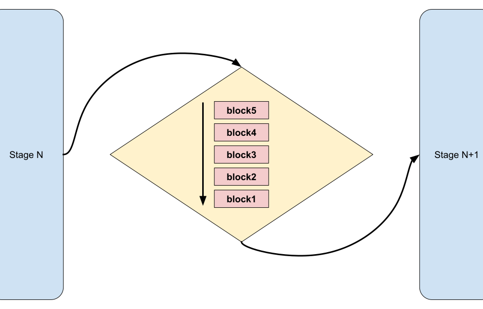

.. _data_key_concepts:

Ray Data conceptual overview
============================

This page provides a conceptual overview of the architecture and execution model for Ray Data. Understanding these technical details can be useful when designing, debugging, and optimizing Ray applications.

This page assumes familiarity with the use cases and core functionality of Ray Data. If you are new to Ray Data, see :ref:`data_quickstart`.

For specific recommendations on optimizing Ray Data workloads, see :ref:`data_performance_tips`.

Ray Data key concepts
---------------------

The following table provides descriptions for the key concepts of Ray Data:

+---------------------------+------------------------------------------------------------------------------------------------------------------------------------------------------------------------------------------------+
|          Concept          |                                                                                          Description                                                                                           |
+===========================+================================================================================================================================================================================================+
| Dataset                   | The primary programming interface and data structure in Ray Data.                                                                                                                              |
+---------------------------+------------------------------------------------------------------------------------------------------------------------------------------------------------------------------------------------+
| Streaming execution model | An optimized data processing model that plans and runs transformations as concurrent stages, providing efficient processing for large datasets.                                                |
+---------------------------+------------------------------------------------------------------------------------------------------------------------------------------------------------------------------------------------+
| Block                     | A collection of rows in a dataset that is distributed during planning and processing.                                                                                                          |
+---------------------------+------------------------------------------------------------------------------------------------------------------------------------------------------------------------------------------------+
| Operator                  | An abstraction of Ray Core tasks, actors, and objects. Ray Data translates the operators you use to write your program into *logical operators* and then *physical operators* during planning. |
+---------------------------+------------------------------------------------------------------------------------------------------------------------------------------------------------------------------------------------+
| Logical plan              | The representation of the logic your Ray Data program contains. The logical plan maps user-facing APIs to logical operators.                                                                   |
+---------------------------+------------------------------------------------------------------------------------------------------------------------------------------------------------------------------------------------+
| Physical plan             | The final stage of planning in Ray Data, representing how the program runs. Physical operators manipulate references to data and map logic to tasks and actors.                                |
+---------------------------+------------------------------------------------------------------------------------------------------------------------------------------------------------------------------------------------+

.. _streaming-execution:

How does Ray Data work?
-----------------------

Ray Data uses the :class:`~ray.data.Dataset` abstraction to map common data operations to Ray Core tasks, actors, and objects. You write programs using Dataset operators and common Python code and libraries. Ray Data handles optimization, distribution, parallelization, and concurrency for your workloads.

The following is a high-level explanation of how Ray Data plans and executes workloads.

1. Define the workload
~~~~~~~~~~~~~~~~~~~~~~

You define Ray Data logic using the Dataset API. 

The following is a simple example that loads CSV data, applies a series of map and filter transformations, and then calls the ``show`` action to trigger the pipeline:

.. testcode::

    import ray

    # Create a dataset with 1K rows
    ds = ray.data.read_csv("s3://anonymous@air-example-data/iris.csv")

    # Define a pipeline of operations
    ds = ds.map(lambda x: {"target1": x["target"] * 2})
    ds = ds.map(lambda x: {"target2": x["target1"] * 2})
    ds = ds.map(lambda x: {"target3": x["target2"] * 2})
    ds = ds.filter(lambda x: x["target3"] % 4 == 0)

    # Data starts flowing when you call a method like show()
    ds.show(5)

.. _plans:

2. Translate the logical plan
~~~~~~~~~~~~~~~~~~~~~~~~~~~~~

Ray Data translates the workload to a logical plan. The logical plan consists of *logical operators* that describe *what* operation to perform.

The following is a simplified view of the resultant logical plan:

.. code-block::

    Filter(<lambda>)
    +- Map(<lambda>)
       +- Map(<lambda>)
          +- Map(<lambda>)
             +- Dataset(schema={...})

3. Build the physical plan
~~~~~~~~~~~~~~~~~~~~~~~~~~

When you run your program, the planner translates the logical plan into a physical plan. The physical plans consists of *physical operators* that describe *how* to execute the operation.

Because Ray Data uses a lazy execution model, the planner can optimize the logical and physical plans to reduce data movement and serialization costs.

The following diagram illustrates the complete planning process:

.. https://docs.google.com/drawings/d/1WrVAg3LwjPo44vjLsn17WLgc3ta2LeQGgRfE8UHrDA0/edit

.. image:: images/get_execution_plan.svg
   :width: 600
   :align: center

Ray Data optimizes data processing for ML using a *streaming execution model*. With streaming execution, Ray processes data in a streaming fashion through a pipeline of operations rather than materializing the entire dataset in memory at once.

Operators are connected as stages in a pipeline. In each stage, the operator outputs results as a queue. The output queue for one operator is the input queue of the next downstream operator. This creates an efficient flow of data through the execution plan.

The physical plan represents each operator as a stage in a pipeline.

The following diagram is a simplified illustration of the physical plan:

.. https://docs.google.com/drawings/d/10myFIVtpI_ZNdvTSxsaHlOhA_gHRdUde_aHRC9zlfOw/edit

.. image:: images/streaming-topology.svg
   :width: 600
   :align: center

4. Distribute data
~~~~~~~~~~~~~~~~~~

The physical plan contains the instructions for distributing blocks of data to workers for parallelization. 

Ray Data holds the Dataset on the process that triggers execution (which is usually the entrypoint of the program, referred to as the :term:`driver`) and stores the blocks as objects in Ray's shared-memory :ref:`object store <objects-in-ray>`.

The following figure visualizes a Dataset with three blocks, each holding 1000 rows:

.. image:: images/dataset-arch-with-blocks.svg
   :alt: Ray Dataset with three blocks
..
  https://docs.google.com/drawings/d/1kOYQqHdMrBp2XorDIn0u0G_MvFj-uSA4qm6xf9tsFLM/edit

5. Transform the data
~~~~~~~~~~~~~~~~~~~~~

Each stage in the physical plan processes blocks of data using the following behavior:

* The stage receives an input queue of block references.
* The operator transforms the block of data.
* The result of the transformation is a block reference in an output queue.
* Output queues become input queues for the next stage in the pipeline.

The following diagram illustrates how data flows through a queue between stages:

6. Concurrent scheduling
~~~~~~~~~~~~~~~~~~~~~~~~

Each block of data is processed independently at each stage. Any stage with data present in its input queue is eligible for scheduling.

The pipeline architecture enables multiple stages to execute concurrently, improving overall performance and resource utilization. For example, if the map operator requires GPU resources, the streaming execution model can execute the map operator concurrently with a filter operator running on CPU resources, effectively utilizing the GPU through the entire duration of the pipeline.

Ray Data and Ray Train
----------------------

The streaming execution model is particularly well-suited to workloads that use GPUs to process large datasets. When you use Ray Data to load and preprocess data for Ray Train, Ray can optimize streaming execution from your data source through training. See :ref:`Ray Train<train-docs>`.

Offline batch inference also uses streaming execution, allowing for efficient model predictions on large datasets with reduced memory and compute requirements.

.. note:: Models, frameworks, or algorithms that must materialize the entire dataset to calculate results are not optimized for streaming execution. See :ref:`remove_bottlenecks`.
